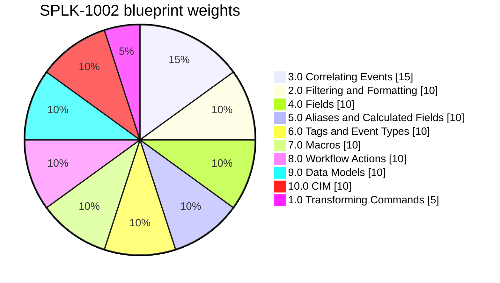

# SPLK-1002 exam overview

Everything verified against Splunk's own published material on 2026-07-26. Where a widely-repeated claim turns out to be wrong, it is called out rather than quietly omitted.

## Exam facts

| | |
|---|---|
| Certification | Splunk Core Certified Power User |
| Exam code | SPLK-1002 (the Pearson VUE registration code; Splunk's own pages no longer lead with it) |
| Version label | None. The current blueprint carries no v1, v2 or v3 designation |
| Questions | 65, multiple choice |
| Time | 60 minutes, which includes 3 minutes to review the exam agreement |
| Level | Entry level |
| Cost | $130 USD per attempt |
| Passing score | **Not published by Splunk** |
| Prerequisite exams | **None** |
| Prerequisite courses | None |
| Delivery | Pearson VUE, test centre or online proctored |
| Retake | 7-day wait after a first failure, longer for subsequent attempts |
| Validity | 3 years from the date of the highest certification exam passed |
| Next step | Splunk Core Certified Advanced Power User (SPLK-1004) |

Source of record: [splunk-test-blueprint-power-user.pdf](https://www.splunk.com/en_us/pdfs/training/splunk-test-blueprint-power-user.pdf) and the [certification track page](https://www.splunk.com/en_us/training/certification-track/splunk-core-certified-power-user.html).

### Four claims that circulate and are wrong

**"The passing score is 70%."** Splunk publishes no cut score for this exam. It is absent from the blueprint, from the certification track page, and from the Training and Certification FAQ. Treat any practice-test percentage as a diagnostic for weak sections, not as a pass predictor.

**"40 questions in 105 minutes for $150."** Several aggregator sites say this. The official numbers are 65 questions, 60 minutes, $130.

**"There is a v2 or v3 of the blueprint."** There is not. Wayback snapshots of the blueprint PDF are content-identical across 2023-01-28, 2024-07-25 and 2025-07-10 (same digest). The `Last-Modified` header of 2025-01-22 reflects a re-upload, not a content change. The blueprint has been frozen since roughly January 2023.

**"Lookups and dashboards are on the exam."** They are not on this blueprint. Several study guides, including a top-ranked search result, list "working with lookups and data enrichment" as SPLK-1002 content. There is no lookups section, no dashboards section, no reports section, and no alerting section.

## The blueprint

Reproduced verbatim from Splunk's published test blueprint, including Splunk's own framing clause.

> The following topics are general guidelines for the content likely to be included on the exam; however, other related topics may also appear on any specific delivery of the exam. In order to better reflect the contents of the exam and for clarity purposes, the guidelines below may change at any time without notice.

**1.0 Using Transforming Commands for Visualizations - 5%**
- 1.1 Use the chart command
- 1.2 Use the timechart command

**2.0 Filtering and Formatting Results - 10%**
- 2.1 The eval command
- 2.2 Use the search and where commands to filter results
- 2.3 The fillnull command

**3.0 Correlating Events - 15%**
- 3.1 Identify transactions
- 3.2 Group events using fields
- 3.3 Group events using fields and time
- 3.4 Search with transactions
- 3.5 Report on transactions
- 3.6 Determine when to use transactions vs. stats

**4.0 Creating and Managing Fields - 10%**
- 4.1 Perform regex field extractions using the Field Extractor (FX)
- 4.2 Perform delimiter field extractions using the FX

**5.0 Creating Field Aliases and Calculated Fields - 10%**
- 5.1 Describe, create, and use field aliases
- 5.2 Describe, create, and use calculated fields

**6.0 Creating Tags and Event Types - 10%**
- 6.1 Create and use tags
- 6.2 Describe event types and their uses
- 6.3 Create an event type

**7.0 Creating and Using Macros - 10%**
- 7.1 Describe macros
- 7.2 Create and use a basic macro
- 7.3 Define arguments and variables for a macro
- 7.4 Add and use arguments with a macro

**8.0 Creating and Using Workflow Actions - 10%**
- 8.1 Describe the function of GET, POST, and Search workflow actions
- 8.2 Create a GET workflow action
- 8.3 Create a POST workflow action
- 8.4 Create a Search workflow action

**9.0 Creating Data Models - 10%**
- 9.1 Describe the relationship between data models and pivot
- 9.2 Identify data model attributes
- 9.3 Create a data model

**10.0 Using the Common Information Model (CIM) Add-On - 10%**
- 10.1 Describe the Splunk CIM
- 10.2 List the knowledge objects included with the Splunk CIM Add-On
- 10.3 Use the CIM Add-On to normalize data

Ten sections, thirty sub-objectives, weights summing to 100.

On exam preparation the blueprint says only: "Candidates may reference the Splunk How-To YouTube Channel, Splunk Docs, and draw from their own Splunk experience."

## What the weights actually mean

On a 65-question exam, the weights work out roughly as follows. Splunk does not guarantee this distribution, and the disclaimer above explicitly reserves the right to ask about related topics.

| Section | Weight | Approx. questions | Notes |
|---|---|---|---|
| 3.0 Correlating Events | 15% | ~10 | The heaviest single section by a clear margin |
| 2.0 Filtering and Formatting | 10% | ~7 | |
| 4.0 Creating and Managing Fields | 10% | ~7 | |
| 5.0 Aliases and Calculated Fields | 10% | ~7 | |
| 6.0 Tags and Event Types | 10% | ~7 | |
| 7.0 Macros | 10% | ~7 | |
| 8.0 Workflow Actions | 10% | ~7 | |
| 9.0 Data Models | 10% | ~7 | |
| 10.0 CIM Add-On | 10% | ~7 | No official Splunk course covers this |
| 1.0 Transforming Commands | 5% | ~3 | The only section under 10% |

Seven sections sit at a flat 10%, so breadth beats depth everywhere except section 3.0. Two consequences worth acting on:

**Section 3.0 deserves disproportionate time.** Fifteen percent in one place, and its hardest objective (3.6, choosing between `transaction` and `stats`) is a judgement call rather than a recall fact.

**Section 10.0 is the highest-risk 10%.** It is the only section with no course behind it, and the printed study guide gives it about two pages.

## Splunk's own suggested courses

The blueprint names eight courses from the Core Certified Power User learning path, described as "suggested and non-exhaustive". All eight exist as instructor-led (3 hours each) and as self-paced eLearning.

| Course | Covers | Blueprint sections |
|---|---|---|
| Working with Time | `_time` and timestamps, event timeline, `earliest`/`latest`, `bin`, date/time eval functions, `timechart`, `timewrap`, timezones | 1.0 |
| Statistical Processing | Data series, `chart`, `timechart`, `top`, `rare`, `stats` and its functions, `eval` maths and statistics, `rename`, `sort` | 1.0, 2.0 |
| Comparing Values | `eval` comparison, conditional and text functions, `case`, `fieldformat`, `where`, wildcards, `isnull`/`isnotnull`, `fillnull` | 2.0 |
| Result Modification | `untable`, `xyseries`, `appendpipe`, `eventstats`, `streamstats`, conversion and text eval functions, `foreach` | 2.0, supports 10.3 |
| Correlation Analysis | Transactions and the `transaction` command; subsearch, `append`, `appendcols`, `union`, `join` | 3.0 |
| Creating Knowledge Objects | The knowledge object role and the search-time operation sequence, event types, workflow actions, tags and field aliases, search macros with arguments, calculated fields | 5.0, 6.0, 7.0, 8.0 |
| Creating Field Extractions | Types of extracted fields and when they are extracted, the Field Extractor, regex extractions, delimited extractions | 4.0 |
| Data Models | Event, search and transaction datasets, object hierarchy and constraints, eval-expression fields, designing data models, Pivot and Instant Pivot, acceleration and tsidx | 9.0 |

**Nothing on that list covers 10.0 CIM.** That is a real gap in Splunk's own path, not an oversight in this guide. `topics/10-cim.md` is written to stand alone because of it.

Two courses that older third-party learning paths list are no longer on Splunk's blueprint: "Search Under the Hood" (the course still exists) and "Introduction to Knowledge Objects" (its course-description page returns 404 and it survives only as a named prerequisite inside other course descriptions). Reseller learning paths from Fast Lane and similar also still list "Using Choropleth". Trust Splunk's list of eight.

## Reading the documentation

The docs moved. `docs.splunk.com/Documentation/Splunk/latest/*` now 301-redirects to `help.splunk.com` with restructured paths, and `latest` resolves to Splunk Enterprise 10.4. Manuals were renamed at the same time: the Knowledge Manager Manual is now the **Knowledge Management Manual**, and Dashboards and Visualizations split into **Simple XML Dashboards** and **Dashboard Studio**.

The blueprint names no Splunk version and every objective is core functionality unchanged from 9.x to 10.x, so studying against either line is safe. This guide uses 10.4 because that is what `latest` serves and what you have installed.

Two documentation traps:

**`docs.splunk.com/Documentation/CIM/latest/` does not redirect** and still self-reports CIM version 6.1.0. The current CIM is 8.6. CIM version numbers are now synchronised with Splunk Enterprise Security version numbers, which is why 6.x jumps to 8.x. Use the `help.splunk.com` CIM 8.6 pages.

**`docs.splunk.com` returns 403 to non-browser user agents.** Pages resolve fine in a browser. If a link checker reports a doc link as dead, check it manually before believing it.

The ordered reading list is in `reference/doc-links.md`.

## How this guide is organised

| Path | What it is |
|---|---|
| `topics/NN-*.md` | One deep file per blueprint section: concept, every option with its default, output shape, worked SPL, decision rules, traps, a lab, self-check questions, and the docs to read |
| `topics/00-foundations-refresher.md` | Off-blueprint knowledge the exam assumes: search modes, time modifiers, the fields sidebar, and condensed coverage of lookups, reports, alerts and dashboards |
| `cram/` | One screen per section for the last few days, plus `all-in-one.md` |
| `reference/knowledge-object-precedence.md` | The search-time operation order. Sections 4, 5, 6, 9 and 10 all reduce to it, which is 50% of the exam by weight |
| `reference/exam-traps.md` | Every trap in the guide, by stable ID, in one place |
| `reference/doc-links.md` | The docs reading syllabus, in reading order |
| `practice/` | Intake format for your 165 Udemy practice questions, plus the tracker and weak-areas files |
| `source-notes/apress-errata.md` | Every wrong answer key in the printed study guide, verified against its own text |
| `source-notes/udemy-module-map.md` | All 41 Udemy modules mapped to blueprint sections, with what is off blueprint |
| `lab-setup.md` | One-time data and index setup on your local Splunk Enterprise 10.x |
