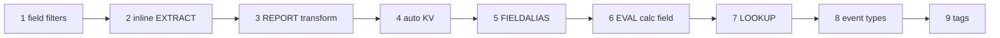

# SPLK-1002 All-in-One Final Review

## Exam facts

65 multiple-choice questions.

60 minutes of seat time, which includes 3 minutes to review the exam agreement.

No passing score is published by Splunk.

No prerequisite exam. SPLK-1001 is recommended, not required.

## Weights

| Section | Weight | Approx. questions of 65 | Note |
| --- | --- | --- | --- |
| 1.0 Transforming commands for visualizations | 5% | 3 | Lightest section |
| 2.0 Filtering and formatting results | 10% | 6-7 | |
| 3.0 Correlating events | 15% | 10 | **Heaviest** |
| 4.0 Creating and managing fields | 10% | 6-7 | |
| 5.0 Field aliases and calculated fields | 10% | 6-7 | |
| 6.0 Tags and event types | 10% | 6-7 | |
| 7.0 Macros | 10% | 6-7 | |
| 8.0 Workflow actions | 10% | 6-7 | |
| 9.0 Data models | 10% | 6-7 | |
| 10.0 Common Information Model | 10% | 6-7 | **No official course covers it** |

Lookups, dashboards, reports and alerts are off blueprint.

## The search-time precedence chain

Field filters, inline field extraction, field extraction using a transform, automatic key-value extraction, field aliases, calculated fields, lookups, event types, tags. Each step can reference fields produced by earlier steps and can never reference fields produced by later steps.



Macros are absent from this chain: expansion is textual and happens before parsing.

## 1.0 Transforming commands (5%)

```spl
chart <agg> OVER <row-split> BY <column-split>
timechart [span=<t>] <agg> BY <one-field>
top|rare [<N>] <field-list> [BY <field-list>]
xyseries <x> <y-name> <y-data>   |   untable <x> <y-name> <y-data>
```

Defaults: `chart` `limit=top 10`, `bins=300`; `timechart` `limit=top10`, `bins=100`; both `useother=true`, `usenull=true`, `otherstr=OTHER`, `nullstr=NULL`, `cont=true`. `top`/`rare` `limit=10`, and `top` has `useother=false`.

Decide: X-axis is time, use `timechart`; X-axis is any other field, use `chart`; one row per field combination, use `stats`.

- `limit` caps columns (series), not rows; `limit=0` means all.
- `timechart` accepts exactly one BY field, `chart` accepts two, `stats` accepts many. `partial` and `fixedrange` exist only on `timechart`.
- `bins` is a maximum, not a target; if both `bins` and `span` are given, `span` wins. `sparkline()` works with `chart` and `stats`, never `timechart`.

## 2.0 Filtering and formatting (10%)

```spl
... | where <eval-expression> | eval <field>=<expr>[, <field>=<expr>]
... | fillnull [value=<s>] [<field-list>] | filldown <wc-field-list>
... | fieldformat <field>=<eval-expression>
```

Defaults: `fillnull value=0` and, with no field list, fills every field; `filldown` accepts wildcards, `fillnull` does not; `fieldformat` takes exactly one expression; `substr` indexes from 1, `mvindex` from 0.

Decide: field against a literal, `search` or `where`; field against a field, arithmetic, or an eval function, `where` only.

- `search` reads a bare right-hand word as a literal string, so it cannot compare two fields.
- `search` evaluates OR before AND; `eval` and `where` evaluate AND before OR. `search` has no `XOR`.
- `NOT field="v"` keeps events with no such field, `field!="v"` drops them. `coalesce` returns the first non-null argument, `case` with no `true()` default returns NULL.

## 3.0 Correlating events (15%, heaviest)

```spl
... | transaction <field-list> [maxspan=][maxpause=][maxevents=][startswith=][endswith=]
... | stats range(_time) AS duration, count AS eventcount, values(x) BY <id>
```

Defaults: `maxspan=-1`, `maxpause=-1` (both no limit), `maxevents=1000`, `connected=true`, `unifyends=true`, `keeporphans=false`, `keepevicted=false`, `mvlist=false`, `delim=" "`, `nullstr=NULL`. Negative values deactivate the constraint.

Decide: raw event text must survive the grouping, use `transaction`; a unique ID plus aggregates on large or distributed data, use `stats`; after an `append`, always `stats`.

- `transaction` creates `duration` (seconds, `0` for a single-event transaction), `eventcount` (not `count`), and `closed_txn`.
- `closed_txn=1` only when `maxevents`, `maxspan`, `maxpause`, or `startswith` is specified. `endswith` alone leaves it `0`.
- `_time` of the result is the earliest member's timestamp, `_raw` is every member's raw text. Input must be in descending time order.

## 4.0 Creating and managing fields (10%)

```spl
... | rex [field=<f>] "<regex>" [max_match=<int>]   |   rex mode=sed "s/x/y/g"
... | erex <field> examples="a,b" [fromfield=<f>]   |   ... | extract pairdelim="" kvdelim=""
```

Defaults: `rex field=_raw`, `max_match=1`; `erex fromfield=_raw`, `maxtrainers=100`; `extract limit=50` pairs, `maxchars=10240`, `_raw` only; Field Extractor save permission defaults to **Owner**; auto KV extracts the first 100 obvious `key=value` pairs.

Decide: consistent single separator, Field Extractor delimiter path; unstructured text with recognisable surrounding literals, regex path; one-off need, `rex`.

- The Field Extractor creates search-time extractions only: retroactive to all indexed events, no reindex, no restart.
- Regex path writes `EXTRACT-<class>` in props.conf and offers Validate and counterexamples; delimiter path writes `REPORT-<class>` plus a `DELIMS`/`FIELDS` stanza in transforms.conf and offers Rename Fields.
- `rex` emits every input event whether or not it matched; `regex` filters. Field names are case sensitive, field values in search terms are not.

## 5.0 Field aliases and calculated fields (10%)

```ini
[<sourcetype>|source::<source>|host::<host>]
FIELDALIAS-<class> = <orig> AS|ASNEW <new>
EVAL-<fieldname>   = <eval expression>
```

Defaults: Overwrite field values is unchecked, which writes `ASNEW`; checked writes `AS`. Scope is host, source, or source type only. Objects are private to the creator on creation.

Decide: the value already exists under another name, alias it; the value must be derived or two fields must collapse into one name, use a calculated field with `coalesce`.

- The original field survives aliasing. Both names return the same events. `rename` replaces, alias adds.
- Multiple `EVAL-` statements in one stanza run in parallel and never chain.
- The Eval expression box takes the right-hand side only: `round(bytes/1024, 2)`, never `eval kb = ...`. You cannot alias a calculated field, lookup output, event type, or tag.

## 6.0 Tags and event types (10%)

```spl
tag=<tagname>   tag::<field>=<tagname>   tag::eventtype=IP-*   eventtype=<name>
```

```ini
[<fieldname>=<value>]
<tag> = enabled
```

Defaults: `priority` is an integer 1 to 10 where **1 is highest and 10 is lowest**, and the attribute is omitted by default. `color` values are `none` plus `et_blue`, `et_green`, `et_magenta`, `et_orange`, `et_purple`, `et_red`, `et_sky`, `et_teal`, `et_yellow`. Sharing is Private on creation.

Decide: naming a set of values of one field, tag; naming a whole event category, event type; anything needing a pipe, `stats`, or a subsearch, a report or macro instead.

- A tag attaches to a field-value pair, not to an event and not to a field.
- An event type search cannot contain a pipe after the simple search, a subsearch, or `savedsearch`.
- `eventtype` is set at search time and becomes multivalue when an event matches two or more event types; priority decides display order and which single colour renders.

## 7.0 Macros (10%)

```spl
`mymacro`     `argmacro(120,300)`     `argmacro(hi=300,lo=120)`     | `generatingmacro`
```

```ini
[bc_status_band(2)]
args = lo, hi
definition = index=main status>=$lo$ status<$hi$
validation = isnum($lo$) AND isnum($hi$)
```

Defaults: `iseval=false`, `args` none, `definition` required, `errormsg` used only by the Boolean form of `validation`, `limits.conf [search] max_macro_depth = 100`. Destination app defaults to the current app context. No restart is needed for macros.conf.

Decide: the chunk varies by a value, add arguments and put the count in the stanza name; the expansion text itself is chosen conditionally, set `iseval=true` and return a string.

- Backticks invoke a macro; single and double quotation marks do not.
- `mymacro(2)` is the stored name because it takes two arguments; it is invoked as `` `mymacro(foo,bar)` ``.
- The Arguments field holds bare names with no dollar signs; the Definition holds `$name$` tokens. Validation failure is an error before dispatch, not zero results. Preview with Control-Shift-E.

## 8.0 Workflow actions (10%)

```ini
[<name>]
type = link|search
label = <text with $field$>
fields = <comma list>            # ALL listed fields must be present
display_location = field_menu|event_menu|both
link.uri = http://x/?q=$field$   link.target = blank|self   link.method = get|post
search.search_string = ...       search.preserve_timerange = <bool>
```

Defaults: `fields=*`, `eventtypes` unset, `display_location=both`, `link.target=blank` (new window), `link.method=get`, `search.preserve_timerange=false`, `disabled=False`. `search.app` and `search.view` default to the current app and view. Path: Settings, Fields, Workflow actions.

Decide: leaving Splunk with values that fit a query string, GET link; needing a body, `$_raw$`, or record creation, POST link; staying in Splunk to run more SPL, search action.

- `type` has exactly two values, `link` and `search`. GET versus POST is `link.method`, not `type`.
- POST arguments travel in the request body, HTTP-form encoded, never in the query string.
- `link.uri` tokens are automatically URI-encoded, `search.search_string` tokens are not, so quote them yourself. `preserve_timerange` is ignored if `search.earliest` or `search.latest` is set.

## 9.0 Data models (10%)

```spl
| datamodel <model> <dataset> search|flat [strict_fields=<b>]
| tstats [summariesonly=<b>] <agg> FROM datamodel=<model>.<root> [WHERE ...] BY <f> [span=<t>]
| from datamodel:<model>.<dataset>
| pivot <model> <dataset> <cell-value> [SPLITROW <f>] [SPLITCOL <f>]
```

Defaults: `acceleration=false` on every model; Summarization Period `*/5 * * * *`; `acceleration.max_time=3600`; `acceleration.max_concurrent=3`; `datamodel strict_fields=true`; `tstats summariesonly=false`; field Type defaults to String, visibility to Shown, requirement to Optional. Root datasets inherit `_time`, `host`, `source`, `sourcetype`.

Decide: simple constraint with no pipes and acceleration wanted, Root Event; needs pipes, Root Search; groups events across time, Root Transaction (never accelerable); narrower slice of an existing dataset, Child.

- A child dataset inherits every constraint and field from every ancestor and adds its own. Inheritance is cumulative and narrowing.
- Only root event hierarchies and streaming-only root search hierarchies accelerate persistently.
- Required is a real filter that removes events lacking the field; Hidden only removes the field from the Pivot pickers. `tstats` uses `datamodel=`, `from` uses `datamodel:`.

## 10.0 Common Information Model (10%)

```spl
| datamodel Authentication Authentication search
| tstats count FROM datamodel=Authentication WHERE nodename=Authentication.Failed_Authentication BY Authentication.src
```

```ini
[buttercup_web]
search = sourcetype=access_combined_wcookie
[eventtype=buttercup_web]
web = enabled
```

Defaults: CIM acceleration disabled on every model; Setup indexes allowlist is all indexes; `summariesonly=false`; `strict_fields=true`. Splunkbase app ID 1621, folder `Splunk_SA_CIM`, installed on search heads only. CIM 8.6 documents 26 models, two of them deprecated (Application State, Change Analysis).

Decide: correct fields but no rows means a missing tag; rows but empty columns means a missing field mapping. Rename only, alias; derive or normalize, calculated field; value absent or coded, lookup.

- The CIM is search-time only. Nothing is reindexed and raw data is untouched.
- Tags are the entry condition into a model. Compliance means correct tags **and** populated required fields.
- Acceleration is off by default, so `summariesonly=true` returns zero rows on a stock CIM model. Child datasets inherit parent tags.

## Defaults table

| Item | Value |
| --- | --- |
| `transaction maxevents` | 1000 |
| `transaction maxspan` / `maxpause` | -1 (no limit) |
| `transaction maxopentxn` / `maxopenevents` | 5000 / 100000 |
| Events shown per rendered transaction | first 5, rest collapsed |
| `chart limit` / `bins` | top 10 / 300 |
| `timechart limit` / `bins` | top10 / 100 |
| `top` / `rare` `limit` and positional N | 10 |
| `top useother` | false (true on `chart` and `timechart`) |
| `top` / `rare` max results | 50,000 (`maxresultrows`) |
| Interesting Fields threshold | field in at least 20% of events returned |
| Macro name argument count | `mymacro(2)` for two arguments |
| `max_macro_depth` | 100 (minimum 1) |
| Event type `priority` | 1 to 10, **1 is highest** |
| `rex max_match` | 1 (`0` is unlimited) |
| `erex maxtrainers` | 100 (range 1 to 1000) |
| `extract limit` / `maxchars` | 50 pairs / 10240 |
| Automatic key-value pairs at search time | first 100 |
| `fillnull value` | 0 |
| Field Extractor sample event limit | 20 lines |
| `substr` first index / `mvindex` first index | 1 / 0 |
| Subsearch `maxout` / `maxtime` | 10,000 results / 60 seconds, silent truncation |
| `join` | `type=inner`, `max=1`, 50,000 rows / 60 seconds |
| `append` / `appendcols` / `union` | `maxout=50000`, `maxtime=60` |
| Data model Summarization Period | `*/5 * * * *` |
| `acceleration.max_time` / `max_concurrent` | 3600 seconds / 3 |
| `tstats summariesonly` / `datamodel strict_fields` | false / true |
| `link.target` and `search.target` | `blank` (new window) |
| `link.method` / `display_location` / `fields` | `get` / `both` / `*` |
| Default ad hoc search time range | Last 24 hours |
| Documented CIM models in 8.6 | 26, two deprecated |

## Twenty confusable pairs

1. `maxevents` defaults to 1000, `maxspan` and `maxpause` default to -1.
2. `NULL` comes from `usenull` (event lacks the split field), `OTHER` comes from `useother` (value cut by `limit`).
3. `transaction` emits `eventcount`, `stats count` emits `count`.
4. `NOT field="v"` keeps events lacking the field, `field!="v"` drops them.
5. `search` compares a field to a literal, `where` compares a field to a field.
6. `search` evaluates OR before AND, `eval` and `where` evaluate AND before OR.
7. `fillnull` writes a constant, `filldown` writes the previous row's value.
8. `fieldformat` changes display only, `eval` changes the stored value and the export.
9. `substr` indexes from 1, `mvindex` indexes from 0.
10. `rex` returns every input event, `regex` filters events out.
11. The regex extraction path writes `EXTRACT-`, the delimiter path writes `REPORT-` plus a transforms.conf stanza.
12. `AS` overwrites an existing destination field, `ASNEW` leaves an existing destination untouched.
13. A field alias can read extractions only, a calculated field can read extractions and aliases.
14. A tag names a field-value pair, an event type names a whole event category.
15. Event type priority 1 is best, priority 10 is worst.
16. The macro stanza `mymacro(2)` declares the argument count, the invocation `` `mymacro(foo,bar)` `` supplies the values.
17. The macro Arguments field takes bare names, the Definition takes `$name$` tokens.
18. Workflow `type` is `link` or `search`, GET versus POST is `link.method`.
19. `link.uri` tokens are URI-encoded automatically, `search.search_string` tokens are not.
20. `tstats` uses `FROM datamodel=<model>.<root>`, `from` uses `datamodel:<model>.<dataset>`.

## Last five minutes

1. Sequence: filters, EXTRACT, REPORT, auto KV, alias, calculated field, lookup, event type, tag.
2. `maxspan=-1`, `maxpause=-1`, `maxevents=1000`. `endswith` never sets `closed_txn=1`.
3. `transaction` gives `duration` in seconds and `eventcount`; `_time` is the earliest member.
4. `timechart` takes one BY field, `chart` takes two, `stats` takes many.
5. `limit` caps columns, not rows. `bins` is 300 on `chart` and 100 on `timechart`, and `span` beats `bins`.
6. `fillnull` defaults to `0`. `search` cannot compare two fields; `where` can.
7. Event type priority 1 is highest of 1 to 10. `eventtype` can be multivalue.
8. Macro name carries the argument count; backticks invoke; Arguments have no dollar signs.
9. Workflow `type` is only `link` or `search`; targets default to `blank`; `fields` defaults to `*`.
10. CIM and data model acceleration are off by default; tags are what admit data to a CIM model.
