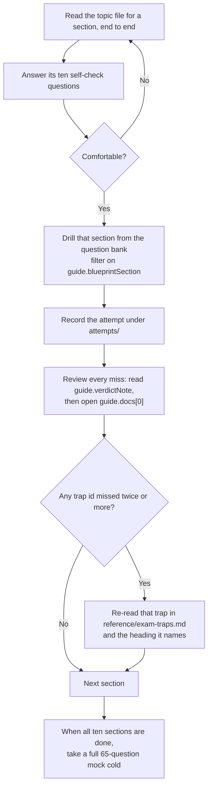

# Practice

The questions are also playable as an exam simulator at `site/exam/index.html`, reachable from the Exam simulator entry in the site navigation: untimed practice with full explanations, or a timed 65-question mock exam. Run `python3 site/build_bank.py` after editing any question file.

Practice-test questions as structured JSON, so a web interface can drill them, score them, and filter by weak area. Source: the Udemy course "Splunk Core Certified Power User Practice Tests (SPLK-1002)", 165 questions across five tests.

## Layout

```
practice/
  schema.json                  JSON Schema for a test file
  udemy-tests/
    tests.json                 manifest: which tests exist, blueprint weights, exam facts
    test-1.json                25 questions
    test-2.json                25 questions
    test-3.json                25 questions
    test-4.json                25 questions
    test-final.json            65 questions, 59 of them duplicates
  attempts/
    example-attempt.json       shape of an attempt record
  tracker.md                   attempt log and repeat-miss counter
  weak-areas.md                regenerated after each attempt
```

Question files are immutable reference data. Attempts are separate files, so retaking a test never destroys the previous result and a UI can chart progress over time.

## The question shape

Every question carries the course's content verbatim plus a `guide` block that this study guide adds.

```json
{
  "id": "t1-q23",
  "number": 23,
  "type": "single",
  "stem": "Which of the following searches will return events containing a tag named Privileged?",
  "options": [
    { "id": "A", "text": "tag=Priv",       "isCorrect": false, "explanation": null },
    { "id": "B", "text": "tag=Priv*",      "isCorrect": true,  "explanation": null },
    { "id": "C", "text": "tag=priv*",      "isCorrect": false, "explanation": null },
    { "id": "D", "text": "tag=privileged", "isCorrect": false, "explanation": null }
  ],
  "overallExplanation": "• Tags are case sensitive • To search for a tag ...",
  "courseKey": ["B"],
  "guide": {
    "blueprintSection": "6.1",
    "blueprintTitle": "Create and use tags",
    "onBlueprint": true,
    "trapIds": ["T-06-12", "T-06-02"],
    "readNext": ["topics/06-tags-and-event-types.md#traps"],
    "keyVerdict": "disputed",
    "verdictNote": "The whole question turns on tag names being case sensitive, which the course asserts but the Splunk 10.4 documentation never states ...",
    "resolveInLab": "Tag a field-value pair with `Privileged`, then run tag=Privileged, tag=privileged, tag=priv* and tag=Priv* ...",
    "correctedAnswer": null,
    "explanationIssues": ["\"Tags are case sensitive\" is not supported by the 10.4 documentation ..."],
    "factChecked": true,
    "docs": [
      {
        "url": "https://help.splunk.com/en/splunk-enterprise/manage-knowledge-objects/knowledge-management-manual/10.4/tags/tag-field-value-pairs-in-search",
        "title": "Tag field-value pairs in Search (Knowledge Management Manual 10.4)",
        "note": "Documented tag search syntax and the wildcard examples. Says nothing about case.",
        "primary": true
      }
    ],
    "difficulty": "hard"
  }
}
```

Fields added by the fact-check pass:

- `courseKey` preserves the option ids Udemy marked correct. `isCorrect` holds the verified truth, so the two differ only where `keyVerdict` is `wrong`.
- `guide.docs` is the documentation for the question. `docs[0]` is the primary page to open; every URL was fetched and returns HTTP 200.
- `guide.correctedAnswer` is set only when `keyVerdict` is `wrong`. An empty array means no offered option is correct.
- `guide.unanswerable` is `true` on the one question where no option is correct. A UI should skip it in scoring rather than mark you wrong.
- `guide.explanationIssues` lists false statements found in the course's explanation text, each with the correction.
- `guide.factChecked` is `true` on all 165.

Conventions worth knowing before you build against it:

- `type` is `single` when the course marks one **Correct answer**, `multi` when it marks one or more **Correct selection**. Multi questions also say "Choose all that apply" in the stem.
- Option `id` is `A`, `B`, `C`, `D` assigned in the order the course presents them. The course itself does not letter its options, so these IDs are ours and are stable.
- `explanation` is `null` when the course gave none. That is common: questions 1 to 10 mostly have per-option explanations, 11 onward mostly do not.
- `readNext` paths are relative to `SPLK-1002/`, not to `practice/`.
- `trapIds` resolve against `reference/exam-traps.md`.

## keyVerdict, and why it exists

Third-party practice tests get answers wrong. Rather than silently "fixing" the course, each question records whether its key holds up against the official documentation.

| Verdict | Meaning |
|---|---|
| `agree` | The course key matches the docs |
| `imprecise` | The keyed answer is defensible, but the question or its explanation is loosely worded or contains a side error |
| `disputed` | The docs do not settle it and the sources genuinely disagree. `resolveInLab` gives a check that would settle it |
| `wrong` | The course key contradicts the docs |

Every one of the 106 unique questions has been fact-checked against fetched documentation, keyed answer and explanation text both. Results: **56 agree, 44 imprecise, 3 wrong, 3 disputed**, with 65 false statements found in explanation text across 44 questions.

`isCorrect` holds the **documentation-verified** answer, so your UI scores you against reality. `courseKey` preserves what Udemy said. Where the two differ, `guide.keyVerdict` is `wrong` and `guide.correctedAnswer` gives the true answer.

### Three keys were wrong

| Question | Course said | Actually |
|---|---|---|
| `t1-q3` | A, B, C | **A, B, C, D.** The docs say "Datasets break down into four types. These types are: Event datasets, search datasets, transaction datasets, and child datasets." Child datasets are a documented type, so option D is correct. |
| `t4-q19` | A, "cannot be edited, create a new one" | **B, de-accelerate first.** Manage data models says "To make changes to an accelerated data model, you must turn off its acceleration." |
| `t4-q14` | B, `tags=<tagname>` | **No valid option.** The syntax is `tag=<tagname>`, which the question's own explanation states. Flagged `unanswerable`; skip it. |

### Three disputed, all the same unsourced claim

`t1-q23`, `t2-q1` and `t4-q3` each depend on tag NAMES being case sensitive. The course asserts it three times; the 10.4 tags pages state nothing either way. For `t1-q23` it decides the answer: if tag names are not case sensitive, that question has three correct answers. One check on your instance settles all three and closes trap T-06-12.

### Recurring defects in explanation text

- **`max_events_per_bucket`** is cited four times as the admin override for the 1,000-event transaction limit. The setting exists, but in the `limits.conf` `[search]` stanza, where it caps events per timeline bucket when `status_buckets>0`. It has no effect on `transaction`. The real controls are the command's own `maxevents` (default 1000, deactivated when negative) plus `[transactions] maxopentxn` (5000) and `maxopenevents` (100000).
- **"The delimiters method is for data that doesn't have headers"** appears on five questions and is backwards. The 10.4 docs describe the method as designed for data from files WITH headers.
- **"Name the workflow action with no spaces or special characters"** appears on four questions and is not a Splunk rule; no documentation states it.
- **"Must be based on an extracted field"** (calculated fields) appears on three questions and is too narrow. The docs say calculated fields can reference all types of field extractions and field aliases; what they cannot reference is lookups, event types and tags.
- **`t1-q6`** keys event type Priority correctly then explains that higher values win. Backwards: 1 is highest.
- **`t1-q25`** says "GET and POST action both can use Link", inverting the relationship. GET and POST are not action types; they are the two values of the link METHOD.
- **`t4-q12`** has transcription errors that would stop the keyed answer running: `index-web` with a hyphen, and a session id switching between `SD42IK` and `SD421K`.

### The fact-check also corrected this guide

Two findings came back against my own material, both now fixed:

- **`reference/cim-data-models.md`** asserted a `cim_<Model>_indexes` macro convention. No CIM 8.6 page documents such a macro; index scoping is the per-model Indexes allowlist on the CIM Setup page. The macros the add-on documentably ships are `cim_datamodelinfo` and the `cim_filter_*` set.
- **`topics/09`** now carries the docs' verbatim four-types sentence and a new trap, **T-09-19**, on editing an accelerated data model.

## Coverage, and why the final test is worth less than it looks

The course advertises 165 questions. **The final test repeats 59 of its 65 questions verbatim from tests 1 to 4**, so there are only **106 unique questions**. Every repeat carries `duplicateOf` pointing at the original, so a UI can hide them and so coverage stats stay honest.

Unique-question coverage against the blueprint weights:

| Section | Weight | Expected on a 65q exam | Unique questions here |
|---|---|---|---|
| 1.0 Transforming commands | 5% | ~3 | 8 |
| 2.0 Filtering and formatting | 10% | ~7 | 9 |
| 3.0 Correlating events | **15%** | ~10 | 13 |
| 4.0 Field extractions | 10% | ~7 | 9 |
| 5.0 Aliases and calculated fields | 10% | ~7 | 10 |
| 6.0 Tags and event types | 10% | ~7 | 9 |
| 7.0 Macros | 10% | ~7 | 7 |
| 8.0 Workflow actions | 10% | ~7 | 13 |
| 9.0 Data models | 10% | ~7 | 14 |
| 10.0 CIM | 10% | ~7 | 10 |
| Off blueprint | 0% | 0 | 4 |

Reasonably balanced, with workflow actions and data models over-represented and section 1.0 heavier than its 5% deserves. The four off-blueprint questions cover chart stack mode, bubble charts, Splunk jobs and the Job Inspector.

## Sending me a new test

Paste the raw text exactly as the course renders it. Do not clean up formatting, fix typos, or renumber. The parser handles:

- `Question N` followed by `Skipped` or your answer status
- `Correct answer` for single-select, `Correct selection` for multi-select, each appearing **before** the option text it belongs to
- An optional `Explanation` block after any option
- A closing `Overall explanation`

If a test is too long for one message, split it and say "part 1 of 2". Numbering continues across parts.

Tell me if you actually answered rather than skipping, and I'll write an attempt file alongside the question file.

## Attempts

One file per attempt in `attempts/`, named `<testId>-<date>.json`. See `example-attempt.json`.

`selected` is always an array, even for single-select, so the same code path handles both. `correct` is computed against `isCorrect` in the test file rather than stored as a judgement, which means a later key correction automatically re-scores old attempts.

## What a UI should probably do

- Filter by `guide.blueprintSection` to drill one weak area
- Filter by `guide.trapIds` to drill the traps you keep missing, which is the single most useful view
- Badge anything where `keyVerdict != "agree"` and show `verdictNote` after the answer is revealed
- Weight a mock exam by the blueprint percentages in `tests.json`, not evenly
- Show `readNext` links after each miss
- Not display a pass or fail. Splunk publishes no cut score, so `exam.passingScore` in `tests.json` is `null` deliberately

## How to run the loop



Read the topic files first and drill second. The topic files and their self-check questions are written to teach; the question bank is written to test, and it only measures something if you meet it cold.

## Two things to do deliberately

**Take each test cold, once.** Re-taking the same test measures memory of the questions, not of the rules. For a second pass on a weak area, use the self-check questions at the end of the relevant topic file.

**Watch the repeat-miss table in `tracker.md`, not the score.** A trap missed three times across three different tests is what will cost you on exam day.
