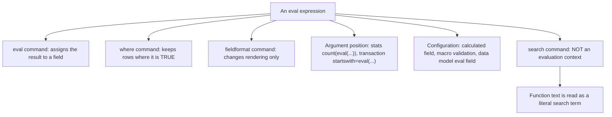

# Eval functions: the corrected catalogue

Every evaluation function in Splunk Enterprise 10.4, by family, with the signature and the one or two facts per function that a question can hang on. This file exists because the printed Apress study guide's Chapter 2 function tables have rows with the wrong description or the wrong example pasted in, including two rows on eval functions specifically. See the last section for those, and `source-notes/apress-errata.md` for the rest of the book.

The taught treatment of `eval`, `where` and `fieldformat` as commands lives in `topics/02-filtering-and-formatting.md`. This is the lookup layer: catalogue first, then the eight pairs people actually confuse, then the exact list of places an eval function is legal.

## Three rules that apply to every function below

The docs state the scope in one sentence: "You can use evaluation functions with the `eval`, `fieldformat`, and `where` commands, and as part of eval expressions with other commands." Individual function pages narrow that further, and where they do it is noted in the tables.

An eval expression cannot return a Boolean into a field. `| eval flag = isnull(user)` errors. Under `eval`, any function whose return is TRUE or FALSE has to be wrapped in `if()`, `case()`, `validate()`, or converted with `tostring()`. Under `where` the same functions are used bare, because `where` wants a Boolean. This catches `in`, `like`, `match`, `cidrmatch`, `searchmatch`, `json_valid`, `json_has_key_exact`, `true`, `false`, and the whole `is*` family.

Numbers are double-precision floats. Results are rounded to the precision of the least precise input unless you use `exact()`, division by zero yields a null field, and the precision limit is 17 significant digits over the range -2^53+1 to 2^53-1.

## Comparison and conditional

| Function | Signature | Returns | Notes |
|---|---|---|---|
| case | `case(<condition>,<value>,...)` | Value paired with the first TRUE condition | NULL when no condition is TRUE. The documented default idiom is a final `true(),"<default>"` pair. Tests strictly first to last, so range ordering matters. |
| cidrmatch | `cidrmatch(<cidr>,<ip>)` | Boolean | Subnet first, address second. Both arguments are strings, so literals need double quotes. IPv4 and IPv6. |
| coalesce | `coalesce(<values>)` | The first argument that is not NULL | One or more arguments. No condition, no branches. This is the row Apress gets wrong. |
| false | `false()` | FALSE | No arguments. |
| if | `if(<predicate>,<true_value>,<false_value>)` | Second argument if the predicate is TRUE, third otherwise | Exactly three arguments, no more. Nesting `if` inside `if` is how people fake a `case`. |
| in | `in(<field>,<list>)` | Boolean | Quoted values, no wildcards. Under `eval` it must sit inside `case`, `if`, or `validate`. Distinct from the `IN` operator. |
| like | `like(<str>,<pattern>)` | Boolean | Case sensitive. `%` matches many characters, `_` matches exactly one. No asterisk. |
| lookup | `lookup("<table>",json_object(...),json_array(...))` | Output fields as a JSON object | Splunk Enterprise only, CSV lookups only. A quoted string not ending in `.csv` is read as a globally shared lookup definition. |
| match | `match(<str>,<regex>)` | Boolean | Matches any substring. Anchor with `^` and `$` for a whole-string match. |
| null | `null()` | NULL | Takes no arguments. Assigning it clears a field value. The second row Apress gets wrong. |
| nullif | `nullif(<field1>,<field2>)` | NULL when the two values are equal, otherwise the value of `<field1>` | Two arguments, both field names in normal use. |
| searchmatch | `searchmatch(<search_str>)` | Boolean | TRUE if the event matches the search string. Under `eval` it must sit inside `if`. Literal search strings only, not saved-search names. |
| true | `true()` | TRUE | No arguments. The standard `case` and `validate` terminator. |
| validate | `validate(<condition>,<value>,...)` | Value paired with the first FALSE condition | NULL when every condition is TRUE. Documented as the opposite of `case`. The natural fit for a macro validation expression. |

## Conversion

| Function | Signature | Returns | Notes |
|---|---|---|---|
| ipmask | `ipmask(<mask>,<ip>)` | Masked IP address string | Documented for the `eval` command. Mask first. |
| printf | `printf(<format>,<arguments>)` | Formatted string | Default precision 6 for `%a %A %e %E %f %F`. `%C`, `%n`, `%S` and the `%<num>$` positional form are unsupported. |
| toarray | `toarray(<value>)` | Array-typed value | Type companion to the JSON functions. |
| tobool | `tobool(<value>)` | Boolean | Being a Boolean, it cannot be assigned directly by `eval`. |
| todouble | `todouble(<value>,<base>)` | Double | `<base>` defaults to 10, range 2 to 36. |
| toint | `toint(<value>,<base>)` | Integer | `<base>` defaults to 10, range 2 to 36. Floors a double rather than rounding it. |
| tomv | `tomv(<value>)` | Multivalue field | Converts an array-typed value into a multivalue field. |
| tonumber | `tonumber(<str>,<base>)` | Number | `<base>` defaults to 10, range 2 to 36. A string containing a period becomes a double, otherwise an integer. Leading or trailing spaces return NULL, and unparseable text such as `tonumber("seven")` raises an error rather than returning NULL. |
| toobject | `toobject(<value>)` | Object-typed value | Type companion to the JSON functions. |
| tostring | `tostring(<value>,<format>)` | String | Only four format keywords: `"binary"`, `"hex"`, `"commas"`, `"duration"`. `"commas"` rounds to two decimal places. `"duration"` renders seconds as `HH:MM:SS`. Booleans become the strings `True` and `False`. A currency symbol is not a format, so concatenate it. |

## Cryptographic

| Function | Signature | Returns | Notes |
|---|---|---|---|
| md5 | `md5(<str>)` | 128-bit MD5 hash of the string | Works with `eval`, `fieldformat` and `where`. |
| sha1 | `sha1(<str>)` | Secure hash based on the FIPS compliant SHA-1 function | Same command scope. |
| sha256 | `sha256(<str>)` | Secure hash based on the FIPS compliant SHA-256 (SHA-2 family) function | Same command scope. |
| sha512 | `sha512(<str>)` | Secure hash based on the FIPS compliant SHA-512 (SHA-2 family) function | Same command scope. |

Off-blueprint, but the family name is worth recognising in a "which of these is not an eval function family" question.

## Date and time

| Function | Signature | Returns | Notes |
|---|---|---|---|
| now | `now()` | UNIX seconds at which the search started | For a scheduled search, the scheduled run time rather than the actual dispatch time. Constant across the whole result set. |
| relative_time | `relative_time(<time>,<specifier>)` | UNIX seconds | Applies a relative time specifier such as `"-1d@d"` to a UNIX time. Input and output are both epoch. |
| strftime | `strftime(<time>,<format>)` | String | Formats epoch seconds for display. Milliseconds, microseconds or nanoseconds must be divided by 10^3, 10^6 or 10^9 first. |
| strptime | `strptime(<str>,<format>)` | UNIX seconds | Parses a time string. The timestamp must include a day, so month and year alone fails. Dates must be 1 January 1971 or later. Running it on `_time` does nothing, because `_time` is already epoch. |
| time | `time()` | Wall-clock UNIX time with microsecond resolution | Evaluated per result as each row passes through, so it varies down the result set. This is the `now()` versus `time()` distinction the exam likes. |

## Informational

| Function | Signature | Returns | Notes |
|---|---|---|---|
| isarray | `isarray(<value>)` | Boolean | |
| isbool | `isbool(<value>)` | Boolean | |
| isdouble | `isdouble(<value>)` | Boolean | |
| isint | `isint(<value>)` | Boolean | |
| ismv | `ismv(<value>)` | Boolean | TRUE when the field holds more than one value. |
| isnotnull | `isnotnull(<value>)` | Boolean | The idiomatic guard inside `mvfilter`. |
| isnull | `isnull(<value>)` | Boolean | |
| isnum | `isnum(<value>)` | Boolean | The idiomatic macro validation test. |
| isobject | `isobject(<value>)` | Boolean | |
| isstr | `isstr(<value>)` | Boolean | |
| typeof | `typeof(<value>)` | String: `Number`, `String`, `Bool`, or `Invalid` | The one member of this family that `eval` can assign directly, because it returns a string rather than a Boolean. |

## JSON

| Function | Signature | Returns | Notes |
|---|---|---|---|
| json | `json(<value>)` | The value, or NULL | Evaluates whether a value can be parsed as JSON. |
| json_object | `json_object(<key>,<value>,...)` | JSON object | Keys must be strings. Also the argument shape used by the `lookup` eval function. |
| json_array | `json_array(<values>)` | JSON array | Accepts strings, numbers, Booleans, and nested objects. |
| json_array_to_mv | `json_array_to_mv(<json_array>,<boolean>)` | Multivalue field | The Boolean controls whether quoting is preserved. |
| json_valid | `json_valid(<json>)` | Boolean | Under `eval`, wrap it in `if()`. |
| json_keys | `json_keys(<json>)` | JSON array of the object's keys | Cannot be used on a JSON array. |
| json_extract | `json_extract(<json>,<path>,...)` | Native type, or a JSON array for multiple paths | Path notation such as `{}.name`. Cannot address keys that contain periods. |
| json_extract_exact | `json_extract_exact(<json>,<string>,...)` | Native type or JSON array | Treats the whole string as a literal key, periods included. |
| json_delete | `json_delete(<object>,<keys>)` | Updated JSON object | The original object is not modified. |
| json_set | `json_set(<json>,<path>,<value>,...)` | Updated JSON object | Interprets periods as nested paths and creates missing keys. |
| json_set_exact | `json_set_exact(<json>,<key>,<value>,...)` | Updated JSON object or array | Interprets keys as literal strings, special characters included. |
| json_append | `json_append(<json>,<path>,<value>,...)` | Updated JSON object | Appends an array as a single element. Invalid paths are ignored. |
| json_extend | `json_extend(<json>,<path>,<array>,...)` | Updated JSON object | Flattens an array into its component values before appending. This is the only difference from `json_append`. |
| json_entries | `json_entries(<value>)` | JSON array of `{"key":...,"value":...}` objects | Top-level pairs only. Also usable with `fieldformat`. |
| json_has_key_exact | `json_has_key_exact(<object>,<key>)` | Boolean | Dots are literal. Under `eval`, wrap it in `if()`; under `where`, use it directly. |

## Mathematical

| Function | Signature | Returns | Notes |
|---|---|---|---|
| abs | `abs(<num>)` | Absolute value | |
| ceiling | `ceiling(<num>)` | Next highest integer | Alias `ceil`. |
| exact | `exact(<expression>)` | The expression result at full precision | Bypasses the least-precise-input rounding rule. |
| exp | `exp(<num>)` | e raised to the power | |
| floor | `floor(<num>)` | Next lowest integer | |
| ln | `ln(<num>)` | Natural log | |
| log | `log(<num>,<base>)` | Logarithm | `<base>` defaults to 10. |
| pi | `pi()` | Pi to 11 digits of precision | No arguments. |
| pow | `pow(<num>,<exp>)` | Number raised to the power | |
| round | `round(<num>,<precision>)` | Rounded number | `<precision>` defaults to an integer. A negative precision is rejected. |
| sigfig | `sigfig(<num>)` | Number rounded to the significant figures its inputs justify | Governed by the least precise operand in the expression that produced the value, not by a digit count you supply. |
| sqrt | `sqrt(<num>)` | Square root | |
| sum | `sum(<num>,...)` | Sum of the numeric arguments | The eval function, not the `stats` aggregate of the same name. |

## Multivalue

| Function | Signature | Returns | Notes |
|---|---|---|---|
| commands | `commands(<value>)` | Multivalue field of the commands in a search string | |
| mvappend | `mvappend(<values>)` | Multivalue field | Concatenates the arguments, single or multivalue. |
| mvcount | `mvcount(<mv>)` | Number of values | `1` for a single value, NULL when the field has no values. |
| mvdedup | `mvdedup(<mv>)` | Multivalue field with duplicates removed | |
| mvfilter | `mvfilter(<predicate>)` | The subset of values for which the predicate is TRUE | The predicate may reference only one field. NULLs survive unless you add `isnotnull()`. |
| mvfind | `mvfind(<mv>,<regex>)` | The index of the first matching value | Indexes from 0. NULL when nothing matches. Returns a position, not a value. |
| mvindex | `mvindex(<mv>,<start>,<end>)` | One value, or a subset | Indexes from 0, `-1` is the last value, out-of-range returns NULL. Omitting `<end>` returns the single value at `<start>`. |
| mvjoin | `mvjoin(<mv>,<delim>)` | Single string | The inverse of `split`. |
| mvmap | `mvmap(<mv>,<expression>)` | Multivalue field | Runs the expression once per value. |
| mvrange | `mvrange(<start>,<end>,<step>)` | Multivalue field of numbers | `<end>` is excluded. A timespan step such as `"7d"` makes start and end UNIX times. |
| mvreverse | `mvreverse(<value>)` | Multivalue field in reverse order | |
| mvsort | `mvsort(<mv>)` | Multivalue field sorted lexicographically | |
| mvzip | `mvzip(<mv_left>,<mv_right>,<delim>)` | Multivalue field of pairs | `<delim>` defaults to `,`. Pairs first with first, second with second. |
| mv_to_json_array | `mv_to_json_array(<field>,<infer_types>)` | JSON array | `<infer_types>` defaults to `false`. Documented for `eval` and `where`. |
| split | `split(<str>,<delim>)` | Multivalue field | `""` as the delimiter splits into one value per character. Catalogued under multivalue functions in 10.4, not under text functions. |

## Statistical

| Function | Signature | Returns | Notes |
|---|---|---|---|
| avg | `avg(<values>)` | Average of the numeric values | Non-numeric arguments are ignored. Documented as equivalent to `sum(x,y)/(mvcount(x) + mvcount(y))`, so multivalue fields contribute each value. |
| max | `max(<values>)` | The maximum | Accepts a mix of numbers and strings, and strings rank above numbers. |
| min | `min(<values>)` | The minimum | Same mixed-type ordering as `max`. |
| random | `random()` | Pseudo-random integer from 0 to 2^31-1 | No arguments. |

These four are row-wise: they compare the arguments you hand them within a single event. The `stats` functions of the same name are column-wise and aggregate down a result set. `| eval m = max(bytes_in, bytes_out)` and `| stats max(bytes)` answer different questions, and swapping one for the other is a standard distractor.

## Text

| Function | Signature | Returns | Notes |
|---|---|---|---|
| len | `len(<str>)` | Character count | Counts UTF-8 code points, not bytes. |
| lower | `lower(<str>)` | Lowercased string | One of only two text functions that accept a multivalue field. |
| ltrim | `ltrim(<str>,<trim_chars>)` | String with leading characters removed | `<trim_chars>` defaults to spaces and tabs. |
| replace | `replace(<str>,<regex>,<replacement>)` | String with every match replaced | PCRE. `\1` and `\2` reference capture groups. Replaces all occurrences, not just the first. |
| rtrim | `rtrim(<str>,<trim_chars>)` | String with trailing characters removed | Same default as `ltrim`. |
| spath | `spath(<value>,<path>)` | Value at the path | The function form of the `spath` command, for XML and JSON. |
| substr | `substr(<str>,<start>,<length>)` | Substring | Indexes from 1, SQLite semantics, negative start counts from the end. Omitting `<length>` returns the rest of the string. |
| trim | `trim(<str>,<trim_chars>)` | String trimmed at both ends | Same default as `ltrim`. |
| upper | `upper(<str>)` | Uppercased string | The other multivalue-capable text function. |
| urldecode | `urldecode(<url>)` | Decoded URL | |

The index-base pairing is examinable on its own: `substr` starts at 1, `mvindex` and `mvfind` start at 0.

## Trigonometric and hyperbolic

| Function | Signature | Returns | Notes |
|---|---|---|---|
| acos | `acos(X)` | Arc cosine in radians, range 0 to pi | |
| acosh | `acosh(X)` | Inverse hyperbolic cosine in radians | |
| asin | `asin(X)` | Arc sine in radians, range -pi/2 to pi/2 | |
| asinh | `asinh(X)` | Inverse hyperbolic sine in radians | |
| atan | `atan(X)` | Arc tangent in radians, range -pi/2 to pi/2 | |
| atan2 | `atan2(Y,X)` | Arc tangent in radians, range -pi to pi | Y coordinate first, X second. Uses the signs of both to pick the quadrant, which is why it beats `atan`. |
| atanh | `atanh(X)` | Inverse hyperbolic tangent in radians | |
| cos | `cos(X)` | Cosine of X radians | |
| cosh | `cosh(X)` | Hyperbolic cosine of X radians | |
| hypot | `hypot(X,Y)` | Square root of the sum of the squares of X and Y | The hypotenuse of a right triangle with sides X and Y. |
| sin | `sin(X)` | Sine of X radians | |
| sinh | `sinh(X)` | Hyperbolic sine of X radians | |
| tan | `tan(X)` | Tangent of X radians | |
| tanh | `tanh(X)` | Hyperbolic tangent of X radians | |

Every input and output is in radians. There is no degree variant, so convert with `pi()`.

A twelfth family, bitwise functions, is listed on the same 10.4 evaluation functions page. Nothing in the SPLK-1002 blueprint touches it; recognise the family name and move on.

## strftime and strptime format specifiers

The same variables serve `strftime`, `strptime`, `fieldformat`, the `timeformat` argument of `search`, and `convert`. The example column renders the instant 2026-01-15 09:05:03.

### Time

| Variable | Meaning | Example |
|---|---|---|
| `%H` | Hour, 24-hour clock, 00 to 23 | `09` |
| `%I` | Hour, 12-hour clock, 01 to 12. Pair with `%p` | `09` |
| `%k` | Like `%H` but a leading zero becomes a space | ` 9` |
| `%M` | Minute, 00 to 59 | `05` |
| `%S` | Second, 00 to 59 | `03` |
| `%p` | AM or PM | `AM` |
| `%T` | The time in 24-hour notation, equivalent to `%H:%M:%S` | `09:05:03` |
| `%X` | Time in the current locale's format | locale dependent |
| `%N` | Subsecond digits, default `%9N`. Also `%3N` and `%6N` | `000000000` |
| `%Q` | Subsecond component of a UTC timestamp, default milliseconds (`%3Q`). Also `%6Q` and `%9Q` | `000` |
| `%f` | Microseconds as a decimal number | `000000` |
| `%s` | UNIX epoch time, seconds since 1970-01-01 00:00:00 UTC | `1768467903` |

Subsecond variables only produce meaningful digits when the data carries that resolution; the docs attach the caveat to metrics indexes enabled for millisecond timestamp resolution.

### Date

| Variable | Meaning | Example |
|---|---|---|
| `%F` | Equivalent to `%Y-%m-%d`, the ISO 8601 date format | `2026-01-15` |
| `%Y` | Year with the century | `2026` |
| `%y` | Year without the century, 00 to 99 | `26` |
| `%m` | Month, 01 to 12 | `01` |
| `%b` | Abbreviated month name | `Jan` |
| `%B` | Full month name | `January` |
| `%d` | Day of the month with a leading zero, 01 to 31 | `15` |
| `%e` | Like `%d` but a leading zero becomes a space | `15` |
| `%j` | Day of the year with leading zeros, 001 to 366 | `015` |
| `%x` | Date in the current locale's format | `1/15/2026` for US English |
| `%C` | Century as a two-digit number | `20` |

### Days and weeks

| Variable | Meaning | Example |
|---|---|---|
| `%A` | Full weekday name | `Thursday` |
| `%a` | Abbreviated weekday name | `Thu` |
| `%w` | Weekday as a number, 0 is Sunday through 6 is Saturday | `4` |
| `%V` | Week of the year, counting from 1 | see note |
| `%U` | Week of the year, counting from 0 | see note |
| `%G` | ISO 8601 year with century corresponding to the ISO week number | `2026` |
| `%g` | ISO 8601 year without the century, 00 to 99 | `26` |

`%V` and `%U` differ only in their start number, and picking the wrong one shifts every week bucket by one. `%V` counting from 1 is the common choice.

### Time zone

| Variable | Meaning | Example |
|---|---|---|
| `%Z` | Time zone abbreviation | `EST` |
| `%z` | Offset from UTC as `+hhmm` or `-hhmm` | `-0500` |
| `%:z` | Offset with a colon | `-05:00` |
| `%::z` | Offset with hour, minute and second | `-05:00:00` |
| `%:::z` | Offset, hour only | `-05` |
| `%Ez` | Splunk-specific offset in minutes | `-300` |

### Composite and literal

| Variable | Meaning | Example |
|---|---|---|
| `%c` | Date and time in the server operating system's locale format | locale dependent |
| `%+` | Date and time with time zone in the locale format | locale dependent |
| `%%` | A literal percent character | `%` |

## Most confused pairs

### if versus case versus coalesce versus nullif

`if` branches on one Boolean and takes exactly three arguments. `case` walks condition and value pairs and returns the value for the first TRUE condition, defaulting to NULL. `coalesce` tests nothing at all and returns its first non-NULL argument. `nullif` returns NULL when its two arguments are equal and otherwise the first one, so it answers "did this change" rather than "which value do I want".

```spl
| makeresults
| eval a = "x", b = null(), c = "x"
| eval by_if       = if(a=="x", "matched", "not matched"),
       by_case     = case(a=="y", "y branch", a=="x", "x branch", true(), "default"),
       by_coalesce = coalesce(b, a, "fallback"),
       by_nullif   = nullif(a, c)
| table a b c by_if by_case by_coalesce by_nullif
```

`by_coalesce` is `x`, because `b` is NULL and `a` is the first argument that is not. `by_nullif` is empty, because `a` and `c` are equal. Drop the `true()` pair from the `case` and change `a` to `"z"` to watch the column go NULL rather than falling through to the last value.

### isnull versus isnotnull versus null()

`isnull` and `isnotnull` are informational tests that return a Boolean, so `where` uses them bare and `eval` has to wrap them. `null()` is not a test: it takes no arguments and produces a NULL, and assigning it wipes a field.

```spl
| makeresults
| eval present = "value", missing = null()
| eval flag = if(isnull(missing), "missing is null", "missing has a value")
| where isnotnull(present)
| eval present = null()
| table present missing flag
```

`where isnotnull(present)` keeps the row. The last `eval` then clears `present`, and because a field needs at least one non-NULL value somewhere in the result set to exist in the schema, the `present` column comes back empty in the table.

### tostring versus fieldformat

`tostring` is a function that produces a new string value, and whatever you assign it to really is a string from that point on. `fieldformat` is a command that changes only how a field renders; every command after it, and every export, sees the original value.

```spl
sourcetype=vendor_sales
| stats sum(price) AS revenue BY product_name
| eval revenue_str = tostring(revenue, "commas")
| fieldformat revenue = "$" . tostring(revenue, "commas")
| sort - revenue
| table product_name revenue revenue_str
```

Both columns look formatted. `sort - revenue` is still numerically correct because `fieldformat` did not touch the value, whereas `sort - revenue_str` would compare `$9.99` against `1,204.50` as text. One expression per `fieldformat` command, and put it last.

### replace versus rex mode=sed

`replace` is an eval function: it needs an assignment target, it takes a PCRE pattern, and it replaces every occurrence. `rex mode=sed` is a command that rewrites a field in place using `s///` or `y///`, defaults to `_raw`, and replaces only the first occurrence unless you add the `g` flag.

```spl
| makeresults
| eval path = "/cart/step2/checkout/step3"
| eval via_function = replace(path, "step(\d+)", "stage-\1")
| rex field=path mode=sed "s/step(\d+)/stage-\1/g"
| table path via_function
```

`path` was rewritten in place and `via_function` is a second column, which is the practical difference: `rex` destroys the original, `replace` preserves it. Note that neither one is the `replace` command, which swaps whole field values and takes no regex.

### like() versus the LIKE operator versus wildcards in search

`like(<str>,<pattern>)` and the infix `LIKE` operator are the same matcher in two syntaxes, both case sensitive, both using `%` for many characters and `_` for exactly one. The `search` command uses `*` instead and is case insensitive on field values. `where` has no `*` at all; there it is a literal character.

```spl
sourcetype=access_combined_wcookie useragent=*MSIE*
| where like(useragent, "Mozilla%") AND NOT useragent LIKE "%Trident%"
| stats count BY useragent
```

The base search prunes at the index with `*`. The `where` clause then filters in memory with `%`. Rewriting the `where` as `useragent="Mozilla*"` returns nothing, and lowercasing the pattern to `"mozilla%"` also returns nothing. See T-02-09 and T-02-10 in `reference/exam-traps.md`.

### round versus sigfig

`round(<num>,<precision>)` takes the number of decimal places you want and gives you exactly that. `sigfig(<num>)` takes no precision argument: it rounds to the significant figures the least precise operand in the originating expression justifies.

```spl
| makeresults
| eval x = 1234.5678
| eval r_int = round(x), r_2dp = round(x, 2), s = sigfig(1.00 * 1111)
| table x r_int r_2dp s
```

`r_int` is `1235`, `r_2dp` is `1234.57`, and `s` is `1110`, because `1.00` carries three significant figures. Reach for `round` when a question says "to two decimal places" and for `sigfig` only when it says "significant figures".

### strftime versus strptime

`strptime` parses: string in, epoch seconds out. `strftime` formats: epoch seconds in, string out. The mnemonic is that the `p` is parse and the `f` is format.

```spl
| makeresults
| eval raw_ts = "2026-01-15 09:05:03"
| eval epoch  = strptime(raw_ts, "%Y-%m-%d %H:%M:%S"),
       pretty = strftime(epoch, "%A %d %B %Y at %H:%M:%S"),
       today  = strftime(now(), "%F %T")
| table raw_ts epoch pretty today
```

Both directions need a format string that matches the data. Two failure modes worth remembering: `strptime` on `_time` does nothing because `_time` is already epoch, and `strftime` on a millisecond timestamp produces a date far in the future until you divide by 1000.

### mvfind versus mvfilter versus mvindex

`mvfind` returns a position, not a value: the zero-based index of the first value matching a regex, or NULL. `mvfilter` returns a subset of values, evaluating a Boolean predicate that may reference only one field. `mvindex` returns the value or values at positions you name.

```spl
| makeresults
| eval hosts = split("web01,db02,web03,cache04", ",")
| eval pos_of_first_db = mvfind(hosts, "^db"),
       web_only        = mvfilter(match(hosts, "^web")),
       second_host     = mvindex(hosts, 1),
       first_two       = mvindex(hosts, 0, 1),
       last_host       = mvindex(hosts, -1)
| table hosts pos_of_first_db web_only second_host first_two last_host
```

`pos_of_first_db` is `1`, a number. `web_only` is a two-value field holding `web01` and `web03`. `second_host` is `db02`, because indexing starts at 0. `last_host` is `cache04` via the documented `-1`, and `mvindex(hosts, 4)` would be NULL rather than an error.

## Where eval functions can and cannot be used



| Context | Legal | What to know |
|---|---|---|
| `eval` command | Yes | The primary case. The result must be a number or a string; a Boolean has to be wrapped. |
| `where` command | Yes | Wants a Boolean, so `isnull()`, `like()`, `match()`, `cidrmatch()` and the rest are used bare here. |
| `fieldformat` command | Yes | One expression per command, rendering only. `ipmask` is documented for `eval`, so do not assume every function is available in all three commands. |
| Argument to a `stats` aggregate | Yes, documented for `count` | "When you use a statistical function, you can use an eval expression as part of the statistical function." The documented example is `index=* \| stats count(eval(status="404")) AS count_status BY sourcetype`. Treat `count(eval(...))` as the form the exam tests. |
| `transaction startswith` and `endswith` | Yes | A filter string can be `eval(<eval-expression>)` returning a Boolean, as in `startswith=eval(speed_field < max_speed_field)`. This is the only way to get a function into those arguments. |
| Calculated field, `EVAL-<field>` in props.conf | Yes | The whole point of a calculated field is a stored eval expression. It runs at stage 6 of search-time processing, after field aliasing and before lookups, so it cannot reference lookup outputs, event types or tags. All `EVAL-` settings in one stanza are processed in parallel, so one cannot feed another. |
| Macro validation expression | Yes | `validation = isnum($lo$) AND isnum($hi$)` with `errormsg` for the Boolean form, or a non-Boolean `validate()` expression where NULL means success and any returned string is itself the message. Evaluated before dispatch, so failure is an error rather than an empty result set. |
| Macro definition with `iseval = true` | Yes | The definition is an eval expression returning the string that the macro expands to, not a value that appears in your results. |
| Data model Eval Expression field | Yes | Enter the expression only, without the word `eval`. Fields are processed from the top of the list down, so an eval field must sit below anything it reads. |
| `search` command | No | See below. |

The `search` command has no evaluation stage, and that is the reason rather than an arbitrary restriction. Before the first pipe, `search` is event-generating: it resolves terms and field-value pairs against the index, deciding which buckets and raw events to read at all. After a pipe it does the same term and field-value matching against results already in memory. Neither mode parses an expression, so a function call arrives as text. `| search isnull(user)` looks for events containing the literal string `isnull(user)`, and `| search len(uri)>10` is read as a comparison on a field literally named `len(uri)`, which does not exist. Nothing errors; you simply get zero results, which is why this one costs people marks.

The fix is always the same shape. Move the predicate to `where`, or compute the value with `eval` first and then filter on the field you created:

```spl
sourcetype=access_combined_wcookie
| eval uri_len = len(uri_path)
| search uri_len>30
```

That works because `uri_len` exists as a field by the time `search` sees it, and `search` is comparing a field to a literal. What it still cannot do is call `len()` itself.

## Apress errata for eval

Chapter 2 of the Apress guide is a set of reference tables rather than a taught progression, and several rows carry the wrong description or an example pasted in from a neighbouring row. Two are eval rows and three are function-table rows in the same chapter. Cross-reference `source-notes/apress-errata.md`, which lists these alongside the nine broken answer keys.

| Table | Row | What the book prints | The correction |
|---|---|---|---|
| 2-16, eval functions | `coalesce(X,...)` | Described as "it evaluates X if true, return Y; otherwise, it returns Z" | That sentence describes `if(X,Y,Z)`. `coalesce` takes one or more arguments, tests no condition, and returns the first that is not NULL. Trap T-02-05. |
| 2-16, eval functions | `null()` | Example given as `\| eval n=nullif(fielda,fieldB)` | That is `nullif`'s example. `null()` takes no arguments and returns NULL; assigning it clears a field. `nullif(<field1>,<field2>)` returns NULL when the two are equal and otherwise the first. Trap T-02-06. |
| 2-9, stats functions | `var(field)` | Command shown as `\| stats mode(field_name)` | Should be `\| stats var(field_name)`. `mode` and `var` are different aggregates. |
| 2-12, headed "timechart Functions" | The whole table | Every example written as `\| stats per_day(...)` under a heading that says timechart | These are rate functions available to `stats`, `chart` and `timechart`. The heading and the examples disagree; neither is wrong on its own, and the table teaches you to trust neither. |
| 2-12 | `per_minute(field)` | Command shown as `\| stats per_day(field_name)` | Should be `\| stats per_minute(field_name)`. |

Chapter 2 also calls the field-selection command "Field" when the SPL command is `fields`, and prints two Boolean examples that will not run, both missing the `search` command after a pipe. For the aggregate and rate functions in tables 2-9 and 2-12, use `reference/stats-and-chart-functions.md` rather than the book.

Read the eval catalogue itself from the source: the [evaluation functions overview](https://help.splunk.com/en/splunk-enterprise/search/spl-search-reference/10.4/evaluation-functions/evaluation-functions) links every family page, and [Comparison and Conditional functions](https://help.splunk.com/en/splunk-enterprise/search/spl-search-reference/10.4/evaluation-functions/comparison-and-conditional-functions) is the single page that corrects both Apress eval rows.
