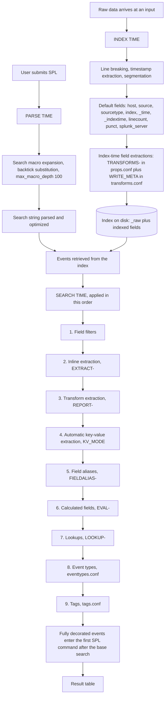
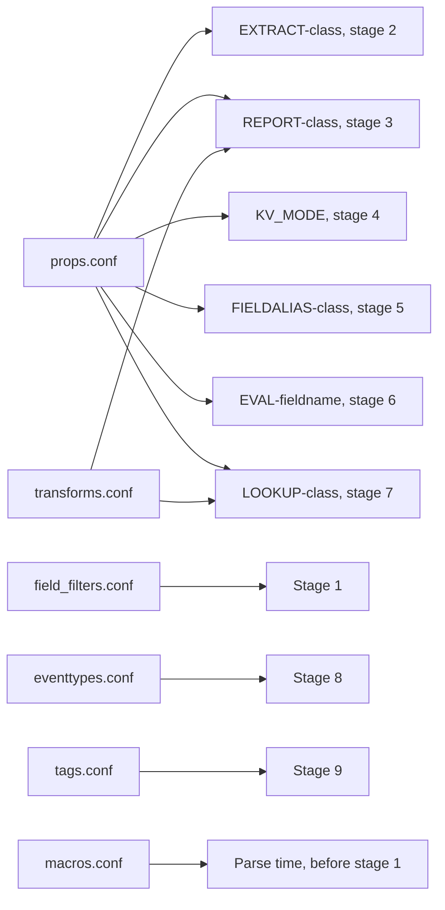

# Search-time knowledge object precedence

The single ordering that blueprint sections 4.0, 5.0, 6.0, 9.0 and 10.0 all reduce to: which knowledge object Splunk applies first, which it applies last, and therefore which definitions can see which fields. Roughly half the SPLK-1002 exam by weight is a restatement of this one table.

## Scope and source of truth

The authoritative page is "The sequence of search-time operations" in the Knowledge Management Manual for Splunk Enterprise 10.4. Everything numbered in this file comes from that page unless another page is named. The page opens: "When you run a search, Splunk software runs several operations to derive various knowledge objects and apply them to the events returned by the search. These knowledge objects include extracted fields, calculated fields, lookup fields, field aliases, tags, and event types." It then states the governing rule: "Splunk software performs these operations in a specific sequence. This sequence can cause problems if you configure something at the top of the process order with a definition that references the result of a configuration that is farther down in the process order."

The constraint stated on that page is the whole exam topic in one sentence: "Each operation can have configurations that reference fields derived by operations that precede them in the sequence. However, those same configurations cannot contain fields that are derived by operations that follow them in the sequence."

Docs URL that establishes the sequence: https://help.splunk.com/en/splunk-enterprise/manage-knowledge-objects/knowledge-management-manual/10.4/get-started-with-knowledge-objects/the-sequence-of-search-time-operations

## The documented sequence, nine operations

The folk version taught in most courses is six steps: extraction, alias, calculated field, lookup, event type, tag. The docs list nine, because field extraction is split into three distinct operations and because field filters were added at the front. Learn the nine. The six-step version is a lossy compression of items 2 through 9, and the exam has questions that turn on the split between EXTRACT and REPORT.

| # | Operation | Backed by | One-line meaning |
|---|-----------|-----------|------------------|
| 1 | Field filters | `field_filters.conf`, a `fieldFilterName` stanza; also configurable in Splunk Web | Removes or replaces specific indexed, `_raw`, search-time, and default fields before anything else sees them |
| 2 | Inline field extraction | `EXTRACT-<class>` in `props.conf` | Search-time regex extraction defined entirely in `props.conf`, no transform referenced |
| 3 | Field extraction using a field transform | `REPORT-<class>` in `props.conf` pointing at a `transforms.conf` stanza | Search-time extraction whose regex and options live in a reusable transform |
| 4 | Automatic key-value field extraction | `KV_MODE` in `props.conf` | Splunk's own key-value, JSON, XML, or whitespace parsing of the raw text |
| 5 | Field aliasing | `FIELDALIAS-<class>` in `props.conf` | Gives an existing field a second name |
| 6 | Calculated fields | `EVAL-<fieldname>` in `props.conf` | Creates a field from an eval expression over fields that already exist |
| 7 | Lookups | `LOOKUP-<class>` in `props.conf` pointing at a `transforms.conf` lookup stanza | Automatic lookups that add output fields to matching events |
| 8 | Event types | `eventtypes.conf` | Adds `eventtype` field values to events matching a saved search string |
| 9 | Tags | `tags.conf` | Adds tag labels to field/value pairs, including `eventtype` values |

Two corroborating statements from separate pages, useful because the exam likes to quote them: "Calculated fields come after field aliasing but before lookups" (About calculated fields), "Event types come before tags, but after lookups" (About event types), and "Tags come last in the sequence of search-time operations" (About tags and aliases). The field alias page states the same thing from its own side: aliases are applied "after key-value extraction but before field lookups", and specifically before calculated fields, lookups, event types, and tags.

## Where macro expansion sits, and why it is not in the list

Search macros are not in the nine. They are not applied to events at all. A macro is textual substitution into the search string, performed while the search string is being parsed, before any event is retrieved and therefore before every one of the nine operations above. The sequence page does not list macros anywhere in its main content, which is itself the evidence: macros are gone by the time the sequence begins.

The mechanics: `limits.conf` documents `max_macro_depth` as the maximum recursion depth for macros, that is the maximum levels for macro expansion, with a default of 100, and describes it as a guardrail on memory usage during the parsing phase of searches. A search goes through multiple rounds of parsing, expansion, and optimization before the final optimized search string exists. Expansion is one of those rounds.

The practical consequence is visible in the docs topic "Use macros with event types and tags". Its opening instruction is: "When using macros containing concatenated expressions in searches with event types and tags, enclose the macro definitions with parentheses." The worked example shows a search `index=_audit OR tag="IDtag"` where the tag resolves to a definition containing a macro, and the expanded `litsearch` string comes out as `litsearch (index=_audit OR index=_internal sourcetype=splunk_btool)`. The macro definition was substituted as raw text, so the `OR` binds against only the first term of the definition. The fix is in the macro definition: `(index=_internal sourcetype=splunk_btool)`.

Read that example twice. It proves both halves of the point. Macro text is substituted literally, and it is substituted into the search string, not applied to events.

## Where index-time processing sits

Everything above happens after retrieval. The sequence page is explicit about what is not in its list: "This list does not include index-time operations, such as default and indexed field extraction. Index-time operations precede all search-time operations."

The "Index time versus search time" page in the indexer manual splits the two phases. Index-time processes take place between the point when the data is consumed and the point when it is written to disk. They are: default field extraction (such as `host`, `source`, `sourcetype`, and `timestamp`), static or dynamic host assignment for specific inputs, default host assignment overrides, source type customization, custom index-time field extraction, structured data field extraction, event timestamping, event linebreaking, and event segmentation. Search-time processes take place while a search is run, as events are collected by the search. That page lists them as: field filters, event segmentation, event type matching, search-time field extraction (automatic and custom field extractions, including multivalue fields and calculated fields), field aliasing, addition of fields from lookups, source type renaming, and tagging. Event segmentation appears in both lists.

Note carefully that the indexer manual's search-time list is a category list, not an ordering. It prints "event type matching" before "search-time field extraction", which is the reverse of the real sequence. The ordered authority is the Knowledge Management page, not this one.

### Default fields

Default fields are added at index time. The "Use default fields" page groups them as follows. Internal fields, which begin with an underscore: `_raw` (the original raw data of an event), `_time` (the event timestamp expressed in UNIX time), `_indextime` (the time the event was indexed, in UNIX time), `_cd` (an address for an event within the index), and `_bkt` (the id of the bucket the event is stored in). Default fields: `host`, `index`, `linecount`, `punct`, `source`, `sourcetype`, `splunk_server`, and `timestamp`. Default datetime fields derived from the event timestamp: `date_hour`, `date_mday`, `date_minute`, `date_month`, `date_second`, `date_wday`, `date_year`, `date_zone`.

### Why index-time changes need reindexing and search-time ones do not

A search-time knowledge object is evaluated on every search, against data already on disk, so a new `EXTRACT-`, `FIELDALIAS-`, `EVAL-`, `LOOKUP-`, event type, or tag applies retroactively to every event already indexed. Nothing is rewritten. An index-time change alters what gets written to disk, so it only affects data indexed after the change. The docs put the strongest version of this on the source type side: "After indexing, you cannot change the host or source type assignments", and the recommendation is to reindex the data or to work around it at search time. The general guidance is the same: "it is better to perform most knowledge-building activities, such as field extraction, at search time", because index-time custom field extraction degrades performance at both index time and search time, slowing indexing and enlarging the index so that later searches are slower.

Source type renaming is the exception that people misfile. `rename = <string>` in a `props.conf` source type stanza is a search-time operation. "The renaming of source types occurs only at search time." The original source type is moved to a field called `_sourcetype`. The sting in the tail: "Data from a renamed source type uses only the search-time configuration for the target source type." Rename `whoops` to `cheese_shop` and the `EXTRACT-` settings in the `[whoops]` stanza stop applying.

## The full pipeline



## Which configuration file backs each stage



| Stage | Setting or file | Splunk Web path | Notes |
|-------|-----------------|-----------------|-------|
| Parse time | `macros.conf`, stanza `[<STANZA_NAME>]` or `[<STANZA_NAME>(<numargs>)]` | Settings > Advanced Search > Search macros > New | Settings: `args`, `definition` (required), `validation`, `errormsg`, `iseval` (default `false`), `description` |
| 1 | `field_filters.conf`, `fieldFilterName` stanza | Configurable in Splunk Web | Removes or replaces indexed, `_raw`, search-time, and default fields |
| 2 | `props.conf` `EXTRACT-<class>` | Settings > Fields > Field extractions | Inline regex, no transform |
| 3 | `props.conf` `REPORT-<class>` plus `transforms.conf` | Settings > Fields > Field transformations, then Field extractions | Transform holds `REGEX`, `FORMAT`, `SOURCE_KEY` |
| 4 | `props.conf` `KV_MODE` | Not a Settings page, edit `props.conf` | Values `auto`, `none`, `json`, `xml`, `whitespace`. Default `auto` |
| 5 | `props.conf` `FIELDALIAS-<class> = <orig_field_name> AS <new_field_name>` | Settings > Fields > Field aliases | `ASNEW` is the non-overwriting variant |
| 6 | `props.conf` `EVAL-<fieldname> = <expression>` | Settings > Fields > Calculated Fields > Add new | Multiple `EVAL-` in one stanza run in parallel |
| 7 | `props.conf` `LOOKUP-<class> = $TRANSFORM <match_field_in_lookup_table> OUTPUT\|OUTPUTNEW <output_field_in_lookup_table>` | Settings > Lookups > Automatic lookups > Add new | Transform holds `filename`, `collection`, `max_matches`, `case_sensitive_match` |
| 8 | `eventtypes.conf`, stanza `[$EVENTTYPE]` | Settings > Event Types > New | Settings: `search`, `priority`, `color`, `description`, `disabled` |
| 9 | `tags.conf` | Settings > Tags, then List by field-value pair, List by tag name, or All unique tag objects | Tags attach to a field/value pair, not to a field |

Configuration file syntax for a single source type that uses six of the stages:

```ini
[access_combined]
EXTRACT-sessionid = JSESSIONID=(?<session_id>\w+)
REPORT-ua = extract_user_agent
KV_MODE = auto
FIELDALIAS-client = clientip AS src_ip
EVAL-bytes_kb = round(bytes/1024, 2)
LOOKUP-users = mock_users ip_address AS clientip OUTPUTNEW state, email
```

## The consequences table

This is the payload. Every row is a question a paper writer can ask directly. "Silently returns nothing" is the correct failure mode to remember: Splunk does not error, the field is simply absent and the search returns zero rows or null values.

| Can this reference that | Verdict | Why, grounded in the ordering |
|---|---|---|
| Field alias (5) references a calculated field (6) | No | Aliasing runs before calculated fields, so the source field does not exist yet. The alias is skipped and, per the post 7.2.4 behavior, an existing alias field is removed |
| Calculated field (6) references a field alias (5) | Yes | Aliasing already completed, so the alias name is a real field by the time the eval runs. The docs give this as the reason aliasing is placed before calculated fields |
| Calculated field (6) references a lookup output field (7) | No | Lookups run after calculated fields. The About calculated fields page states outright that calculated fields cannot reference lookups, event types, or tags |
| Lookup (7) input field is a field alias (5) | Yes | Aliasing completes two stages earlier. The field alias docs give this as an explicit design reason: perform aliasing before lookups so you can key a lookup on an alias |
| Lookup (7) input field is a calculated field (6) | Yes | Calculated fields complete one stage earlier |
| Automatic lookup (7) uses a field output by another automatic lookup (7) | No | Same stage, and the docs are categorical: "Splunk software does not support nested automatic lookups." Chain lookups explicitly with the `lookup` command in SPL instead |
| Event type search (8) references a lookup output field (7) | Yes | Lookups complete before event types are matched |
| Event type search (8) references a calculated field (6) or an alias (5) | Yes | Both complete earlier in the sequence |
| Event type search (8) references a tag (9) | No | Docs are explicit: "Search strings that define event types cannot reference tags, because event types are always processed and added to events before tags" |
| Tag (9) applied to an event type value | Yes | Tags run last, so `eventtype` already exists as a field. Tagging `eventtype` values is the normal CIM pattern |
| Tag (9) applied to a lookup output field or a calculated field | Yes | Docs: tags apply to "any field/value pair in an event, whether it is extracted at index time, search time, or added through some other method, such as an event type, lookup, or calculated field" |
| Calculated field (6) references an `eventtype` value (8) | No | Event types are two stages later. Use the event type in the search string instead |
| Field alias (5) references another field alias (5) | Not a documented capability | Aliases are a single operation processed in lexicographical order by class name. The docs never document alias chaining; when two alias configurations collide on the same destination field the collision is resolved by lexicographical sort order and the last one applied wins. The documented way to combine or fall back across several source fields is a calculated field with `coalesce`, `mvappend`, or `mvdedup` |
| Inline extraction (2) references a field from a transform extraction (3) | No | `EXTRACT-` runs before `REPORT-` |
| Transform extraction (3) references a field from an inline extraction (2) | Yes, with a setting | The ordering permits it, but a transform reads `_raw` by default. Set `SOURCE_KEY` in the `transforms.conf` stanza to the field you want to parse. `SOURCE_KEY` default is `_raw` |
| Any extraction (2, 3, 4) references an alias, calculated field, lookup, event type, or tag | No | All four of those stages are later |
| Field filter (1) affects a lookup output, event type, or tag | Yes | Field filters run first, so redacting a field there breaks everything downstream that depends on it |
| Macro used inside an event type definition | Yes | Macro expansion completes at parse time, long before stage 8. Wrap concatenated macro definitions in parentheses or the expansion loses operator grouping |
| A search-time change applies to data already indexed | Yes | Search-time objects are evaluated per search against existing `_raw`. Index-time changes affect only data indexed after the change |

## Ordering inside a single stage: lexicographical order

Several stages contain many configurations, and Splunk needs a tie-break. The docs: "Splunk software processes the following knowledge objects in lexicographical order, according to the host, source, or source type they belong to: Inline field extractions, Field extractions that use a field transform, Field aliases, Event types, after they are sorted according to priority, Lookups." Tags are also processed in lexicographical order, but "they are not associated with a specific host, source, or source type". The tags page phrases the same rule as ASCII sort order.

Lexicographical order is not alphabetical order and not numeric order. The docs define it as sorting "based on the values used to encode the items in computer memory. In Splunk software, this is almost always UTF-8 encoding, which is a superset of ASCII." The consequences the exam uses: numbers sort before letters, numbers sort on the first digit so that 10, 9, 70, 100 sort as 10, 100, 70, 9, uppercase letters sort before lowercase letters, and symbols are not standard.

The docs' own example: `EXTRACT-ZZZ` is processed before `EXTRACT-aaa`, because uppercase sorts first, so "you cannot reference a field extracted by `EXTRACT-aaa` in the field extraction definition for `EXTRACT-ZZZ`". If you need ordering, name the classes with a numeric prefix and pad the digits.

Two special cases sit on top of lexicographical order. Event types are sorted by `priority` first and only then lexicographically, where "1 is the highest priority and 10 is the lowest priority". Calculated fields do not use lexicographical order at all: "All `EVAL-<fieldname>` configurations within a single `props.conf` stanza are processed in parallel instead of sequentially", which is exactly why one calculated field cannot consume another calculated field defined in the same stanza.

## Configuration file precedence is a different thing

This is a separate mechanism with a confusingly similar name, and conflating the two is a standard distractor. Search-time object ordering answers "in what order are knowledge objects applied to my events". Configuration file precedence answers "when the same setting appears in more than one copy of the same `.conf` file, which copy wins". Neither one influences the other.

Splunk merges the settings from all copies of a file and uses a location-based prioritization scheme. Files operate in either a global context or in the context of the current app and user, and the two contexts have different, in part opposite, precedence orders.

Global context, highest priority first:

1. `$SPLUNK_HOME/etc/system/local/*`
2. `$SPLUNK_HOME/etc/apps/A/local/*` through `$SPLUNK_HOME/etc/apps/z/local/*`
3. `$SPLUNK_HOME/etc/apps/A/default/*` through `$SPLUNK_HOME/etc/apps/z/default/*`
4. `$SPLUNK_HOME/etc/system/default/*`

App or user context, highest priority first:

1. `$SPLUNK_HOME/etc/users/*` for the current user
2. App directories for the currently running app, `local` then `default`
3. App directories for all other apps, `local` then `default`, for exported settings only
4. System directories, `local` then `default`

Three facts to hold onto. `local` always beats `default` at the same level, which is why you never edit files under `default`. In the global context, system `local` is at the top and system `default` is at the bottom, so system straddles the whole app layer. In the app or user context, user beats app beats system, so system `local` is near the bottom rather than at the top. Where several apps supply the same setting, the global context breaks the tie by lexicographical order of the app directory names, and the app or user context breaks it by reverse-lexicographical order, so the two contexts resolve app collisions in opposite directions.

## Traps

**T-KO-01** The six-step folk order versus the nine documented operations. Wrong belief: the sequence is extraction, alias, calculated field, lookup, event type, tag, full stop. Correct fact: the 10.4 docs list nine operations. Field filters is number 1, and field extraction is three separate operations, inline `EXTRACT-` at 2, transform-based `REPORT-` at 3, and automatic key-value extraction via `KV_MODE` at 4. The six-step version is items 2 through 9 collapsed.

**T-KO-02** Reversing aliases and calculated fields. Wrong belief: calculated fields are evaluated before field aliases because eval "feels" more primitive. Correct fact: field aliasing is stage 5 and calculated fields are stage 6. The docs say "Calculated fields come after field aliasing but before lookups". A calculated field can use an alias; an alias cannot use a calculated field.

**T-KO-03** An alias built on a calculated field. Wrong belief: `FIELDALIAS-x = my_eval_field AS foo` produces `foo`. Correct fact: the source field does not exist at stage 5, so nothing is aliased. Worse, since 7.2.4, if the alias field already exists on the event and the source field does not, the alias field is removed from the event.

**T-KO-04** A calculated field built on a lookup output. Wrong belief: `EVAL-margin = bytes - cost` works when `bytes` comes from an automatic lookup. Correct fact: lookups are stage 7 and calculated fields are stage 6, so `bytes` is null when the eval runs. The docs state calculated fields cannot reference lookups, event types, or tags.

**T-KO-05** An event type defined in terms of a tag. Wrong belief: `search = tag=authentication` is a valid event type definition. Correct fact: "Search strings that define event types cannot reference tags, because event types are always processed and added to events before tags." The event type will match nothing.

**T-KO-06** Believing tags cannot apply to event types. Wrong belief: tags are only for raw extracted fields. Correct fact: tags run last and can be applied to any field/value pair including `eventtype`, whether the field came from index time, search time, an event type, a lookup, or a calculated field. Tagging event types is the standard CIM normalization pattern, and the Splunk Web event type form has a Tag(s) field.

**T-KO-07** Placing macros somewhere in the nine. Wrong belief: macros are applied after field extraction, or macros are a search-time knowledge object like the others. Correct fact: macros are textual substitution into the search string during parsing, before any event is fetched and before stage 1. The sequence page does not list them. `limits.conf` bounds recursion with `max_macro_depth`, default 100, described as a guardrail on the parsing phase.

**T-KO-08** Thinking a new field extraction needs a reindex. Wrong belief: adding `EXTRACT-` means old events do not get the field until you reindex. Correct fact: search-time objects are evaluated per search against existing data, so they apply retroactively to every event already on disk. Only index-time changes such as `TRANSFORMS-`, line breaking, timestamping, host assignment, and source type assignment require reindexing.

**T-KO-09** Chaining automatic lookups. Wrong belief: `LOOKUP-a` outputs `dept`, so `LOOKUP-b` can key on `dept`. Correct fact: "Splunk software does not support nested automatic lookups." Both configurations belong to the same stage. Chain them explicitly with the `lookup` command in SPL, where pipeline order is under your control.

**T-KO-10** Chaining field aliases. Wrong belief: `FIELDALIAS-a = clientip AS ip` then `FIELDALIAS-b = ip AS src` gives you `src`. Correct fact: aliases are one operation, processed in lexicographical order by class name, and chaining is not a documented capability. When two alias configurations write the same destination field the lexicographically last one wins. The documented way to build a field from several possible sources is a calculated field using `coalesce`, `mvappend`, or `mvdedup`.

**T-KO-11** Confusing search-time sequence with configuration file precedence. Wrong belief: "precedence" is one concept, so `local` beating `default` somehow determines whether a lookup can see an alias. Correct fact: they are unrelated. The sequence decides in what order objects are applied to events. Configuration file precedence decides which copy of a duplicated setting survives the merge.

**T-KO-12** Assuming app directory ordering works the same in both contexts. Wrong belief: apps are always evaluated in lexicographical order. Correct fact: the global context uses lexicographical order of app directory names, the app or user context uses reverse-lexicographical order. The two contexts resolve app collisions in opposite directions.

**T-KO-13** Treating lexicographical order as alphabetical or numeric. Wrong belief: `EXTRACT-aaa` runs before `EXTRACT-ZZZ`, and `EXTRACT-9` runs before `EXTRACT-10`. Correct fact: uppercase sorts before lowercase, so `ZZZ` runs first, and numbers sort on the first digit, so 10, 100, 70, 9 is the sorted order. Pad numeric prefixes if you need real ordering.

**T-KO-14** Chaining calculated fields inside a stanza. Wrong belief: `EVAL-a` can feed `EVAL-b` if you name them in the right order. Correct fact: "All `EVAL-<fieldname>` configurations within a single `props.conf` stanza are processed in parallel instead of sequentially." Lexicographical order does not save you. Also note that a calculated field overrides an extracted field of the same name even when the eval returns null, which is why `coalesce` is the documented guard.

**T-KO-15** `OUTPUT` versus `OUTPUTNEW`. Wrong belief: they are interchangeable, or `OUTPUTNEW` means "only new rows in the lookup table". Correct fact: with `OUTPUT`, output fields that already exist in the event are overwritten. With `OUTPUTNEW`, Splunk adds only the output fields that are new to the event, leaving existing values alone. The same distinction exists for field aliases as `AS` versus `ASNEW`.

**T-KO-16** Event type priority direction. Wrong belief: 10 is the best priority because bigger is better. Correct fact: "1 is the highest priority and 10 is the lowest priority." Priority determines the display order of matching event types in the expanded event, and which color shows when several matching event types define one. Splunk processes event types by priority first, then lexicographically. The docs publish the 1 to 10 range but do not publish a default value for `priority` in `eventtypes.conf`, in the eventtypes configuration topic, or on the Splunk Web event type page.

**T-KO-17** Source type renaming. Wrong belief: `rename` in `props.conf` is an index-time change and requires reindexing, or the old stanza's extractions keep working. Correct fact: "The renaming of source types occurs only at search time." The original source type moves to `_sourcetype`. And "Data from a renamed source type uses only the search-time configuration for the target source type", so the extractions defined under the original stanza name stop applying.

**T-KO-18** Quoting the indexer manual's search-time list as an ordering. Wrong belief: event type matching happens before field extraction, because the "Index time versus search time" page prints it in that order. Correct fact: that page is a category list of which activities happen in which phase. The ordered authority is "The sequence of search-time operations", where event types are stage 8 and extraction is stages 2 through 4.

**T-KO-19** Assuming an alias always leaves both fields present. Wrong belief: aliasing is purely additive and never removes anything. Correct fact: "An alias does not replace or remove the original field name", so the source field survives. But the destination behaves conditionally: since 7.2.4, if the source field is absent and the alias field is present, the alias field is removed from the event. Use `ASNEW`, or the Splunk Web "Overwrite field values" checkbox, to control this.

**T-KO-20** Getting the default field set wrong. Wrong belief: `punct` and `linecount` are search-time extractions, or `_time` is derived at search time. Correct fact: default fields are added at index time. Internal fields are `_raw`, `_time`, `_indextime`, `_cd`, and `_bkt`. Default fields are `host`, `index`, `linecount`, `punct`, `source`, `sourcetype`, `splunk_server`, and `timestamp`. Default datetime fields are `date_hour`, `date_mday`, `date_minute`, `date_month`, `date_second`, `date_wday`, `date_year`, `date_zone`.

## Self-check

**1.** A `props.conf` stanza for `index=web sourcetype=access_combined action=purchase` contains an automatic lookup that outputs `categoryId`, and a calculated field `EVAL-label = categoryId . " (" . clientip . ")"`. A search on that source type returns events where `label` is null. Why?

- A. The lookup ran but `OUTPUTNEW` suppressed the field
- B. Calculated fields are evaluated before lookups, so `categoryId` did not exist yet
- C. The concatenation operator is not valid in `EVAL-` settings
- D. Calculated fields cannot be scoped to a source type

**2.** Which of these definitions will silently match nothing?

- A. An event type whose search string is `index=web sourcetype=access_combined status=404`
- B. An event type whose search string is `tag=web_error`
- C. A tag applied to the field/value pair `eventtype=failed_purchase`
- D. A lookup whose input field is a field alias

**3.** A source type has two inline field extractions, `EXTRACT-Alpha` and `EXTRACT-beta`. Which statement matches the documented processing order?

- A. `EXTRACT-Alpha` is processed first, because uppercase letters sort before lowercase letters in lexicographical order
- B. `EXTRACT-beta` is processed first, because lowercase letters sort before uppercase letters in lexicographical order
- C. Whichever appears first in `props.conf` is processed first
- D. Whichever field appears first in `_raw` is extracted first

**4.** A user adds a new field alias to a source type on Monday. On Tuesday they search over data indexed last month. What happens?

- A. Nothing, index-time changes only apply to data indexed after the change
- B. The alias applies, because it is a search-time object evaluated against existing data
- C. The alias applies only after the buckets are rebuilt
- D. The alias applies only to the current app's data

**5.** Two apps both define `KV_MODE` for the same source type in their `default` directories, and no `local` copy exists anywhere. Which mechanism decides the winner?

- A. The sequence of search-time operations
- B. Configuration file precedence, resolving the app collision by directory name ordering
- C. Event type priority
- D. The lexicographical order of the `KV_MODE` class names

<details><summary>Answers</summary>

**1. B.** Field aliasing is stage 5, calculated fields are stage 6, lookups are stage 7. The eval runs one stage before the lookup populates `categoryId`, so the concatenation operates on a null and yields null. The About calculated fields page states directly that calculated fields cannot reference lookups, event types, or tags. A is wrong because `OUTPUTNEW` only declines to overwrite a field that already exists; it still adds a field that is not present. C is wrong because `EVAL-` accepts any SPL eval expression, and `.` is the standard concatenation operator. D is wrong because scoping a calculated field to a source type is the normal case; what the docs say is unsupported is scoping one to an *aliased* host, source, or source type.

**2. B.** Event types are stage 8 and tags are stage 9, so a tag does not exist when the event type search is evaluated. The docs say so explicitly. A is a valid event type: `sourcetype` is a default field and `status` comes from extraction at stage 2 to 4, both earlier. C is valid and is the normal pattern, because tags run after event types, so `eventtype` is a real field by then. D is valid because aliasing is stage 5 and lookups are stage 7, and the docs give keying a lookup on an alias as the reason for that ordering.

**3. A.** Inline extractions are processed in lexicographical order of the class name, and the docs define lexicographical order as the UTF-8 encoding order, a superset of ASCII, in which uppercase letters sort before lowercase letters. `Alpha` therefore precedes `beta`. The docs' own example makes the same point in the direction that trips people: `EXTRACT-ZZZ` is processed before `EXTRACT-aaa`. B is wrong because it inverts the case rule, which is the single most common misreading of lexicographical order. C is wrong because the class name determines the order, not the position of the setting in the file; if file position mattered the docs would not warn about naming. D is wrong because processing order is a property of the configuration, not of where a match happens to occur inside the raw text.

**4. B.** Field aliases are search-time knowledge objects, evaluated on each search against `_raw` and the fields already on disk, so they apply retroactively to all existing data. A describes index-time behavior, which is the opposite case: `TRANSFORMS-`, line breaking, timestamping, host and source type assignment are baked in at index time and need a reindex. C is wrong because nothing is rewritten on disk for a search-time object, so no rebuild is involved. D is wrong because sharing scope is a permissions question, not a data-age question, and does not change whether old data is covered.

**5. B.** This is configuration file precedence, not search-time sequencing. Two copies of the same setting in two apps' `default` directories are merged by location-based priority, and the app collision is broken by app directory name ordering, lexicographical in the global context and reverse-lexicographical in the app or user context. A is wrong because the search-time sequence decides in what order object types are applied to events, not which duplicate setting survives. C applies only to event types. D is a category error: `KV_MODE` has no class suffix, and lexicographical class ordering resolves ordering within a stage, not file merge conflicts.

</details>

## Cram block

Sequence, memorise as nine: filters, inline extract, transform extract, auto key-value, alias, calculated field, lookup, event type, tag. Mnemonic on the last five: Alias, Eval, Lookup, Eventtype, Tag.

Before all nine: macro expansion at parse time. Before that: index time, where default fields and indexed fields are written.

Reference rule: an object can see fields from stages above it, never below it.

Six one-liners: calculated field can use an alias, alias cannot use a calculated field; lookup can key on an alias or a calculated field; calculated field cannot use a lookup output; event type cannot use a tag; tag can be applied to an event type; automatic lookups cannot nest.

Ordering within a stage: lexicographical, uppercase before lowercase, numbers on first digit. Event types sort by priority first, 1 best and 10 worst. `EVAL-` settings in one stanza run in parallel, so they never chain.

Different concept, same word: configuration file precedence. `local` beats `default`. Global context runs system `local`, app `local`, app `default`, system `default`. App or user context runs user, current app, other apps, system.

Trap IDs: T-KO-01 through T-KO-20.

## Docs

Read in this order.

1. https://help.splunk.com/en/splunk-enterprise/manage-knowledge-objects/knowledge-management-manual/10.4/get-started-with-knowledge-objects/the-sequence-of-search-time-operations The nine-operation table, the reference rule, and the lexicographical order section. This is the page the exam is written from. 15 minutes, then reread the table until you can write it from memory.
2. https://help.splunk.com/en/splunk-enterprise/administer/manage-indexers-and-indexer-clusters/10.4/indexing-overview/index-time-versus-search-time The two lists of processes and the argument for doing knowledge work at search time. 8 minutes.
3. https://help.splunk.com/en/splunk-enterprise/manage-knowledge-objects/knowledge-management-manual/10.4/fields-and-field-extractions/use-default-fields The internal, default, and default datetime field lists. 6 minutes, memorise the three groups.
4. https://help.splunk.com/en/splunk-enterprise/manage-knowledge-objects/knowledge-management-manual/10.4/welcome-to-knowledge-management/what-is-splunk-knowledge The five categories of knowledge object and the index-time versus search-time framing. 5 minutes.
5. https://help.splunk.com/en/splunk-enterprise/manage-knowledge-objects/knowledge-management-manual/10.4/field-aliases/configure-field-aliases-with-props.conf `FIELDALIAS-<class>` syntax and the placement argument for stage 5. 6 minutes.
6. https://help.splunk.com/en/splunk-enterprise/manage-knowledge-objects/knowledge-management-manual/10.4/calculated-fields/about-calculated-fields The stage 6 placement, the parallel-evaluation rule, and the null-override behavior. 8 minutes.
7. https://help.splunk.com/en/splunk-enterprise/manage-knowledge-objects/knowledge-management-manual/10.4/use-the-configuration-files-to-configure-lookups/make-your-lookup-automatic `LOOKUP-<class>` syntax, `OUTPUT` versus `OUTPUTNEW`, and the no-nested-lookups rule. 8 minutes.
8. https://help.splunk.com/en/splunk-enterprise/manage-knowledge-objects/knowledge-management-manual/10.4/event-types/about-event-types Stage 8 placement, the no-tags rule, priority then lexicographical processing, and multivalue `eventtype`. 6 minutes.
9. https://help.splunk.com/en/splunk-enterprise/manage-knowledge-objects/knowledge-management-manual/10.4/tags/about-tags-and-aliases Stage 9 placement, ASCII sort order, and what can be tagged. 5 minutes.
10. https://help.splunk.com/en/splunk-enterprise/manage-knowledge-objects/knowledge-management-manual/10.4/search-macros/use-search-macros-in-searches Backtick syntax, arguments, quoting, and the leading pipe rule for generating macros. 8 minutes.
11. https://help.splunk.com/en/splunk-enterprise/manage-knowledge-objects/knowledge-management-manual/10.4/tags/use-macros-with-event-types-and-tags The parentheses example. Short but it is the clearest proof that expansion is textual and early. 4 minutes.
12. https://help.splunk.com/en/splunk-enterprise/administer/admin-manual/10.4/administer-splunk-enterprise-with-configuration-files/configuration-file-precedence The two context orderings and the app directory tie-break. Read it once and label it mentally as the other precedence. 10 minutes.
13. https://help.splunk.com/en/splunk-enterprise/get-started/get-data-in/10.4/configure-source-types/rename-source-types-at-search-time `rename`, `_sourcetype`, and the target-stanza configuration rule. 5 minutes.
14. https://help.splunk.com/en/splunk-enterprise/administer/admin-manual/10.4/configuration-file-reference/10.4.0-configuration-file-reference/props.conf Reference only. Look up `EXTRACT-`, `REPORT-`, `KV_MODE`, `FIELDALIAS-`, `EVAL-`, `LOOKUP-` when you need exact syntax. Do not read start to finish.
15. https://help.splunk.com/en/splunk-enterprise/administer/admin-manual/10.4/configuration-file-reference/10.4.0-configuration-file-reference/transforms.conf Reference only. `SOURCE_KEY`, `REGEX`, `FORMAT` for extraction transforms, `filename`, `collection`, `max_matches`, `case_sensitive_match` for lookup transforms.
16. https://help.splunk.com/en/splunk-enterprise/release-notes-and-updates/release-notes/10.2/known-issues-for-this-release/field-alias-behavior-change The `AS` versus `ASNEW` matrix and the source-absent removal behavior. The 10.2 release note is the latest published copy of this topic. 5 minutes.
