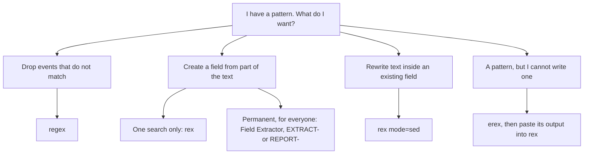

# Regular expressions for Splunk

Blueprint section 4.0 is 10 percent of the exam and the only section where regular expressions are unavoidable. The exam does not ask you to author a hard pattern under time pressure. It asks you to read a pattern that a machine generated, point at the named capture group, say which field it creates, and say which command or setting the pattern belongs in. `topics/04-field-extractions.md` owns the Field Extractor wizard and the commands as knowledge objects; this file owns the pattern language and the places it turns up.

## The flavour

The Knowledge Management Manual states it in one sentence: "Splunk regular expressions are PCRE (Perl Compatible Regular Expressions) and use the PCRE C library." Everything you know from Perl, Python's `re`, PHP, or regex101 in PCRE mode transfers, with two Splunk-specific habits layered on top: named capture groups are how fields get created, and the pattern is almost always written inside a quoted SPL string or a configuration file value, which changes how you escape things.

Splunk accepts **both** named capture group syntaxes. The same docs page shows `(?P<field_name>capture_pattern)` and `(?<field_name>capture_pattern)` as valid, and they are identical in effect: each creates a field named `field_name` holding the captured text. Hand-written documentation examples and `props.conf` stanzas use the short `(?<name>...)` form. Splunk's own generators emit the Python-style `(?P<name>...)` form: the documented `erex` example prints `(?i)^(?:[^\.]*\.){3}\d+\s+(?P<port>\w+\s+\d+)`, and the Field Extractor writes its expressions the same way. [verify]

Exam consequence: if one option shows `(?P<status>\d+)` and another shows `(?<status>\d+)`, neither is wrong on syntax grounds, so look at what else differs. An option with `(?'status'\d+)`, or with a group that has no name at all, is the one being tested.

## Compact syntax table

| Construct | Written | Meaning and the Splunk-specific note |
|---|---|---|
| Literal | `abc` | Matches the characters exactly. Case sensitive. |
| Any character | `.` | Any single character except a newline. This is why generated patterns keep adding `\n` to negated classes. |
| Character class | `[abc]`, `[a-z0-9_-]` | One character from the set. Inside a class, `.` `?` `+` `*` `(` `)` are literal; only `^` `]` `-` `\` need care. |
| Negated class | `[^&"\s]` | One character that is not in the set. The workhorse of a good Splunk extraction. |
| Word, non-word | `\w`, `\W` | Letter, number, or underscore. `\W` is its complement. |
| Digit, non-digit | `\d`, `\D` | `0-9` and its complement. |
| Whitespace | `\s`, `\S` | Space, tab, newline, and their complement. `\S+` is the correct way to say "one token". |
| Start, end | `^`, `$` | Start and end of the string being matched, which is `_raw` unless `field=` says otherwise. |
| Word boundary | `\b`, `\B` | Zero-width position between a word and a non-word character. `\bWC\b` does match inside `WC-SH-A02`, because a hyphen is a non-word character. |
| Zero or more | `*` | Greedy by default. |
| One or more | `+` | Greedy by default. |
| Zero or one | `?` | Marks the preceding token optional. |
| Exact count | `{3}`, `{1,3}`, `{2,}` | Repetition counts. `\d{1,3}` is the standard octet. |
| Lazy quantifier | `*?`, `+?`, `??`, `{n,m}?` | Stops at the first position that lets the rest of the pattern match. |
| Possessive quantifier | `*+`, `++`, `?+` | Greedy with no backtracking. Fails rather than giving characters back. Rare in Splunk, but PCRE supports it and it is a legitimate distractor. |
| Atomic group | `(?>...)` | Same no-backtracking idea applied to a group. |
| Alternation | `a\|b` | Either side. Lowest precedence in the language, so parenthesise it: `(?:GET\|POST)`. |
| Capture group | `(...)` | Numbered group. In `rex` a numbered group captures nothing usable, because `rex` creates fields only from names. |
| Non-capturing group | `(?:...)` | Groups for quantifying or alternation without creating a group. Generated Splunk regexes lean on it heavily. |
| Named capture group | `(?<name>...)` or `(?P<name>...)` | Creates the field. This is the only construct the exam truly requires you to recognise. |
| Lookahead | `(?=...)`, `(?!...)` | Zero-width assertion about what follows. `\d(?=\d{4})` matches a digit only if four digits follow it, which is how the account-masking sed example works. |
| Lookbehind | `(?<=...)`, `(?<!...)` | Zero-width assertion about what precedes. Must be fixed width in PCRE, so `(?<=\d{3})` is legal and `(?<=\d+)` is not. The documented `regex` example `(?<!\d)10\.\d{1,3}` uses a negative lookbehind to avoid matching `210.`. |
| Backreference | `\1`, `\2`, `\k<name>` | Refers to what an earlier group captured. In `rex mode=sed` replacements the same `\1` syntax names the group in the replacement text. |
| Inline flag | `(?i)`, `(?m)`, `(?s)` | Case-insensitive, multiline anchors, dot-matches-newline. `(?i)` at the front of the pattern is how you defeat case sensitivity. |
| Escape | `\.` `\?` `\/` `\|` `\(` `\[` `\$` `\^` `\+` `\*` `\\` | A backslash makes a metacharacter literal. |

## What the Field Extractor actually generates

The two generators in the product, the Field Extractor wizard and `erex`, build patterns the same way: anchor at the start of the event, walk forward through the sample text by counting delimiters, then capture. Neither understands what the log means.

The documentation's own `erex` example is the cleanest published specimen. Run against `sourcetype=secure` failed-login events with `examples="port 3351, port 3768"`, it produces:

```
(?i)^(?:[^\.]*\.){3}\d+\s+(?P<port>\w+\s+\d+)
```

Token by token against `Failed password for invalid user jabber from 118.142.68.222 port 3187 ssh2`:

| Token | What it does |
|---|---|
| `(?i)` | Turns off case sensitivity for the whole pattern. Generators add this because they cannot tell whether the sample's capitalisation is stable. |
| `^` | Anchors at the first character of `_raw`. |
| `(?:[^\.]*\.){3}` | Non-capturing group: any run of non-dot characters followed by a literal dot, three times. That consumes everything up to and including `118.142.68.` |
| `\d+` | The final octet, `222`. |
| `\s+` | The whitespace after the IP address. |
| `(?P<port>\w+\s+\d+)` | The capture. It matches `port 3187`, so the field value is the string `port 3187`, not `3187`. |

That last row matters. The generator captured the label because the examples included the label. Ask for `3351` and you get a pattern that captures digits; ask for `port 3351` and you get a field whose every value starts with the word `port`.

Now the Apache case. Given an `access_combined_wcookie` event whose request looks like `GET /product.screen?productId=WC-SH-A02&JSESSIONID=SD0SL6FF7ADFF4953 HTTP 1.1`, highlighting `SD0SL6FF7ADFF4953` in the Field Extractor and naming it `JSESSIONID` yields a pattern of this shape:

```
^(?:[^=\n]*=){2}(?P<JSESSIONID>\w+)
```

| Token | What it does |
|---|---|
| `^` | Start of `_raw`. The pattern is positional from character zero. |
| `(?:` ... `){2}` | Skip the same construct twice. |
| `[^=\n]*` | Any run of characters that are neither an equals sign nor a newline. The `\n` is leading context insurance: without it, `[^=]*` would happily run across line boundaries inside a multiline event. |
| `=` | A literal equals sign, consumed. Two iterations consume the `=` after `productId` and the `=` after `JSESSIONID`. |
| `(?P<JSESSIONID>\w+)` | Captures word characters until the first character that is not a letter, digit, or underscore, which is the space before `HTTP`. |

Splunk adds two things around your highlighted value. **Leading context** is the anchor plus a delimiter-counting skip, sometimes plus a literal string lifted straight out of the sample. **Trailing context** is a literal that tells the engine where to stop, added when the capture's own character class is not self-terminating; highlight a value followed by a quotation mark and you get a trailing `"` in the pattern.

Why this is more brittle than what you would write by hand:

- It is anchored. Any change earlier in the event, a different request method, an added header, a `-` where a user name used to be, shifts every count and the extraction silently returns nothing.
- It counts delimiters instead of naming the key. On a request with no `productId` parameter the second `=` is a different equals sign, and the field is filled with the wrong value. Wrong values are worse than missing values.
- It was inferred from one sample, or from the handful you added. Optional segments, empty values, and quoted values containing the delimiter stay invisible until the Validate step surfaces them.
- `\w+` was chosen because the sample value happened to contain only word characters. A session id containing a hyphen truncates at the hyphen with no error.

The hand-written equivalent, `JSESSIONID=(?<JSESSIONID>[^&"\s]+)`, is unanchored, keyed on the literal name, and explicit about its stop characters, so it survives reordering, added parameters, and a changed request line. The Field Extractor cannot infer any of that, which is why the Validate step and counterexamples exist, and why you read the generated regex before you save it.

## rex, the extracting command

```spl
rex [field=<field>] ( <regex-expression> [max_match=<int>] [offset_field=<string>] ) | (mode=sed <sed-expression>)
```

| Option | Default | Behaviour |
|---|---|---|
| `field` | `_raw` | The string the pattern is applied to. `^` and `$` then anchor to that field's value, not to the event. |
| `<regex-expression>` | required unless `mode=sed` | Quoted PCRE. Each named group creates a field. Unnamed groups create nothing. |
| `max_match` | `1` | Number of matches allowed per event. `0` means unlimited. Anything above 1 produces a multivalue field. |
| `offset_field` | none | Creates a field holding the zero-indexed start and end character positions of each match, rendered like `src_ip=71-83`. |
| `mode=sed` | none | Switches to substitution. Mutually exclusive with the extraction form. |

Sed mode takes two expression types. Substitution is `"s/<regex>/<replacement>/<flags>"`, where the flags are `g` for every occurrence and a bare integer for the Nth occurrence only, and `\1` and `\2` in the replacement refer to capture groups in the search half. Transliteration is `"y/<string1>/<string2>/"`, which maps characters positionally, first character of `string1` to first character of `string2`, with no regular expression involved at all. Keep the two strings the same length.

```spl
| rex field=AcctID mode=sed "s/\d(?=\d{4})/x/g"
| rex field=Code mode=sed "y/ABC/XYZ/"
```

The first masks every digit that has four digits after it, leaving the last four visible, using a lookahead so the trailing digits are not consumed. The second rewrites the letter grade in place. Neither creates a field and neither touches the index; both rewrite the value in the result set only.

## erex, the generator

```spl
erex [<field>] examples=<string> [counterexamples=<string>] [fromfield=<field>] [maxtrainers=<integer>]
```

`examples` is required and takes comma-separated sample values that must actually occur in the events piped in, or the command errors. `counterexamples` lists values that must not be extracted, and is how you stop it capturing the destination port as well as the source port. `fromfield` defaults to `_raw`. `maxtrainers` defaults to 100, valid range 1 to 1000.

The generated expression is not a result row. Splunk Web prints it in the job messages, reachable from the **Job** menu; in `search.log` you find it by searching for the phrase "Successfully learned regex". The documentation is explicit about what to do next: replace the `erex` command with `rex` plus the generated expression, which it calls more cost effective than leaving `erex` in place. `erex` persists nothing and appears nowhere in Settings. It is a drafting tool.

## regex versus rex

The most reliable distractor pair in the section: the names differ by one letter and the behaviours have nothing in common.

| | `rex` | `regex` |
|---|---|---|
| Purpose | Extracts fields, or rewrites a value in sed mode | Filters events |
| Syntax | `rex [field=<f>] "<pattern>"` | `regex (<field>=<pattern> \| <field>!=<pattern> \| <pattern>)` |
| Default target | `_raw` | `_raw` |
| Pattern anchoring | Unanchored unless you write `^` | Documented as "an unanchored Perl Compatible Regular Expression (PCRE library)" |
| Named groups | Required, they are the point | Pointless, nothing is captured |
| Row count | Unchanged, every input event is emitted | Reduced, non-matching events are dropped |
| New fields | One per named group | None, ever |
| Command type | Distributable streaming | Distributable streaming |

```spl
index=main sourcetype=secure | regex _raw="(?<!\d)10\.\d{1,3}\.\d{1,3}\.\d{1,3}(?!\d)"
index=main sourcetype=access_combined_wcookie | regex JSESSIONID!="^SD"
```

One documented subtlety that makes a good question: `regex <field>!=<pattern>` does not behave like `search <field>!=<value>`. The `regex` form includes events where the field is undefined or null, because those events also fail to match. The `search` form excludes them.



## Where regex turns up outside rex

| Place | Form | The detail worth knowing |
|---|---|---|
| Inline extraction | `props.conf`, `EXTRACT-<class> = <regex>` | The regex lives in `props.conf` itself. Optionally suffixed with `in <src_field>` to read a field other than `_raw`. This is what the Field Extractor regex method writes. |
| Transform extraction | `transforms.conf`, `REGEX = <regex>` plus `props.conf`, `REPORT-<class>` | `REGEX` defaults to an empty string and is required unless you are using `DELIMS`. `SOURCE_KEY` defaults to `_raw`. `MV_ADD` defaults to `false`, `CLEAN_KEYS` to `true`. |
| Transform field naming | `transforms.conf`, `FORMAT` | Not needed when the regex uses named capture groups. With unnamed groups you supply it, as in `REGEX = ([a-z]+)=([a-z]+)` with `FORMAT = $1::$2`, which names the field from group 1 and its value from group 2. |
| Eval function | `match(<str>,<regex>)` | Returns TRUE if the pattern matches anywhere in the string. Anchor with `^` and `$` for a whole-value match. It returns a Boolean, so under `eval` it must sit inside `if`, `case`, or `validate`; under `where` it stands alone. |
| Eval function | `replace(<str>,<regex>,<replacement>)` | PCRE, replaces every occurrence, `\1` and `\2` available in the replacement. The eval-side twin of `rex mode=sed`. |
| Eval function | `mvfilter(<predicate>)` | Filters a multivalue field, almost always with `match()` inside. The predicate may reference only one field. |
| Eval function | `mvfind(<mv>,<regex>)` | Returns the index of the first value in a multivalue field that matches. |
| Lookups | `transforms.conf`, `match_type = WILDCARD(<field>)` | Not regex. It is glob matching on `*` inside the lookup table values. `CIDR()` and the default `EXACT` are the other two match types. |
| Data models | Regular Expression field on any dataset | Extract From accepts any dataset field or `_raw`, and the expression must contain at least one named capture group. Sed mode and sed expressions are not supported here. |
| Search itself | `index=main uri_path=*cart*` | Also not regex. The asterisk in the `search` command is a glob over terms, and `like()` under `where` uses `%` and `_`. Neither accepts PCRE. |

## Worked examples against the guide's lab data

Splunk tutorial data in `index=main`, source types `access_combined_wcookie`, `secure`, and `vendor_sales`.

**1. JSESSIONID from an Apache access log.**

```spl
index=main sourcetype=access_combined_wcookie
| rex "JSESSIONID=(?<JSESSIONID>[^&\"\s]+)"
| stats dc(uri_path) AS pages_visited BY JSESSIONID
| sort - pages_visited
```

The pattern is unanchored and keyed on the literal string `JSESSIONID=`, so the position of the parameter in the query string does not matter. The capture is a negated class rather than `\w+`, so it stops at an ampersand, a quotation mark, or whitespace, whichever comes first, and it survives a session id containing a hyphen. Note the `\"` inside the class: the whole pattern is a double-quoted SPL string, so an inner double quote has to be escaped. Automatic key-value extraction has already produced `JSESSIONID` in this data, so the `rex` overwrites it, which is a cheap way to prove that a same-named capture group wins over what came before it in the pipeline.

**2. User and source IP from an sshd failure.**

```spl
index=main sourcetype=secure "Failed password"
| rex "for (?:invalid user )?(?<user>\S+) from (?<src_ip>\d{1,3}(?:\.\d{1,3}){3}) port (?<src_port>\d+)"
| stats count BY user, src_ip
| sort - count
```

Against `Failed password for invalid user jabber from 118.142.68.222 port 3187 ssh2` this returns `user=jabber`, `src_ip=118.142.68.222`, `src_port=3187`. Three constructs are doing real work. `(?:invalid user )?` is a non-capturing group made optional by `?`, so the same pattern also matches `Failed password for root from ...`, which a Field Extractor pattern built from one sample would not. `\S+` is the correct way to grab one whitespace-delimited token; `.*` would swallow the rest of the line and hand `user` the value `jabber from 118.142.68.222 port 3187 ssh2`. `(?:\.\d{1,3}){3}` repeats the dot-octet pair three times inside a non-capturing group, so no stray numbered group is created and the whole address lands in one field.

**3. Three fields from the vendor_sales format.**

```spl
index=main sourcetype=vendor_sales
| rex "VendorID=(?<VendorID>\d+)\s+Code=(?<Code>\w+)\s+AcctID=(?<AcctID>\d+)"
| stats count BY Code
```

Against `[01/Sep/2022:18:23:07] VendorID=5037 Code=C AcctID=5317605039838520` this fills all three fields in one pass, which is what the Field Extractor produces when you highlight three values in one sample event. `\s+` between the segments stays deliberately vague about how much whitespace separates them. To list the keys without knowing their names, use the multivalue form:

```spl
index=main sourcetype=vendor_sales
| rex max_match=0 "(?<kv_key>\w+)="
| stats count BY kv_key
```

`max_match=0` lifts the one-match-per-event limit, `kv_key` becomes multivalue, and `stats count BY` counts each value separately, so you get one row per distinct key name in the source.

## Traps

**T-RX-01** Greedy quantifiers on a line with repeated delimiters. Wrong belief: `"\[(?<ts>.*)\]"` extracts the timestamp from `[01/Sep/2022:18:23:07] VendorID=5037`. Correct fact: `.*` is greedy and runs to the end of the line before backtracking to the **last** `]`, so on any event containing a second closing bracket the field swallows everything in between. Use the lazy form `.*?` or, better, a negated class `[^\]]*` which cannot cross the delimiter at all.

**T-RX-02** An unescaped dot or question mark. Wrong belief: `"host=(?<h>www1.example.com)"` and `"screen?productId=(?<p>\w+)"` say what they look like they say. Correct fact: an unescaped `.` matches any character, so `www1.example.com` also matches `www1xexample!com`, and an unescaped `?` makes the preceding character optional, so `screen?` matches `scree` followed by an optional `n`. Write `www1\.example\.com` and `screen\?`.

**T-RX-03** Reaching for `.*` where a negated class is correct. Wrong belief: `"user (?<user>.*) from"` is fine because the pattern ends at ` from`. Correct fact: on a line containing a second occurrence of ` from` the greedy `.*` matches through the first one. `[^ ]*` or `\S+` is the correct token grab, cannot cross the space, and needs no backtracking. Prefer a negated class to a dot-star in every Splunk extraction.

**T-RX-04** A capture group name that is not a valid field name. Wrong belief: any name works because it is just a label. Correct fact: two rule sets apply. The Field Extractor states that "Field names must start with a letter and contain only letters, numbers, and underscores." At the configuration-file level, "Valid characters for field names are a-z, A-Z, 0-9, . , :, and _" and "Field names cannot begin with 0-9 or _", because leading underscores are reserved for Splunk internal variables. So `(?<src-ip>...)`, `(?<2nd_ip>...)` and `(?<_ip>...)` are all wrong, and the leading underscore is the one the exam likes.

**T-RX-05** Anchoring to `_raw` when the pattern runs against a named field. Wrong belief: `^` and `$` always mean the start and end of the event. Correct fact: they mean the start and end of whatever `rex` is reading. `| rex field=uri_query "^(?<first_param>[^&]+)"` anchors at the first character of `uri_query`; drop the `field=` and the same pattern anchors on `_raw` and matches something entirely different. Generated patterns carry a `^`, so moving one from an FX extraction into `| rex field=something` breaks it.

**T-RX-06** Regular expressions in Splunk are case insensitive because field values are. Wrong belief: since `status=Failed` matches `failed` in the search bar, `rex "Failed password"` matches `failed password`. Correct fact: search-term matching on field values is case insensitive, and regular expression matching is case sensitive. `| rex "(?<u>invalid user \S+)"` will not fire on `Invalid user`. Prefix the pattern with `(?i)` to make it case insensitive, which is exactly why Splunk's own generators put `(?i)` at the front of what they produce.

**T-RX-07** `rex` and `regex` are the same command. Wrong belief: both take a PCRE, so both do the same job. Correct fact: `rex` extracts and never changes the row count; `regex` filters and never creates a field. A question that says "500 events in, 120 match" is testing this: `rex` emits 500, `regex` emits 120.

**T-RX-08** An unnamed capture group creates a field. Wrong belief: `| rex "port (\d+)"` creates a field, perhaps called `1`. Correct fact: `rex` creates fields from named groups only, so that command runs, matches, and produces nothing. In a `transforms.conf` transform an unnamed group is usable, but only because `FORMAT = $1::$2` supplies the naming that the regex left out.

**T-RX-09** `(?P<name>...)` is a different or a broken construct. Wrong belief: the `P` is a typo, or Python syntax that Splunk rejects. Correct fact: the docs list `(?P<field_name>...)` and `(?<field_name>...)` side by side as valid. Both create the same field. The generated expressions you will be shown on the exam are likelier to carry the `P`.

**T-RX-10** Quoting inside the pattern is free. Wrong belief: `| rex "\"(?<method>\w+) "` and `| rex "(?<agent>Mozilla/5.0 (Windows...))"` are fine. Correct fact: the pattern is a double-quoted SPL string, so an inner double quote must be written `\"`, and a literal parenthesis in the data must be escaped as `\(` or it opens a group. Both mistakes produce a search that either errors or silently matches nothing.

**T-RX-11** `erex` examples should include the label. Wrong belief: `examples="port 3351"` is a friendly way to say "the port number". Correct fact: `erex` captures whatever you show it. The documented output for that example is `(?P<port>\w+\s+\d+)`, whose values are the string `port 3351`, label included. Give it `3351` if you want digits, and add `counterexamples=` to steer it off the values it should leave alone.

**T-RX-12** Wildcards in searches and lookups are regular expressions. Wrong belief: `uri_path=*cart*`, `like(user,"admin%")` and `match_type = WILDCARD(host)` are PCRE under the hood. Correct fact: the `search` asterisk is a glob over terms, `like()` uses `%` and `_` from SQL, and lookup `WILDCARD()` is glob matching on `*` inside the lookup table values. Only `rex`, `regex`, `erex`, `match()`, `replace()`, `mvfilter()` with `match()`, `mvfind()`, and the extraction settings in `props.conf` and `transforms.conf` take PCRE.

## Docs

1. [About Splunk regular expressions](https://help.splunk.com/en/splunk-enterprise/manage-knowledge-objects/knowledge-management-manual/10.4/get-started-with-knowledge-objects/about-splunk-regular-expressions) - the PCRE statement, the symbol tables, both named capture group forms. 10 minutes.
2. [About regular expressions with field extractions](https://help.splunk.com/en/splunk-enterprise/manage-knowledge-objects/knowledge-management-manual/10.4/fields-and-field-extractions/about-regular-expressions-with-field-extractions) - inline versus transform storage, field name character rules, key cleaning. 8 minutes.
3. [regex](https://help.splunk.com/en/splunk-enterprise/search/spl-search-reference/10.4/search-commands/regex) - the unanchored PCRE statement and the null-field behaviour of `!=`. 5 minutes.
4. [rex](https://help.splunk.com/en/splunk-enterprise/search/spl-search-reference/10.4/search-commands/rex) - `field` default `_raw`, `max_match` default 1, `offset_field`, both sed forms. 10 minutes.
5. [erex](https://help.splunk.com/en/splunk-enterprise/search/spl-search-reference/10.4/search-commands/erex) - example 3 for the generated expression, the "Successfully learned regex" wording, and the advice to swap `erex` for `rex`. 6 minutes.
6. [Field Extractor: Select Fields step](https://help.splunk.com/en/splunk-enterprise/manage-knowledge-objects/knowledge-management-manual/10.4/use-the-field-extractor-in-splunk-web/field-extractor-select-fields-step) - field naming rules, required text, the point of no return on manual regex editing. 8 minutes.
7. [Configure advanced extractions with field transforms](https://help.splunk.com/en/splunk-enterprise/manage-knowledge-objects/knowledge-management-manual/10.4/use-the-configuration-files-to-configure-field-extractions/configure-advanced-extractions-with-field-transforms) - `REGEX`, `FORMAT`, `SOURCE_KEY`, `MV_ADD`, `CLEAN_KEYS` defaults. Reference only. 8 minutes.
