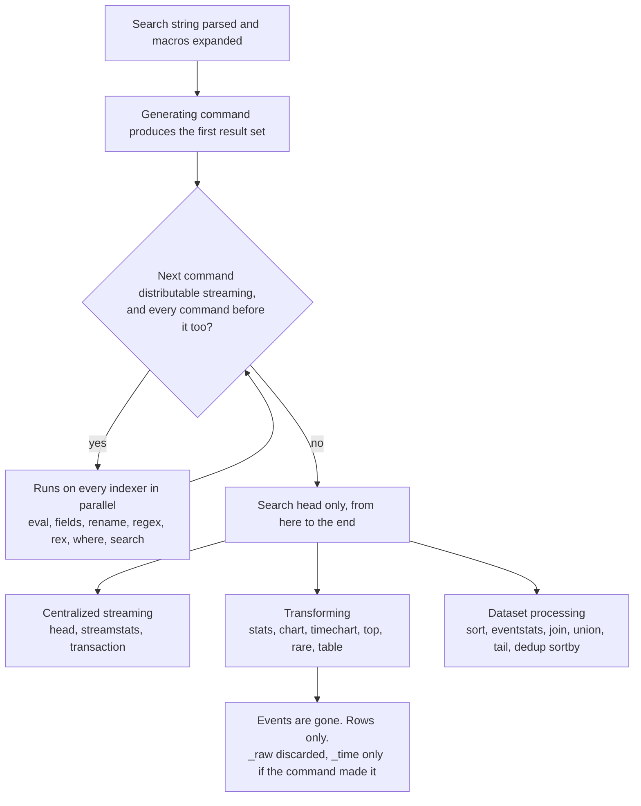
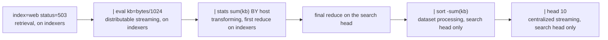

# SPL command reference, scoped to SPLK-1002

Every command the exam can put in front of you, organised by command type, because the type is itself examinable. Commands with their own topic file get a two-line entry and a link; everything else gets syntax, the options that matter with their defaults, one example and one gotcha. Defaults are the 10.4 documented values.

## 1. Command types

The 10.4 quick reference names five types: streaming (split into distributable and centralized), generating, orchestrating, transforming, and dataset processing. The types are not mutually exclusive. `append` is both transforming and dataset processing, `history` is both transforming and generating, `datamodel` and `from` are both generating and dataset processing, and `dedup` changes class depending on its arguments.

| Type | Definition | Where it runs | Pipeline position |
| --- | --- | --- | --- |
| Distributable streaming | One event in, one or zero events out, order irrelevant | Indexers, but only while every preceding command is also distributable streaming; otherwise the search head | Anywhere after retrieval |
| Centralized streaming | One event at a time, but the order of events changes the answer | Search head only | Anywhere after retrieval, forces everything after it onto the search head |
| Transforming | Orders results into a data table, turning event values into the numbers a visualization needs | Search head, though `stats`, `chart` and `timechart` push a first reduce step to the indexers | Ends the event stream |
| Generating | Produces results instead of consuming them | Depends on the command; `search` and `tstats` retrieve from indexers, `makeresults` and `inputlookup` do not | First in the pipeline |
| Orchestrating | Controls how the search is processed without directly changing the final result set | Varies | Anywhere |
| Dataset processing | Needs the entire dataset in hand before it can emit a first result | Search head | Anywhere, but it is a hard barrier |

Verbatim membership lists from the 10.4 command types quick reference, which is what a question is likely to be built from:

- **Transforming**: `addtotals`, `anomalydetection`, `append`, `associate`, `chart`, `cofilter`, `contingency`, `history`, `makecontinuous`, `mvcombine`, `rare`, `stats`, `table`, `timechart`, `top`, `xyseries`
- **Generating**: `datamodel`, `dbinspect`, `eventcount`, `from`, `gentimes`, `history`, `inputcsv`, `inputlookup`, `loadjob`, `makeresults`, `metadata`, `metasearch`, `mstats`, `multisearch`, `pivot`, `rest`, `search`, `searchtxn`, `set`, `tstats`, `typeahead`, `walklex`
- **Orchestrating**: `localop`, `lookup`, `noop`, `redistribute`, `require`
- **Dataset processing**: `anomalousvalue`, `anomalydetection`, `append`, `appendcols`, `appendpipe`, `bin`, `cluster`, `concurrency`, `datamodel`, `dedup`, `eventstats`, `fieldsummary`, `fillnull`, `from`, `join`, `map`, `outlier`, `reverse`, `sort`, `tail`, `transaction`, `union`

Streaming is not given as a list; each command page states its own class. Distributable streaming examples named in the search manual are `eval`, `fields`, `makemv`, `rename`, `regex`, `replace`, `strcat`, `typer` and `where`. Centralized streaming examples are `head`, `streamstats`, and certain modes of `dedup` and `cluster`.

There is no **orphan** command type. The word appears in two other places and both are testable: `transaction keeporphans=true` emits events that joined no transaction, flagged `_txn_orphan=1`, and an orphaned knowledge object is one whose owning account no longer exists, fixed from Settings with Reassign Knowledge Objects except when the object is both orphaned and privately shared. If an answer choice offers "orphan" as a command type, it is a distractor.



## 2. Master table

Type abbreviations: DS is distributable streaming, CS is centralized streaming, T is transforming, G is generating, DP is dataset processing, O is orchestrating. "Unlisted" means the command appears in none of the four verbatim lists above and its page states no class.

| Command | Type | Section | Purpose | Topic file |
| --- | --- | --- | --- | --- |
| `search` | G first, DS after a pipe | 2.0 | Retrieve events, or filter rows already in the pipeline | [02](../topics/02-filtering-and-formatting.md) |
| `where` | DS | 2.0 | Filter using an eval expression, so field against field | [02](../topics/02-filtering-and-formatting.md) |
| `eval` | DS | 2.0 | Calculate a new field or overwrite an existing one | [02](../topics/02-filtering-and-formatting.md) |
| `fields` | DS | 2.0 | Keep or drop fields, without changing column order | - |
| `rename` | DS | 2.0 | Change a field's name, replacing the old one | - |
| `sort` | DP | 2.0 | Order results by one or more fields | - |
| `dedup` | CS, DP with `sortby` | 2.0 | Keep the first N events per combination of field values | - |
| `head` | CS | 2.0 | Keep the first N results, or results until an expression is false | - |
| `tail` | DP | 2.0 | Keep the last N results, returned in reverse order | - |
| `table` | T | 1.0, 2.0 | Keep named fields in the given column order as a table | [01](../topics/01-transforming-commands.md) |
| `fillnull` | DS with a field list, DP without | 2.0 | Replace null values with a constant | [02](../topics/02-filtering-and-formatting.md) |
| `filldown` | Unlisted | 2.0 | Replace null values with the last non-null value above | [02](../topics/02-filtering-and-formatting.md) |
| `fieldformat` | DS | 2.0 | Change how a field displays without changing its value | [02](../topics/02-filtering-and-formatting.md) |
| `stats` | T | 1.0, 3.0 | Aggregate into a results table, one row per BY combination | [01](../topics/01-transforming-commands.md) |
| `eventstats` | DP | 1.0 | Compute the same aggregates and write them onto every event | - |
| `streamstats` | CS | 1.0 | Compute a running aggregate over events seen so far | - |
| `chart` | T | 1.0 | Two-dimensional table, row-split by column-split | [01](../topics/01-transforming-commands.md) |
| `timechart` | T | 1.0 | Aggregate over time bins, `_time` always the first column | [01](../topics/01-transforming-commands.md) |
| `top` | T | 1.0 | Most common values with `count` and `percent` | [01](../topics/01-transforming-commands.md) |
| `rare` | T | 1.0 | Least common values with `count` and `percent` | [01](../topics/01-transforming-commands.md) |
| `bin` (alias `bucket`) | DP, streaming with `span` | 1.0 | Put a numeric or time field into buckets | - |
| `addtotals` | DS, T when `col=true` | 1.0 | Sum numeric fields across a row, or down a column | - |
| `untable` | DS | 1.0 | Turn a chart-shaped table into stats-shaped long rows | [01](../topics/01-transforming-commands.md) |
| `xyseries` | DS, T when `grouped=true` | 1.0 | Turn stats-shaped rows into a chart-shaped table | [01](../topics/01-transforming-commands.md) |
| `transaction` | CS, also DP | 3.0 | Group related events into one result with `duration` | [03](../topics/03-correlating-events.md) |
| `append` | T and DP | 3.0 | Add subsearch results as extra rows at the end | [03](../topics/03-correlating-events.md) |
| `appendcols` | DP | 3.0 | Merge the Nth subsearch row into the Nth main row | [03](../topics/03-correlating-events.md) |
| `appendpipe` | DP | 3.0 | Append the output of a subpipeline run on the current results | - |
| `join` | CS with a field list, DP without | 3.0 | SQL-style join to a subsearch on shared fields | [03](../topics/03-correlating-events.md) |
| `union` | DP | 3.0 | Merge two or more datasets into one result set | [03](../topics/03-correlating-events.md) |
| `selfjoin` | Unlisted | 3.0 | Join result rows to other rows in the same result set | [03](../topics/03-correlating-events.md) |
| `lookup` | O | Off blueprint | Enrich rows from a lookup table at search time | [00](../topics/00-foundations-refresher.md) |
| `inputlookup` | G | Off blueprint | Read a lookup table as the search's input | [00](../topics/00-foundations-refresher.md) |
| `outputlookup` | Unlisted | Off blueprint | Write the current results into a lookup table | [00](../topics/00-foundations-refresher.md) |
| `rex` | DS | 4.0 | Extract fields with named capture groups, or edit with sed | [04](../topics/04-field-extractions.md) |
| `erex` | Not stated on the page | 4.0 | Generate a regex from example values | [04](../topics/04-field-extractions.md) |
| `regex` | DS | 4.0 | Filter events by a regular expression, extracting nothing | - |
| `extract` (alias `kv`) | DS | 4.0 | Run key-value extraction on `_raw` at search time | [04](../topics/04-field-extractions.md) |
| `spath` | DS | 4.0 | Extract fields from JSON or XML by path | - |
| `makemv` | DS | 4.0 | Split one field's value into a multivalue field | - |
| `mvexpand` | DS | 4.0 | Turn each value of a multivalue field into its own result | - |
| `nomv` | Unlisted | 4.0 | Collapse a multivalue field back to a single value | - |
| `datamodel` | G and DP | 9.0, 10.0 | Inspect a model, or run a dataset's search | [09](../topics/09-data-models-and-pivot.md) |
| `tstats` | G | 9.0, 10.0 | Aggregate over indexed fields or an accelerated model | [09](../topics/09-data-models-and-pivot.md) |
| `from` | G and DP | 9.0, 10.0 | Read a dataset: data model, lookup or saved search | [09](../topics/09-data-models-and-pivot.md) |
| `pivot` | G | 9.0 | Run a Pivot report against a data model dataset in SPL | [09](../topics/09-data-models-and-pivot.md) |
| `makeresults` | G | Support | Create N empty results with `_time` for testing | - |
| `format` | Unlisted | 3.0 | Turn subsearch rows into one search-string field | [00](../topics/00-foundations-refresher.md) |
| `foreach` | Unlisted | Support | Run a template subpipeline once per matching field | - |
| `map` | DP | Support | Run a search once per input result, with token substitution | - |
| `multisearch` | G | Support | Run two or more generating subsearches concurrently | - |
| `loadjob` | G | Support | Load the results of a completed search job | - |
| `savedsearch` | G in practice, absent from the list | 6.0, 7.0 | Run a saved search's SPL inline | - |
| `collect` | Unlisted | Off blueprint | Write results into a summary index | - |
| `history` | T and G | Support | Return your own search history | - |

## 3. Command entries

### Already covered in depth

`search`, `where`, `eval`, `fillnull`, `filldown` and `fieldformat` are section 2.0 and are documented option by option in [02-filtering-and-formatting.md](../topics/02-filtering-and-formatting.md). The two facts that get tested most: `fillnull` defaults to `value=0` and fills every field when given no field list, and `fieldformat` accepts exactly one expression and changes display only.

`chart`, `timechart`, `top`, `rare`, `untable` and `xyseries` are section 1.0 and are in [01-transforming-commands.md](../topics/01-transforming-commands.md). Carry these: `chart` defaults to `limit=top 10` and `bins=300`, `timechart` to `limit=top10` and `bins=100`, `top` and `rare` to `limit=10`, and `span` beats `bins` when both are given.

`stats` is covered across [01](../topics/01-transforming-commands.md) and [03](../topics/03-correlating-events.md). Syntax is `stats [partitions=<num>] [allnum=<bool>] [delim=<string>] <stats-agg-term>... [BY <field-list>]`, `allnum` defaults to `false`, `delim` to a single space. With no BY clause it returns exactly one row. `values(x)` returns distinct values in lexicographical order; `list(x)` returns every value in event order, capped at the first 100.

`transaction` is section 3.0 and is in [03-correlating-events.md](../topics/03-correlating-events.md). `maxspan=-1`, `maxpause=-1`, `maxevents=1000`, and it creates `duration`, `eventcount` and `closed_txn`.

`append`, `appendcols`, `join`, `union` and `selfjoin` are compared in [03-correlating-events.md](../topics/03-correlating-events.md). `join` is `type=inner`, `max=1`, right side capped at 50,000 rows over 60 seconds. `append`, `appendcols` and `union` all use `maxout=50000` and `maxtime=60`.

`rex`, `erex` and `extract` are section 4.0 and are in [04-field-extractions.md](../topics/04-field-extractions.md). `rex field=_raw max_match=1`, `erex fromfield=_raw maxtrainers=100`, `extract limit=50 maxchars=10240` and `_raw` only.

`datamodel`, `tstats`, `from` and `pivot` are sections 9.0 and 10.0 and are in [09-data-models-and-pivot.md](../topics/09-data-models-and-pivot.md) and [10-cim.md](../topics/10-cim.md). `datamodel strict_fields=true`, `tstats summariesonly=false`, `tstats` writes `FROM datamodel=<model>.<root>` with an equals sign while `from` writes `datamodel:<model>.<dataset>` with a colon.

`lookup`, `inputlookup`, `outputlookup` and `format` are summarised in [00-foundations-refresher.md](../topics/00-foundations-refresher.md). Lookups are off blueprint except for where they sit in the search-time sequence, which is step 7, after calculated fields and before event types.

### fields

```spl
fields [+|-] <wc-field-list>
```

The sign defaults to `+`, meaning keep only the listed fields. Wildcards are supported. Internal fields such as `_raw` and `_time` are not removed by `+` unless you name them, so `| fields - _*` is the only way to clear them all. The docs warn against removing `_time`, since `chart` and `timechart` cannot display date or time information without it.

```spl
index=web sourcetype=access_combined | fields clientip status bytes | stats sum(bytes) BY status
```

Gotcha: `fields` does not reorder columns and does not turn the Events tab into a Statistics tab, because it is distributable streaming, not transforming. Placing `| fields` early is a genuine performance win because it reduces what gets moved from the indexers.

### rename

```spl
rename <wc-field> AS <wc-field>
```

Wildcards must appear on both sides and must correspond. Field names containing spaces must be quoted. The old name disappears, which is the whole difference from a field alias.

```spl
index=web sourcetype=access_combined action=purchase | rename productId AS "Product ID" | table "Product ID" bytes
```

Gotcha: renaming a field onto a name that already exists overwrites it, and renaming several fields onto one name loses data. A rename lives for one search only; the persistent equivalent is a field alias, which keeps both names alive.

### sort

```spl
sort [<count>] <sort-by-clause>... [desc]
```

With no count, the limit is 10,000 results. Prefix a field with `-` for descending or `+` for ascending; ascending is the default. The ordering functions are `num()`, `str()`, `ip()` and `auto()`, and `auto()` is what runs when you name a bare field.

```spl
index=web sourcetype=access_combined action=purchase | stats sum(bytes) AS total_bytes BY categoryId | sort 5 -revenue
```

Gotcha: `sort` is a dataset processing command, so it emits nothing until it has the whole set, and it silently truncates at 10,000 unless you pass a count. A field that was formatted with `eval` rather than `fieldformat` sorts lexicographically, which is why `$1,204.50` lands before `$9.99`.

### dedup

```spl
dedup [<int>] <field-list> [keepevents=<bool>] [keepempty=<bool>] [consecutive=<bool>] [sortby <sort-by-clause>]
```

The leading integer is how many events to keep per combination of values and defaults to 1. `consecutive=false`, `keepempty=false` and `keepevents=false` are the defaults. Events missing any listed field are dropped unless `keepempty=true`. With `sortby`, `dedup` becomes a dataset processing command instead of a streaming one.

```spl
index=web sourcetype=access_combined | dedup 2 clientip sortby -bytes
```

Gotcha: "first" means first in the order the events arrive, which by default is most recent first. Change the sort and you change which event survives. `consecutive=true` only removes duplicates that are adjacent, which is a different answer entirely.

### head and tail

```spl
head [<N> | (<eval-expression>)] [limit=<int>] [null=<bool>] [keeplast=<bool>]
tail [<N>]
```

Both default to 10 results. `head` stops at the first result for which the eval expression is false; `null=false` and `keeplast=false` are the defaults, and `keeplast=true` keeps the result that ended the run. If both a count and an expression are given, the more restrictive wins. `tail` returns the last N results in reverse order.

```spl
index=web sourcetype=access_combined | sort -_time | head (bytes > 1000) keeplast=true
```

Gotcha: `head` is centralized streaming and `tail` is dataset processing, so `tail` is the more expensive of the pair. `| head 5` after a transforming command takes the first five rows of the table, not the first five events.

### eventstats and streamstats

```spl
eventstats [allnum=<bool>] <stats-agg-term>... [BY <field-list>]
streamstats [reset_on_change=<bool>] [reset_before=(<eval>)] [reset_after=(<eval>)] [current=<bool>] [window=<int>] [time_window=<span>] [global=<bool>] [allnum=<bool>] <stats-agg-term>... [BY <field-list>]
```

Both keep every input row and add columns rather than replacing the result set. `allnum=false` on both. `streamstats` defaults are `window=0` (no window, so all events so far), `current=true` (include the current event), `global=true` (one window shared across BY groups), and the three reset options all `false`. With `window=0` the `max_stream_window` limit of 10,000 events still applies.

```spl
index=web sourcetype=access_combined action=purchase | eventstats avg(bytes) AS avg_bytes | where bytes > avg_bytes
index=web sourcetype=access_combined action=purchase | sort _time | streamstats sum(bytes) AS running_total
```

Gotcha: `eventstats` is dataset processing and `streamstats` is centralized streaming, and neither is transforming, so neither one on its own populates the Statistics tab from an event search. `streamstats current=false` gives you the previous row's value, which is the standard way to compute a delta.

### bin (alias bucket)

```spl
bin [<bin-options>...] <field> [AS <newfield>]
```

`bins` defaults to 100 and is a maximum, not a target. `span`, `minspan`, `start`, `end` and `aligntime` are unset by default; `aligntime` aligns to the UTC epoch when not given. Specifying `span` makes `bin` a streaming command instead of a dataset processing one.

```spl
index=web sourcetype=access_combined | bin span=1h _time | stats count BY _time, status
```

Gotcha: that example is what `timechart` does for you. `bin` is the answer when you need time buckets and more than one BY field, since `timechart` allows exactly one split-by field.

### addtotals

```spl
addtotals [row=<bool>] [col=<bool>] [labelfield=<field>] [label=<string>] [fieldname=<field>] [<field-list>]
```

`row=true` and `col=false` are the defaults, so bare `addtotals` adds a per-row sum in a new field named by `fieldname`, default `Total`. `col=true` appends a summary row whose label is `label`, default `Total`, written into `labelfield`. Only numeric fields are summed.

```spl
index=web sourcetype=access_combined action=purchase | chart sum(bytes) OVER categoryId BY categoryId | addtotals col=true labelfield=categoryId
```

Gotcha: the type changes with the arguments. `addtotals` is distributable streaming for row totals and transforming for column totals. Without `labelfield` the summary row appears with no label, which reads like a bug.

### appendpipe

```spl
appendpipe [run_in_preview=<bool>] [<subpipeline>]
```

Runs the subpipeline against the results already in the pipeline and appends its output as extra rows. Unlike `append`, there is no subsearch and no second data retrieval, so the subsearch limits do not apply. `run_in_preview` defaults to `true` [verify].

```spl
index=web sourcetype=access_combined action=purchase | stats sum(bytes) AS total_bytes BY categoryId | appendpipe [stats sum(revenue) AS revenue | eval categoryId="TOTAL"]
```

Gotcha: it is the cheap way to add a totals row, and it is a dataset processing command, so it sits with `sort` and `eventstats` as a barrier in the pipeline.

### regex

```spl
regex (<field>=<regex> | <field>!=<regex> | <regex>)
```

Defaults to matching against `_raw`. It filters and nothing else: no field is created, no value is changed. `!=` keeps the events that do not match.

```spl
index=security sourcetype=linux_secure | regex _raw="(?i)failed password for (invalid user )?\w+"
```

Gotcha: this is the one that pairs with `rex` in a two-answer question. `rex` extracts and returns every input event whether it matched or not; `regex` extracts nothing and returns only matching events.

### spath

```spl
spath [input=<field>] [output=<field>] [path=<datapath> | <datapath>]
```

`input` defaults to `_raw`. With no `path`, `spath` extracts every field it can find in the structured data. Paths use dot notation for objects and `{}` for arrays, so `objects{}.name` reaches into an array of objects, and `{n}` selects one element.

```spl
index=cisco sourcetype=cisco:wsa:squid | spath input=_raw output=user_role path=user.role
```

Gotcha: `spath` reads JSON and XML only. For a flat `key=value` line the command is `extract`, and for arbitrary text it is `rex`. Automatic key-value extraction already handles well-formed JSON in many cases, so `spath` is most useful when the JSON is nested inside a field rather than in `_raw`.

### makemv, mvexpand and nomv

```spl
makemv [delim=<string> | tokenizer=<string>] [allowempty=<bool>] [setsv=<bool>] <field>
mvexpand <field> [limit=<int>]
nomv <field>
```

`makemv` splits one field's value into several. `delim` defaults to a single space, `tokenizer` is unset, `allowempty=false` and `setsv=false`. `mvexpand` turns each value of one multivalue field into its own result, duplicating the other fields; `limit` defaults to 0, meaning no cap. `nomv` reverses the process and returns a single value.

```spl
index=web sourcetype=access_combined action=purchase | eval tags="a,b,c" | makemv delim="," tags | mvexpand tags
```

Gotcha: `mvexpand` accepts exactly one field per command and multiplies your row count, which is how a search that ran fine yesterday hits `max_mem_usage_mb` today. `makemv` uses `delim` or `tokenizer`, never both.

### makeresults

```spl
| makeresults [count=<num>] [annotate=<bool>] [splunk_server=<wc-string>] [splunk_server_group=<wc-string>]
```

`count` defaults to 1 and `annotate` to `false`. With `annotate=false` the result carries a single field, `_time`, set to the time the search ran. `annotate=true` adds `_raw`, `host`, `source`, `sourcetype` and `splunk_server`.

```spl
| makeresults count=10 | streamstats count | eval _time=now()+10*count, user="nobody" | sort -_time | transaction user maxspan=11s
```

Gotcha: it is a generating command, so it must be first and needs a leading pipe. That example is the documented way to build a transaction test set without touching an index, and it is the search behind the `closed_txn=0` result in the correlating events topic.

### foreach

```spl
foreach <wc-field>... [fieldstr=<string>] [matchstr=<string>] [matchseg1=<string>] [mode=<multifield|multivalue|multikv|json_array>] <subsearch>
```

Runs a template subpipeline once per field matched by the wildcard, substituting the field name for the `<<FIELD>>` token. `<<MATCHSTR>>` gives the part of the name that matched the wildcard. `mode` defaults to `multifield`.

```spl
index=web | timechart sum(bytes) BY host | foreach * [eval <<FIELD>>=round('<<FIELD>>'/1024, 2)]
```

Gotcha: `foreach` is the documented exception to the rule that a subsearch must start with a generating command, because its bracketed argument is a template pipeline rather than a subsearch.

### map, multisearch, loadjob and savedsearch

```spl
| map (<search> | <savedsearch>) [maxsearches=<int>]
| multisearch [<subsearch1>] [<subsearch2>] ...
| loadjob (<sid> | <savedsearch-identifier>) [events=<bool>]
| savedsearch <savedsearch-name>
```

`map` runs a search once per input result with `$field$` token substitution and defaults to `maxsearches=10`, silently dropping the rest. `multisearch` needs at least two subsearches, each starting with a generating command, and permits only streaming commands inside them. `loadjob` reads the artifacts of a job that already finished rather than rerunning it, and `events` defaults to `false`, meaning results rather than events. `savedsearch` runs the saved search's SPL inline.

```spl
| multisearch [search index=web sourcetype=access_combined | eval src="web"] [search index=web sourcetype=access_combined action=purchase | eval src="sales"]
```

Gotcha: `savedsearch` is the thing an event type definition may not contain, along with a pipe and a subsearch. Do not confuse the `savedsearch` command with the `savedsearch=` search modifier, which is a filter term inside `search`.

### collect and history

```spl
| ... | collect index=<string> [addtime=<bool>] [marker=<string>] [testmode=<bool>]
| history [events=<bool>]
```

`collect` writes the current results into a summary index you name; `index` is required, and `testmode` defaults to `false`, so it writes for real. `addtime` defaults to `true` [verify]. `history` returns your own search history and `events` defaults to `false`, giving a table rather than events.

```spl
index=web sourcetype=access_combined action=purchase | stats sum(bytes) AS total_bytes BY categoryId | collect index=summary marker="report=daily_revenue"
```

Gotcha: summary indexing is one of three distinct acceleration mechanisms and is not report acceleration or data model acceleration. `history` is on both the transforming and the generating lists, which makes it a clean example of the types not being mutually exclusive.

## 4. Commands that look alike

**`search` versus `where`.** `search` compares a field to a literal and reads an unquoted right-hand word as a string, so it can never compare two fields. `where` evaluates an eval expression, so it can compare fields, do arithmetic, and call functions. `search` evaluates OR before AND and has no XOR; `where` and `eval` evaluate AND before OR and do have XOR. Wildcards work in `search` and only through `like()` or `LIKE` in `where`.

```spl
index=web clientip=192.168.1.1 status=200
index=web | where bytes > avg_bytes AND like(uri_path, "/product%")
```

**`rex` versus `regex` versus `extract`.** `rex` extracts named capture groups into fields and passes every input event through, matched or not. `regex` extracts nothing and passes through only the events that match. `extract` runs key-value extraction on `_raw` with delimiters rather than a pattern, and has no `field=` argument at all.

```spl
... | rex field=_raw "port (?<src_port>\d+)"
... | regex _raw="port \d+"
... | extract pairdelim="," kvdelim="="
```

**`stats` versus `eventstats` versus `streamstats`.** `stats` replaces the events with a results table. `eventstats` computes the same aggregates and writes them back onto every event, so the row count never changes. `streamstats` computes a running aggregate over the events seen so far, so each row gets a different value. Use `eventstats` when you need to compare a row to a whole-set aggregate, and `streamstats` when you need a running total, a rank, or a previous-row comparison.

```spl
... | stats avg(bytes) BY host
... | eventstats avg(bytes) AS avg_bytes BY host | where bytes > avg_bytes
... | sort _time | streamstats current=false last(bytes) AS prev_bytes BY host | eval delta=bytes-prev_bytes
```

**`chart` versus `timechart` versus `stats`.** If the X-axis is time, use `timechart`, which fixes `_time` as the row-split and takes exactly one BY field. If the X-axis is any other field, use `chart`, which takes two BY fields, the first becoming rows and the second becoming columns. If you want one row per unique combination with every group-by field kept as its own column, use `stats`, which takes many BY fields. All three are transforming and all three destroy the event list.

```spl
... | stats count BY host, status
... | chart count OVER host BY status
... | timechart span=1h count BY status
```

**`fillnull` versus `filldown`.** `fillnull` writes a constant, defaulting to `0`, into every null cell, and with no field list it fills every field. `filldown` writes the last non-null value seen above in that column and leaves the cell null when there is nothing above it. `filldown` accepts wildcards in its field list; `fillnull` does not.

```spl
... | timechart count BY categoryId | fillnull value=0
... | sort _time | filldown session_id user*
```

**`eval` versus `fieldformat`.** Both take an eval expression. `eval` changes the stored value, so everything downstream, including `sort`, `where` and any export, sees the new value. `fieldformat` changes only how the field renders, so downstream commands still see the original, and the change does not reach `outputcsv` or `outputlookup`. Format currency, durations and byte counts with `fieldformat` and keep the arithmetic intact.

```spl
... | stats sum(bytes) AS total_bytes | eval revenue="$".tostring(revenue, "commas")
... | stats sum(bytes) AS total_bytes | fieldformat revenue="$".tostring(revenue, "commas")
```

**`dedup` versus `stats values`.** `dedup` keeps whole events, one per combination of the named fields, and the surviving event is whichever arrived first. `stats values()` throws the events away and returns the distinct values themselves, sorted lexicographically, alongside whatever else you aggregate. If the question asks for unique events, `dedup`; if it asks for the set of values, `stats`.

```spl
... | dedup host sourcetype
... | stats values(sourcetype) AS sourcetypes, count BY host
```

**`transaction` versus `stats`.** `transaction` preserves `_raw` for every member, sets `_time` to the earliest member, unions all other fields, and adds `duration`, `eventcount` and `closed_txn`. `stats` is a transforming command that can push its first reduce step to the indexers, so the docs recommend it whenever a unique identifier exists and the raw text is not needed. `transaction` is the answer when the grouping needs `startswith`, `endswith`, `maxspan`, `maxpause` or the raw text; `stats` is the answer for large or distributed data, and the only option after an `append`.

```spl
... | transaction JSESSIONID maxspan=30m startswith="view" endswith="purchase"
... | stats range(_time) AS duration, count AS eventcount, values(action) AS actions BY JSESSIONID
```

**`append` versus `appendcols` versus `join` versus `union`.** `append` adds subsearch rows to the bottom, keeping columns aligned by name. `appendcols` merges the Nth subsearch row into the Nth main row by position, which is fragile and rarely the exam answer. `join` matches rows on shared field values with `type=inner` and `max=1` by default. `union` merges whole datasets and interleaves on `_time`. All four are limited: 50,000 rows and 60 seconds by default, and `join` caps the right side at one matching row per main row.

```spl
index=web sourcetype=access_combined | stats count BY host | append [search index=web sourcetype=access_combined action=purchase | stats count BY host]
index=web sourcetype=access_combined | stats count BY host | join type=left host [search index=web sourcetype=access_combined action=purchase | stats sum(bytes) AS total_bytes BY host]
| union [search index=web sourcetype=access_combined] [search index=web sourcetype=access_combined action=purchase]
```

**`table` versus `fields`.** `table` is transforming: it produces a results table in the column order you typed, ends the event stream, and populates the Statistics tab. `fields` is distributable streaming: it keeps or drops columns without reordering them and without ending the event stream, and it can run on the indexers. Both accept wildcards. Use `fields` early to cut data volume, and `table` at the end to fix presentation, especially the marker, X, Y ordering a scatter chart needs.

```spl
index=web | fields clientip status bytes | stats sum(bytes) BY status
index=web | stats sum(bytes) AS total BY status | table status total
```

**`inputlookup` versus `lookup`.** `inputlookup` is a generating command: it reads the lookup table as the search's input and must be first, with a leading pipe. `lookup` is an orchestrating command that enriches results already in the pipeline by matching one or more fields. `inputlookup` when the table is the data; `lookup` when the table is the annotation.

```spl
| inputlookup categoryIds.csv | search categoryId=STRATEGY
index=web sourcetype=access_combined action=purchase | lookup categoryIds.csv productId OUTPUT categoryId
```

**`datamodel` versus `tstats` versus `from datamodel`.** `datamodel <model> <dataset> search` runs the dataset's generated search against raw events and honours `strict_fields=true`, so you see the constraint fields only. `tstats` reads indexed fields and accelerated summaries, is by far the fastest, and returns nothing useful with `summariesonly=true` against an unaccelerated model, which every stock CIM model is. `from datamodel:<model>.<dataset>` is the dataset-reading form and takes a colon where `tstats` takes an equals sign.

```spl
| datamodel Authentication Failed_Authentication search
| tstats count FROM datamodel=Authentication WHERE nodename=Authentication.Failed_Authentication BY Authentication.src
| from datamodel:Authentication.Failed_Authentication | stats count BY src
```

## 5. Pipeline rules

**A generating command must be first.** Every generating command except `search` is written with a leading pipe: `| inputlookup`, `| makeresults`, `| tstats`, `| datamodel`, `| pivot`, `| from`, `| multisearch`, `| loadjob`, `| history`. `search` is generating too, which is exactly why a bare search string works with no pipe in front of it. A generating command anywhere other than the first position is a syntax error, and that is the single most common shape of a malformed-SPL question.

**A subsearch runs first.** The bracketed inner search executes before the outer search, its rows are converted by `format` into one field named `search` containing a Boolean string, and that string is substituted into the outer search before the outer search runs. The defaults are `maxout=10000` results and `maxtime=60` seconds, and exceeding either finalizes the subsearch silently, so a wrong answer looks exactly like a right one. The first command in a subsearch must be a generating command, with `foreach` as the documented exception. Time modifiers do not cross the bracket in either direction.

**A transforming command ends the event stream.** After `stats`, `chart`, `timechart`, `top`, `rare` or `table`, the pipeline carries rows, not events. `_raw` is gone, so bare keyword search terms and `rex field=_raw` no longer find anything. `_time` survives only when the transforming command produced it, which `timechart` always does and `stats count BY host` never does. What still works afterwards is anything that operates on a table: `sort`, `where`, `search` on surviving fields, `eval`, `rename`, `fields`, `fillnull`, `filldown`, `addtotals`, `appendpipe`, and a second transforming command.

**A non-streaming command ends distributed processing.** While every command so far is distributable streaming, the whole chain runs on each indexer in parallel and only the reduced results cross the network. The first centralized streaming, transforming or dataset processing command pins everything from that point onward to the search head, running once, in one process. This is why `transaction`, a centralized streaming command that holds open transactions in search head memory, loses to `stats`, whose first reduce step the indexers can do, and why filtering before the first pipe beats filtering after it.



**Order the pipeline for cost.** Filter before the first pipe wherever the terms allow it, drop fields with `fields` before any expensive command, put `where` before `stats` when the filter uses a field that already exists, and put `where` after `stats` when the filter uses a field that `stats` created, such as a `count` or a `duration`. `sort` and `dedup sortby` are barriers; place them once, late.
