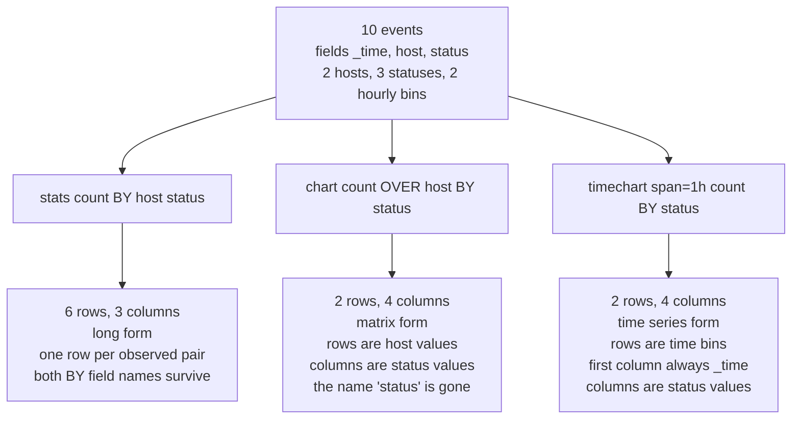

# Statistical and charting functions

The function catalogue that `stats`, `chart`, `timechart`, `eventstats`, `streamstats` and `tstats` share, plus the one piece of geometry the exam tests hardest: how `stats ... BY`, `chart ... OVER ... BY` and `timechart ... BY` turn the same events into three differently shaped tables.

Command options and defaults for `chart`, `timechart`, `top` and `rare` live in `topics/01-transforming-commands.md`. The transaction-equivalence subset of these functions lives in `topics/03-correlating-events.md`. This file is the function-level companion to both and does not repeat their option tables beyond the aggregation limits, which are reproduced here because they are the reason a chart has columns you did not ask for.

Blueprint note: only `chart` and `timechart` are named in section 1.0, but `stats` functions appear in every section that involves a search, and `eventstats`, `streamstats` and `tstats` show up as distractors. Nothing here is off-limits as a wrong answer.

## How to read the "Works with" column

| Code | Command |
| --- | --- |
| S | `stats` |
| C | `chart` |
| T | `timechart` |
| ES | `eventstats` |
| SS | `streamstats` |
| TS | `tstats` |

The S, C, T and TS marks come from the per-function "You can use this function with the ... commands" line on the 10.4 function pages. Those lines also name `mstats`, which is the metrics-index command and is off blueprint; where a function is `mstats`-only that is called out in Notes. The ES and SS marks come from the `eventstats` and `streamstats` command pages, which list the aggregate, event-order and multivalue families as a group rather than repeating each usage line. One documented oddity: the `eventstats` list names `avg()` but not `mean()`.

## Aggregate functions

| Function | Signature | What it returns | Works with | Notes |
| --- | --- | --- | --- | --- |
| avg | `avg(<value>)` | Arithmetic mean of the field's numeric values. | S, C, T, TS, ES, SS | Sparkline-capable. Non-numeric values are ignored unless `allnum=true`, which discards the whole group instead. |
| count, c | `count(<value>)`, `count`, `c(<value>)` | Number of occurrences of the field. Bare `count` with no argument counts events. | S, C, T, TS, ES, SS | Processes values as strings. `count(status)` counts events in which `status` exists, which is not the same number as `count`. Conditional form is `count(eval(field="value"))`. |
| distinct_count, dc | `dc(<value>)`, `distinct_count(<value>)` | Exact count of the distinct values of the field. | S, C, T, TS, ES, SS | Processes values as strings, so `200` and `"200 "` are two values. Expensive on high-cardinality fields. |
| estdc | `estdc(<value>)` | Estimated count of the distinct values. | S, C, T, TS, ES, SS | Not sparkline-capable, and not available on `mstats`. If the actual number of distinct values is below the `approx_dc_threshold` setting in `limits.conf` (1000), Splunk does not estimate at all and returns the exact count. |
| estdc_error | `estdc_error(<value>)` | Theoretical error of the estimated distinct count, as the ratio `absolute_value(estimate_distinct_count - real_distinct_count)/real_distinct_count`. | S, C, T, ES, SS | The narrowest usage line in the whole catalogue: `chart`, `stats` and `timechart` only, no `tstats` and no `mstats`. |
| exactperc | `exactperc<percentile>(<value>)` | The exact percentile value, for example `exactperc95(bytes)`. | S, C, T, TS, ES, SS | Documented as very resource expensive for high-cardinality fields. Use it when the number has to be defensible, not in a dashboard that runs every minute. |
| max | `max(<value>)` | Maximum value of the field. | S, C, T, ES, SS | Processes values as numbers if possible, otherwise lexicographically. The usage line names `chart`, `mstats`, `stats` and `timechart` and does not name `tstats`. |
| mean | `mean(<value>)` | Arithmetic mean of the field. | S, C, T, ES | The same statistic as `avg()`. Its usage line does not name `tstats`, and the `eventstats` page lists `avg` but not `mean`. Write `avg()` and the question of which pages list it never arises. |
| median | `median(<value>)` | Middle-most value of the field. | S, C, T, ES, SS | With an even number of events the calculation is by default approximated to the higher of the two middle values. Not sparkline-capable. |
| min | `min(<value>)` | Minimum value of the field. | S, C, T, ES, SS | Numbers if possible, otherwise lexicographic. Not sparkline-capable. |
| mode | `mode(<value>)` | Most frequent value of the field. | S, C, T, ES, SS | Processes values as strings. No `tstats`, no `mstats`. Returns a value, not its count. |
| perc, p | `perc<percentile>(<value>)`, `p<percentile>(<value>)` | Approximate threshold such that the given percent of the field's values fall below it. | S, C, T, TS, ES, SS | The percentile may be a floating point number between 0 and 100, for example `perc99.95(bytes)`. Above 1000 distinct values a radix-tree digest algorithm approximates the answer, limiting the error to under 1 percent of rank error. |
| range | `range(<value>)` | Difference between the maximum and minimum values. Values must be numeric. | S, C, T, TS, ES, SS | `range(_time)` is the `stats` equivalent of a transaction's `duration`. See the pairs section below. |
| stdev | `stdev(<value>)` | Sample standard deviation, the n-1 denominator form. | S, C, T, TS, ES, SS | Use when the events are a sample of a larger population, which is almost always true of log data. |
| stdevp | `stdevp(<value>)` | Population standard deviation, the n denominator form. | S, C, T, TS, ES, SS | Use only when the result set is the entire population. |
| sum | `sum(<value>)` | Sum of the numeric values of the field. | S, C, T, TS, ES, SS | Conditional form is `sum(eval(...))`. The default `chart` and `timechart` series ranking is by the sum of each series. |
| sumsq | `sumsq(<value>)` | Sum of the squares of the values. | S, C, T, TS, ES, SS | The building block behind variance. Almost never the answer to a business question, frequently the answer to an exam question about what `sumsq` does. |
| upperperc | `upperperc<percentile>(<value>)` | Approximate upper bound for the requested percentile when there are more than 1000 values. | S, C, T, TS, ES, SS | Pair it with `perc` to bracket the estimate: `perc95` gives the lower end of the approximation, `upperperc95` the upper. |
| var | `var(<value>)` | Sample variance. | S, C, T, TS, ES, SS | `stdev` squared. |
| varp | `varp(<value>)` | Population variance. | S, C, T, TS, ES, SS | `stdevp` squared. |

## Event order and time order functions

The docs split this group across two pages, and the split is itself examinable. The Event order functions page documents exactly two functions, `first()` and `last()`. Everything else below, including `earliest()` and `latest()`, is documented on the Time functions page.

| Function | Signature | What it returns | Works with | Notes |
| --- | --- | --- | --- | --- |
| first | `first(<value>)` | The first seen value of the field, meaning the most recent instance, based on the order in which events reach the command. | S, C, T, ES, SS | The order events are seen is not necessarily chronological order. |
| last | `last(<value>)` | The last seen value, meaning the oldest instance in processing order. | S, C, T, ES, SS | Same caveat. Both flip meaning if anything upstream reorders results. |
| earliest | `earliest(<value>)` | The chronologically earliest seen occurrence of a value in the field. | S, C, T, TS, ES, SS | Processes values as strings. This is the time-safe version of `first()`. |
| earliest_time | `earliest_time(<value>)` | The UNIX time of the chronologically earliest seen occurrence. | S, TS | Usage line names `mstats`, `stats` and `tstats` only. Not available on `chart` or `timechart`. |
| latest | `latest(<value>)` | The chronologically latest seen occurrence of a value in the field. | S, C, T, TS, ES, SS | The time-safe version of `last()`. |
| latest_time | `latest_time(<value>)` | The UNIX time of the chronologically latest seen occurrence. | S, TS | Same restriction as `earliest_time()`. |
| rate | `rate(<value>)` | Per-second rate of change, computed as `(latest(<value>) - earliest(<value>)) / (latest_time(<value>) - earliest_time(<value>))`. | S, TS | Requires the `earliest` and `latest` values to be numerical and the `earliest_time` and `latest_time` values to be different, and needs at least two data points. Handles the largest value reset if there is at least one reset, which is what makes it usable on counters. |
| rate_avg | `rate_avg(<value>)` | Average of the per-series rates for accumulating counter metrics. | `mstats` only | Does not support `prestats=true`. Can compute a rate where each timespan holds a single data point, by pulling data across timespans. |
| rate_sum | `rate_sum(<value>)` | Aggregate of the per-series rates for accumulating counter metrics. | `mstats` only | Same two notes as `rate_avg`. |

## Multivalue functions

| Function | Signature | What it returns | Works with | Notes |
| --- | --- | --- | --- | --- |
| list | `list(<value>)` | A multivalue entry built from the field's values, in the order of the events. | S, C, T, ES, SS | If more than 100 values are in a field, only the first 100 are returned. Duplicates are kept. Processes values as strings. |
| values | `values(<value>)` | A multivalue entry of the distinct values of the field, in lexicographical order. | S, C, T, TS, ES, SS | No default limit; a cap can be set with `maxvalues` in the `[stats \| sistats]` stanza of `limits.conf`. Lexicographical means numbers sort on their first digit, so 10 sorts before 9. |

## Time functions, the per_* family

| Function | Signature | What it returns | Works with | Notes |
| --- | --- | --- | --- | --- |
| per_day | `per_day(<value>)` | The values of the field or eval expression expressed per day. | T only | |
| per_hour | `per_hour(<value>)` | The same, per hour. | T only | |
| per_minute | `per_minute(<value>)` | The same, per minute. | T only | |
| per_second | `per_second(<value>)` | The same, per second. | T only | |

All four are aggregators that rescale a sum to a rate. They do not set the time span. If the span works out to 30 minutes, `per_hour()` returns `sum()*2`. To get hourly buckets you still write `span=1h`. That is trap T-01-16.

## The pairs the exam confuses

### first and last against earliest and latest

`first()` and `last()` are defined by processing order. `earliest()` and `latest()` are defined by the timestamp. Search results arrive in reverse chronological order by default, so `first()` usually returns the newest value and `last()` the oldest, which is the opposite of what the English words suggest. Anything upstream that reorders results (`sort`, `append`, `union`, a subsearch) breaks even that weak guarantee, while `earliest()` and `latest()` keep working.

```spl
index=web sourcetype=access_combined
| stats earliest(action) AS entry_action, latest(action) AS exit_action, first(action) AS first_seen, last(action) AS last_seen BY JSESSIONID
```

For a session whose events are `view` at 10:01, `addtocart` at 10:03 and `purchase` at 10:07, the row reads:

| JSESSIONID | entry_action | exit_action | first_seen | last_seen |
| --- | --- | --- | --- | --- |
| SD1 | view | purchase | purchase | view |

`entry_action` and `first_seen` disagree, and that disagreement is the whole question. Rule: if the word "chronological", "first event" or "last event" appears in the stem, the answer is `earliest()` or `latest()`. This is trap T-03-12.

### dc against estdc against count

| Function | Counts | Cost | When it lies |
| --- | --- | --- | --- |
| `count(field)` | Events in which the field exists | Cheapest | Never, but it answers a different question: it is not a cardinality |
| `dc(field)` | Distinct values, exactly | Expensive on high cardinality | Never |
| `estdc(field)` | Distinct values, estimated | Cheap on high cardinality | Only above `approx_dc_threshold`, below which it returns the exact count anyway |

```spl
index=web
| stats count AS events, count(clientip) AS events_with_ip, dc(clientip) AS unique_ips, estdc(clientip) AS approx_ips, estdc_error(clientip) AS error_ratio
```

| events | events_with_ip | unique_ips | approx_ips | error_ratio |
| --- | --- | --- | --- | --- |
| 41,568 | 41,568 | 8,742 | 8,701 | 0.004690 |

`events` and `events_with_ip` match only because every event carries a `clientip`. Remove that assumption and they diverge immediately. `error_ratio` is a ratio, not a percentage, so 0.00469 is roughly half a percent.

### values against list

| | `values()` | `list()` |
| --- | --- | --- |
| Duplicates | Removed | Kept |
| Order | Lexicographical | Order of the events |
| Documented limit | None by default; `maxvalues` in the `[stats \| sistats]` stanza of `limits.conf` | Only the first 100 values are returned |
| `tstats` | Supported | Not in the usage line |

```spl
index=web
| stats values(action) AS actions_set, list(action) AS actions_seq BY JSESSIONID
```

For a session whose events are `view`, `addtocart`, `view`, `purchase` in that order:

| JSESSIONID | actions_set | actions_seq |
| --- | --- | --- |
| SD1 | addtocart, purchase, view | view, addtocart, view, purchase |

`values()` sorted alphabetically and deduplicated, which destroys the sequence. `list()` preserved the sequence, and would silently stop at 100 values on a longer session. The 100 is the examinable number, and it is the answer to any question phrased as "why is my result incomplete". This is trap T-03-13. The `transaction` parallel is `mvlist`, which defaults to `false` and gives the `values()` style rendering; `mvlist=true` gives the `list()` style (trap T-03-07).

### range as the stats equivalent of duration

A `transaction` result carries `duration`, the difference in seconds between the timestamps of the first and last member events. The `stats` expression that produces the same number is `range(_time)`, because `_time` is epoch seconds and `range()` is max minus min.

```spl
index=web
| transaction JSESSIONID
| stats count BY duration

index=web
| stats range(_time) AS duration, count AS eventcount BY JSESSIONID
| stats count BY duration
```

Both return the distribution of session lengths. The second is a transforming command that distributes across indexers and never holds an open-transaction pool in search head memory. The equivalence is only valid when the grouping field is genuinely unique per group; a recycled `JSESSIONID` merges unrelated sessions and inflates `duration` without warning. Full equivalence table in `topics/03-correlating-events.md`.

### stdev against stdevp, var against varp

The `p` suffix means population. Without it the function computes the sample statistic, dividing by n-1 rather than n. On log data the events in your time range are a sample of all the events the system will ever produce, so `stdev()` and `var()` are the defaults you want. `stdevp()` and `varp()` are correct only when the result set is the complete population, for example the 12 monthly totals of a finished year. On large result sets the two agree to several decimal places, which is exactly why an exam question uses a tiny dataset where they visibly differ.

```spl
index=sales
| stats stdev(bytes) AS sample_sd, stdevp(bytes) AS population_sd, var(bytes) AS sample_var, varp(bytes) AS population_var BY category
```

`sample_sd` is always the larger of the two, because the denominator is smaller.

## by against over against split-by

This is the single highest-yield idea in the file. Take ten events with three fields, two hosts, three status values and two hourly time bins.

| _time | host | status |
| --- | --- | --- |
| 10:05 | web1 | 200 |
| 10:12 | web1 | 200 |
| 10:20 | web1 | 404 |
| 10:31 | web2 | 200 |
| 10:44 | web2 | 503 |
| 11:02 | web1 | 200 |
| 11:15 | web1 | 503 |
| 11:20 | web2 | 200 |
| 11:33 | web2 | 404 |
| 11:41 | web2 | 404 |

`stats count BY host, status` gives one row per observed combination, and both group-by field names survive as columns:

| host | status | count |
| --- | --- | --- |
| web1 | 200 | 3 |
| web1 | 404 | 1 |
| web1 | 503 | 1 |
| web2 | 200 | 2 |
| web2 | 404 | 2 |
| web2 | 503 | 1 |

`chart count OVER host BY status` gives the matrix of the same six numbers. The field name `status` disappears; its values became column headers:

| host | 200 | 404 | 503 |
| --- | --- | --- | --- |
| web1 | 3 | 1 | 1 |
| web2 | 2 | 2 | 1 |

`timechart span=1h count BY status` gives the same matrix with the row axis replaced by time. The first column is always `_time`:

| _time | 200 | 404 | 503 |
| --- | --- | --- | --- |
| 10:00 | 3 | 1 | 1 |
| 11:00 | 2 | 2 | 1 |

Change the split field and the columns change but the geometry does not. `timechart span=1h count BY host`:

| _time | web1 | web2 |
| --- | --- | --- |
| 10:00 | 3 | 2 |
| 11:00 | 2 | 3 |



Shape arithmetic, assuming defaults:

| Command | Rows | Columns |
| --- | --- | --- |
| `stats <agg> BY A B` | One per observed combination of A and B, at most the product of their cardinalities | One per BY field plus one per aggregation term |
| `chart <agg> OVER A BY B` | One per distinct value of A | One for A, plus up to `limit` distinct values of B, plus OTHER, plus NULL |
| `timechart <agg> BY B` | One per time bin, set by `span` or `bins` | One for `_time`, plus up to `limit` distinct values of B, plus OTHER, plus NULL |

Four rules that fall out of this and answer most shape questions:

`chart count BY A B` and `chart count OVER A BY B` are identical. The field after `OVER`, or the first field after `BY`, is the row-split; the second is the column-split. Swapping them transposes the table (trap T-01-03).

`stats` takes any number of BY fields. `chart` takes exactly two slots, one row-split and one column-split. `timechart` takes one split-by field only, because `_time` has already claimed the row-split, so `timechart count BY host, status` is not valid (trap T-01-02).

Only `chart` and `timechart` collapse a field's values into column headers, so only they can produce OTHER and NULL columns. `stats` never does; it just returns more rows.

Convert between the shapes without re-running the search: `... | stats n BY x y | xyseries x y n` reproduces `... | chart n BY x y`, and `untable` runs it in the other direction. For the `timechart` equivalent, `x` is `_time`. Neither converter is transforming on its own (trap T-01-18).

## Aggregation limits

All defaults below are from the 10.4 `chart` and `timechart` reference pages, reproduced from `topics/01-transforming-commands.md`.

| Setting | Default | Effect |
| --- | --- | --- |
| `limit` | `top 10` on `chart`, `top10` on `timechart` | Caps the number of data series, meaning columns, not rows. Valid on `chart` only when a column-split is specified. |
| `limit=0` | not the default | Returns all results on `chart`; uses all distinct values with no series filtering on `timechart`. It never means zero (trap T-01-17). |
| `useother` | `true` | Adds one pooled series for the values the limit or where-clause excluded. Note the contrast: `useother` defaults to `false` on `top` (trap T-01-07). |
| `otherstr` | `OTHER` | Label for that pooled series. Applies only when `useother=true`. |
| `usenull` | `true` | Adds one series for events that do not contain the split-by field. |
| `nullstr` | `NULL` | Label for that series. Applies only when `usenull=true`. |
| split-by count | one on `timechart` | `_time` already occupies the row-split, so `timechart` accepts a single BY field. |
| `<where-clause>` | behaves like `where sum in top10` | An explicit where-clause silently disables both `limit` and `agg` (trap T-01-19). |

Series scoring with `limit` is by the sum of each series when there is a single aggregation, and by the frequency of the split value when there is more than one aggregation, with ties broken lexicographically. That is why `timechart avg(bytes) max(bytes) BY host` needs `limit=0` if you want every host kept.

`useother` and `usenull` are independent switches with separate labels, and mixing them up is trap T-01-04. Counting the columns in the resulting table is the most common form the question takes: one row-split column, plus up to `limit` value columns, plus one for OTHER if anything was excluded, plus one for NULL if any event lacked the field.

## Conditional aggregation

Any aggregate function can take an `eval` expression instead of a field name, which turns the aggregation into a filter that does not need a separate `search` clause. The documented form for counting is:

```spl
... | stats count(eval(status="404")) AS count_status BY sourcetype
```

That counts, per sourcetype, only the events where the expression is true, while leaving every other event in the result set available to the other aggregations in the same `stats`. That is the point: one pass, several mutually exclusive counts.

```spl
index=web
| stats count AS total,
        count(eval(status>=500)) AS server_errors,
        count(eval(status>=400 AND status<500)) AS client_errors,
        sum(eval(if(action="purchase", bytes, 0))) AS revenue,
        sum(eval(bytes/1024)) AS kb_total
        BY host
```

| host | total | server_errors | client_errors | revenue | kb_total |
| --- | --- | --- | --- | --- | --- |
| web1 | 20,183 | 214 | 1,902 | 41,255.00 | 92,410.7 |
| web2 | 21,385 | 198 | 2,041 | 39,870.00 | 96,332.1 |

Three things worth knowing. `count(eval(...))` counts events where the expression evaluates true, not events where it returns a value, so `count(eval(status))` is not a way to count events with a `status` field; use `count(status)` for that. `sum(eval(...))` evaluates the expression per event and then sums, which is how you build a conditional total without a preceding `eval` line. And `timechart` requires the split-by clause when the argument is a bare eval expression rather than a function wrapping one.

The same construct works in `chart` and `timechart`:

```spl
index=web
| timechart span=1h count(eval(status=200)) AS ok, count(eval(status!=200)) AS not_ok
```

Two named series with no split-by field at all, which sidesteps `limit`, `useother` and `usenull` entirely. That is often the cleaner answer when a question asks how to chart exactly two categories.

## eventstats and streamstats

Neither is named in the blueprint. Both appear in distractor lists, and both are the right answer to real problems that `stats` cannot solve, because they add aggregates to events instead of replacing them.

| | `eventstats` | `streamstats` |
| --- | --- | --- |
| Syntax | `eventstats [allnum=<bool>] <stats-agg-term>... [BY <field-list>]` | `streamstats [reset_on_change=<bool>] [reset_before="(<eval>)"] [reset_after="(<eval>)"] [current=<bool>] [window=<int>] [time_window=<span>] [global=<bool>] [allnum=<bool>] <stats-agg-term>... [BY <field-list>]` |
| Command type | Dataset processing | Centralized streaming |
| What it does | Computes the aggregate over the whole result set and writes it into a new field on every event | Computes cumulative statistics for each event at the time that event is seen |
| Key defaults | `allnum=false` | `current=true`, `window=0` (all previous events), `global=true`, `allnum=false`, `reset_on_change=false` |
| Functions accepted | Aggregate family, `earliest`, `first`, `last`, `latest`, `list`, `values` | Same families |
| Memory | Governed by `max_mem_usage_mb` in `limits.conf` | `time_window` is bounded by `max_stream_window` in `limits.conf` |

The canonical uses are worth recognising on sight. `eventstats` for a comparison against a group aggregate, because the per-event detail has to survive:

```spl
index=web
| eventstats avg(bytes) AS avg_bytes, stdev(bytes) AS sd_bytes BY host
| where bytes > avg_bytes + (3 * sd_bytes)
```

`streamstats` for a running total, or for numbering rows so that `xyseries` and `untable` do not drop duplicates:

```spl
index=sales
| sort _time
| streamstats sum(bytes) AS running_total BY category
```

Both are dataset-shaped commands that keep events, so neither populates the Statistics tab on its own. That is the distractor: a question asking which command produces a table for a visualization never has `eventstats` as the answer.


## Docs

1. [Statistical and charting functions (Search Reference 10.4)](https://help.splunk.com/en/splunk-enterprise/search/spl-search-reference/10.4/statistical-and-charting-functions/statistical-and-charting-functions) - the four function categories, the sparkline restriction to `chart` and `stats`, and the related-commands note. 5 minutes.
2. [Aggregate functions](https://help.splunk.com/en/splunk-enterprise/search/spl-search-reference/10.4/statistical-and-charting-functions/aggregate-functions) - read the usage line under every function, not just the description. That line is where the command support differences live. 20 minutes.
3. [Event order functions](https://help.splunk.com/en/splunk-enterprise/search/spl-search-reference/10.4/statistical-and-charting-functions/event-order-functions) - two functions, and the sentence that processing order is not necessarily chronological. 3 minutes.
4. [Time functions](https://help.splunk.com/en/splunk-enterprise/search/spl-search-reference/10.4/statistical-and-charting-functions/time-functions) - `earliest`, `latest`, the `_time` variants, `rate` and the `per_*` family. Note that `earliest` and `latest` live here and not on the event order page. 10 minutes.
5. [Multivalue stats and chart functions](https://help.splunk.com/en/splunk-enterprise/search/spl-search-reference/10.4/statistical-and-charting-functions/multivalue-stats-and-chart-functions) - `values()` against `list()` and the 100-value cap. 5 minutes.
6. [stats](https://help.splunk.com/en/splunk-enterprise/search/spl-search-reference/10.4/search-commands/stats) - the BY-clause behaviour and the `count(eval(...))` examples. 15 minutes.
7. [eventstats](https://help.splunk.com/en/splunk-enterprise/search/spl-search-reference/10.4/search-commands/eventstats) and [streamstats](https://help.splunk.com/en/splunk-enterprise/search/spl-search-reference/10.4/search-commands/streamstats) - the option defaults and the supported-function lists. 10 minutes for both.
