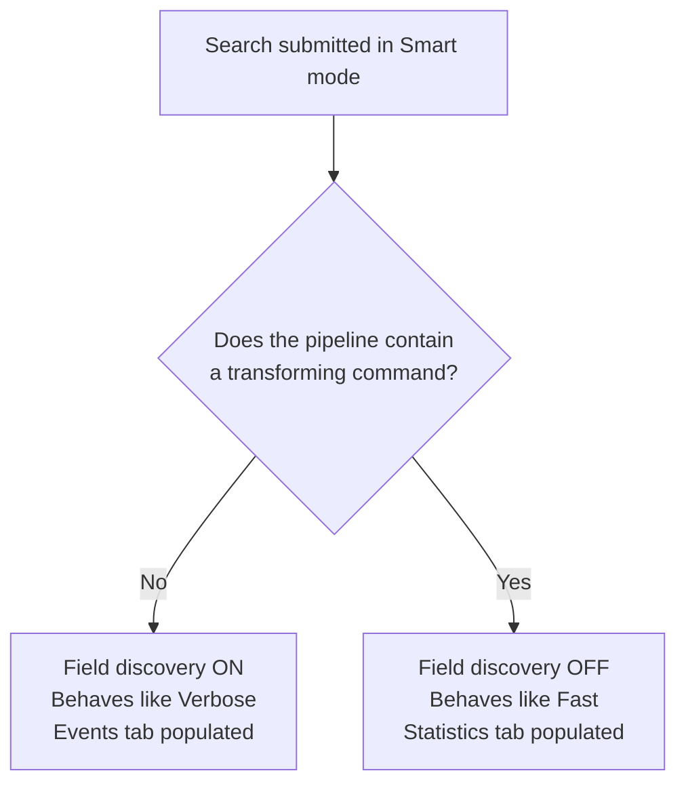
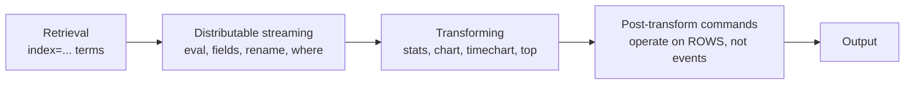

# 0.0 Foundations Refresher (0%)

Assumed knowledge: everything SPLK-1002 expects you to already own from SPLK-1001 and from daily Splunk use, plus four large topics that carry zero direct blueprint weight. Nothing here is a blueprint objective, so nothing here earns a point on its own. It earns points indirectly, because roughly a third of real blueprint questions are phrased using this vocabulary and will be unanswerable if the vocabulary is shaky.

## Blueprint mapping

SPLK-1002 has no section 0.0. This file has no official weight and no sub-objectives. It exists because the exam is written for candidates who hold or could hold SPLK-1001, and because the blueprint sections silently depend on the following.

What is here and why:

- Areas 1 to 5 and 9 (search modes, fields sidebar, time, command types, subsearches, search jobs and the Job Inspector) are **assumed prerequisites**. A blueprint question can be built on top of them. Example: a 3.0 transaction question that hinges on whether `transaction` is streaming, or a 5.0 field-alias question that hinges on the search-time sequence.
- Areas 6, 7, 8 and 10 (lookups, reports and alerts, dashboards, knowledge object management) are **off blueprint** and are not tested directly on SPLK-1002. Lookups belong to SPLK-1001 and SPLK-1004; alerting and dashboards to SPLK-1001 and the admin track. They are here in tight summary form because they are useful at work and because knowing they are off blueprint is the fastest way to stop over-studying them.


Where any secondary source disagrees with anything below, the documentation wins.

## 1. Search modes

The single most testable item in this file. Three modes, one default, and one conditional behaviour.

| Mode | Field discovery | Fields returned | Behaviour |
| --- | --- | --- | --- |
| Fast | Off for event searches | Default fields (`host`, `source`, `sourcetype`), index-time fields, and only those search-time fields you explicitly name in the search | Prioritises performance. Non-transforming searches still show an event list and timeline. Transforming searches go straight to the visualisation or table. |
| Smart (default) | Conditional | Conditional | Switches between Fast and Verbose based on whether the search contains a transforming command. |
| Verbose | On | All discoverable fields: default, index-time, and every search-time extraction | Returns the event list and the report table or visualisation. Slowest. |

The Smart mode rule, stated exactly:

- Search contains **no** transforming command (an event search): field discovery is **on**, Smart behaves as if it were in **Verbose** mode.
- Search **does** contain a transforming command (a report search): field discovery is **off**, Smart behaves as if it were in **Fast** mode, skipping event list generation and jumping to the results.



Two consequences the exam likes:

1. In Fast mode a field you did not name in the search will not appear in the fields sidebar, even though the extraction exists and is correctly configured. The extraction is not broken; the mode is suppressing discovery.
2. Reports cannot benefit from report acceleration when you run them in Verbose mode. Turning acceleration on and then switching the mode to Verbose silently returns the report to non-accelerated speed.

All reports run in Smart mode after they are first created.

UI path: the mode selector sits directly under the search bar, to the left of the search action buttons.

## 2. The fields sidebar

Three groupings, one threshold.

| Grouping | Contents | Rule |
| --- | --- | --- |
| Selected Fields | Fields shown under each event in the events list | Starts as `host`, `source`, `sourcetype` by default. You add to it. |
| Interesting Fields | Fields the platform thinks are worth surfacing | A field appears here when it is present in **at least 20% of the events returned by the search**. |
| All Fields | Everything, via the `All Fields` link at the top of the sidebar | Opens the Select Fields dialog, which lists each field with its number of unique values and its type (`String` or `Number`). |

The 20% threshold is computed against the events **returned by the current search**, not against the index and not against the source type. Narrow the search and a field that was below threshold can cross it, and the reverse.

In the sidebar itself, string fields are marked with a lowercase `a` and numeric fields with a `#`. [verify]

Two facts that follow from the mode section: in Fast mode the Interesting Fields list is close to empty because discovery is off; in Verbose mode it is at its fullest. The 20% rule does not change with mode, but the candidate pool of fields does.

## 3. Time

`_time` is stored as UNIX time, an integer count of seconds since 00:00:00 UTC on 1 January 1970, and rendered in human-readable form for display. Because the stored value is absolute, the same search returns the same events regardless of viewer time zone. The exception is any range that references a local calendar boundary, for example `Since 00:00:00` or `@d`: midnight happens at a different absolute instant in San Francisco than in Tokyo, so those ranges genuinely return different events for different users.

Default time range for an ad hoc search in Search and Reporting: Last 24 hours.

### Time range picker

Categories: Presets, Relative, Real-time, Date Range, Date and Time Range, Advanced. The Advanced tab takes UNIX time or relative time notation in its Earliest and Latest fields and renders the resulting timestamp underneath so you can check it.

### Inline modifiers

| Modifier | Applies to | Notes |
| --- | --- | --- |
| `earliest` | `_time` | Start of the range. |
| `latest` | `_time` | End of the range. Defaults to `now()` when omitted. |
| `_index_earliest` | `_indextime` | Start of the range by index time, not event time. |
| `_index_latest` | `_indextime` | End of the range by index time. |

Precedence: a time range specified in the search bar or in a saved search **overrides** the time range selected in the Time Range Picker. Select Last 24 hours in the picker, type `earliest=-30m latest=now`, and you get 30 minutes.

`latest` is exclusive at the boundary. With `latest=02:00:00`, events timestamped before 02:00:00 are included and an event at exactly 02:00:00 is not.

### Relative time syntax

```
[+|-]<time_integer><time_unit>@<time_unit>
```

| Unit | Valid abbreviations |
| --- | --- |
| Subseconds | `us`, `ms`, `cs`, `ds` |
| Second | `s`, `sec`, `secs`, `second`, `seconds` |
| Minute | `m`, `min`, `mins`, `minute`, `minutes` |
| Hour | `h`, `hr`, `hrs`, `hour`, `hours` |
| Day | `d`, `day`, `days` |
| Week | `w`, `week`, `weeks` |
| Month | `mon`, `month`, `months` |
| Quarter | `q`, `qtr`, `qtrs`, `quarter`, `quarters` |
| Year | `y`, `yr`, `yrs`, `year`, `years` |

Snap-to rules:

- `@` separates the offset from the snap unit. Snapping always rounds **down**, to the latest time that is not after the specified time. There is no rounding up.
- The offset on the left of `@` is applied before the snap on the right. `-2h@h` means "go back two hours, then snap to the top of that hour".
- You can chain a further offset after the snap. `@d-2h` means "snap to the beginning of today, then subtract two hours", which is 10 PM yesterday.
- Day-of-week snapping uses `@w0` through `@w7`, where `w0` and `w7` are Sunday and `w6` is Saturday.
- `earliest=1 latest=now()` is an effective all-time search, starting at the epoch.

Worth memorising as a shape: `earliest=-5d@w1 latest=@w6` is Monday to Saturday of the past business week.

### now() and relative_time()

`now()` is an eval function returning the current time as an epoch integer. `relative_time(<epoch_time>, <relative_time_specifier>)` applies the same relative syntax to an arbitrary epoch value and returns an epoch integer. They live in `eval` and `where`, not in the time modifier slot.

```spl
index=web sourcetype=access_combined
| eval age_seconds = now() - _time
| eval start_of_day = relative_time(now(), "@d")
```

## 4. Command types

Six types. They are not mutually exclusive: a command can be both generating and transforming, and several commands appear on two lists.

| Type | Definition | Where it runs |
| --- | --- | --- |
| Distributable streaming | Operates on each event as it is returned, one event in, one or zero events out | Indexers, when every preceding command is also distributable streaming; otherwise the search head |
| Centralized streaming | Applies a transformation to each event but order matters | Search head only |
| Transforming | Orders the results into a data table, turning event values into the numbers a visualisation needs | Search head |
| Generating | Returns or generates results rather than consuming them | Depends on the command |
| Orchestrating | Controls some aspect of how the search is processed without directly affecting the final result set | Varies |
| Dataset processing | Requires the entire dataset before it can run | Search head |

Verbatim lists from the 10.4 command types quick reference:

- **Transforming**: `addtotals`, `anomalydetection`, `append`, `associate`, `chart`, `cofilter`, `contingency`, `history`, `makecontinuous`, `mvcombine`, `rare`, `stats`, `table`, `timechart`, `top`, `xyseries`
- **Generating**: `datamodel`, `dbinspect`, `eventcount`, `from`, `gentimes`, `history`, `inputcsv`, `inputlookup`, `loadjob`, `makeresults`, `metadata`, `metasearch`, `mstats`, `multisearch`, `pivot`, `rest`, `search`, `searchtxn`, `set`, `tstats`, `typeahead`, `walklex`
- **Orchestrating**: `localop`, `lookup`, `noop`, `redistribute`, `require`
- **Dataset processing**: `anomalousvalue`, `anomalydetection`, `append`, `appendcols`, `appendpipe`, `bin`, `cluster`, `concurrency`, `datamodel`, `dedup`, `eventstats`, `fieldsummary`, `fillnull`, `from`, `join`, `map`, `outlier`, `reverse`, `sort`, `tail`, `transaction`, `union`

Distributable streaming examples named in the search manual: `eval`, `fields`, `makemv`, `rename`, `regex`, `replace`, `strcat`, `typer`, `where`. Centralized streaming examples: `head`, `streamstats`, and certain modes of `dedup` and `cluster`.

Why the distinction decides pipeline order:



Once a transforming command runs, the pipeline no longer holds events. It holds a result table. Commands after that point see only the fields the transforming command emitted. `_raw` is gone. `_time` survives only if the transforming command produced it (`timechart` does, `stats count by host` does not). This is the mechanism behind a very large share of exam distractors across sections 3.0 and 4.0.

Generating commands that generate events, rather than reporting on an index, must be first in the search and are written with a leading pipe: `| inputlookup`, `| makeresults`, `| tstats`. `search` is a generating command too, which is why a bare search string works without a leading pipe.

## 5. Subsearches

Syntax: enclose the inner search in square brackets inside the outer search.

```spl
index=web sourcetype=access_combined [ search index=web sourcetype=access_combined action=purchase | top limit=1 categoryId | fields categoryId ]
```

Execution order: when a search contains a subsearch, the subsearch typically **runs first**. Its output is turned into a search-term string, and that string is substituted into the outer search before the outer search runs. The outer search never sees the subsearch as a pipeline stage.

Defaults:

| Setting | Default | Effect |
| --- | --- | --- |
| `maxout` (`[subsearch]` in `limits.conf`) | 10,000 results | The subsearch returns at most this many results. Individual commands can override the effective default when they invoke a subsearch. |
| `maxtime` (`[subsearch]` in `limits.conf`) | 60 seconds | A subsearch that runs longer than this has its results automatically finalized, meaning silently truncated. |

The first command in a subsearch must be a generating command (`search`, `eventcount`, `inputlookup`, `tstats` and so on), with `foreach` as the exception.

### The format command

`format` is what converts subsearch rows into the boolean search string. Its defaults define the shape of that string.

| Argument | Default | What it does |
| --- | --- | --- |
| `mvsep` | `"OR"` | Separator between values of a multivalue field |
| `maxresults` | `0` (no limit) | Caps the rows converted |
| row prefix | `"("` | Opens each row |
| column prefix | `"("` | Opens the whole set |
| column separator | `"AND"` | Joins fields within one row |
| column end | `")"` | Closes each row |
| row separator | `"OR"` | Joins rows |
| row end | `")"` | Closes the whole set |
| `emptystr` | `"NOT( )"` | Emitted when there is nothing to format |

Result contract for `format`: it collapses all input rows into **one row, one field, named `search`**. Default output shape, given two rows of host, source and sourcetype:

```spl
( ( host="mylaptop" AND source="syslog.log" AND sourcetype="syslog" ) OR ( host="bobslaptop" AND source="bob-syslog.log" AND sourcetype="syslog" ) )
```

That is: AND within a row, OR between rows.

Why subsearches are a performance trap: the truncation at 10,000 results and at 60 seconds is silent. A subsearch that returns 10,000 of 40,000 distinct values produces an outer search that is wrong rather than slow, and nothing in the UI says so. The fixes are to narrow the subsearch time range, add `| format maxresults=<n>` so the truncation is yours, or restructure with `stats`.

Time ranges do not cross the boundary: time modifiers in the base search do not apply to the subsearch, and vice versa. The Time Range Picker applies to a subsearch only when the subsearch has no inline modifiers of its own.

## 6. Lookups (OFF BLUEPRINT)

Not an SPLK-1002 objective. SPLK-1001 and SPLK-1004 material. Summary only.

Four types:

| Type | Backing store | Use for |
| --- | --- | --- |
| CSV (file-based) | A `.csv` or `.csv.gz` file | Small, relatively static tables |
| KV Store | A collection in the App Key Value Store | Large tables, or tables that change frequently |
| External (scripted) | A Python script or binary executable | Values that must be fetched live, for example DNS |
| Geospatial | A KMZ or KML file of geographic feature collections | Matching coordinates to regions for choropleth maps |

Three distinct objects, routinely conflated:

1. **Lookup table file**: the data itself. Uploaded at `Settings > Lookups > Lookup table files`.
2. **Lookup definition**: names the lookup, points at a table file or collection, sets the matching rules (case sensitivity, wildcards, time-based matching). One table file can back several definitions. Created at `Settings > Lookups > Lookup definitions`.
3. **Automatic lookup**: binds a definition to a host, source or source type so it applies to every search without anyone typing `lookup`. Created at `Settings > Lookups > Automatic lookups`.

Commands:

```spl
lookup [local=<bool>] [update=<bool>] <lookup-table-name> (<lookup-field> [AS <event-field>])... [OUTPUT | OUTPUTNEW (<lookup-destfield> [AS <event-destfield>])...]
```

| Option | Default | What it does |
| --- | --- | --- |
| `local` | `false` | `true` forces the lookup to run on the search head only |
| `update` | `false` | For real-time searches, refreshes the lookup when the table changes. Implies `local=true` |
| `OUTPUT` | none | Output fields overwrite fields already on the event |
| `OUTPUTNEW` | none | The lookup is not performed for events in which the output fields already exist |
| Neither clause | (this is the default) | All fields in the lookup table that are not match fields become output fields |

```spl
| inputlookup [append=<bool>] [strict=<bool>] [start=<int>] [max=<int>] <filename> | <tablename> [WHERE <search-query>]
```

`append` defaults to `false`, `strict` to `false`, `start` to `0`, `max` to `1000000000`.

`outputlookup` writes results to a static lookup table or KV store collection. `append` defaults to `false`, which **overwrites** the target: fields that are not in the current search results are removed from the file. `override_if_empty` defaults to `true`, `createinapp` to `true`, `output_format` to `splunk_sv_csv`.

Where lookups sit in the search-time sequence, in order:

1. Field filters
2. Inline field extractions
3. Field extractions using field transforms
4. Automatic key-value field extraction
5. Field aliasing
6. Calculated fields
7. **Lookups**
8. Event types
9. Tags

Each stage can reference fields produced by stages above it and cannot reference stages below it. Calculated fields cannot reference lookups. Lookups can reference field aliases and calculated fields, and cannot reference event types or tags. This ordering is genuinely on the blueprint under 5.0, so it is the one part of the lookup story that pays.

## 7. Reports and alerts (OFF BLUEPRINT)

Not an SPLK-1002 objective. Summary only.

A **saved search** is the underlying object. Saving a search as a **report** makes it re-runnable and shareable. Saving it as an **alert** attaches a schedule or a real-time search plus a trigger condition plus alert actions. Reports and alerts are both listed at `Settings > Searches, reports, and alerts`, and reports also appear on the Reports tab of the Search app.

Four ways to create a report: from Search via `Save As > Report`, from Pivot, via `Settings > Searches, reports, and alerts > New Report`, and by converting an inline-search dashboard panel.

Alert types: **scheduled** and **real-time**. Real-time alerts use either **per-result** triggering (the search runs continuously and every matching result triggers) or **rolling time window** triggering (trigger when N events occur within a window that rolls forward, for example three failed logins in ten minutes). Real-time with per-result triggering is the most resource-demanding option, and the docs caution against it in high availability deployments because results can be incomplete.

Trigger conditions for scheduled alerts are built-in result and field count options, plus a custom condition written as a secondary search. The UI names them Number of Results, Number of Hosts, Number of Sources, and Custom. [verify] `Number of Hosts` and `Custom` are confirmed verbatim in the 10.4 docs; the other two option labels are not.

Throttling, also called suppression, stops an alert firing repeatedly. Two shapes: throttle the whole alert for a time period, or throttle per result by naming one or more comma-separated fields, in which case events with the same value across all named fields are suppressed for the period. There is no documented default throttle value. Throttling is off unless configured.

Cron: five fields separated by spaces.

| Position | Field | Range |
| --- | --- | --- |
| 1 | Minute | 0-59 |
| 2 | Hour | 0-23 |
| 3 | Day of the month | 1-31 |
| 4 | Month | 1-12 |
| 5 | Day of the week | 0-6, where 0 is Sunday |

Special characters: `*`, `,`, `-`, `/`. Examples: `5 9 * * *` runs at 09:05 daily. `*/20 * * * 1-5` runs every 20 minutes, Monday to Friday. `0 9 1-7 * *` runs at 09:00 on the first seven days of each month.

Schedule dropdown options for a report: Run every hour, Run every day, Run every week, Run every month, Run on Cron Schedule. Schedule Window defaults to No Window and needs `edit_search_schedule_window`. Schedule Priority defaults to Default and needs `edit_search_schedule_priority`.

Three acceleration mechanisms, which are three different things:

| Mechanism | What it accelerates | Where the summary lives | Requirements |
| --- | --- | --- | --- |
| Report acceleration | One saved report | `.tsidx` summary files alongside the index buckets | Search must use a transforming command; any commands before the first transforming command must be streamable; the search cannot use event sampling. A summary is built only when the hot bucket covered by the chosen Summary Range holds at least **100,000** events. `max_summary_ratio` default is 10% of the source bucket size. |
| Data model acceleration | Every search against an accelerated data model, and `tstats` against it | High-performance analytics store, also `.tsidx`, alongside buckets | Data model must be accelerated; only fields in the model are covered |
| Summary indexing | A scheduled search whose reduced output is written into a separate index | A normal Splunk index that you nominate | You build and maintain it. Supports event and metric data, where the other two are event-only |

Report and data model acceleration are automatic once turned on. Summary indexing is a pipeline you own. Reports cannot benefit from report acceleration when run in Verbose mode. Reports created from Pivot cannot be accelerated. Summary Range is chosen from a dropdown offering 1 Day, 7 Days, 1 Month, 3 Months, 1 Year and All Time. [verify] Only 7 Days and 1 Month appear verbatim in the 10.4 pages fetched.

## 8. Dashboards (OFF BLUEPRINT)

Not an SPLK-1002 objective. Very tight summary.

Splunk 10.x ships two dashboard frameworks side by side. **Classic Splunk Dashboards (Simple XML)** is the legacy framework, defined in XML, with a row and column layout, and full support for custom JavaScript and CSS. **Splunk Dashboard Studio** is the current framework, with absolute (free-form) and grid layouts, additional visualisation types (shapes, lines, text boxes, custom icons, parallel coordinates, Sankey, timelines), dashboard defaults, SVG choropleth maps, and per-visualisation PNG export. Studio does not support custom JavaScript or CSS, and does not support certain Simple XML token functions including `unset` and `condition`. A conversion path exists from Simple XML to Studio; components convert fully, partially, or not at all.

Panels come from either an **inline search** (the SPL lives in the dashboard definition, so editing it edits only that panel) or a **report** (the panel references a saved report, so editing the report changes every panel that references it). Converting between the two is a supported operation in both frameworks.

**Tokens** are `$name$` placeholders that inputs set and searches consume, giving dropdowns, text boxes, time pickers and radio inputs that reparameterise panel searches. Token names and functions differ between Simple XML and Dashboard Studio. **Drilldowns** are the click-through behaviour of a panel: run a search, go to a dashboard, go to a URL, or set a token another panel reads.

## 9. The Job Inspector

### What a search job is

A job is the unit of work Splunk creates when a search runs. The docs are deliberately broad about what counts: "Each time you run a search, create a pivot, open a report, or load a dashboard panel, the Splunk software creates a job in the system." Typing SPL into the search bar is only one of those four. A job kicked off by a report, by an alert's scheduled search, or by a six-panel dashboard is the same kind of object, and that dashboard creates six of them.

Each job produces a **search artifact**, "the results and associated metadata that are returned at the time that the ad hoc search or saved search was run". The artifact is what the Jobs page lists, what a shared job link resolves to, and what the Job Inspector reads. On the host, a running job appears as a child process of `splunkd` named `splunkd search`, so jobs are visible in `ps` output as well as in Splunk Web.

| Setting | Default | Meaning |
| --- | --- | --- |
| Ad hoc job lifetime | 10 minutes | After this the artifact expires and the results are gone |
| Shared job lifetime | 7 days | Sharing a job automatically extends its lifetime to 7 days |
| `srchJobsQuota` | 3 | Concurrent historical searches a user holding the role may run |
| `srchDiskQuota` | 100 MB | Disk space the role's job artifacts may occupy |

Jobs are therefore subject to quotas, though a quota is a role setting that constrains jobs and never a definition of one. A capability is likewise a role authorisation with no connection to jobs.

The Job menu on a completed search offers four actions: Edit Job Settings, Send Job to Background, Inspect Job, and Delete Job.

### What the Job Inspector shows

Open it after running a search: `Job > Inspect Job`. It opens in a separate window and reports on the job whether or not it succeeded. You can inspect any job "as long as the search job has not expired (which means that the search artifact still exists). The search does not need to be running to access the Search Job Inspector." Finished, failed and in-flight searches are all inspectable; an expired artifact is not.

Its stated purpose is to "take a closer look at what your search is doing and see where the Splunk software is spending most of its time", which covers both raw performance and the cost of your knowledge objects, since lookups, event types and tags each get their own line in the costs.

Two halves:

- **Execution costs**: the search processing components that ran, each with its duration in seconds, how many times it was invoked, and its input and output event counts. This is where you find out that `command.search.lookups` or a regex is eating the search.
- **Search job properties**: the job metadata, including time bounds, state flags (`isDone`, `isFailed`, `isPaused`) and the count fields below.

Above those two sits a header strip carrying the information message, the SID, a `search.log` link and a Job Details Dashboard link. The 10.4 docs name only the two sections as "the key information that the Search Job Inspector displays"; courseware routinely counts the header as a third component and says the Inspector contains three. Both describe one screen: two data sections under one header. Recognise either phrasing. The Job Details Dashboard behind that link is a separate condensed view with four sections of its own: Summary, Search Strings, Search Costs, and Indexers.

The three counts, which are not synonyms:

| Property | Definition |
| --- | --- |
| `scanCount` | The number of events that are scanned or read off disk |
| `eventCount` | The number of events returned by the search, that is the subset of scanned events that actually matches the search terms |
| `resultCount` | The total number of results returned by the search |

For **dense** searches `scanCount` and `resultCount` are similar. For **sparse** searches `scanCount` is much greater than the result count. Judge performance on `scanCount` per second rather than `resultCount` per second; the docs put a healthy rate at roughly 10,000 to 20,000 events scanned per second.

A transforming search makes `resultCount` a row count rather than an event count, which is why `resultCount` of 8 alongside a `scanCount` of two million is completely normal for `stats count by status`.

## 10. Knowledge object management

Every knowledge object has an owner, an app context, and a sharing level.

| Sharing level | UI label under "Display For" | Who sees it |
| --- | --- | --- |
| Private | `Owner` | The owner only |
| App | `App` | Everyone with access to the app the object lives in |
| Global | `All apps` | Everyone, in every app |

Permissions dialog: for each role, and for `Everyone`, you grant `Read`, `Write`, both, or neither. Read means view and use the object without being able to change its definition. Write means view, use and update it.

Who can change permissions: by default the `admin` role can change permissions on any knowledge object, and the `power` role can change permissions only on objects it owns. Other roles gain the ability by being granted write permission on the app the object lives in.

Click-path: `Settings`, then the settings page for the object type (for example `Settings > Fields > Field aliases`), find the object row, then `Edit > Edit Permissions` or the `Permissions` link in the Sharing column. Set `Display For`, set the role matrix, `Save`.

**Orphaned knowledge objects** arise when the owner's account is deactivated or removed and their objects stay in the system with an owner that no longer resolves. The damage is scheduling: the scheduler cannot run a scheduled report on behalf of a nonexistent owner, so scheduled reports and alerts stop firing and dependent dashboards go stale. Splunk raises a notification linking to the Orphaned Scheduled Searches, Reports, and Alerts dashboard. Objects orphaned by the removal of a user in a third-party authentication system are not always detected.

Fix: `Settings > All configurations > Reassign Knowledge Objects`. The page filters by owner status, object type, app and free text, works with search head clustering, and reassigns both owned and orphaned objects. It **cannot** reassign a knowledge object that is both orphaned and privately shared. For those, either temporarily recreate the invalid owner account, reassign, then deactivate it again, or move the stanza between configuration files by hand.

## Decision rules

| Situation | Rule |
| --- | --- |
| A field extraction "does not work" but the config looks right | Check the search mode first. Fast mode returns only fields you explicitly named. |
| You need every field visible for exploration | Verbose. Accept the cost and accept losing report acceleration. |
| You are building a report you intend to accelerate | Smart or Fast. Never Verbose. |
| Picker says one range, search bar says another | The search bar wins. |
| You need "since midnight local" | `@d`. Understand that this is local-calendar dependent and differs by user time zone. |
| You need "the last full hour" | `-1h@h` to `@h`, not `-1h` to `now`. |
| A command must come before another | If the earlier one is transforming, the later one operates on rows, not events. |
| You want a command to run on the indexers | It and everything before it must be distributable streaming. |
| Subsearch returns "some" of the expected values | Assume you hit 10,000 results or 60 seconds. Verify before blaming the SPL. |
| You must know how many events were read versus matched | `scanCount` is read off disk, `eventCount` is matched, `resultCount` is rows out. |
| You need to know which knowledge object is making a search slow | Job Inspector, Execution costs half. Search job properties tells you the shape of the search, not the cost per component. |
| `Inspect Job` on an old ad hoc search shows nothing | The artifact expired. Ad hoc jobs live 10 minutes by default; sharing a job extends it to 7 days. |
| A scheduled report stopped running after a leaver | Orphaned object. Reassign Knowledge Objects. |
| A lookup needs to reference an event type | Impossible. Lookups run before event types in the search-time sequence. |

## Traps

**T-00-01** Fast is the default search mode. Wrong. **Smart** is the default. Fast is one end of the spectrum, Verbose is the other, Smart sits in the middle and is what every new search and every saved report uses.

**T-00-02** Smart mode always discovers all fields. Wrong. Smart mode discovers all fields only for **non-transforming** searches. The moment the pipeline contains a transforming command, Smart turns field discovery off and behaves like Fast. A question that shows `index=web | stats count by host` and asks what the fields sidebar contains in Smart mode is testing exactly this.

**T-00-03** Verbose mode is just Smart mode plus more fields, so it is always safe. Wrong in one specific way: a report running in Verbose mode cannot use report acceleration. Switching an accelerated report to Verbose silently reverts it to full-scan speed.

**T-00-04** Interesting Fields means fields present in at least 20% of the events in the index, or in the source type. Wrong. The threshold is 20% of **the events returned by the search**. Change the search and the list changes.

**T-00-05** The Time Range Picker overrides `earliest` and `latest` in the search bar because the picker is the more "explicit" user action. Wrong, and backwards. The time range specified in the search bar or in a saved search **overrides** the picker.

**T-00-06** Snapping with `@` rounds to the nearest boundary. Wrong. Snapping always rounds **down**, to the latest time that is not after the specified time. `-30m@h` at 14:50 gives 14:00, never 15:00.

**T-00-07** In `-2h@h` the snap happens first and then the offset. Wrong. The offset on the left of `@` is applied before the snap on the right. A further offset written after the snap unit, as in `@d-2h`, is applied after the snap. Both forms exist and they mean different things.

**T-00-08** A subsearch runs last, or runs as a stage in the outer pipeline. Wrong. The subsearch runs **first**, and its results are substituted into the outer search before the outer search executes.

**T-00-09** Subsearch limits are 50,000 results and 30 seconds, or the limits do not apply to `inputlookup`. Wrong. The documented defaults are **10,000 results** and **60 seconds**, and exceeding either causes silent finalization, not an error.

**T-00-10** The `format` command joins rows with AND and fields within a row with OR. Wrong, and backwards. The default is **AND within a row, OR between rows**, with the whole set wrapped in parentheses. The output lands in a single field named `search`.

**T-00-11** `table` is a formatting command, not a transforming command. On the exam, `table` appears in the official **transforming** commands list alongside `stats`, `chart`, `timechart`, `top` and `rare`. Related trap: `append` appears on both the transforming list and the dataset processing list, and `history` appears on both the transforming and generating lists. The types are not mutually exclusive.

**T-00-12** `sort` is a streaming command because it seems to process events one at a time. Wrong. `sort` is a **dataset processing** command: it needs the entire dataset before it can produce a first result. So are `eventstats`, `transaction`, `dedup`, `join` and `union`.

**T-00-13** `scanCount` and `eventCount` are the same number. Wrong. `scanCount` is events read off disk. `eventCount` is the subset of those that matched the search terms. In a sparse search `scanCount` is far larger.

**T-00-14** Setting a knowledge object to App sharing makes it visible in every app. Wrong. App sharing exposes it to users of the **one app it lives in**. Visibility everywhere requires `All apps`, which the docs call global.

**T-00-15** Reassign Knowledge Objects can fix any orphaned object. Wrong. It cannot reassign an object that is both **orphaned and privately shared**. Those need the owner account temporarily recreated or a manual configuration file edit.

**T-00-16** Report acceleration, data model acceleration and summary indexing are three names for the same feature. Wrong. Three separate mechanisms with three separate storage models. Report acceleration needs a transforming search with only streamable commands before the transform and at least 100,000 events in the covered hot bucket. Data model acceleration accelerates a model. Summary indexing is a scheduled search you build that writes into an index you nominate.

**T-00-17** Calculated fields can call a lookup, since both happen at search time. Wrong. The search-time sequence puts calculated fields at step 6 and lookups at step 7. Calculated fields cannot reference lookups, event types or tags. Lookups can reference calculated fields.

**T-00-18** `_time` is stored in the indexer's local time zone. Wrong. `_time` is stored as UNIX epoch seconds, an absolute value, and rendered in the viewing user's time zone. Two users in different zones searching the same absolute range see the same events with different displayed timestamps.

**T-00-19** A job only exists when a user types SPL into the search bar, so dashboards and reports have nothing to inspect. Wrong. Running a search, creating a pivot, opening a report and loading a dashboard panel each create a job, which is why a six-panel dashboard creates six of them and why every one of them shows up on the host as a `splunkd search` child process.

**T-00-20** The Search Job Inspector only works on a search that is still running, so you have to catch a slow search in the act. Wrong. Any job whose artifact has not expired can be inspected, running or not, succeeded or failed. What defeats you is expiry: an ad hoc job lives 10 minutes by default, and sharing it extends the lifetime to 7 days.

## Lab

Fifteen minutes on a single-node Splunk Enterprise 10.x instance with the practice dataset loaded.

**Part 1, search modes and the sidebar (5 minutes).**

Set the time range picker to `All time`, set the mode selector to `Verbose`, and run:

```spl
index=web sourcetype=access_combined
```

Note how many entries are under Interesting Fields. Switch the mode selector to `Fast` and re-run the same search. Count again. Now run this in Fast mode:

```spl
index=web sourcetype=access_combined | fields action, productId
```

`action` and `productId` now appear because you named them explicitly. Nothing about the extraction changed; the mode did.

**Part 2, the Smart mode switch (3 minutes).**

Set the mode to `Smart`. Run each of these and watch which tab is selected by default and what the sidebar holds:

```spl
index=web sourcetype=access_combined action=purchase
```

```spl
index=web sourcetype=access_combined action=purchase | stats sum(bytes) as revenue by categoryId
```

The first lands on Events with a full sidebar (Verbose behaviour). The second lands on Statistics with field discovery off (Fast behaviour).

**Part 3, time modifiers versus the picker (3 minutes).**

Set the picker to `Last 15 minutes`, then run:

```spl
index=web sourcetype=access_combined earliest=-30d@d latest=now
```

You get 30 days of data despite the picker. The search bar wins. Now compare the two snap forms:

```spl
| makeresults | eval offset_then_snap = strftime(relative_time(now(), "-2h@h"), "%F %T"), snap_then_offset = strftime(relative_time(now(), "@d-2h"), "%F %T")
```

**Part 4, Job Inspector (2 minutes).**

Run a deliberately sparse search over all time and inspect it:

```spl
index=web sourcetype=access_combined status=503
```

Open `Job > Inspect Job`. Record `scanCount`, `eventCount` and `resultCount` from Search job properties. Then run a dense equivalent and compare:

```spl
index=web sourcetype=access_combined
```

**Part 5, permissions (2 minutes).**

Go to `Settings > Searches, reports, and alerts`. Pick any object you own, choose `Edit > Edit Permissions`, and read the `Display For` row. Confirm the three values are `Owner`, `App` and `All apps`. Do not save a change.

**Verification search.** This proves the mode and time-modifier behaviour without depending on a screenshot:

```spl
index=web sourcetype=access_combined earliest=-30d@d latest=@d | stats count as events, dc(clientip) as unique_clients, min(_time) as first, max(_time) as last | eval first = strftime(first, "%F %T"), last = strftime(last, "%F %T")
```

If `last` is midnight of today rather than the current clock time, `@d` snapped down correctly and `latest` behaved exclusively.

## Self-check

**Q1.** A user reports that a search-time field extraction they configured is not appearing in the fields sidebar. The search is `index=web sourcetype=apache` and the mode selector shows Fast. What is the most likely explanation?

- A. The extraction is written against the wrong source type.
- B. Fast mode disables field discovery, so only default fields, index-time fields, and search-time fields named in the search are returned.
- C. The field appears in fewer than 20% of events, so it is filtered out of the sidebar entirely.
- D. Search-time extractions never appear in the sidebar, only index-time fields do.

**Q2.** In Smart mode, which search will have field discovery turned OFF?

- A. `index=web sourcetype=access_combined action=purchase`
- B. `index=web sourcetype=access_combined | fields clientip`
- C. `index=web sourcetype=access_combined | stats count by status`
- D. `index=web sourcetype=access_combined | eval is_error = if(status >= 500, 1, 0)`

**Q3.** The Time Range Picker is set to Last 7 days. The search bar contains `index=web earliest=-1h latest=now`. What range is searched?

- A. Last 7 days, because the picker is evaluated after the search string.
- B. The last hour, because a time range in the search bar overrides the picker.
- C. The intersection is empty, so the search returns an error.
- D. Last 7 days for the base search and the last hour for any subsearch.

**Q4.** At 14:50 on a Wednesday, what instant does `-1d@w1` resolve to?

- A. 14:50 on Tuesday.
- B. 00:00 on Tuesday.
- C. 00:00 on the Monday of the current week.
- D. 00:00 on the Monday of the previous week.

**Q5.** A subsearch is expected to produce about 35,000 distinct `clientip` values, and the outer search returns fewer events than expected. Nothing in the UI shows an error. What is the most likely cause?

- A. The subsearch ran after the outer search and its results arrived too late.
- B. The subsearch hit the default `maxout` of 10,000 results and was silently truncated.
- C. The `format` command joined the values with AND instead of OR.
- D. The subsearch inherited the outer search's time range and found nothing.

**Q6.** Which of these is a dataset processing command rather than a streaming command?

- A. `eval`
- B. `rename`
- C. `sort`
- D. `where`

**Q7.** In the Job Inspector, a search shows `scanCount` of 2,400,000 and `resultCount` of 6. What does this tell you?

- A. The search failed and returned partial results.
- B. It is a sparse search, or a transforming search, or both. `scanCount` counts events read off disk while `resultCount` counts rows returned.
- C. `resultCount` should always equal `scanCount`, so the index is corrupt.
- D. 2,399,994 events were dropped by a `dedup`.

**Q8.** An analyst leaves the company and their account is deactivated. Their private scheduled report stops running. Which statement is correct?

- A. The report is automatically reassigned to the `admin` user after 24 hours.
- B. `Settings > All configurations > Reassign Knowledge Objects` will fix it directly, because that page handles all orphaned objects.
- C. The object is orphaned and privately shared, so the Reassign page cannot fix it. You must temporarily recreate the owner account or edit the configuration file.
- D. Private objects cannot be scheduled, so the premise is impossible.

**Q9.** A dashboard panel running `index=web sourcetype=access_combined | lookup product_lookup productId OUTPUT categoryId | stats count by categoryId` takes 40 seconds. You need to know whether the lookup or the base retrieval is responsible. Where do you look?

- A. Search job properties, comparing `scanCount` with `resultCount`.
- B. Execution costs, reading the duration and invocation count of each processing component, including `command.search.lookups`.
- C. The fields sidebar, which lists which knowledge object contributed each field.
- D. Nowhere. Loading a dashboard panel does not create a job, so there is no artifact to inspect.

**Q10.** A user runs an ad hoc search, reads the results, and leaves the tab open without saving or sharing anything. Twenty-five minutes later they choose `Job > Inspect Job` and are told the job no longer exists. Which statement explains this?

- A. The Search Job Inspector only works while a search is running, so it had to be inspected during execution.
- B. The default lifetime of an ad hoc job is 10 minutes, so the artifact expired. Sharing the job would have extended its lifetime to 7 days.
- C. `srchDiskQuota` defaults to 100 MB, and once a role passes it Splunk deletes that role's oldest artifacts first.
- D. Job artifacts survive until the search head restarts, so the instance must have restarted.

<details><summary>Answers</summary>

**Q1: B.** Fast mode turns field discovery off and returns only default fields (`host`, `source`, `sourcetype`), index-time fields, and search-time fields explicitly named in the search. The extraction is fine; the mode is suppressing it. A is wrong because a wrong source type would also break the extraction in Verbose mode, and the question gives no evidence of that. The mode is the differentiating detail. C is wrong because the 20% rule governs whether a field lands in **Interesting Fields**, not whether it exists in the sidebar at all. A sub-20% field still appears under All Fields. C is a real concept applied to the wrong question. D is wrong: search-time extracted fields are exactly what the sidebar surfaces in Verbose and Smart-on-event-search modes.

**Q2: C.** Smart mode turns field discovery off and behaves like Fast whenever the search contains a transforming command. `stats` is transforming. A is a plain event search with no pipeline, so Smart behaves like Verbose with discovery on. B uses `fields`, which is distributable streaming, not transforming. Discovery stays on. D uses `eval`, which is distributable streaming. Discovery stays on. B and D are the good distractors here because both add a pipe, and the presence of a pipe is not what matters.

**Q3: B.** A time range specified in the Search bar or in a saved search overrides the range selected in the Time Range Picker. A inverts the documented precedence. C invents an intersection semantic that does not exist; there is no error, the search bar simply wins. D is a distorted version of a real fact: time modifiers in the base search genuinely do not apply to subsearches. But that does not make the picker govern the base search, and the question has no subsearch.

**Q4: C.** Two steps, in order. The offset on the left of `@` is applied first: `-1d` from Wednesday 14:50 gives Tuesday 14:50. Then `@w1` snaps to Monday, and snapping always rounds **down** to the latest matching time that is not after the current value. The most recent Monday at or before Tuesday is the Monday of the current week, at 00:00. A ignores the snap entirely and keeps the 14:50 clock time. Snapping always zeroes the smaller units. B applies `@d` semantics instead of `@w1`, snapping to the start of the offset day rather than back to Monday. D rounds the wrong way, treating the snap as if it had to move to a Monday strictly before the current week. Snapping never skips past the nearest qualifying boundary below.

**Q5: B.** The default `maxout` for a subsearch is 10,000 results. Exceeding it truncates the results with no error, so the outer search runs against an incomplete value list and legitimately returns fewer events. The parallel trap is `maxtime` at 60 seconds, which finalizes the subsearch the same way. A reverses the execution order: the subsearch runs first. C describes a real `format` behaviour but backwards. The default is AND within a row and OR between rows, which is what you want for a one-field subsearch anyway. D is wrong: time modifiers do not cross the subsearch boundary in either direction.

**Q6: C.** `sort` is a dataset processing command. It cannot emit a first result until it has seen the entire dataset. A, B and D are all distributable streaming commands named as such in the search manual: one event in, one or zero events out, and they can run on the indexers. This question is testing whether "processes each event" is being confused with "can emit results before seeing them all".

**Q7: B.** `scanCount` is the number of events scanned or read off disk. `resultCount` is the total number of results returned. For a sparse search `scanCount` is much greater than the result count, and for a transforming search `resultCount` is a row count. Six rows out of 2.4 million scanned events is normal for something like `stats count by status`. A is wrong: nothing about that ratio indicates failure. Job state is reported separately by `isFailed`. C states the dense-search relationship (`scanCount` roughly equals `resultCount`) as if it were universal. It only holds for dense, non-transforming searches. D confuses `dedup` filtering with the scan-versus-result distinction. `dedup` would reduce `eventCount`, and the question gives no `dedup`.

**Q8: C.** When the owner's account is deactivated the object becomes orphaned. The Reassign Knowledge Objects page handles owned and orphaned objects, but it explicitly cannot reassign an object that is both orphaned and privately shared. The documented workarounds are to temporarily recreate the invalid owner, reassign, then deactivate the account again, or to move the stanza between configuration files. A invents an automatic reassignment that does not exist. B is the trap: the Reassign page is the right tool for orphaned objects in general, and it is only the private sharing that defeats it. D is false. Private objects can be scheduled; that is precisely what creates the orphaned scheduled search problem and the Orphaned Scheduled Searches, Reports, and Alerts dashboard.

**Q9: B.** Execution costs is the half of the Job Inspector that breaks the job down by search processing component, giving each one a duration, an invocation count and input and output event counts, which is exactly how you separate `command.search.lookups` from the retrieval components. A names a real pair of properties, but `scanCount` against `resultCount` tells you the shape of the search, dense or sparse or transforming, not where the time went. C is not a diagnostic surface at all; the sidebar groups fields by Selected, Interesting and All, and says nothing about cost or origin. D is false on its premise: loading a dashboard panel creates a job just as running a search does, and that job can be inspected like any other.

**Q10: B.** The default lifetime of an ad hoc job is 10 minutes, after which the search artifact expires and there is nothing left to inspect. Sharing the job extends that lifetime to 7 days automatically. A states the opposite of the rule: the docs say the search does not need to be running for the Inspector to work, only that the artifact still exists. C quotes a real setting with the right default, 100 MB of job artifacts per role, but a disk quota is not what removes one small idle job after ten minutes, and the eviction order it describes is invented. D invents a persistence model; artifacts expire on their own lifetime regardless of process uptime.

</details>

## Docs

Read in this order.

1. [Search modes](https://help.splunk.com/en/splunk-enterprise/search/search-manual/10.4/use-the-search-app/search-modes) - the Smart mode transforming versus non-transforming switch, and the Verbose plus report acceleration warning. 10 minutes, and re-read it.
2. [Command types](https://help.splunk.com/en/splunk-enterprise/search/spl-search-reference/10.4/quick-reference/command-types) - the six types and the verbatim command lists. Skim the definitions, then read the lists carefully looking for commands on two lists. 15 minutes.
3. [Types of commands](https://help.splunk.com/en/splunk-enterprise/search/search-manual/10.4/search-overview/types-of-commands) - the same taxonomy from the search manual side, with the streaming versus non-streaming reasoning. 10 minutes.
4. [Time modifiers](https://help.splunk.com/en/splunk-enterprise/search/spl-search-reference/10.4/time-format-variables-and-modifiers/time-modifiers) - the unit alias table, snap-to, `@w0` to `@w7`, and every example. 15 minutes.
5. [Specify time modifiers in your search](https://help.splunk.com/en/splunk-enterprise/search/search-manual/10.4/specify-time-ranges/specify-time-modifiers-in-your-search) - precedence over the Time Range Picker and the subsearch boundary rule. 5 minutes.
6. [About searching with time](https://help.splunk.com/en/splunk-enterprise/search/search-manual/10.4/specify-time-ranges/about-searching-with-time) - `_time` as UNIX epoch and why calendar-boundary ranges differ per time zone. 5 minutes.
7. [About subsearches](https://help.splunk.com/en/splunk-enterprise/search/search-manual/10.4/subsearches/about-subsearches) - execution order, `maxout` 10,000, `maxtime` 60 seconds, the `format` recommendation. 10 minutes.
8. [format](https://help.splunk.com/en/splunk-enterprise/search/spl-search-reference/10.4/search-commands/format) - the default delimiters and the single `search` field it produces. 5 minutes.
9. [Use fields to search](https://help.splunk.com/en/splunk-enterprise/search/search-tutorial/10.4/part-4-searching-the-tutorial-data/use-fields-to-search) - Selected, Interesting and All Fields, and the 20% rule. 5 minutes.
10. [View search job properties](https://help.splunk.com/en/splunk-enterprise/search/search-manual/10.4/manage-jobs/view-search-job-properties) - execution costs, search job properties, the not-expired access rule, `scanCount`, `eventCount`, `resultCount`, dense versus sparse, and the four sections of the Job Details dashboard. 10 minutes.
11. [About jobs and job management](https://help.splunk.com/en/splunk-enterprise/search/search-manual/10.4/manage-jobs/about-jobs-and-job-management) - what creates a job, the search artifact, the 10 minute and 7 day lifetimes, the Job menu, `srchJobsQuota` and `srchDiskQuota`. 5 minutes.
12. [The sequence of search-time operations](https://help.splunk.com/en/splunk-enterprise/manage-knowledge-objects/knowledge-management-manual/10.4/get-started-with-knowledge-objects/the-sequence-of-search-time-operations) - the nine-stage order. This one is genuinely on the blueprint under 5.0. 10 minutes.
13. [Manage knowledge object permissions](https://help.splunk.com/en/splunk-enterprise/manage-knowledge-objects/knowledge-management-manual/10.4/get-started-with-knowledge-objects/manage-knowledge-object-permissions) - Owner, App, All apps, and who may change what. 10 minutes.
14. [Manage orphaned knowledge objects](https://help.splunk.com/en/splunk-enterprise/manage-knowledge-objects/knowledge-management-manual/10.4/get-started-with-knowledge-objects/manage-orphaned-knowledge-objects) - how they arise and the Reassign page limitation. 5 minutes.
15. [About lookups](https://help.splunk.com/en/splunk-enterprise/manage-knowledge-objects/knowledge-management-manual/10.4/use-lookups-in-splunk-web/about-lookups) - off blueprint. Skim the four types and the file versus definition versus automatic distinction only. 5 minutes.
16. [Alert type and triggering scenarios](https://help.splunk.com/en/splunk-enterprise/alert-and-respond/alerting-manual/10.4/choose-an-alert-type/alert-type-and-triggering-scenarios) - off blueprint. Skim scheduled versus real-time and the two real-time triggering shapes. 5 minutes.
17. [Overview of summary-based search acceleration](https://help.splunk.com/en/splunk-enterprise/manage-knowledge-objects/knowledge-management-manual/10.4/use-data-summaries-to-accelerate-searches/overview-of-summary-based-search-acceleration) - off blueprint. Read only the comparison of the three mechanisms. 5 minutes.
18. [What is Splunk Dashboard Studio?](https://help.splunk.com/en/splunk-enterprise/create-dashboards-and-reports/dashboard-studio/10.4/introduction-to-splunk-dashboard-studio/what-is-splunk-dashboard-studio) - off blueprint. Skim for the Studio versus Simple XML differences only. 5 minutes.
