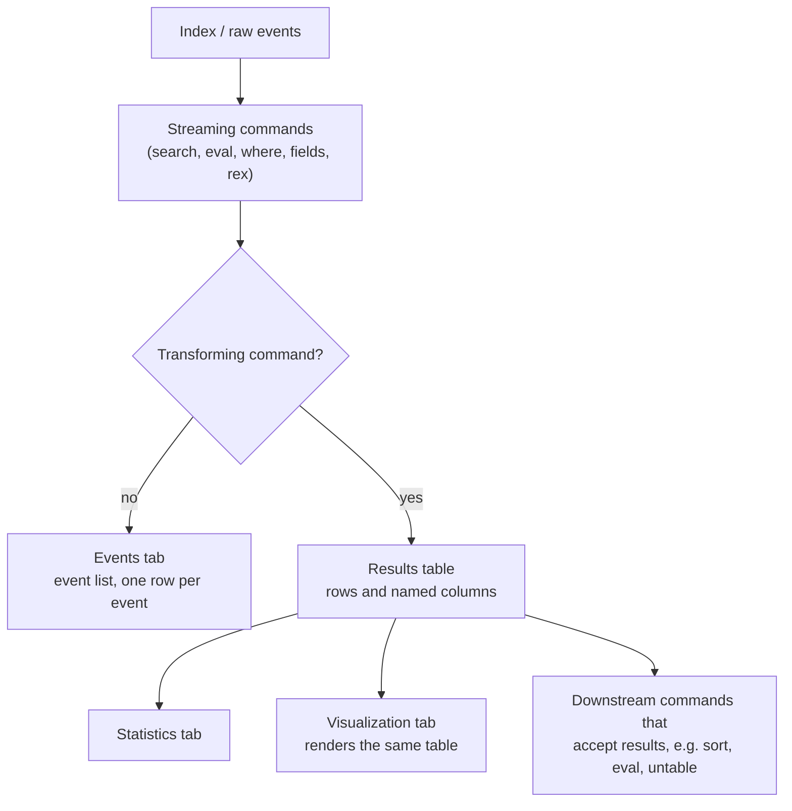
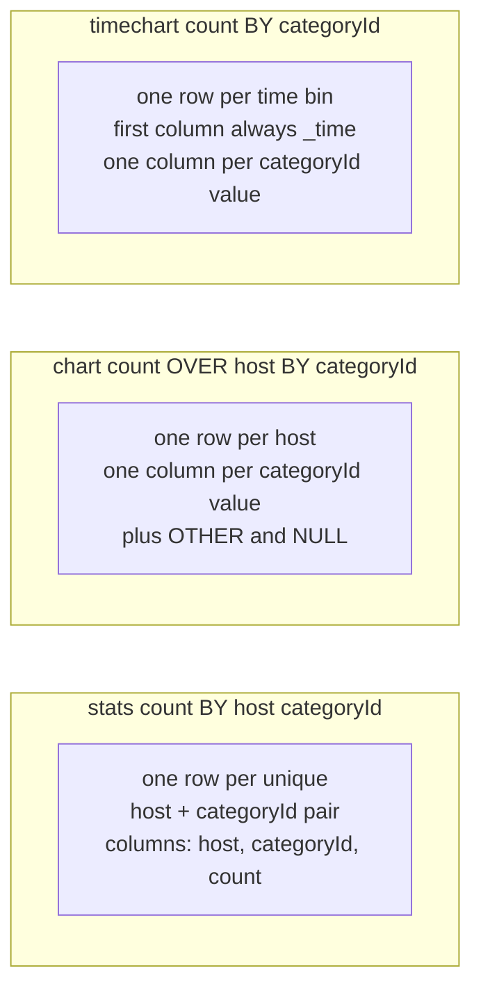

# 1.0 Using Transforming Commands for Visualizations (5%)

This section is about the four commands that turn an event stream into a statistics table (`chart`, `timechart`, `top`, `rare`), and it is weighted at 5% because the exam only needs to confirm that you can predict the shape of the output table, not that you can build a dashboard.

## Blueprint mapping

> The following topics are general guidelines for the content likely to be included on the exam; however, other related topics may also appear on any specific delivery of the exam. In order to better reflect the contents of the exam and for clarity purposes, the guidelines below may change at any time without notice.

- Section 1.0 Using Transforming Commands for Visualizations, 5% of the exam
- 1.1 Use the chart command
- 1.2 Use the timechart command

| Source | Where it covers this | Honest assessment |
| --- | --- | --- |
| Udemy, "Splunk: Zero to Power User" (Hailie Shaw), Modules 9A, 9B | `chart` and `timechart` demonstrations against the tutorial data | Good for intuition about the Statistics and Visualization tabs. Covers none of `limit`, `useother`, `usenull`, `cont`, `partial`, `fixedrange`, or `bins`, which is where the exam distractors live. |
| Udemy, Modules 14A, 14B, 15A | Reports, dashboards, and visualization formatting | Dashboard mechanics outside blueprint 1.0. Context, not preparation for this section. |
| Apress, "Splunk Certified Study Guide" (Deep Mehta, 2021), Chapter 2 | Reference tables for `chart`, `timechart`, `stats`, `top`, `rare`, `untable` | Reference tables only, four `chart` examples and two `timechart` examples, nothing on `span`, `limit`, or `useother`. The book has demonstrably wrong answer keys elsewhere, so use it for vocabulary and check every default against help.splunk.com. |

## What it is

A transforming command orders search results into a data table. The Splunk documentation states it plainly: transforming commands "transform" the specified cell values for each event into numerical values that Splunk software can use for statistical purposes, they are not streaming, and they are required to transform search result data into the data structures that are required for visualizations such as column, bar, line, area, and pie charts.

The practical consequence is the one the exam tests. A search containing a transforming command such as `stats`, `top`, or `chart` populates the Statistics tab, and it populates the Visualization tab too, whose results area holds a chart plus the statistics table used to generate that chart. The Visualization tab is a rendering of the Statistics table, so if the table has the wrong number of columns, no amount of chart formatting will fix the picture.

Transforming commands also destroy events: the docs state that transforming commands do not output events, they output results, and after you run one you cannot run a command that expects events as an input.



The transforming commands listed in the Search Reference command-types table are `addtotals` (transforming only when calculating column totals), `anomalydetection`, `append`, `associate`, `chart`, `cofilter`, `contingency`, `history`, `makecontinuous`, `mvcombine`, `rare`, `stats`, `table`, `timechart`, `top`, and `xyseries` (transforming only when `grouped=true`). The Search Manual's shorter list of "primary" transforming commands is `chart`, `timechart`, `top`, `rare`, and `stats`. Blueprint 1.0 names only `chart` and `timechart`, but questions routinely use `stats`, `top`, and `rare` as distractors.

One function library serves three of them. The Statistical and charting functions reference opens by stating that you can use these functions with the `chart`, `stats`, and `timechart` commands, which is why `count`, `sum`, `avg`, `dc`, `values`, `list`, `earliest`, and `latest` mean the same thing in all three. Those commands differ in the shape of the table they emit, not in the functions they accept. `eval` and `where` draw on a separate library of evaluation functions, so `if()` and `case()` are not aggregations. The documented exception to the three-way overlap is `sparkline`, which the same page says applies to `chart` and `stats` only.

## Syntax and options

### chart

```spl
chart [<chart-options>] [agg=<stats-agg-term>] ( <stats-agg-term> | <sparkline-agg-term> | "("<eval-expression>")" )...
      [ BY <row-split> <column-split> ] | [ OVER <row-split> ] [BY <column-split>]
      [<dedup_splitvals>]
```

The row-split field becomes the first column of the results table and the X-axis of the chart. The column-split field becomes the data series, one column per distinct value. `BY a b` and `OVER a BY b` mean the same thing: `a` is the row-split, `b` is the column-split.

Two points in that syntax line are easy to misread. First, `chart` requires an aggregation: the docs state that you must specify a statistical function when you use the `chart` command, so the argument has to be a stats-agg-term, a sparkline-agg-term, or a parenthesised eval expression. `chart sum(price) AS sales BY product_name` is valid, `chart sales BY product_name` is not. Second, `chart` does not have two BY clauses. `BY <row-split> <column-split>` is one BY clause listing two fields, and the comma is optional: the docs write `chart eval(avg(size)/max(delay)) AS ratio BY host user`, and `BY host, user` parses identically. `OVER` takes exactly one field, always the row-split, cannot follow `BY`, and appears in no command other than `chart`, so `chart count OVER a, b` and `chart count BY a OVER b` are both malformed.

| Option | Values | Default | What it does |
| --- | --- | --- | --- |
| `agg` | `agg=<stats-agg-term>` | none | Names the aggregator used for series scoring together with `limit`. Ignored if an explicit `<where-clause>` is provided. |
| `limit` | `limit=(top\|bottom) <int>` | `top 10` | Only valid when a column-split is specified. Keeps the top or bottom N series by the sum of each series. `limit=0` returns all results. With no prefix, Splunk uses top. |
| `useother` | `useother=<bool>` | `true` | Adds a series for data series not included in the graph because they did not meet the `<where-clause>` criteria. |
| `otherstr` | `otherstr=<string>` | `OTHER` | Label for the series created by `useother`. Only applies when `useother=true`. |
| `usenull` | `usenull=<bool>` | `true` | Creates a series for events that do not contain the split-by field. |
| `nullstr` | `nullstr=<string>` | `NULL` | Label for the series created by `usenull`. Only applies when `usenull=true`. |
| `cont` | `cont=<bool>` | `true` | If `true`, bins with no values display with a count of 0 or null values. If `false`, replots the X-axis so a noncontinuous sequence of bins shows up adjacently. |
| `sep` | `sep=<string>` | none stated | Builds output field names for multiple data series with a split-by field. Equivalent to `format=$AGG$<sep>$VAL$`. |
| `format` | `format=<string>` | none stated | Parameterised output field naming using `$AGG$` and `$VAL$`. Takes precedence over `sep`. |
| `bins` | `bins=<int>` | `300` | Maximum number of bins for discretizing a numeric split field. Finds the smallest bin size producing no more than N distinct bins. |
| `span` | `span=<log-span> \| span=<span-length>` | none | Explicit bin size, time-based or log-based. |
| `start` / `end` | `start=<num>`, `end=<num>` | none | Minimum and maximum extents for numerical bins. Data outside `[start, end]` is discarded. |
| `aligntime` | `aligntime=(earliest\|latest\|<time-specifier>)` | none | Aligns bin times to something other than epoch 0. Valid only for time-based discretization, ignored if `span` is in days, months, or years. |
| `dedup_splitvals` | `dedup_splitvals=<bool>` | `false` | Removes duplicate values in multivalued BY clause fields. |
| `<where-clause>` | `<single-agg> (in\|notin) (top\|bottom)<int>` or `<single-agg> (<\|>) <num>` | `sum in top10` behaviour | Series selection criteria. Overrides `limit` and `agg`. Unrelated to the `where` command. |

`bins`, `span`, `start`, `end`, and `aligntime` are the bin options; `usenull`, `useother`, `nullstr`, `otherstr` plus the bin options and the `<where-clause>` are the tc-options that attach to the column-split field.

### timechart

```spl
timechart [sep=<string>] [format=<string>] [partial=<bool>] [cont=<bool>] [limit=<chart-limit-opt>]
          [agg=<stats-agg-term>] [<bin-options>...]
          ( ( <single-agg> [BY <split-by-clause>] ) | ( <eval-expression> ) BY <split-by-clause> )
          [<dedup_splitvals>]
```

`_time` is always the X-axis. There is no `OVER` keyword because the row-split is fixed. The single optional BY field is the column-split.

| Option | Values | Default | What it does |
| --- | --- | --- | --- |
| `span` | `<log-span> \| <span-length> \| <snap-to-time>` | none (falls back to `bins=100` or the time-range default) | Explicit bin size on the time axis. Wins over `bins` when both are given. |
| `bins` | `bins=<int>` | `100` | Maximum number of time bins. Finds the smallest bin size producing no more than N distinct bins. |
| `minspan` | `minspan=<span-length>` | none | Smallest span granularity to use when inferring span from the data time range. |
| `start` / `end` | `start=<num>`, `end=<num>` | none | Minimum and maximum extents for numerical bins. |
| `aligntime` | `aligntime=(earliest\|latest\|<time-specifier>)` | none | Aligns bin times away from epoch 0. Ignored if `span` is in days, months, or years. |
| `limit` | `limit=(top\|bottom)<int>` | `top10` | Number of distinct split-by values to keep. `limit=0` uses all distinct values. Scoring is by the sum of the aggregation for a single aggregation, and by frequency of the split value when multiple aggregations are specified. Ties break lexicographically. |
| `agg` | `agg=<stats-agg-term>` | none | Aggregation used for series scoring with `limit`. Ignored when an explicit `<where-clause>` is given. |
| `useother` | `useother=<bool>` | `true` | Merges all series not included in the results table into one series. |
| `otherstr` | `otherstr=<string>` | `OTHER` | Label for the merged series when `useother=true`. |
| `usenull` | `usenull=<bool>` | `true` | Creates a series for events with no split-by field. |
| `nullstr` | `nullstr=<string>` | `NULL` | Label for that series when `usenull=true`. |
| `cont` | `cont=<bool>` | `true` | If `true`, the Search app fills in the time gaps. |
| `partial` | `partial=<bool>` | `true` | Retains partial time bins. Only the first and last bin can be partial. |
| `fixedrange` | `fixedrange=<bool>` | `true` | Enforces the earliest and latest times of the search. `fixedrange=false` lets the chart constrict or expand to the range actually covered by events. |
| `sep` | `sep=<string>` | none stated | Output field naming, equivalent to `format=$AGG$<sep>$VAL$`. |
| `format` | `format=<string>` | none stated | Output field naming with `$AGG$` and `$VAL$`. Takes precedence over `sep`. |
| `dedup_splitvals` | `dedup_splitvals=<bool>` | `false` | Removes duplicate values in multivalued split-by fields. |
| `<where-clause>` | `<single-agg> (in\|notin) (top\|bottom)<int>` or `<single-agg> (<\|>) <num>` | same as `where sum in top10` | Series selection. Overrides `limit` and `agg`. |

When no `span` is given and you use a preset from the time range picker, the default spans are: Last 15 minutes gives 10 seconds, Last 60 minutes gives 1 minute, Last 4 hours gives 5 minutes, Last 24 hours gives 30 minutes, Last 7 days gives 1 day, Last 30 days gives 1 day, Previous year gives 1 month.

`span` is the only argument that sets the size of a time bin directly, and `bins` only caps how many bins there may be. Nothing else groups events into time buckets from inside `timechart`: there is no `interval` argument in the syntax, and `duration` is a field the `transaction` command produces rather than a bin option.

### top and rare

```spl
top [<N>] [<top-options>...] <field-list> [BY <field-list>]
rare [<rare-options>...] <field-list> [BY <field-list>]
```

| Option | Applies to | Values | Default | What it does |
| --- | --- | --- | --- | --- |
| `<N>` | `top` | `<int>` | `10` | Positional count of results to return. `top 5 host` is the same as `top limit=5 host`. |
| `limit` | `top`, `rare` | `limit=<int>` | `10` | How many tuples to return. `limit=0` returns all values up to `maxresultrows`. |
| `countfield` | `top`, `rare` | `countfield=<string>` | `count` | Name of the field holding the event count. |
| `percentfield` | `top`, `rare` | `percentfield=<string>` | `percent` | Name of the field holding the percentage. |
| `showcount` | `top`, `rare` | `showcount=<bool>` | `true` | Whether the count field is created at all. |
| `showperc` | `top`, `rare` | `showperc=<bool>` | `true` | Whether the percent field is created at all. |
| `useother` | `top` only | `useother=<bool>` | `false` | Adds a row representing all values not included because of the limit cutoff. |
| `otherstr` | `top` only | `otherstr=<string>` | `OTHER` | Label for that row when `useother=true`. |

The 10.4 `rare` page lists only `countfield`, `limit`, `percentfield`, `showcount`, and `showperc` under "Rare options", while its optional-arguments summary says these "are the same as the `<top-options>` used by the `top` command". The page never mentions `useother` or `otherstr`. Treat `useother` and `otherstr` as documented for `top` only.

Both commands return a maximum of 50,000 results by default, controlled by `maxresultrows` in the `[top]` and `[rare]` stanzas of `limits.conf`.

### The shape converters

```spl
untable <x-field> <y-name-field> <y-data-field>
xyseries [grouped=<bool>] <x-field> <y-name-field> <y-data-field>... [sep=<string>] [format=<string>]
```

`untable` converts a tabular result into a `stats`-like long format and is a distributable streaming command. `xyseries` is its inverse and is a distributable streaming command unless `grouped=true`, in which case it is transforming; `grouped` defaults to `false`. The `xyseries` alias is `maketable`. On the `xyseries` page the default separator between the field name and field value is documented as `:`, producing names like `count(host):referrer_domain`.

## Result contract

`stats`, `chart`, and `timechart` all consume events and emit a results table, but the row and column geometry differs.



All three are transforming, so all three are non-streaming and all three destroy the event list.

The `stats` rule is one row per distinct combination. The docs state that if a BY clause is used, one row is returned for each distinct value specified in the BY clause; with no BY clause `stats` returns a single row for the whole result set. The BY fields survive as named columns, and `AS` renames the aggregate column only, so `stats count AS logins BY user` gives a `user` column and a `logins` column, one row per user.

`stats count BY host, productId` against the tutorial web data produces a long table (illustrative numbers, truncated):

| host | productId | count |
| --- | --- | --- |
| www1 | DB-SG-G01 | 210 |
| www1 | DC-SG-G02 | 187 |
| www2 | DB-SG-G01 | 194 |
| www2 | DC-SG-G02 | 165 |

`chart count OVER host BY productId` produces the matrix form of exactly the same numbers:

| host | DB-SG-G01 | DC-SG-G02 | ...8 more... | OTHER | NULL |
| --- | --- | --- | --- | --- | --- |
| www1 | 210 | 187 | ... | 122 | 4041 |
| www2 | 194 | 165 | ... | 118 | 3987 |

The first column is the row-split field, every other column is a distinct value of the column-split field, and the number of value columns is limited to 10 by default. The `OTHER` column exists because `useother=true` and `productId` has more than 10 distinct values. The `NULL` column exists because `usenull=true` and most web events (anything that is not a product page view or purchase) carry no `productId` at all.

`timechart span=1d count BY categoryId usenull=f` produces:

| _time | ACCESSORIES | ARCADE | SHOOTER | SIMULATION | SPORTS | STRATEGY | TEE |
| --- | --- | --- | --- | --- | --- | --- | --- |
| 2018-03-29 | 5 | 17 | 6 | 3 | 5 | 32 | 9 |
| 2018-03-30 | 62 | 63 | 39 | 30 | 22 | 127 | 56 |
| 2018-03-31 | 65 | 94 | 38 | 42 | 34 | 128 | 60 |

The first column is always `_time`. That guarantee is what makes `timechart` the only command whose output is automatically a time series, and it is why line, area, and column charts built on `timechart` always get a time axis.

`top` and `rare` add two fields to the results: `count` and `percent`. `top categoryId` yields:

| categoryId | count | percent |
| --- | --- | --- |
| STRATEGY | 806 | 30.495649 |
| ARCADE | 493 | 18.653046 |
| TEE | 367 | 13.885736 |

With a BY clause, the group-by field is added as the leading column and the tuple columns follow, for example `top 1 productName by categoryId showperc=f countfield=total` yields `categoryId`, `productName`, `total`.

Series naming when a split-by field meets more than one aggregation: `chart` and `timechart` build one column per (aggregation, split value) pair, named through `format`, or through `sep` as the shorthand `format=$AGG$<sep>$VAL$`, so `timechart avg(bytes) max(bytes) BY host` gives one column per host per function. The 10.4 `chart` and `timechart` pages state no default for `sep` or `format`; the parallel `xyseries` page documents `:`, and the chart commands follow the same convention. [verify]

Which visualization needs which shape:

| Visualization | Required result shape |
| --- | --- |
| Single value | One value. `stats` gives the aggregated total for the range; `timechart` gives the most recent result and unlocks the sparkline and trend indicator. If a search returns multiple values, the visualization uses the first cell. |
| Pie | Exactly one data series, so a two-column Statistics table: labels then numbers. Extra columns are ignored. |
| Column and bar | At least two columns. Column charts take X-axis values from the first column; bar charts take Y-axis values from the first column. |
| Line and area | At least two columns for a single series, three or more for multiple series. X-axis comes from the first column. Line charts can render a single series; area charts represent multiple series. |
| Scatter | Three columns, in the order marker name, X-axis field, Y-axis field. Use `table` to fix the column order. |
| Bubble | Four columns: row label, X-axis field, Y-axis field, bubble size field. Position carries two dimensions and bubble size the third, the only three-dimension chart here. |
| Trellis | The split field must be present in the results, and the last command in the search must be a transforming command such as `stats`, `chart`, or `timechart`. Trellis is not available for table visualizations or cluster maps. |

Off-blueprint context, worth a minute because it marks the boundary of what the table controls. Once the columns are right, how the series stack is a formatting choice made after the search: the Format menu's Stack options are Unstacked, Stacked, and Stacked 100%. There is no `stack` command in SPL, and stacking is not gated on `timechart` rather than `chart`. Trellis is different again, splitting one visualization into small multiples, one per split value.

## Worked examples

All examples use the Splunk tutorial dataset (Buttercup Games) with sourcetypes `access_combined_wcookie`, `vendor_sales`, and `secure`.

1. Simplest transforming search with an arbitrary X-axis. One row per web server, one numeric column.

```spl
sourcetype=access_combined_wcookie
| chart count OVER host
```

Two columns, so this drives a column chart, a bar chart, a line chart, or a pie chart directly.

2. Row-split plus column-split. This is the canonical `chart` shape question.

```spl
sourcetype=access_combined_wcookie status=200 action=purchase
| chart dc(clientip) OVER date_hour BY categoryId usenull=f
```

One row per hour of the day (0 to 23), one column per category. `usenull=f` suppresses the `NULL` column for purchase events carrying no `categoryId`. The tutorial data has seven categories, so the default `limit=top 10` never bites and no `OTHER` column appears.

3. Forcing the series count. The `status` field has several distinct values in the tutorial data, so this is where `limit`, `useother`, and `otherstr` become visible.

```spl
sourcetype=access_combined_wcookie
| chart count OVER host BY status limit=3 useother=t otherstr="ALL OTHER CODES"
```

Three status columns plus one column named `ALL OTHER CODES`. Change to `useother=f` and the remaining statuses vanish rather than being pooled, so the row totals no longer add up to the event count. Change to `limit=0` and every status becomes its own column.

The Statistics tab returns this. Read the shape rather than the numbers: the row-split field becomes the first column, every distinct value of the column-split field becomes a further column, and each cell is the aggregation for that intersection.

<!-- results -->

| host | 200 | 404 | 503 | ALL OTHER CODES |
| --- | --- | --- | --- | --- |
| www1 | 12,046 | 892 | 311 | 604 |
| www2 | 11,733 | 861 | 298 | 587 |
| www3 | 11,504 | 848 | 289 | 573 |

Three things to take from that table. The `host` header is the field name itself, not a label you chose, which is why `chart` output is self-describing. The column headers are data values rather than field names, which is the difference from `stats count BY host, status` where you would get one `status` column with a row per pair. And `ALL OTHER CODES` sits at the end because `useother=t` pools everything the `limit=3` cut, so the row still totals the full event count for that host.

4. Time series with a split. The `_time` guarantee plus a controlled span.

```spl
sourcetype=access_combined_wcookie action=purchase
| timechart span=1d count BY categoryId usenull=f
```

One row per calendar day, first column `_time`, one column per category. Without `span=1d`, the span comes from the time range picker preset (or from `bins=100` if the range is custom), so the same search can silently change granularity between runs.

5. Multiple aggregations with a split-by field, which is where series naming shows up.

```spl
sourcetype=access_combined_wcookie
| timechart span=1h avg(bytes) max(bytes) BY host limit=0 useother=f
```

Three hosts and two functions give six value columns plus `_time`. With more than one aggregation, `limit` scoring ranks hosts by frequency rather than by aggregate sum, which is why `limit=0` is used to keep all of them.

6. `top` and `rare` as transforming commands, and the option that changes the output schema.

```spl
sourcetype=access_combined_wcookie status=200 action=purchase
| top 5 productId BY categoryId showperc=f countfield=purchases useother=t

sourcetype=secure
| rare limit=5 user
```

The first search returns `categoryId`, `productId`, and `purchases`, with no `percent` column because `showperc=f` removed it, plus one `OTHER` row per category group. The second returns `user`, `count`, and `percent`. Note the asymmetry: `top` has a positional `<N>` argument, but the documented `rare` syntax has no positional count, so the limit has to be written `limit=5`, and `rare` has no documented `useother`, so there is no pooled row.

7. Shape conversion in both directions.

```spl
sourcetype=access_combined_wcookie status=200 action=purchase
| top categoryId
| untable categoryId calculation value
```

This turns the three-column `top` output into a long table with columns `categoryId`, `calculation` (holding the literal strings `count` and `percent`), and `value`. Reverse it with `| xyseries categoryId calculation value`. Use `untable` when a visualization or a downstream `stats` needs one row per data point, `xyseries` when `stats`-shaped output has to become `chart`-shaped for a multi-series chart.

8. Simulating a multi-series chart that `timechart` cannot produce directly.

```spl
sourcetype=access_combined_wcookie
| bin _time span=1h
| stats sum(bytes) AS total avg(bytes) AS mean BY _time, host
| eval s1="total mean"
| makemv s1
| mvexpand s1
| eval yval=case(s1=="total",total,s1=="mean",mean)
| eval series=host.":".s1
| xyseries _time, series, yval
```

The documented pattern for building a chart of multiple data series, because transforming commands provide no direct way to define multiple series. The rule of thumb from the docs is that `... | chart n by x,y` can be simulated with `... | stats n by x,y | xyseries x y n`, and for the `timechart` equivalent `x` is `_time`.

## Decision rules

| Question | Rule |
| --- | --- |
| Does the X-axis have to be time? | Yes, use `timechart`. No, use `chart`. `chart` cannot be forced to guarantee a time axis, and `timechart` cannot be pointed at any other field. |
| Do I need one row per unique combination of two fields? | `stats ... BY a b`. Never `chart`. |
| Do I need a matrix of a by b? | `chart ... OVER a BY b`, equivalently `chart ... BY a b`. |
| Which command accepts both `OVER` and `BY`? | `chart` alone. `stats` and `timechart` document a BY clause only, `xyseries` takes three positional fields, `transaction` takes a field list. |
| How many split fields may I use? | `chart` takes one row-split and one column-split. `timechart` takes one split-by field only, because `_time` already occupies the row-split. `stats` takes any number of BY fields. |
| The chart has an unexpected `OTHER` column | The split field has more than `limit` distinct values. Set `limit=0` to keep all, raise `limit`, or set `useother=f` to drop them. |
| The chart has an unexpected `NULL` column | Some events lack the split field. Set `usenull=f`. |
| I need a pie chart | Produce exactly two columns. `stats count BY field` or `chart <agg> OVER field`. A `timechart` never makes a good pie because its first column is `_time`. |
| I need a scatter chart | Produce exactly three columns in marker, X, Y order, using `table` to fix the order. |
| I need a single value with a sparkline and trend arrow | The search must end with `timechart`. A `stats` single value gets neither. |
| I need a trellis | The last command must be transforming, and the split field must be in the results. |
| I have `stats`-shaped output but need a multi-series chart | `xyseries <x> <series-name> <value>`. |
| I have `chart`-shaped output but need one row per data point | `untable <x> <name> <value>`. |
| I set both `bins` and `span` on `timechart` | `span` wins, `bins` is ignored. |
| I want per-hour rates | `per_hour()` is an aggregation only. It does not set the span. Add `span=1h` yourself. |

## Traps

**T-01-01** The `limit` default on `chart` and `timechart` limits columns, not rows. Wrong belief: `limit=10` caps the results table at ten rows. Correct fact: on `chart` the default is `top 10`, the docs say the number of columns included is limited to 10 by default, and `limit` is valid only when a column-split is specified. On `timechart` the default is `top10` distinct split-by values, and rows are governed by `span` or `bins`.

**T-01-02** `timechart` accepts only one split-by field. Wrong belief: `timechart count BY host, status` works and produces a nested chart. Correct fact: the docs state you can only use one BY clause, and `_time` is already the row-split, so the single BY field is the column-split. `chart count BY host status` is legal because `chart` has two slots.

**T-01-03** `OVER` and `BY` ordering. Wrong belief: `chart count OVER host BY status` and `chart count OVER status BY host` produce the same table. Correct fact: the field after `OVER` is the row-split, becoming the first column and the X-axis; the field after `BY` is the column-split, becoming the data series. Swapping them transposes the table, and `chart count BY host status` is identical to `chart count OVER host BY status`.

**T-01-04** `NULL` and `OTHER` come from different options. Wrong belief: `useother=f` removes the `NULL` column. Correct fact: `usenull` controls the series for events that do not contain the split-by field, labelled by `nullstr` (default `NULL`); `useother` controls the series for values excluded by the `<where-clause>` or `limit`, labelled by `otherstr` (default `OTHER`). Both default to `true` on `chart` and `timechart`.

**T-01-05** `bins` defaults are not the same across commands. Wrong belief: `bins` defaults to 100 everywhere. Correct fact: the `chart` bin options default to `bins=300`; the `timechart` bin options default to `bins=100`. Both set a maximum, not a target: Splunk finds the smallest bin size producing no more than N distinct bins, so you can get far fewer.

**T-01-06** `span` beats `bins` on `timechart`. Wrong belief: specifying both narrows the result twice, or throws an error. Correct fact: the docs say `timechart` accepts either `bins` or `span`, and if you specify both, `span` is used and `bins` is ignored.

**T-01-07** `useother` defaults differ between `top` and the chart commands. Wrong belief: `top 5 host` shows an `OTHER` row for the remaining hosts. Correct fact: `useother` defaults to `false` on `top`, so no `OTHER` row appears unless you ask for it. On `chart` and `timechart` it defaults to `true`.

**T-01-08** `rare` does not document `useother` or `otherstr`. Wrong belief: because `rare` "operates identically to `top`", every `top` option works on `rare`. Correct fact: the 10.4 `rare` page lists only `countfield`, `limit`, `percentfield`, `showcount`, and `showperc`, even though its summary line claims the options match `<top-options>`. The documentation contradicts itself here; answer from the option list.

**T-01-09** `partial` and `fixedrange` are `timechart` only. Wrong belief: `chart cont=false partial=false` is valid. Correct fact: `partial` (default `true`, retains partial first and last bins) and `fixedrange` (default `true`, enforces the search earliest and latest) exist only on `timechart`. `cont` exists on both and defaults to `true` on both.

**T-01-10** `stats BY a b` and `chart BY a b` are not interchangeable. Wrong belief: they return the same table with different formatting. Correct fact: with `stats`, each row is one unique combination of the group-by values and the group-by fields stay as columns. With `chart`, the first BY field becomes rows and the second becomes columns, so the second field's values become headers and the field name itself disappears.

**T-01-11** You cannot reuse a field as both a function argument and the split field. Wrong belief: `chart sum(A) BY A span=log2` bins field A and sums it. Correct fact: with `chart` and `timechart` you cannot specify the same field in a function and as the row-split or split-by field. The documented workaround is `eval A1=A | chart sum(A) BY A1 span=log2`.

**T-01-12** `span` placement matters when there is a split-by field. Wrong belief: `timechart count BY categoryId span=1d` sets a daily time bucket. Correct fact: the docs say to specify `bins` and `span` before the split-by field; placed after it, Splunk assumes you want to control the bins on the split-by field, not on the time axis. Write `timechart span=1d count BY categoryId`.

**T-01-13** Snap-to-time spans are restricted. Wrong belief: `span=1d@d` or `span=1mon@mon` work in `timechart`. Correct fact: the docs state you can only use week spans with the snap-to span argument in the `timechart` command, for example `span=w@w1` for weeks beginning Monday. Separately, `aligntime` is ignored when `span` is in days, months, or years.

**T-01-14** `table` is transforming but does not make every chart possible. Wrong belief: because `table` appears in the transforming commands list, `| table host status` renders any visualization. Correct fact: `table` is listed as transforming and is the right tool for a scatter chart, because it fixes column order to marker, X, Y. It aggregates nothing, so a pie chart still needs two columns from an aggregation, and the docs warn that `eval` or `fields` can change result structure so that column and bar charts cannot render.

**T-01-15** `sparkline` does not work with `timechart`. Wrong belief: `timechart sparkline(count) BY host` adds inline mini-charts. Correct fact: the docs state that sparkline is a function that applies to only the `chart` and `stats` commands. Sparkline size is capped by `sparkline_maxsize` in `limits.conf`.

**T-01-16** The `per_*` functions are `timechart` only and do not set a span. Wrong belief: `per_hour(price)` forces hourly buckets. Correct fact: `per_day()`, `per_hour()`, `per_minute()`, and `per_second()` are documented as usable with `timechart`, and the docs state they are aggregators not responsible for setting a time span. On a 30-minute span, `per_hour()` returns `sum()*2`. Hourly buckets still need `span=1h`.

**T-01-17** `limit=0` does not mean zero results. Wrong belief: `limit=0` suppresses the series entirely. Correct fact: on `chart`, `limit=0` returns all results; on `timechart`, `limit=0` means all distinct values are used and no series filtering occurs; on `top` and `rare`, `limit=0` returns all values up to `maxresultrows` (default maximum 50,000).

**T-01-18** `xyseries` is not transforming by default. Wrong belief: `xyseries` is a transforming command, so it can end a search that feeds a visualization on its own. Correct fact: `xyseries` is distributable streaming unless `grouped=true`, and `grouped` defaults to `false`. `untable` is always distributable streaming. Neither turns an event list into a statistics table; they reshape results a transforming command already produced.

**T-01-19** An explicit `<where-clause>` silently disables `limit` and `agg`. Wrong belief: you can combine `limit=5` with `WHERE count > 100` to get at most five series above the threshold. Correct fact: the docs state the `limit` and `agg` options are ignored if an explicit `<where-clause>` is provided. The default behaviour with no where-clause is equivalent to `where sum in top10`.

**T-01-20** `top` has a positional count argument and `rare` does not. Wrong belief: `rare 5 user` is the mirror image of `top 5 user`. Correct fact: the documented syntax is `top [<N>] [<top-options>...] <field-list> [<by-clause>]` but `rare [<rare-options>...] <field-list> [<by-clause>]`. Only `top` documents the leading `<N>`, and the docs note that `top limit=<int>` is the same as `top N`. Write `rare limit=5 user`.

**T-01-21** There is no such thing as two BY clauses. Wrong belief: `chart count BY vendor_action, user` works because `chart` supports two BY clauses, so `timechart count BY host, status` should work for the same reason. Correct fact: the documented syntax is one BY clause taking a row-split and a column-split, `BY <row-split> <column-split>`, comma optional. `timechart` has one BY clause too; it just accepts a single field in it, because `_time` already holds the row-split. Count fields, not clauses.

**T-01-22** `chart` and `timechart` demand a statistical function. Wrong belief: `chart sales BY product_name` reports the `sales` field split by product. Correct fact: the docs state you must specify a statistical function when you use the `chart` command, so the argument must be a stats-agg-term, a sparkline-agg-term, or a parenthesised eval expression. The working form is `chart sum(price) AS sales BY product_name`. Bare field names belong to `table` and `fields`, which aggregate nothing.

**T-01-23** `OVER` belongs to `chart` and nothing else. Wrong belief: `stats sum(price) AS sales OVER product_name` is the `stats` way of naming an X-axis. Correct fact: the `stats` syntax offers only `BY <field-list>`. `timechart` has no `OVER` because `_time` is its fixed row-split, `xyseries` takes three positional fields, and `transaction` takes a field list. `OVER` on any other command is wrong on syntax alone.

**T-01-24** `span` is the only time-bucketing argument on `timechart`. Wrong belief: an `interval` or `duration` argument sets the bin size. Correct fact: the documented bin options are `span`, `bins`, `minspan`, `start`, `end`, and `aligntime`. `span` sets the bin size, `bins` caps the bin count, and no `interval` argument exists. `duration` is a field the `transaction` command outputs, which is what makes it plausible.

## Lab

Fifteen minutes on a single-node Splunk Enterprise 10.x instance with the tutorial data loaded.

1. Open Splunk Web. From the Splunk bar select **Apps**, then **Search & Reporting**. In the app navigation bar click **Search**. Set the time range picker to **All time**.

2. Run the baseline and click the **Statistics** tab. Count the columns: `host` plus one per category, and note whether `OTHER` or `NULL` appeared.

```spl
sourcetype=access_combined_wcookie status=200 action=purchase
| chart count OVER host BY categoryId
```

3. Re-run with `limit=3` appended: three category columns plus `OTHER`. Append `useother=f` as well and re-run: `OTHER` disappears and the row totals drop. Then swap the two fields to `chart count OVER categoryId BY host` and confirm the table transposes.

4. Render a pie chart. Run the two-column search below, click the **Visualization** tab, use the **Visualization Picker** to select **Pie**, and set a minimum size from the **Format** menu. Then change the search to `| chart count OVER host BY categoryId` and click **Visualization** again: the pie ignores every column past the second.

```spl
sourcetype=access_combined_wcookie status=200 action=purchase
| stats count BY categoryId
```

5. Watch the span default move. Run the search below on **Last 24 hours**, then on **Last 7 days**, without changing the SPL, and compare the `_time` granularity. Pin it with `timechart span=1h` and confirm it stops moving.

```spl
sourcetype=access_combined_wcookie action=purchase
| timechart count BY categoryId usenull=f
```

6. Single value. Run `sourcetype=access_combined_wcookie action=purchase | timechart span=1h count`, click **Visualization**, pick **Single Value**, and confirm the sparkline and trend arrow appear. Replace `timechart span=1h count` with `stats count` and confirm both disappear.

7. Trellis. With the step 5 search loaded, on the **Visualization** tab open the **Trellis** menu, switch **Use Trellis** on, and split by `categoryId`.

Verification search that proves the shapes are what you think they are:

```spl
sourcetype=access_combined_wcookie status=200 action=purchase
| chart count OVER host BY categoryId limit=2
| untable host series value
| stats sum(value) AS total BY series
```

If `useother` is still at its default of `true`, the `series` column will contain your two category names plus `OTHER`, and `total` summed across all series will equal the total purchase count. That single result table proves the column limit, the `OTHER` pooling, and the `untable` conversion in one go.

## Self-check

1. A search ends with `chart count OVER host BY status`. There are 14 distinct `status` values and some events have no `status`. How many columns does the Statistics table have, assuming all defaults?

    A. 15
    B. 12
    C. 13
    D. 16

2. Which command produces a results table whose first column is guaranteed to be `_time`?

    A. `chart`
    B. `stats`
    C. `timechart`
    D. `top`

3. `... | timechart bins=50 span=1h count` is run over a 24-hour range. What happens?

    A. An error, because `bins` and `span` conflict
    B. 50 bins are produced
    C. 24 bins are produced, `bins` is ignored
    D. 50 bins of 1 hour each, truncating the range

4. You need a pie chart of purchases by product category. Which search gives the correct data structure?

    A. `sourcetype=access_combined_wcookie action=purchase | chart count OVER date_hour BY categoryId`
    B. `sourcetype=access_combined_wcookie action=purchase | stats count BY categoryId`
    C. `sourcetype=access_combined_wcookie action=purchase | timechart count BY categoryId`
    D. `sourcetype=access_combined_wcookie action=purchase | table categoryId productId price`

5. Which statement about `top` is correct?

    A. `top` adds `count` and `percent` fields and `useother` defaults to `true`
    B. `top` adds `count` and `percent` fields and `useother` defaults to `false`
    C. `top` adds only a `count` field; `percent` requires `showperc=t`
    D. `top limit=0` returns no rows

6. `... | chart avg(bytes) OVER host BY useragent` returns a column named `OTHER`. Which change removes that column while keeping every other column intact?

    A. `usenull=f`
    B. `otherstr=""`
    C. `useother=f`
    D. `limit=0`

7. A search ends with `stats count BY _time, host`, producing three columns. You need one column per host so a line chart shows one line per host. Which command reshapes the results?

    A. `untable _time host count`
    B. `xyseries _time host count`
    C. `transpose`
    D. `mvcombine host`

8. Which of these is NOT a valid reason a search fails to populate the Visualization tab?

    A. The search returns events because it contains no transforming command
    B. The search ends with `fields` after a transforming command, changing the result structure
    C. The search uses `chart` with `usenull=f`
    D. The search ends with `table` listing only non-numeric fields

9. What does this search return?

    ```spl
    sourcetype=access_combined_wcookie
    | timechart span=1h avg(bytes) BY host limit=3 WHERE avg(bytes) > 2000
    ```

    A. At most three host series, each with an hourly average above 2000
    B. One series for every host whose `avg(bytes)` exceeds 2000, with `limit=3` ignored
    C. An error, because `limit` and a `WHERE` clause cannot both be specified
    D. The three hosts with the highest averages, with the rest merged into `OTHER`

10. Which statement about the functions available to `chart`, `stats`, and `timechart` is correct?

    A. All three accept the same statistical and charting functions, except that `sparkline` applies to `chart` and `stats` only
    B. `stats` and `eval` share one function library, so `if()` can be used as a `stats` aggregation
    C. `timechart` accepts `sparkline` because it already has a time axis to draw the mini-chart on
    D. `per_hour()` is available to `chart` and `stats` as well as to `timechart`

<details><summary>Answers</summary>

1. **A. 15.** One column for the row-split field `host`, plus columns for the column-split values. `limit` defaults to `top 10`, so ten `status` columns survive. `useother` defaults to `true`, adding an `OTHER` column for the remaining four values. `usenull` defaults to `true`, adding a `NULL` column for events with no `status`. That is 1 + 10 + 1 + 1 = 15. B and C are wrong for the same reason: each drops one or both of the `OTHER` and `NULL` columns. D is wrong because it assumes all 14 value columns survive the default `limit`.

2. **C. `timechart`.** The command is defined as a statistical aggregation applied to a field to produce a chart with time used as the X-axis, and it has no `OVER` keyword because the row-split is fixed to `_time`. The column is named `_time`, with the leading underscore; `time` and `date` are not fields Splunk creates. A is wrong because `chart` produces a table with an arbitrary field as the X-axis; it can be pointed at `_time` with `chart count BY _time span=12h`, but that is a choice, not a guarantee. B is wrong because `stats` only has `_time` as a column if you group by it. D is wrong because `top` returns the field, `count`, and `percent`, with no time column.

3. **C. 24 bins are produced, `bins` is ignored.** The docs state `timechart` accepts either `bins` or `span`, and if both are specified `span` is used and `bins` is ignored. A is wrong because the combination is legal, not an error. B is wrong because `bins` loses. D is wrong because `span` does not truncate the search range; `fixedrange=true` keeps the full range.

4. **B.** A pie chart needs a single data series, which means a two-column Statistics table: labels then numbers. `stats count BY categoryId` produces exactly `categoryId` and `count`. A is wrong because `chart ... OVER date_hour BY categoryId` gives one row per hour and one column per category, so the extra columns are ignored and the pie shows only the first category. C is wrong for the same reason, with `_time` as the label column. D is wrong because `table` aggregates nothing, so there is no measure to size the slices by, and it produces three columns.

5. **B.** The docs state that `top` adds `count` and `percent` to the results, and that `useother` defaults to `false`. A is wrong on the `useother` default; `true` is the default for `chart` and `timechart`, not `top`. C is wrong because `showperc` defaults to `true`, so `percent` appears unless you suppress it. D is wrong because `limit=0` returns all values up to `maxresultrows`, not zero rows.

6. **C. `useother=f`.** `useother` controls whether a series is added for values excluded by the limit or where-clause, and `otherstr` only labels it. A is wrong because `usenull` controls the `NULL` series for events missing the split field, a different column. B is wrong because `otherstr` renames the column rather than removing it. D is wrong because `limit=0` gives every distinct `useragent` its own column, removing the pooling but adding many columns rather than keeping the rest intact.

7. **B. `xyseries _time host count`.** `xyseries` takes `<x-field> <y-name-field> <y-data-field>`, so `_time` is the X-axis, the values of `host` become the column headers, and `count` supplies the cell values. The documented equivalence is that `... | stats n by x,y | xyseries x y n` simulates `... | chart n by x,y`. A is wrong because `untable` converts in the opposite direction, flattening a matrix into long form, and this input is already long. C is wrong because `transpose` swaps the whole table's rows and columns, so `_time` would stop being a column and the result would not be a time series. D is wrong because `mvcombine` merges results that differ only in one field into a multivalue result; it creates no columns.

8. **C.** `usenull=f` only suppresses the `NULL` series. The search still ends in a transforming command, so the Statistics and Visualization tabs still populate. A is wrong because it is a valid reason: the Statistics tab populates only for searches with transforming commands. B is wrong because it is a valid reason: the docs warn that using `eval` or `fields` can change search result structure so that charts cannot render. D is wrong because it is a valid reason: a table of non-numeric fields has no valid Y-axis values.

9. **B.** The docs state that `limit` and `agg` are ignored when an explicit `<where-clause>` is provided, so the series set is decided entirely by `avg(bytes) > 2000` and the number of surviving hosts is whatever the data gives. A is wrong because it applies both filters; once the where-clause is present, `limit=3` has no effect. C is wrong because the combination is legal: the where-clause is part of the split-by clause and sits after the split field, exactly where `limit` sits. D is wrong on the selection step: failing series are pooled into `OTHER` because `useother` defaults to `true`, but the excluded set is the hosts below 2000, not the hosts outside a top three that is never computed.

10. **A.** The statistical and charting functions reference opens by naming `chart`, `stats`, and `timechart` as the commands these functions work with, and the same page calls out `sparkline` as applying to `chart` and `stats` only. B is wrong because evaluation functions are a separate library belonging to `eval` and `where`; `if()` returns one value per event and is not an aggregator. C is wrong because it reverses the restriction: `timechart` is the one command of the three that cannot take `sparkline`. D is wrong because the `per_*` functions are documented as usable with `timechart`, and they set no span either, so `per_hour()` on a 30-minute span returns `sum()*2`.

</details>

## Docs

Read in this order.

1. [Types of commands (Search Manual 10.4)](https://help.splunk.com/en/splunk-enterprise/search/search-manual/10.4/search-overview/types-of-commands) - the Transforming section, for the definition and the "do not output events" statement. 10 minutes.
2. [About transforming commands and searches (Search Manual 10.4)](https://help.splunk.com/en/splunk-enterprise/search/search-manual/10.4/create-statistical-tables-and-chart-visualizations/about-transforming-commands-and-searches) - the five primary transforming commands and why visualizations need statistical tables. 5 min.
3. [chart (Search Reference 10.4)](https://help.splunk.com/en/splunk-enterprise/search/spl-search-reference/10.4/search-commands/chart) - every option default, then the Usage sections "X-axis" and "Using row-split and column-split fields". 25 min.
4. [timechart (Search Reference 10.4)](https://help.splunk.com/en/splunk-enterprise/search/spl-search-reference/10.4/search-commands/timechart) - option defaults, the "bins and span arguments" note, the default time span table, and the "Split-by fields" placement note. 25 min.
5. [stats (Search Reference 10.4)](https://help.splunk.com/en/splunk-enterprise/search/spl-search-reference/10.4/search-commands/stats) - the BY-clause behaviour only, to fix the contrast with `chart`. 10 min.
6. [top (Search Reference 10.4)](https://help.splunk.com/en/splunk-enterprise/search/spl-search-reference/10.4/search-commands/top) - the seven options and their defaults, especially `useother=false`. 10 min.
7. [rare (Search Reference 10.4)](https://help.splunk.com/en/splunk-enterprise/search/spl-search-reference/10.4/search-commands/rare) - confirm which options are documented. 5 min.
8. [Data structure requirements for visualizations (Simple XML Dashboards 10.4)](https://help.splunk.com/en/splunk-enterprise/create-dashboards-and-reports/simple-xml-dashboards/10.4/get-started-with-visualizations/data-structure-requirements-for-visualizations) - visualization type to required table shape. 5 min.
9. [Pie chart (Simple XML Dashboards 10.4)](https://help.splunk.com/en/splunk-enterprise/create-dashboards-and-reports/simple-xml-dashboards/10.4/charts/pie-chart) - the two-column rule and the extra-columns-are-ignored rule. 5 min.
10. [Column and bar charts (Simple XML Dashboards 10.4)](https://help.splunk.com/en/splunk-enterprise/create-dashboards-and-reports/simple-xml-dashboards/10.4/charts/column-and-bar-charts) and [Line and area charts](https://help.splunk.com/en/splunk-enterprise/create-dashboards-and-reports/simple-xml-dashboards/10.4/charts/line-and-area-charts) - which axis the first Statistics column feeds, single versus multiple series. 8 min.
11. [Scatter chart (Simple XML Dashboards 10.4)](https://help.splunk.com/en/splunk-enterprise/create-dashboards-and-reports/simple-xml-dashboards/10.4/charts/scatter-chart) - the marker, X, Y ordering. Then skim [Bubble chart](https://help.splunk.com/en/splunk-enterprise/create-dashboards-and-reports/simple-xml-dashboards/10.4/charts/bubble-chart) for the four-column, three-dimension contrast. 5 min.
12. [Generate a single value (Simple XML Dashboards 10.4)](https://help.splunk.com/en/splunk-enterprise/create-dashboards-and-reports/simple-xml-dashboards/10.4/single-value/generate-a-single-value) - why sparkline and trend indicator need `timechart`. 5 min.
13. [Use trellis layout to split visualizations (Simple XML Dashboards 10.4)](https://help.splunk.com/en/splunk-enterprise/create-dashboards-and-reports/simple-xml-dashboards/10.4/trellis-layout-for-visualizations/use-trellis-layout-to-split-visualizations) - the requirement that the last command be transforming. 5 min.
14. [untable (Search Reference 10.4)](https://help.splunk.com/en/splunk-enterprise/search/spl-search-reference/10.4/search-commands/untable) and [xyseries (Search Reference 10.4)](https://help.splunk.com/en/splunk-enterprise/search/spl-search-reference/10.4/search-commands/xyseries) - the two shape converters and their command types. 10 min.
15. [Build a chart of multiple data series (Search Manual 10.4)](https://help.splunk.com/en/splunk-enterprise/search/search-manual/10.4/create-statistical-tables-and-chart-visualizations/build-a-chart-of-multiple-data-series) - the `stats` plus `xyseries` pattern and the `chart n by x,y` equivalence. 10 min.
16. [Command types (Search Reference 10.4)](https://help.splunk.com/en/splunk-enterprise/search/spl-search-reference/10.4/quick-reference/command-types) - the full transforming commands table, for the `table`, `addtotals`, and `xyseries` edge cases. 5 min.
17. [Statistical and charting functions (Search Reference 10.4)](https://help.splunk.com/en/splunk-enterprise/search/spl-search-reference/10.4/statistical-and-charting-functions/statistical-and-charting-functions) - the opening paragraph only: these functions serve `chart`, `stats`, and `timechart`, with `sparkline` the exception. 5 min.
