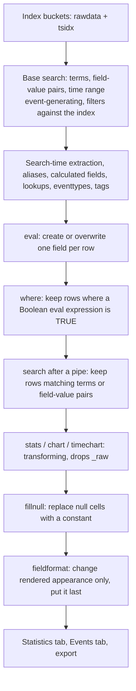

# 2.0 Filtering and Formatting Results (10%)

Section 2.0 is the SPL-mechanics core of the Power User exam: create a field with `eval`, cut a result set down with `search` or `where`, and patch the holes sparse data leaves with `fillnull`. The 10% weight goes almost entirely on knowing which of those three to reach for when a question describes a filtering problem in English.

## Blueprint mapping

Official section: 2.0 Filtering and Formatting Results, 10%.

Sub-objectives, verbatim from the official blueprint:

- 2.1 The eval command
- 2.2 Use the search and where commands to filter results
- 2.3 The fillnull command

> The following topics are general guidelines for the content likely to be included on the exam; however, other related topics may also appear on any specific delivery of the exam. In order to better reflect the contents of the exam and for clarity purposes, the guidelines below may change at any time without notice.

| Sub-objective | Udemy (Hailie Shaw, "Splunk: Zero to Power User") | Apress (Deep Mehta, 2021) | Where the secondary sources fail |
| --- | --- | --- | --- |
| 2.1 eval | Modules 11A, 11B | Chapter 2, eval function tables | Apress Table 2-16 describes `coalesce` as if it were `if()` and `null()` as if it were `nullif()`. Both wrong. Udemy is demo-heavy and never enumerates signatures. |
| 2.2 search and where | Modules 8A, 8B | Chapter 2 (`where`, plus `dedup`, `head`, `tail`) | Apress mixes in commands that are not on the 2.0 blueprint and contradicts itself on field-value case sensitivity. |
| 2.3 fillnull | No dedicated module | Absent from the book entirely | `fillnull` and `fieldformat` are both missing from Apress. This file is the only source. |

`fieldformat` and `filldown` are not named in the blueprint but sit directly adjacent to `eval` and `fillnull`, so question writers use them as distractors. Both are covered here.

## What it is

Everything in section 2.0 happens at search time, after events are retrieved and after search-time field extraction. Nothing here changes what is stored on disk.

The base search, the terms before the first pipe, is the only part that filters against the index itself: it is event-generating and decides which buckets and raw events are read at all. Every `search`, `where`, `eval`, `fillnull`, `fieldformat`, and `filldown` after the first pipe works on results already read off disk. Hence the performance argument for this section: a filter moved earlier prunes disk reads, a filter left later prunes only rows in memory.



Three different questions: `eval` answers "what value should this row carry", `search` and `where` answer "should this row survive", `fillnull` answers "what should an empty cell say". `fieldformat` answers "how should this look on screen without changing what it is".

## Syntax and options

### eval

```spl
eval <field>=<expression>["," <field>=<expression>]...
```

Four kinds of work go through this one command: calculations with the arithmetic operators, type conversion with `tonumber` and `tostring`, display formatting with the `tostring` formats and `strftime`, and conditional logic with `if`, `case`, `validate`, and `coalesce`. It cannot assign a Boolean, and it cannot remove a field, which is the job of `fields -`. The nearest it gets is assigning `null()`, which clears a value, and a field left null on every row falls out of the results.

| Option | Values | Default | What it does |
| --- | --- | --- | --- |
| `<field>` | Destination field name, bare or single-quoted | none (required) | Receives the result. Overwrites the field if it exists, creates and appends a new column if it does not. |
| `<expression>` | Values, variables, operators, evaluation functions | none (required) | Evaluated per row. Case sensitive. Syntax is checked before the search runs; an invalid expression throws an exception rather than returning zero results. |
| Comma between assignments | `,` | none | Chains assignments in one command, processed left to right, so a later assignment can reference a field an earlier one created. |
| Single quotation marks | `'server-1'`, `'Last.Name'`, `'Account ID'` | none | Required when a field name contains a non-alphanumeric character other than underscore, starts with a numeral, or contains a space. |
| Double quotation marks | `"server-"` | none | Required for literal strings. An unquoted bare word is read as a field name. |
| Curly braces on the left | `{aName}=aValue` | none | Dynamic field-name creation: the value of `aName` becomes the new field's name. Unbounded recursion errors out and the search does not complete. |

Operators shared by `eval` and `where`: arithmetic `+ - * / %`, concatenation `.`, Boolean `AND OR NOT XOR < > <= >= != = == LIKE`. `+` adds two numbers or concatenates two strings; the other arithmetic operators need two numbers. The period concatenates strings and numbers, reading both as strings. `=` and `==` are synonyms; convention reserves `=` for assignment and `==` for comparison. `LIKE` takes two strings, `%` matching many characters and `_` matching exactly one, so `field LIKE "a%b_"` matches `a`, anything, `b`, then exactly one character.

Numeric behaviour: values are double-precision floating point, division by zero yields a null field, NaN renders as `"nan"`, infinities as `"inf"` and `"-inf"`. Results are rounded to the precision of the least-precise input unless you use `exact()`; `sigfig()` sets significant digits. Precision limit is 17 significant digits, range -2^53+1 to 2^53-1.

### Evaluation functions

All functions below work with `eval`, `fieldformat`, and `where`, and inside eval expressions in other commands, except where noted.

Comparison and conditional:

| Signature | Returns |
| --- | --- |
| `case(<condition>,<value>,...)` | Value paired with the first TRUE condition. NULL if none is TRUE. |
| `cidrmatch(<cidr>,<ip>)` | TRUE if `<ip>` is in the subnet. Subnet first. Both args are strings; literals need double quotes. IPv4 and IPv6. |
| `coalesce(<values>)` | The first argument that is not NULL. One or more args. No condition, no branches. |
| `false()` | FALSE. No arguments. |
| `if(<predicate>,<true_value>,<false_value>)` | Second arg when the predicate is TRUE, third otherwise. Exactly three args. |
| `in(<field>,<list>)` | TRUE if the field matches one listed value. Quoted values, no wildcards. Under `eval` it must sit inside `case`, `if`, or `validate`. |
| `like(<str>,<pattern>)` | TRUE on a case-sensitive match. `%` many characters, `_` one. Pattern is a double-quoted string. |
| `lookup("<table>",json_object(...),json_array(...))` | Output fields as a JSON object. Splunk Enterprise only, CSV lookups only. A quoted string not ending `.csv` is treated as a globally shared lookup definition. |
| `match(<str>,<regex>)` | TRUE if the regex matches any substring. Anchor with `^` and `$` for a full match. |
| `null()` | NULL. No arguments. Assigning it clears a field value. |
| `nullif(<field1>,<field2>)` | NULL when the two values are equal, otherwise the value of `<field1>`. |
| `searchmatch(<search_str>)` | TRUE if the event matches the search string. Under `eval` it must sit inside `if`. Literal search strings only, not saved-search names. |
| `true()` | TRUE. No arguments. The standard `case` default. |
| `validate(<condition>,<value>,...)` | Value paired with the first FALSE condition. NULL if all are TRUE. Documented as the opposite of `case`. |

Conversion: `ipmask(<mask>,<ip>)`, `printf(<format>,<arguments>)`, `toarray(<value>)`, `tobool(<value>)`, `todouble(<value>,<base>)`, `toint(<value>,<base>)`, `tomv(<value>)`, `tonumber(<str>,<base>)`, `toobject(<value>)`, `tostring(<value>,<format>)`.

| Function | Optional arg | Default | Behaviour |
| --- | --- | --- | --- |
| `tonumber` | `<base>` | 10 | Base 2 to 36 inclusive. A string with a period becomes a double, otherwise an integer. Leading or trailing spaces return NULL; unparseable text such as `tonumber("seven")` raises an error. |
| `tostring` | `<format>` | none | Exactly four formats: `"binary"` (`tostring(9,"binary")` returns `1001`), `"hex"`, `"commas"` (rounds to two decimal places when the number has a decimal), `"duration"` (seconds to `HH:MM:SS`). Only integers from 0 to 2^53-1 are accepted as input to the format, so `tostring("5","binary")` is not supported. Booleans become the strings `True` and `False`. The docs warn that values converted under `eval` "might not sort as expected because they are converted to ASCII" and point at `fieldformat` instead. |
| `toint` / `todouble` | `<base>` | 10 | Base 2 to 36. `toint` floors a double rather than rounding. |
| `printf` | precision | 6 for `%a %A %e %E %f %F` | `%C`, `%n`, `%S`, and `%<num>$` are unsupported. |

Text: `len(<str>)` (alias `length`), `lower(<str>)`, `ltrim(<str>,<trim_chars>)`, `replace(<str>,<regex>,<replacement>)`, `rtrim(<str>,<trim_chars>)`, `spath(<value>,<path>)`, `substr(<str>,<start>,<length>)`, `trim(<str>,<trim_chars>)`, `upper(<str>)`, `urldecode(<url>)`. Defaults: `ltrim`, `rtrim`, and `trim` strip spaces and tabs when `<trim_chars>` is omitted; `substr` returns the rest of the string when `<length>` is omitted and indexes from 1 with negative indexes counting from the end; `len` counts UTF-8 code points; `replace` is PCRE and replaces every occurrence, with `\1` and `\2` for capture groups. Only `lower` and `upper` support multivalue fields.

Multivalue: `commands(<value>)`, `mvappend(<values>)`, `mvcount(<mv>)`, `mvdedup(<mv>)`, `mvfilter(<predicate>)`, `mvfind(<mv>,<regex>)`, `mvindex(<mv>,<start>,<end>)`, `mvjoin(<mv>,<delim>)`, `mvmap(<mv>,<expression>)`, `mvrange(<start>,<end>,<step>)`, `mvreverse(<value>)`, `mvsort(<mv>)`, `mvzip(<mv_left>,<mv_right>,<delim>)`, `mv_to_json_array(<field>,<infer_types>)`, `split(<str>,<delim>)`.

| Function | Optional arg | Default | Behaviour |
| --- | --- | --- | --- |
| `mvindex` | `<end>` | none, returns the single value at `<start>` | Indexes from 0, `-1` is the last value, out-of-range returns NULL. |
| `mvzip` | `<delim>` | `,` | Pairs first with first, second with second. |
| `mvrange` | `<step>` | none | `<end>` is excluded. A timespan step such as `"7d"` makes start and end UNIX times. |
| `mvcount` | none | none | Number of values, `1` for a single value, NULL when the field has no values. |
| `mvfilter` | none | none | The predicate may reference only one field. NULLs survive unless you add `isnotnull()`. |
| `mv_to_json_array` | `<infer_types>` | `false` | `true()` strips one layer of quoting and infers JSON types. |
| `split` | none | none | Returns a multivalue field. `""` splits into one value per character. In 10.4 this is catalogued under multivalue functions, not text functions. |

Date and time: `now()`, `relative_time(<time>,<specifier>)`, `strftime(<time>,<format>)`, `strptime(<str>,<format>)`, `time()`. `now()` returns the time the search started (or the scheduled run time for a scheduled search) in UNIX seconds, and is constant across the result set. `time()` returns wall-clock UNIX time with microsecond resolution and differs per row, because it is evaluated as each result passes through. `strftime()` needs UNIX seconds, so millisecond or nanosecond inputs must be divided down first. `strptime()` parses a string into UNIX seconds, requires a day component, requires a date of 1 January 1971 or later, and does nothing if pointed at `_time`, which is already UNIX time.

Informational: `isarray`, `isbool`, `isdouble`, `isint`, `ismv`, `isnotnull`, `isnull`, `isnum`, `isobject`, `isstr`, all taking one value, plus `typeof(<value>)`. Every `is*` function returns a Boolean, so `where` can use them directly but `eval` must wrap them in `if`, `case`, or `validate`. `typeof()` returns a string (`Number`, `String`, `Bool`, or `Invalid`), so `eval` can assign it directly.

Mathematical: `abs(<num>)`, `ceiling(<num>)` (alias `ceil`), `exact(<expression>)`, `exp(<num>)`, `floor(<num>)`, `ln(<num>)`, `log(<num>,<base>)`, `pi()`, `pow(<num>,<exp>)`, `round(<num>,<precision>)`, `sigfig(<num>)`, `sqrt(<num>)`, `sum(<num>,...)`. `log()` defaults to base 10, `round()` defaults to an integer and rejects a negative precision, `pi()` returns 11 digits.

### where

```spl
where <eval-expression>
```

| Option | Values | Default | What it does |
| --- | --- | --- | --- |
| `<eval-expression>` | Mathematical, concatenation, comparison, Boolean, or function call | none (required) | Keeps only results for which the expression returns TRUE. Case sensitive. Invalid syntax throws an exception before the search runs. |

No other arguments. Quoting is identical to `eval`: unquoted bare word is a field name, double-quoted token is a literal string, single quotation marks for field names starting with a numeral or containing non-alphanumeric characters. The only wildcard mechanism is `like()` or the `LIKE` operator with `%` and `_`.

### search

```spl
search <logical-expression>
```

| Option | Values | Default | What it does |
| --- | --- | --- | --- |
| `<comparison-expression>` | `<field><op><value>` with `=` `!=` `<` `<=` `>` `>=`, or `<field> IN (<value-list>)` | none | `=` and `!=` compare string values, so `"1"` does not match `"1.0"`. `< <= > >=` compare numbers numerically and everything else lexicographically. |
| `<index-expression>` | Quoted phrase, bare term, or search modifier | none | Bare terms and quoted phrases match against `_raw`. |
| `<search-modifier>` | `sourcetype=`, `host=`, `hosttag=`, `source=`, `savedsearch=` (or `savedsplunk=`), `eventtype=`, `eventtypetag=`, `splunk_server=` | none | `splunk_server=local` means the search head. Tags use `tag::<field>=<string>`. |
| `IN` operator | `field IN (v1, v2, ...)` | none | Available with `search` and `tstats`. Accepts the `*` wildcard in the value list, unlike the `in()` function. Combines with `NOT`. |
| `timeformat` | strftime format string | `%m/%d/%Y:%H:%M:%S` | Format of the `starttime` and `endtime` terms. |
| `<time-modifier>` | `starttime=`, `endtime=`, `earliest=`, `latest=` | none | `starttime` and `endtime` must match `timeformat`. |
| `TERM(<term>)` | One indexed term | none | Matches a whole term in the index, ignoring minor breakers such as periods. Does not work for terms not bounded by major breakers. |
| `CASE(<term>)` | A term or field value | none | Forces a case-sensitive match. Searches are case-insensitive by default. |

The implied `search` at the start of every search is event-generating. After a pipe it is distributable streaming, and the terms it can use depend on what reached it: with `_raw` present you can use bare keywords, but transforming commands such as `stats` and `chart` do not pass `_raw` down, so only field-value pairs on surviving fields work.

### fillnull

```spl
fillnull [value=<string>] [<field-list>]
```

| Option | Values | Default | What it does |
| --- | --- | --- | --- |
| `value` | `value=<string>` | `0` | The string written into each null cell the command touches. |
| `<field-list>` | Space-delimited field names | none, meaning all fields | Restricts the fill. A named field that does not exist is created and filled. No wildcards. |

Both arguments are optional, so bare `fillnull` is legal and fills every field with `0`. With a field list it is distributable streaming; with no field list it is a dataset processing command, because it must see the whole result set to know which columns exist. Splunk cannot distinguish a null value from a field absent from the schema, and a field is only in the schema if it has at least one non-null value somewhere in the result set.

### filldown

```spl
filldown <wc-field-list>
```

| Option | Values | Default | What it does |
| --- | --- | --- | --- |
| `<wc-field-list>` | Space-delimited field names, `*` wildcards allowed, for example `score*` | none, meaning all fields | Replaces each null with the last non-null value seen above it in that field. Leaves the cell NULL when there is no previous value. |

### fieldformat

```spl
fieldformat <field>=<eval-expression>
```

| Option | Values | Default | What it does |
| --- | --- | --- | --- |
| `<field>` | Name of a new or existing field, not wildcarded | none (required) | Receives the rendered output. |
| `<eval-expression>` | Any eval expression | none (required) | Exactly one per command. Formatting several fields takes several `fieldformat` commands. |

Distributable streaming, appearance only. Later commands see the original value, so place `fieldformat` as late as possible. It does not apply to export commands such as `outputcsv` and `outputlookup`, which write the underlying data.

## Result contract

| Command | Streaming class | Rows | Columns |
| --- | --- | --- | --- |
| `eval` | Distributable streaming | Unchanged, one to one | Adds one column per assignment or overwrites an existing one. Never removes a column. |
| `where` | Distributable streaming | Subset | Unchanged. Never adds, removes, or renames a field. |
| `search` after a pipe | Distributable streaming | Subset | Unchanged. |
| `fillnull` | Distributable streaming with a field list, dataset processing without | Unchanged | Unchanged, unless a named field did not exist, in which case one column is added. |
| `filldown` | Not listed in the command-types tables | Unchanged | Unchanged. |
| `fieldformat` | Distributable streaming | Unchanged | Unchanged in count; the named column renders differently while its stored value is untouched. |

There are six command types: distributable streaming, centralized streaming, transforming, generating, orchestrating, and dataset processing. "Report generating" is not one of them. Everything in this section is distributable streaming apart from `fillnull` with no field list. The docs define the class by where the work can run: "A distributable streaming command runs on the indexer or the search head, depending on where in the search the command is invoked. Any distributable streaming command that comes after a non-streaming command in the search is processed on the search head." So `| eval` early in a pipeline spreads across the indexers, while the same `| eval` after `stats` runs on the search head alone. Position changes the machine, never the classification. Compare centralized streaming, which "only works on the search head" wherever it sits, `transaction` being the command the exam sets against `eval`.

A `fillnull` shape, starting from `| timechart count by categoryId`:

| _time | ACCESSORIES | ARCADE | SHOOTER | STRATEGY | TEE |
| --- | --- | --- | --- | --- | --- |
| 2021-03-17 | 5 | 17 | 6 | 32 | |
| 2021-03-16 | | 63 | 39 | 127 | 56 |

After `| fillnull`:

| _time | ACCESSORIES | ARCADE | SHOOTER | STRATEGY | TEE |
| --- | --- | --- | --- | --- | --- |
| 2021-03-17 | 5 | 17 | 6 | 32 | 0 |
| 2021-03-16 | 0 | 63 | 39 | 127 | 56 |

Two things the exam checks there: the fill value is `0`, not a blank and not the word `null`, and the row and column counts do not change.

Type contract for `eval`: an expression can produce a number or a string, and either can be assigned. It cannot produce a Boolean. `| eval flag = isnull(x)` fails; `| eval flag = if(isnull(x), "yes", "no")` works, and `| eval flag = tostring(isnull(x))` works and yields the strings `True` or `False`.

Storage contract for `eval`: the result goes into a field in the search results and nowhere else, never into an index, a KV Store collection, or a database. The column lives only for the length of the pipeline unless a later command such as `outputlookup` or `collect` carries it out, and it cannot be used in the base search of the next search you run, because it does not exist until the pipeline builds it. A calculated field (section 5) is what makes the same expression available before the first pipe.

## Worked examples

All examples use the Splunk tutorial dataset (Buttercup Games), sourcetypes `access_combined_wcookie`, `vendor_sales`, and `secure`.

### 1. Derive a field, then filter on it

```spl
sourcetype=access_combined_wcookie status=200 action=purchase
| eval revenue = price * quantity
| where revenue > 100
| table clientip productId price quantity revenue
```

The base search filters at the index. `eval` adds one column to every row with no change to the row count; `where` then drops rows with no change to the column set. `revenue > 100` cannot go in the base search, because `revenue` does not exist until `eval` creates it.

### 2. Categorise with case, and give it a default

```spl
sourcetype=access_combined_wcookie
| eval status_class = case(status < 300, "success",
                           status < 400, "redirect",
                           status < 500, "client error",
                           true(), "server error")
| stats count BY status_class
```

`case` tests strictly first to last and returns the value paired with the first TRUE condition, so the ordering of the ranges is doing real work. Without the `true()` pair, a status of 500 or above yields NULL and `stats count BY status_class` silently drops those rows.

### 3. coalesce versus if versus nullif on one screen

```spl
sourcetype=access_combined_wcookie OR sourcetype=vendor_sales
| eval ip         = coalesce(clientip, VendorIP, "unknown"),
       is_local   = if(cidrmatch("87.194.0.0/16", ip), "local", "remote"),
       changed_ip = nullif(ip, clientip)
| table sourcetype clientip VendorIP ip is_local changed_ip
```

`coalesce` walks its arguments and returns the first non-NULL one; it tests no condition. `if` takes exactly three arguments and branches on a Boolean. `nullif` returns NULL when its two arguments are equal and otherwise returns the first, so `changed_ip` is populated only where `ip` came from somewhere other than `clientip`. These are the three functions Apress Table 2-16 conflates.

### 4. Compare two fields, which only where can do

```spl
sourcetype=secure
| where user != src_user
| stats count BY user src_user
```

`sourcetype=secure user!=src_user` does not work: the `search` command reads `src_user` as the literal string value `src_user`. Only `where` treats an unquoted bare word on the right-hand side as a field reference.

### 5. Wildcards on both sides of the search and where line

```spl
sourcetype=access_combined_wcookie referer_domain=*buttercup*
| where like(useragent, "Mozilla%") AND NOT like(useragent, "%MSIE%")
| stats count BY referer_domain
```

The base search uses `*` because `search` supports the asterisk in field values. `where` has no asterisk wildcard, so it needs `like()` or the `LIKE` operator with `%` and `_`. `like()` matches case-sensitively, so `like(useragent, "mozilla%")` returns nothing here.

### 6. Fill the holes, then format the display

```spl
sourcetype=vendor_sales
| timechart span=1d sum(price) AS revenue BY product_name
| fillnull value=0
| fieldformat revenue = "$" . tostring(revenue, "commas")
```

`timechart` leaves a null wherever a product had no sales that day. `fillnull value=0` writes `0` into those cells. `fieldformat` renders `revenue` as `$1,234.56` on the Statistics tab while the underlying number is untouched, so a later `sort - revenue` or a CSV export still sees the number.

Swap that last line for `| eval revenue = "$" . tostring(revenue, "commas")` and the display is identical but `revenue` is now a string. `sort` auto-detects its collation, numeric for numbers, IP order for addresses, lexicographical for everything else, and lexicographical order works on the first character: the docs' example is 10, 9, 70, 100 sorting as 10, 100, 70, 9. So sort while the values are numeric and convert afterwards, or leave the number alone and let `fieldformat` do the display.

### 7. Multivalue and text functions in one eval chain

```spl
sourcetype=access_combined_wcookie
| eval path_parts = split(uri_path, "/"),
       depth      = mvcount(path_parts),
       leaf       = mvindex(path_parts, -1),
       first_char = substr(leaf, 1, 1)
| table uri_path depth leaf first_char
```

One command, four comma-separated assignments processed left to right, so each references what the previous ones created. The two index bases are the pairing the exam uses: `mvindex` counts from 0 with `-1` as the last value, `substr` counts from 1.

## Decision rules

| Situation | Command | Why |
| --- | --- | --- |
| The filter can be expressed as terms or field-value pairs on indexed data | Base search, before the first pipe | Only the base search prunes what is read off disk. |
| Field compared to a literal, later in the pipeline | `search` or `where`, either works | `\| search status=404` and `\| where status=404` return the same rows. |
| One field compared to another field | `where` | `search` reads the right-hand bare word as a literal value. |
| The predicate needs `cidrmatch`, `like`, `isnull`, `match`, `in`, or any evaluation function | `where` | `search` has no evaluation functions. |
| The predicate needs arithmetic, for example `distance/time > 100` | `where` | `search` cannot compute. |
| Wildcard match | `search` with `*`, or `where` with `like()` and `%` | Different characters, different commands. `where` has no `*`. |
| Case-sensitive value match | `where`, or `search` with `CASE()` | Plain `search` is case-insensitive on field values. |
| Exclude events, and events missing the field must survive | `NOT field="value"` | `NOT` returns everything except matches, including events with no value in that field. |
| Exclude events, and events missing the field must not survive | `field!="value"` | `!=` only returns events that have a value in the field. |
| Empty cells need a constant placeholder | `fillnull` | Default `0`. |
| Empty cells need the previous row's value | `filldown` | Fills with the last non-null value above. |
| Display differently, calculate and export unchanged | `fieldformat` | Rendering only. |
| Display differently and have it stick downstream | `eval` | Actually changes the value, including for `outputcsv` and `outputlookup`. |
| Numbers must be both ordered and shown as text | `sort` first, then `eval ... tostring()`, or keep the number and use `fieldformat` | Strings sort as ASCII, so converting before sorting reorders the rows. |
| Same expression needed across many searches | Calculated field (blueprint section 5) | Moves the expression into configuration; the field becomes directly searchable, which an in-pipeline `eval` result is not. |
| A Boolean result must land in a field | Wrap it in `if()`, `case()`, `validate()`, or `tostring()` | `eval` cannot assign a Boolean. |

Boolean precedence differs by command, and the exam knows it:

| Order | `search` command | `eval` and `where` commands |
| --- | --- | --- |
| 1 | Expressions within parentheses | Expressions within parentheses |
| 2 | NOT clauses | NOT clauses |
| 3 | OR clauses | AND clauses |
| 4 | AND clauses | OR clauses |
| 5 | XOR not supported | XOR clauses |

Operators must be capitalised: `AND`, `OR`, `NOT`, `XOR`. `AND` is implied between terms, so `web error` is `web AND error`. `NOT` applies only to the term immediately following it unless you use parentheses.

## Traps

**T-02-01** Comparing two fields in `search`. Wrong belief: `index=web clientip=ipaddress` finds events where the two fields hold the same value. Correct: the `search` command expects a field compared to a literal and reads `ipaddress` as the string `ipaddress`. Use `| where clientip=ipaddress`, and for the negative form either `| where fieldA!=fieldB` or `| where NOT fieldA=fieldB`.

**T-02-02** Boolean precedence is uniform. Wrong belief: `AND` always binds tighter than `OR`. Correct: `search` evaluates OR before AND, so `host="www1" AND status=200 OR action="addtocart"` runs as `host="www1" AND (status=200 OR action="addtocart")`. `eval` and `where` evaluate AND before OR, so the same expression under `where` runs as `(host="www1" AND status=200) OR action="addtocart"`. Different results. `search` also has no `XOR`; `eval` and `where` do.

**T-02-03** `NOT` equals `!=`. Wrong belief: `NOT status=404` and `status!=404` return the same events. Correct: `status!=404` returns only events that have a `status` field with a different value, dropping events with no `status` at all. `NOT status=404` returns everything except the matches, including events with no `status`. Corollary: `NOT field=*` returns events where the field is null or undefined, and `field!=*` never returns anything.

**T-02-04** Case sensitivity is uniform. Wrong belief: SPL is either all case sensitive or all not. Correct: for `search`, field names are case sensitive but field values are not, and searches are case-insensitive by default unless wrapped in `CASE()`. `eval` and `where` are case sensitive throughout, being eval expressions, and `like()` matches case-sensitively. Apress contradicts itself here; trust the doc split.

**T-02-05** `coalesce` is a conditional. Wrong belief, and the exact Apress Table 2-16 error: `coalesce(X,Y)` behaves like `if(X,Y,...)`. Correct: `coalesce(<values>)` takes one or more arguments and returns the first that is not NULL. No test expression, no branches. `if(<predicate>,<true_value>,<false_value>)` is the conditional and takes exactly three arguments.

**T-02-06** `null()` takes arguments. Wrong belief, the second Apress Table 2-16 error: `null()` behaves like `nullif()`. Correct: `null()` takes no arguments and returns NULL, clearing a field value when assigned. `nullif(<field1>,<field2>)` takes two fields and returns NULL when they are equal, otherwise the value of `<field1>`.

**T-02-07** `case` supplies a default. Wrong belief: a value matching no condition falls through to the last value listed. Correct: `case` returns NULL when no condition is TRUE. The documented default idiom is a final `true(), "<default>"` pair. The mirror function is `validate`, which returns the value for the first FALSE condition and defaults to NULL when all are TRUE.

**T-02-08** `eval` can store a Boolean. Wrong belief: `| eval matched = isnull(user)` puts `true` or `false` in `matched`. Correct: the result of an eval expression cannot be a Boolean and this errors. Wrap it in `if()`, `case()`, or `validate()`, or convert with `tostring()`. The same restriction hits `in()`, `like()`, `cidrmatch()`, `searchmatch()`, and the whole `is*` family under `eval`. Under `where` they are used directly, because `where` wants a Boolean.

**T-02-09** Wildcards in `where`. Wrong belief: `| where useragent="Mozilla*"` filters on a prefix. Correct: `where` has no asterisk wildcard and `*` is a literal character there. Use `like(useragent, "Mozilla%")` or `useragent LIKE "Mozilla%"`.

**T-02-10** `IN` operator equals `in()` function. Wrong belief: they are the same and both take wildcards. Correct: the `IN` operator works with `search` and `tstats` and accepts `*` in the value list, for example `status IN (40*, 500)`. The `in()` function works with `eval`, `where`, and `fieldformat`, requires quoted values, and accepts no wildcards; under `eval` it must be nested in `case`, `if`, or `validate`.

**T-02-11** `fillnull` default value. Wrong belief: the default is `NULL`, an empty string, or `N/A`. Correct: the default is `0`. Bare `| fillnull` writes `0` into every null cell of every field. `value=` precedes the field list in the syntax.

**T-02-12** `fillnull` accepts wildcards in its field list. Wrong belief: `| fillnull value=0 bytes*` fills every field starting with `bytes`. Correct: `fillnull` takes a plain `<field-list>` with no wildcard support, and naming a field that does not exist creates it, so `bytes*` would create a literal field named `bytes*`. `filldown` is the command whose `<wc-field-list>` does accept `*`.

**T-02-13** `fillnull` and `filldown` are the same. Wrong belief: both write a constant. Correct: `fillnull` writes one constant everywhere; `filldown` copies the last non-null value seen above that row and leaves the cell NULL when there is no previous value.

**T-02-14** `fillnull` can resurrect an all-null field. Wrong belief: `| eval test2=null() | fillnull value=NULL` produces a `test2` column of `NULL` strings. Correct: a field exists in the schema only if it has at least one non-null value in the result set, so an all-null field is invisible to `fillnull` and drops out of the results. The exception is naming it explicitly in the field list, which creates it.

**T-02-15** `fieldformat` changes the value. Wrong belief: `| fieldformat bytes=tostring(bytes,"commas") | sort - bytes` sorts on the formatted value, and a later `outputcsv` writes the commas. Correct: `fieldformat` changes rendering only; later commands and export commands such as `outputcsv` and `outputlookup` see the original value. Use `eval` when the change must persist, and place `fieldformat` last. One expression per `fieldformat` command, so three fields take three commands.

**T-02-16** Index bases agree. Wrong belief: multivalue and string indexing start at the same place. Correct: `mvindex()` and `mvfind()` index from 0, with `-1` as the last value and NULL for out-of-range indexes. `substr()` indexes from 1 with SQLite semantics, negative indexes counting from the end and the length argument optional.

**T-02-17** `eval` and calculated fields are the same object. Wrong belief: "create a field with an eval expression" always means the `eval` command. Correct: the `eval` command creates a field for one search only; a calculated field defined in `props.conf` or through Settings creates it for every search touching that source type, and the result is directly searchable in the base search, which an in-pipeline `eval` result is not. Calculated fields are section 5, but the wording bleeds into section 2 questions.

**T-02-18** `search` after a transforming command still matches keywords. Wrong belief: `| stats count BY host | search error` finds rows whose events contained `error`. Correct: `stats` and `chart` do not pass `_raw` down the pipeline, so a later `search` can only use field-value pairs on the surviving fields. Bare keywords have nothing to match.

**T-02-19** `tostring` formats. Wrong belief: `tostring(x,"commas")` preserves all decimals, or any format keyword is accepted, or the list stops at three. Correct: there are exactly four, `"binary"`, `"hex"`, `"commas"`, and `"duration"`. `"commas"` rounds to two decimal places, `"duration"` converts seconds to `HH:MM:SS`, and `"binary"` renders the number in base 2, so `tostring(9,"binary")` gives `1001`. `"decimal"` is not a format. A currency symbol is not a format option either, so concatenate it: `"$" . tostring(x,"commas")`.

**T-02-20** Convert first, sort second. Wrong belief: `| eval size = tostring(bytes,"commas") | sort - size` still orders by size, because the number survives underneath. Correct: `tostring` returns a string and the assignment overwrites the field with it, so `sort` uses lexicographical collation and orders on the first character. Sort while the values are numeric and convert afterwards, or use `fieldformat` and never convert. Same trap in currency dress: `| eval price = "$" . price` makes every value start with punctuation.

**T-02-21** `eval` results persist. Wrong belief: the field an `eval` creates is written to the index, a KV Store collection, or a lookup, so the next search can filter on it. Correct: it lands in a field in the search results only and is gone when the search ends, so naming it in a new base search matches nothing. Only a calculated field, or an explicit `outputlookup` or `collect`, makes the value outlive the search.

**T-02-22** Command class changes with position. Wrong belief: `eval` turns into a transforming command once it creates a column or once it follows `stats`, or it is "report generating". Correct: `eval` is distributable streaming wherever it sits. Position changes only the machine, a distributable streaming command running on the indexers unless it follows a non-streaming command, in which case the search head takes it. "Report generating" is not one of the six command types.

## Lab

Assumes the tutorial data is loaded on a single-node Splunk Enterprise 10.x instance. Budget fifteen minutes.

Step 1. Click **Search** in the App bar to start a new search, and set the time range picker to **All time**.

Step 2, create versus overwrite:

```spl
sourcetype=access_combined_wcookie status=200
| eval bytes_kb = round(bytes/1024, 2), bytes = bytes . " bytes"
| table clientip bytes bytes_kb
```

On the Statistics tab, `bytes_kb` is a new column and `bytes` now holds a string, because the second assignment overwrote it. Swap the two assignments and re-run: `bytes_kb` breaks, because the division now runs on a string. That is the left-to-right rule.

Step 3, `search` versus `where` on two fields. Run both and compare counts:

```spl
sourcetype=secure user=src_user
```

```spl
sourcetype=secure | where user=src_user
```

The first returns nothing, because it looks for the literal value `src_user`.

Step 4, `NOT` versus `!=`. Run both and compare:

```spl
sourcetype=access_combined_wcookie NOT action="purchase" | stats count
```

```spl
sourcetype=access_combined_wcookie action!="purchase" | stats count
```

The `NOT` form is larger, because it also returns events with no `action` field at all.

Step 5, `fillnull` on a sparse table. Run `sourcetype=vendor_sales | timechart span=1d count BY categoryId`, note the blank cells, then append `| fillnull` and re-run. Every blank now reads `0` and the row and column counts are unchanged.

Step 6, `fieldformat` versus `eval`:

```spl
sourcetype=vendor_sales
| stats sum(price) AS revenue BY product_name
| fieldformat revenue = "$" . tostring(revenue, "commas")
| sort - revenue
```

The column displays as currency and the sort is still numerically correct. Replace `fieldformat` with `eval` and re-run: the display is identical but the order breaks, `sort` now comparing `$9.99` and `$1,204.50` as strings.

Step 7, surface a computed field in the Events tab:

```spl
sourcetype=access_combined_wcookie
| eval network = if(cidrmatch("182.236.164.11/16", clientip), "local", "other")
```

In the fields sidebar, click on the **network** field. In the popup, next to **Selected** click **Yes** and close the popup. The value now appears inline under each event.

Verification search, proving the whole section at once:

```spl
sourcetype=vendor_sales
| stats count sum(price) AS revenue BY categoryId
| eval tier = case(revenue > 10000, "high", revenue > 1000, "mid", true(), "low")
| where tier != "low"
| fillnull value=unverified note
| fieldformat revenue = "$" . tostring(revenue, "commas")
| table categoryId count revenue tier note
```

Expected shape: fewer rows than `stats` produced, a `tier` column holding only `high` and `mid`, a `note` column that did not exist before and reads `unverified` on every row, and `revenue` rendered with a dollar sign and commas.

## Self-check

**Q1.** Which search returns events where the value of `src_ip` equals the value of `dest_ip`?

A. `index=network src_ip=dest_ip`
B. `index=network | search src_ip=dest_ip`
C. `index=network | where src_ip=dest_ip`
D. `index=network | where src_ip="dest_ip"`

**Q2.** A `timechart` produces a table with blank cells. Which command replaces every blank cell in every column with 0, using the fewest arguments?

A. `| fillnull value=0`
B. `| fillnull`
C. `| filldown`
D. `| fillnull value=NULL`

**Q3.** What does `| eval x = case(status==200, "OK", status==404, "Not found")` put in `x` for an event with `status=500`?

A. The string `500`
B. The string `Not found`
C. NULL, so `x` has no value on that row
D. The string `OK`

**Q4.** Which statement about `fieldformat` is correct?

A. It changes the underlying value, so later commands and `outputcsv` see the formatted version.
B. It changes only how the value renders; later commands and `outputcsv` see the original value.
C. It accepts multiple comma-separated expressions in one command, like `eval`.
D. It supports wildcarded field names, so `fieldformat total*=tostring(total,"commas")` formats several fields at once.

**Q5.** How do you filter on a prefix with the `where` command?

A. `| where useragent="Mozilla*"`
B. `| where like(useragent, "Mozilla%")`
C. `| where match(useragent, "Mozilla*")`
D. `| where useragent IN (Mozilla*)`

**Q6.** How do `sourcetype=secure NOT user="root"` and `sourcetype=secure user!="root"` differ?

A. They are identical; `NOT` is shorthand for `!=`.
B. The `NOT` form also returns events that have no `user` field.
C. The `!=` form also returns events that have no `user` field.
D. The `!=` form is case sensitive and the `NOT` form is not.

**Q7.** Which function returns the first argument that is not NULL?

A. `if(X,Y,Z)`
B. `nullif(X,Y)`
C. `coalesce(X,...)`
D. `validate(X,Y,...)`

**Q8.** For a multivalue field `parts` holding five values, which expression returns the last value?

A. `mvindex(parts, 5)`
B. `mvindex(parts, 4)`
C. `mvindex(parts, -1)`
D. Both B and C

**Q9.** A search ends with these three commands:

```spl
| stats sum(price) AS revenue BY product_name
| eval revenue = tostring(revenue, "commas")
| sort - revenue
```

What does the `sort` produce?

A. Rows ordered from highest revenue to lowest, because `sort` reads the number behind the formatted value.
B. Rows ordered lexicographically on the formatted text, so a row reading `9.99` can sit above one reading `1,204.50`.
C. An error, because `sort` cannot order a field that `eval` created.
D. Rows ordered numerically, because `"commas"` only inserts separators and leaves the value a number.

**Q10.** A colleague runs and saves this search:

```spl
sourcetype=access_combined_wcookie
| eval bytes_kb = round(bytes/1024, 2)
```

The next day you open a new search and run `sourcetype=access_combined_wcookie bytes_kb>10`. What happens?

A. It returns the events whose `bytes_kb` exceeds 10, because `eval` wrote the field into the index.
B. It returns no events, because `bytes_kb` exists only inside the pipeline that builds it.
C. It returns an error, because `>` is not a valid operator in a base search.
D. It returns every event in that source type, because a base search ignores a field it does not recognise.

<details><summary>Answers</summary>

**Q1: C.** `where` uses eval expression syntax, where an unquoted bare word on the right is a field name, so it compares the two fields. A is wrong because the `search` command expects a field compared to a literal and reads `dest_ip` as the string value `dest_ip`; the docs say so explicitly under "Comparing two fields". B is wrong for the same reason, since `search` after a pipe behaves like the implied `search`. D is wrong because the double quotation marks make `dest_ip` a literal, so it filters for events where `src_ip` holds the text `dest_ip`.

**Q2: B.** Bare `fillnull` applies the default `0` to all fields, so it is both correct and shortest. A is behaviourally correct but not the fewest arguments. C is wrong because `filldown` copies the last non-null value from above, so a blank under a `63` becomes `63`, not `0`. D writes the literal string `NULL`, not zero.

**Q3: C.** `case` returns NULL when no condition is TRUE, which is why the documented idiom adds a final `true(), "<default>"` pair. A is wrong because `case` never falls back to the input value. B and D are wrong because `status=500` satisfies neither `status==404` nor `status==200`.

**Q4: B.** The docs state that `fieldformat` changes the appearance without changing the underlying value, that later commands cannot modify the formatted results, and that export commands retain the original data format. A is the inversion and describes `eval`. C is wrong because only one eval expression is allowed per `fieldformat` command. D is wrong because the `<field>` argument is documented as non-wildcarded.

**Q5: B.** `where` supports wildcards only through `like()`, with `%` for multiple characters. A is wrong because `where` has no asterisk wildcard and treats `*` as a literal. C is wrong because `match()` takes a regular expression, in which `*` means "zero or more of the preceding character", so `"Mozilla*"` matches `Mozill` followed by any number of `a` characters; the correct regex form is `match(useragent, "^Mozilla")`. D is wrong because the wildcard-capable `IN` operator belongs to `search` and `tstats`, and the `in()` function used by `where` takes quoted values with no wildcards.

**Q6: B.** With `NOT`, every event is returned except those containing the specified value, including events with no value in the field. With `!=`, only events that have a value in the field and whose value differs are returned. A is wrong because the counts differ whenever the field is sparse. C reverses the behaviour. D is wrong because neither form changes case handling; `search` field values are case-insensitive in both.

**Q7: C.** `coalesce(<values>)` returns the first argument that is not NULL. A is wrong: `if` is a three-argument conditional branching on a Boolean and never inspects for NULL. B is wrong: `nullif` returns NULL when the two values are equal and otherwise the first value, close to the opposite behaviour. D is wrong: `validate` returns the value paired with the first FALSE condition and is documented as the opposite of `case`. A and B are precisely the two functions Apress Table 2-16 wrongly maps onto `coalesce` and `null`.

**Q8: D.** Multivalue indexes start at 0, so five values occupy indexes 0 through 4 and index 4 is the last; separately, `-1` is documented as the last value. Both work, which is why D beats B or C alone. A is wrong because index 5 is out of range and out-of-range indexes return NULL. The function that starts at 1 is `substr`, not `mvindex`.

**Q9: B.** `tostring` returns a string and the assignment overwrites `revenue` with it, so by the time `sort` runs the field holds text, and lexicographical collation orders on the first character: the docs' example is 10, 9, 70, 100 sorting as 10, 100, 70, 9. Descending, `9.99` outranks `1,204.50`. A is wrong because nothing keeps the original number once `eval` overwrites the field, which is why the docs warn that values converted this way "might not sort as expected because they are converted to ASCII". C is wrong because `sort` orders any field in the result set, including one `eval` just created. D is wrong because every `tostring` format returns a string, `"commas"` included. Fix it by sorting before converting, or by using `| fieldformat revenue = tostring(revenue, "commas")`, which changes the rendering while `sort` keeps seeing a number.

**Q10: B.** An `eval` result is stored in a field in the search results and nowhere else, so it is gone when the search ends. The new base search asks the index for events carrying a `bytes_kb` above 10, no event has that field, and zero events come back. A is wrong because `eval` writes nothing to an index, a KV Store collection, or a database. C is wrong because `>` is a documented comparison operator for the `search` command, alongside `=`, `!=`, `<`, `<=`, and `>=`. D is wrong because an unmatched field-value term filters events out rather than being ignored. Filtering on the derived value before the first pipe takes a calculated field, which applies at search time to every search on that source type and is directly searchable.

</details>

## Docs

Read in this order.

1. [eval](https://help.splunk.com/en/splunk-enterprise/search/spl-search-reference/10.4/search-commands/eval) - the whole page: Usage (create versus overwrite, no Boolean assignment), the operator table, Boolean expressions, Field names, and the ten basic examples. 25 minutes.
2. [Comparison and Conditional functions](https://help.splunk.com/en/splunk-enterprise/search/spl-search-reference/10.4/evaluation-functions/comparison-and-conditional-functions) - `case`, `coalesce`, `if`, `in`, `like`, `match`, `null`, `nullif`, `true`, `validate`. This is the page that corrects Apress Table 2-16. 20 minutes.
3. [where](https://help.splunk.com/en/splunk-enterprise/search/spl-search-reference/10.4/search-commands/where) - the quoting table and the three-row comparison against `search`. 8 minutes.
4. [search](https://help.splunk.com/en/splunk-enterprise/search/spl-search-reference/10.4/search-commands/search) - Usage: the implied search command, using search later in the pipeline, Boolean expressions, Comparing two fields, the IN operator, and example 6 on `NOT` versus `!=`. 20 minutes.
5. [Difference between != and NOT](https://help.splunk.com/en/splunk-enterprise/search/search-manual/10.4/expressions-and-predicates/difference-between-and-not) - the Ponies.csv example, framed exactly as the exam frames it. 6 minutes.
6. [Boolean expressions with logical operators](https://help.splunk.com/en/splunk-enterprise/search/search-manual/10.4/expressions-and-predicates/boolean-expressions-with-logical-operators) - the precedence table and the two AND/OR examples. 6 minutes.
7. [fillnull](https://help.splunk.com/en/splunk-enterprise/search/spl-search-reference/10.4/search-commands/fillnull) - syntax, the default of 0, and the section on fields needing at least one non-null value. 10 minutes.
8. [filldown](https://help.splunk.com/en/splunk-enterprise/search/spl-search-reference/10.4/search-commands/filldown) - one short page, read purely to fix the contrast. 3 minutes.
9. [fieldformat](https://help.splunk.com/en/splunk-enterprise/search/spl-search-reference/10.4/search-commands/fieldformat) - the Description paragraphs on export and pipeline position, plus the supported-function table. 10 minutes.
10. [Conversion functions](https://help.splunk.com/en/splunk-enterprise/search/spl-search-reference/10.4/evaluation-functions/conversion-functions) - `tostring` formats and `tonumber` base handling. 10 minutes.
11. [Text functions](https://help.splunk.com/en/splunk-enterprise/search/spl-search-reference/10.4/evaluation-functions/text-functions) and [Multivalue eval functions](https://help.splunk.com/en/splunk-enterprise/search/spl-search-reference/10.4/evaluation-functions/multivalue-eval-functions) - signatures and index bases; note that `split` lives on the multivalue page. 15 minutes for both.
12. [Informational functions](https://help.splunk.com/en/splunk-enterprise/search/spl-search-reference/10.4/evaluation-functions/informational-functions) and [Date and Time functions](https://help.splunk.com/en/splunk-enterprise/search/spl-search-reference/10.4/evaluation-functions/date-and-time-functions) - skim signatures, read the `now()` versus `time()` distinction properly. 12 minutes for both.
13. [Command types](https://help.splunk.com/en/splunk-enterprise/search/spl-search-reference/10.4/quick-reference/command-types) - locate `eval`, `where`, `search`, `fillnull`, and `fieldformat`, and memorise the `fillnull` split. 5 minutes.
14. [Mathematical functions](https://help.splunk.com/en/splunk-enterprise/search/spl-search-reference/10.4/evaluation-functions/mathematical-functions) - skim signatures plus the two defaults worth knowing, `log` base 10 and `round` to integer. 6 minutes.
15. [sort](https://help.splunk.com/en/splunk-enterprise/search/spl-search-reference/10.4/search-commands/sort) - Usage only: collation auto-detection and the lexicographical ordering of 10, 9, 70, 100. 4 minutes.
