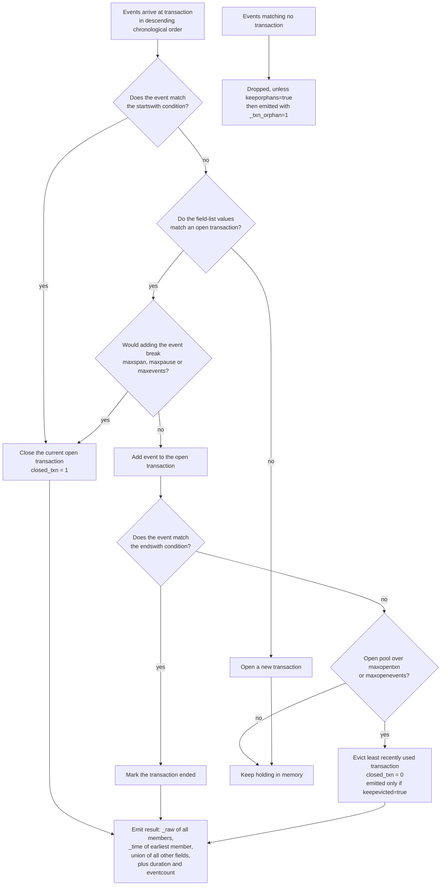
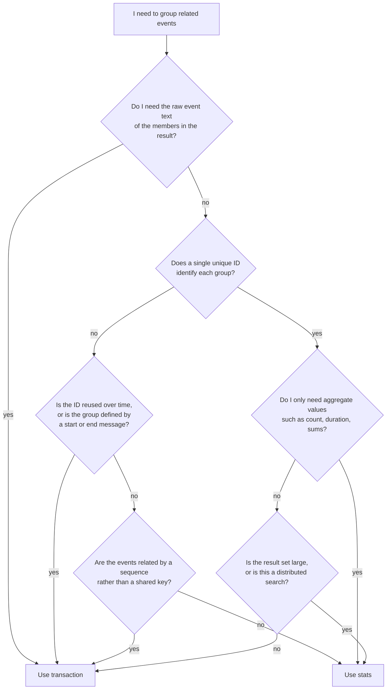

# 3.0 Correlating Events (15%)

The heaviest single section of SPLK-1002: it tests whether you can build a group of related events with the `transaction` command, read its output contract exactly, and then justify choosing `stats` instead, which is the answer more often than candidates expect.

## Blueprint mapping

- Section 3.0 Correlating Events, 15% of the exam
- 3.1 Identify transactions
- 3.2 Group events using fields
- 3.3 Group events using fields and time
- 3.4 Search with transactions
- 3.5 Report on transactions
- 3.6 Determine when to use transactions vs. stats

> The following topics are general guidelines for the content likely to be included on the exam; however, other related topics may also appear on any specific delivery of the exam. In order to better reflect the contents of the exam and for clarity purposes, the guidelines below may change at any time without notice.

| Sub-objective | Udemy "Splunk: Zero to Power User" (Hailie Shaw) | Apress "Splunk Certified Study Guide" (Deep Mehta, 2021) | Honest gap note |
| --- | --- | --- | --- |
| 3.1 Identify transactions | Module 10A | Chapter 2 | Both treat a transaction as "events sharing a field" and miss the docs definition: raw text of every member, the time fields of the earliest member, and the union of all other fields. |
| 3.2 Group events using fields | Module 10A | Chapter 2 | Neither covers `connected`, and neither states that an event missing the unifying field can still join a transaction. |
| 3.3 Group events using fields and time | Module 10A | Chapter 2 (`maxpause`, `maxspan` only) | Apress gives `maxspan` and `maxpause` but not their default of `-1`, and states a "1000 event max" without saying that this is the configurable `maxevents` default. |
| 3.4 Search with transactions | Module 10B | Chapter 4 | Neither source covers `startswith`, `endswith`, `keeporphans`, `unifyends`, or `keepevicted`, which are exactly the options a question writer reaches for as distractors. |
| 3.5 Report on transactions | Module 10B | Chapter 4 | Thin in both. Neither drills the point that `duration` and `eventcount` exist only after `transaction`, so filters on them must come later in the pipeline. |
| 3.6 Determine when to use transactions vs. stats | Not contrasted | Not contrasted | Neither source contrasts `transaction` with `stats` or builds the decision table. This sub-objective must be learned from the docs page "About transactions" alone. |

## What it is

Event correlation is finding relationships between events that a single search line does not express: how far apart in time a set of events occurred, how long an end-to-end operation took, how many steps it involved. The Splunk docs list five correlation mechanisms: time and geographic proximity, transactions, subsearches, field lookups, and joins. The exam concentrates on transactions, with `stats` as the constant alternative.

A transaction is any group of conceptually-related events that spans time. The `transaction` command builds one output result per group. That result is made of the raw text (the `_raw` field) of each member, the time and date fields of the earliest member, and the union of all other fields of each member. The command then adds `duration` and `eventcount`.

Members do not have to look alike. The docs list what a transaction can include: different events from the same source and host, different events from different sources on the same host, and similar events from different hosts and sources. Members need not share a sourcetype, need not carry the same set of fields, and do not share a timestamp, since a transaction spans time by definition. What binds them is the definition you hand the command: a field list, a start or end condition, a time constraint, or a combination. Where a field list is given the members must agree on those field values, and even the field list is optional in the syntax.

Where it sits in the processing model matters for 3.6. `transaction` is a centralized streaming command: it applies a transformation to each event returned by the search, and it only works on the search head. `stats` is a transforming command: it orders results into a data table and can push its first reduce step to the indexers. That single difference is the reason the docs say `stats` "performs more efficiently, especially in a distributed environment".



## Syntax and options

```spl
transaction [<field-list>] [name=<transaction-name>] [<txn_definition-options>...] [<memcontrol-options>...] [<rendering-options>...]
```

There are no required arguments. `transaction` with no arguments at all is legal and groups every event into one transaction, bounded only by `maxevents`.

The option groups are fixed and the exam does use their names: `<txn_definition-options>` is `maxspan | maxpause | maxevents | startswith | endswith | connected | unifyends | keeporphans`, `<memcontrol-options>` is `maxopentxn | maxopenevents | keepevicted`, and `<rendering-options>` is `delim | mvlist | mvraw | nullstr`.

| Option | Values | Default | What it does |
| --- | --- | --- | --- |
| `<field-list>` | `<field> ...` (space separated in the Search Reference, comma separated in the Knowledge Management Manual; both parse) | none | Groups events by unique values of the listed fields. For `transaction client_ip host`, each `client_ip` value gets a separate transaction per unique `host` value. Events with common field names and different values are never grouped, but an event that carries no value at all for a listed field can still join. |
| `name` | `name=<transaction-name>` | none | Names a stanza in `transactiontypes.conf`. Options given inline overrule the same options in that stanza. |
| `maxspan` | `<int>[s\|m\|h\|d]` | `-1` (no limit) | Maximum total time between the earliest and latest events in a transaction. Events in the transaction must span less than the integer specified. Events that exceed it become a separate transaction. Negative deactivates the constraint. Requires events sorted in descending chronological order. |
| `maxpause` | `<int>[s\|m\|h\|d]` | `-1` (no limit) | Maximum gap between consecutive events inside one transaction. Negative deactivates the constraint. Requires events sorted in descending chronological order. |
| `maxevents` | `<int>` | `1000` | Maximum number of events in a transaction. Deactivated if the value is negative. |
| `startswith` | `<filter-string>` | none (empty string per `transactiontypes.conf.spec`) | A search or eval filtering expression which, if satisfied by an event, marks the beginning of a new transaction. |
| `endswith` | `<filter-string>` | none (empty string per `transactiontypes.conf.spec`) | A search or eval filtering expression which, if satisfied by an event, marks the end of a transaction. |
| `connected` | `true \| false` | `true` | Only relevant when a field list is specified. When an event contains the fields the transaction requires but none of them has yet been instantiated in that transaction, `connected=true` opens a new transaction and `connected=false` adds the event to the existing one. Changing it changes the `unifyends` default to match. |
| `unifyends` | `true \| false` | `true`, set to the same default value as `connected` | Forces events matching `startswith` or `endswith` to also match at least one of the fields used to unify events into the transaction. |
| `keeporphans` | `true \| false` | `false` | Outputs results that are not part of any transaction. Orphans carry a `_txn_orphan` field with a value of `1`. |
| `keepevicted` | `<bool>` | `false` or `0` | Outputs evicted transactions. Evicted results are distinguished by `closed_txn=0`; non-evicted, closed transactions have `closed_txn=1`. |
| `maxopentxn` | `<int>` | read from the `[transactions]` stanza in `limits.conf`, where the shipped default is `5000` | Maximum number of not yet closed transactions to hold in the open pool before LRU eviction starts. |
| `maxopenevents` | `<int>` | read from the `[transactions]` stanza in `limits.conf`, where the shipped default is `100000` | Maximum number of events belonging to open transactions before LRU eviction starts. |
| `mvlist` | `true \| false \| <field-list>` | `false` | `true` renders multivalue fields as a list of the original event values in arrival order. `false` renders them as a set of unique values ordered alphabetically. A comma or space delimited field list renders only those fields as lists. |
| `mvraw` | `<bool>` | `false` | Makes the `_raw` field of the transaction result a multivalue field. |
| `delim` | `<string>` | `" "` (whitespace) | Character separating multiple values. With `mvraw=t` it delimits the values inside `_raw`. |
| `nullstr` | `<string>` | `NULL` | Placeholder for missing field values inside multivalue fields. Applies only to fields rendered as lists. |
| `match` | `closest` | none stated | Matching type for a transaction definition. `closest` is the only supported value. |

A `<filter-string>` for `startswith` and `endswith` is one of three shapes: `<search-expression>` (a valid search expression without quotes), `(<quoted-search-expression>)` (a valid search expression that contains quotes), or `eval(<eval-expression>)` where the eval expression returns a Boolean. Documented examples include `startswith="login"`, `startswith=(username=foobar)`, and `startswith=eval(speed_field < max_speed_field)`.

## Result contract

`transaction` collapses N input events into 1 output result per group. Field-level contract:

| Field | Origin | Value |
| --- | --- | --- |
| `_raw` | preserved | The raw text of every member event, one event per line by default. `mvraw=true` makes it a genuine multivalue field. |
| `_time` | preserved | The time and date fields of the earliest member event. Not the latest, and not the time the transaction closed. |
| every other field | preserved | The union of all other fields of each member. A field with different values across members becomes multivalue. |
| `duration` | created | Difference, in seconds, between the timestamps of the first and last events in the transaction. A single-event transaction has `duration=0`. |
| `eventcount` | created | Number of events in the transaction. |
| `closed_txn` | created | `1` (true) for non-evicted, closed transactions; `0` (false) for evicted ones. |
| `linecount` | present in output | Appears alongside the created fields in the documented example output for `transaction`. |
| `field_match_sum` | present in output | Appears alongside the created fields in the documented example output for `transaction`. |
| `_txn_orphan` | created when `keeporphans=true` | `1` on results passed through as orphans. |
| `transactiontype` | created when `name=` is used | The stanza name of the transaction from `transactiontypes.conf`. |

Everything in the options table is an input: no option name comes back as a field, and there is no field called `transaction` either. The command creates only `duration`, `eventcount`, `closed_txn`, and, under the relevant options, `_txn_orphan` and `transactiontype`.

Because the raw text of every member survives into `_raw`, a `search <term>` after `transaction` matches a group when any single member contributed that term, and the whole group comes back intact.

Command type: `transaction` is a centralized streaming command, and is additionally listed as a dataset processing command in some modes. It runs on the search head only. It is not a transforming command, so its output stays on the Events tab as a list of grouped events rather than becoming a statistics table.

Rendering: in the Events list, the member events of a transaction are grouped as multiple values in the Events field and each event starts on a new line. If a transaction has more than 5 events, the remaining events are collapsed behind a message that offers to show all of them.

Ordering: the incoming events must be in descending chronological order. Commands such as `eval` can change the order or time labeling of events; if one of them precedes `transaction`, the search returns an error unless a `sort` command appears immediately before `transaction`. The docs show that using `maxspan` on ascending-order events silently returns wrong results, not an error.

A rendered example. The documented `| makeresults count=10 | streamstats count | eval _time=now()+10*count, user="nobody" | sort -_time | transaction user maxspan=11s` search returns five rows shaped like this:

| _time | closed_txn | count | duration | eventcount | field_match_sum | linecount | user |
| --- | --- | --- | --- | --- | --- | --- | --- |
| 2024-07-16 16:10:30 | 1 | 10, 9 | 10 | 2 | 2 | 2 | nobody |
| 2024-07-16 16:10:10 | 1 | 7, 8 | 10 | 2 | 2 | 2 | nobody |
| 2024-07-16 16:09:50 | 1 | 5, 6 | 10 | 2 | 2 | 2 | nobody |
| 2024-07-16 16:09:30 | 1 | 3, 4 | 10 | 2 | 2 | 2 | nobody |
| 2024-07-16 16:09:10 | 0 | 1, 2 | 10 | 2 | 2 | 2 | nobody |

Note two things: `count` became multivalue because its members disagreed, and the last transaction has `closed_txn=0` because nothing closed it before the input ran out.

`stats` by contrast is a transforming command. Without a BY clause it returns exactly one row, the aggregation over the entire incoming result set. With a BY clause it returns one row per distinct value of the BY fields, and every field not named in the aggregation or the BY clause is discarded. `_raw` does not survive `stats`.

## Worked examples

1. Group web access events by client IP with both time constraints. This is the canonical 3.3 pattern.

```spl
sourcetype=access_* | transaction clientip maxspan=30s maxpause=5s
```

Produces one result per burst of activity from a single `clientip`, where the whole burst spans less than 30 seconds and no two consecutive events are more than 5 seconds apart. `host` and `source` may come back multivalue if several machines share one source IP.

2. Group by a start and an end condition, then filter on a field that only exists afterwards.

```spl
sourcetype=access_* | transaction JSESSIONID clientip startswith="view" endswith="purchase" | where duration>0
```

The first event of each transaction must contain the string `view` and the last must contain `purchase`. The `where duration>0` clause drops sessions that completed inside the same second. That filter cannot be moved before `transaction`, because `duration` does not exist until `transaction` creates it.

The same sequencing applies to plain text filters, for a different reason. To return whole sessions that contain at least one rejection:

```spl
index=main | transaction sessionid | search REJECT
```

`search REJECT` matches a transaction whose combined `_raw` contains that term, contributed by any one member, and the session comes back whole. Writing `index=main REJECT | transaction sessionid` instead discards every non-matching event before grouping, leaving one-event transactions with `duration=0`. Pre-filter on terms every member carries, such as the index, the sourcetype, or the session id; filter after `transaction` on terms only some members carry.

3. Bound the group by event count as well as time.

```spl
sourcetype=access_* action=purchase | transaction clientip maxspan=10m maxevents=3
```

Defines a purchase transaction as at most 3 events from one IP inside a 10 minute window. The filtering happens before the first pipe, which the docs say makes any search faster, and `transaction` is the command you least want to feed unfiltered. It is safe here because every event of interest carries `action=purchase`.

4. Report on transactions. This is the whole of 3.5: everything happens after the `transaction` command.

```spl
sourcetype=access_* | transaction JSESSIONID maxpause=30m
| search closed_txn=1
| where eventcount>3
| eval duration_min=round(duration/60,2)
| stats count AS sessions, avg(duration_min) AS avg_minutes, max(eventcount) AS longest BY host
```

`search closed_txn=1` keeps only transactions that a constraint actually closed. `where eventcount>3` keeps sessions with real depth. `eval` converts seconds to minutes because `duration` is always in seconds. The final `stats` aggregates the transactions themselves, which is the normal shape of a transaction report. Swap the last line for `| timechart span=1h avg(duration) AS avg_seconds` to trend it.

5. Keep the events that did not form a transaction, and the ones memory pressure threw away.

```spl
sourcetype=access_* | transaction clientip maxspan=5m keeporphans=true keepevicted=true
| eval status=case(_txn_orphan==1,"orphan", closed_txn==0,"evicted", 1==1,"closed")
| stats count BY status
```

This is a diagnostic search, not a reporting search. It tells you how much of your data never made it into a group and how much was evicted by the open-transaction pool limits.

6. Show what `mvlist` changes.

```spl
sourcetype=access_* | transaction clientip maxspan=1m mvlist=true
```

With the default `mvlist=false`, a field such as `action` comes back as the unique set of its values ordered alphabetically. With `mvlist=true` it comes back as every value from every member event, in arrival order, duplicates included. Use `mvlist=action,status` to get list rendering for only those two fields and set rendering for the rest.

7. The same problem solved both ways. This is the 3.6 pattern the exam draws from directly.

```spl
sourcetype=access_* | transaction JSESSIONID | stats count BY duration
```

```spl
sourcetype=access_* | stats range(_time) AS duration, count AS eventcount, min(_time) AS _time, values(action) AS actions, earliest(referer) AS entry_page, latest(action) AS exit_action BY JSESSIONID | stats count BY duration
```

Both give the distribution of session durations. The `stats` version is a transforming command that distributes across indexers, discards `_raw`, and has no open-transaction pool to blow. The docs give the identical pair for trades, `... | transaction trade_id | chart count by duration span=log2` and `... | stats range(_time) as duration by trade_id | chart count by duration span=log2`, and the `stats` form is correct only because `trade_id` is unique. If `trade_id` values are reused, the docs say the only solution is `... | transaction trade_id endswith=END`, or `... | transaction trade_id maxpause=10m` when the reuse is separated by time rather than marked by a message.

Equivalence table for rebuilding transaction output with `stats`:

| transaction field | stats equivalent |
| --- | --- |
| `duration` | `range(_time) AS duration` |
| `eventcount` | `count AS eventcount` |
| `_time` of the group | `min(_time) AS _time`, or `earliest_time(<field>)` for the epoch of a specific field value |
| union of a field's values, set rendering (`mvlist=false`) | `values(<field>)`, distinct, lexicographical order |
| union of a field's values, list rendering (`mvlist=true`) | `list(<field>)`, event order, capped at the first 100 values |
| first event's value, chronologically | `earliest(<field>)` |
| last event's value, chronologically | `latest(<field>)` |
| first or last value in processing order | `first(<field>)` or `last(<field>)` |
| `_raw` of every member | `values(_raw)` or `list(_raw)`, which is the one thing `stats` does badly |

## Decision rules



| Situation | Command | Why |
| --- | --- | --- |
| Every group has one unique identifier and you want aggregates | `stats ... BY <id>` | More efficient, especially in a distributed environment. |
| The identifier is reused, for example a cookie or a client IP | `transaction <id> maxpause=...` or `maxspan=...` | Time spans or pauses segment the reused identifier into separate transactions. |
| The group boundary is a message, for example `END` or `logout` | `transaction <id> endswith=...` | `stats` has no concept of a start or end condition. |
| You want to read the combined raw text of the events | `transaction` | `stats` discards `_raw` unless you aggregate it, and even then loses event boundaries. |
| You want a statistic over the grouped events | `stats` | `transaction` computes nothing except `duration` and `eventcount`. |
| The result set is large or the search is distributed | `stats` | `transaction` is centralized streaming and holds open transactions in search head memory. |
| You already used `append` | `stats` | You cannot use a `transaction` command after you use an `append` command. |
| You need to break groups longer than a fixed duration | `transaction ... maxspan=` | Directly supported; `stats` would need `bin` plus a compound BY clause. |
| Two different datasets, one of them small and static | `lookup` | The docs list lookup ahead of `join` for this shape. |
| Two different datasets, both dynamic, small right side | `join` | Last resort: the right-side dataset is capped at 50,000 rows over 60 seconds by default. |

Sequencing rules inside a transaction search:

1. Filter as much as possible before the first pipe, but only on terms every member of the group carries. `transaction` gets whatever you hand it, and a pre-pipe term that only some members carry silently shrinks each group to those members.
2. If any command before `transaction` can change event order or time labeling, put `| sort -_time` immediately before `transaction`.
3. Any filter on `duration`, `eventcount`, `closed_txn`, or `_txn_orphan` must come after `transaction`, and once there, `where` and `search` both work on them because they are ordinary fields at that point.
4. Report on transactions by piping to `stats`, `chart`, `timechart`, or `table`. A transaction result is a row like any other.
5. To keep whole groups but see only the ones containing a particular term, put `| search <term>` after `transaction` and rely on the preserved `_raw`.

Other correlation approaches named in the docs chapter, and when the exam would prefer `stats`:

| Approach | One-line note | Exam preference |
| --- | --- | --- |
| Subsearch | Enclosed in square brackets, runs first, its results feed the outer search. Default cap of 10,000 results and 60 seconds runtime. | Prefer `stats` when both halves are in the same index and share a key. |
| `append` | Adds subsearch results as extra rows at the end. Transforming command. `maxtime=60`, `maxout=50000`, `extendtimerange=false`. Historical data only. | Prefer `stats` with a compound BY clause; you cannot follow `append` with `transaction`. |
| `appendcols` | Merges the Nth subsearch row into the Nth main row by position. `override=false`, `maxtime=60`, `maxout=50000`, `timeout=60`. Dataset processing command. | Almost never the answer; positional merging is fragile. |
| `union` | Merges two or more datasets into one, interleaving on `_time`. Dataset processing command. `maxtime=60`, `maxout=50000`, `timeout=300`. | Prefer `union` over `append` for multi-dataset merges, then `stats` to group. |
| `join` | SQL-style inner, outer, or left join with a right-side dataset or subsearch. `type=inner`, `max=1`, `usetime=false`, `earlier=true`, `overwrite=true`. Centralized streaming when a field list is given, dataset processing when it is not. | The docs recommend `stats` and `transaction` over `join` and `append`. Field values in the join field list are case sensitive. |
| `selfjoin` | Joins result rows with other rows in the same result set on one or more fields. `keepsingle=false`, `max=1`, `overwrite=true`, main results capped at 100,000. | Niche: parent process to child process style data. |
| `searchtxn` | Efficiently returns transaction events matching a transaction type from `transactiontypes.conf`. `eventsonly=false`, `max_terms=1000`. | Only appears as a distractor; it requires a configured transaction type. |
| `streamstats` | Adds running aggregates to each event as it passes, in order. Every input event stays an output event. | Never the answer to "group events by fields": it correlates a value with the events before it rather than collapsing events into a group. |

## Traps

**T-03-01** The exam offers `maxspan` and `maxpause` defaults such as `30s`, `5m`, or `1000`. Wrong belief: they have a positive default. Correct fact: both default to `-1`, which means no limit and the constraint is deactivated. Only `maxevents` has a positive default, `1000`.

**T-03-02** A question shows `... | eval x=1 | transaction user maxspan=60s` and asks why the results are wrong. Wrong belief: `transaction` sorts its own input. Correct fact: `transaction` requires incoming events in descending chronological order, and `sort` must occur immediately before `transaction`. Ascending order with `maxspan` returns incorrect results rather than an error.

**T-03-03** `duration` is offered in minutes, or as null for a one-event transaction. Wrong belief: `duration` is formatted or absent. Correct fact: `duration` is the difference in seconds between the timestamps of the first and last events, and a single-event transaction has `duration=0`. Convert with `eval` if you want minutes.

**T-03-04** A question asks what `_time` is on a transaction result. Wrong belief: the latest event, or the time the transaction closed. Correct fact: the transaction takes the time and date fields of the earliest member event.

**T-03-05** A question sets `endswith` and asks why `closed_txn` is `0` everywhere. Wrong belief: any boundary option closes a transaction. Correct fact: `closed_txn` is set to `1` if one of `maxevents`, `maxspan`, `maxpause`, or `startswith` is specified. `endswith` is not in that list. If none of the four is specified, all transactions are output with `closed_txn=0`.

**T-03-06** `keeporphans=true` is claimed to mark results with `orphan=1` or `closed_txn=0`. Wrong belief: orphans reuse an existing field. Correct fact: orphan results are distinguished by a `_txn_orphan` field with a value of `1`, and the option default is `false`.

**T-03-07** `mvlist` defaults are inverted. Wrong belief: `mvlist=false` suppresses multivalue fields entirely, or `true` is the default. Correct fact: the default is `false`, which renders multivalue fields as a set of unique values ordered alphabetically. `mvlist=true` renders them as a list of the original event values in arrival order. You can also pass a field list to make only those fields render as lists.

**T-03-08** `unifyends` is offered with an independent default. Wrong belief: `unifyends` is always `true`. Correct fact: its default is `true` because it is set to the same default value as `connected`. Setting `connected=false` makes `unifyends=false`.

**T-03-09** A question asks which command is more efficient in a distributed deployment. Wrong belief: they are equivalent, or `transaction` wins because it makes fewer results. Correct fact: `stats` is a transforming command and performs more efficiently, especially in a distributed environment. `transaction` is a centralized streaming command that only works on the search head.

**T-03-10** `... | transaction clientip | where count>5`. Wrong belief: `transaction` produces a `count` field. Correct fact: `transaction` produces `eventcount`. `count` is what `stats` produces. This filter returns nothing.

**T-03-11** `... | append [search ...] | transaction sessionid`. Wrong belief: `append` and `transaction` compose freely. Correct fact: you cannot use a `transaction` command after you use an `append` command. Use `stats` to group after an `append`.

**T-03-12** `first()` and `latest()` are treated as synonyms. Wrong belief: `first()` returns the chronologically earliest value. Correct fact: `first()` returns the first seen value in processing order, which is the most recent instance, and `last()` returns the oldest instance in processing order. For time order use `earliest()` and `latest()`. Processing order is not necessarily chronological order.

**T-03-13** `values()` and `list()` are offered interchangeably as the `stats` equivalent of a transaction's multivalue field. Wrong belief: they differ only in name. Correct fact: `values()` returns distinct values in lexicographical order with no default cap; `list()` returns every value in event order and returns only the first 100 if a field has more than 100 values.

**T-03-14** `maxevents=-1` is read as "no events allowed". Wrong belief: a negative value means zero. Correct fact: a negative value deactivates the constraint, exactly as it does for `maxspan` and `maxpause`.

**T-03-15** `startswith="/cart"` is described as a regular expression. Wrong belief: `startswith` and `endswith` take regex. Correct fact: a `<filter-string>` is a search expression, a quoted search expression in parentheses, or `eval(<eval-expression>)` that evaluates to a Boolean. Use `eval(match(...))` if you genuinely need a regex.

**T-03-16** A question claims `transaction host cookie` means `host AND cookie`. Wrong belief: the field list is a strict conjunction. Correct fact: Splunk software does not necessarily interpret multiple fields as a conjunction or a disjunction. If a transitive relationship exists between the fields and the related events appear in the right sequence, `transaction` uses it. Separately, a result with no `host` value can join a transaction with `host=mylaptop`, while `host=mylaptop` and `host=myserver` can never share one.

**T-03-17** `join` is offered as the general-purpose correlation answer. Wrong belief: `join` scales like SQL. Correct fact: `join` defaults to `max=1` subsearch result per main result, and the right-side dataset defaults to a maximum of 50,000 rows over a maximum runtime of 60 seconds. The docs recommend `stats` and `transaction` over `join` and `append`.

**T-03-18** `connected=false` is offered as a way to change time behaviour. Wrong belief: `connected` affects `maxspan` or `maxpause`. Correct fact: `connected` is only relevant when a field or field list is specified, and it governs one narrow case: an event that carries the transaction's required fields but where none of those fields has yet been instantiated in the open transaction.

**T-03-19** The Apress book's "1000 event max" is read as a hard product ceiling. Wrong belief: transactions can never exceed 1000 events. Correct fact: the accurate phrasing is that by default there is a limit of 1000 events per transaction. `1000` is the `maxevents` default, it is settable per search or per `transactiontypes.conf` stanza, and a negative value removes the limit entirely. The other ceilings are `maxopentxn` (`5000` by default) and `maxopenevents` (`100000` by default), and those cause eviction rather than truncation. Direction matters too: a group that runs past 1000 events argues for `stats`, never for `transaction`.

**T-03-20** `keepevicted` is confused with `keeporphans`. Wrong belief: they do the same thing. Correct fact: `keepevicted=true` outputs transactions that memory pressure or a missing close condition left open, identified by `closed_txn=0`. `keeporphans=true` outputs events that never belonged to any transaction, identified by `_txn_orphan=1`. Both default to `false`. Note that `transactiontypes.conf.spec` describes the eviction marker as an `evicted` field; the `transaction` command reference, which is the authority for the command, uses `closed_txn`.

**T-03-21** A `limits.conf` setting is offered as the way to raise how many events one transaction may hold. Wrong belief: `max_events_per_bucket` controls the per-transaction event ceiling. Correct fact: `max_events_per_bucket` sits in the `[search]` stanza, where it caps the events retrieved for each timeline bucket in searches with `status_buckets>0`, and has nothing to do with `transaction`. The `[transactions]` stanza holds only `maxopentxn` and `maxopenevents`, both also settable as memory control options on the command. The events-per-transaction ceiling is the command's own `maxevents`.

**T-03-22** A question lists the fields a bare `... | transaction JSESSIONID` adds and slips `maxspan` into the list. Wrong belief: the options that shape a group come back as fields. Correct fact: `maxspan`, `maxpause`, and `maxevents` are inputs only. The command adds `duration` and `eventcount`, sets `closed_txn`, and creates `_txn_orphan` and `transactiontype` only under the relevant options. No field named `transaction` exists either, so filters shaped like `where transaction="REJECT"` match nothing.

**T-03-23** `index=main REJECT | transaction sessionid` is offered as the way to see the sessions containing a rejection. Wrong belief: pre-filtering on a term is the same as filtering the finished groups. Correct fact: the pre-pipe term discards every event that does not carry it, so each session contributes only its `REJECT` events and you get one-event transactions with `duration=0`. Group first, then `| search REJECT`, which matches the preserved `_raw` of any member and returns the whole session.

**T-03-24** `streamstats` is offered as the efficient way to group events by fields in a large environment. Wrong belief: `streamstats` is a cheaper `stats`. Correct fact: `streamstats` adds running aggregates to each event as it passes and returns every event; it never collapses events into a group. The grouping commands are `stats` and `transaction`, recommended by the docs over `join` and `append`.

## Lab

Fifteen minutes on a single-node Splunk Enterprise 10.x instance with the tutorial data loaded.

Step 1, build a transaction and read its contract. In Splunk Web open Search & Reporting, set the time range to All time, and run:

```spl
sourcetype=access_* | transaction JSESSIONID maxspan=30m maxpause=10m
| table _time JSESSIONID duration eventcount closed_txn action
```

Confirm on the Statistics tab that `duration` is in seconds, that `eventcount` is an integer, and that `action` is multivalue on multi-step sessions.

Step 2, prove that field rendering is controlled by `mvlist`. Run the same search twice, with and without `mvlist=true` on the `transaction` clause. With the default the `action` column shows a short alphabetical set; with `mvlist=true` it shows one entry per member event in arrival order.

Step 3, prove the `closed_txn` rule. Run:

```spl
sourcetype=access_* | transaction JSESSIONID endswith="purchase" keepevicted=true | stats count BY closed_txn
```

Then run it again with `maxspan=30m` added. The first search returns everything under `closed_txn=0` because `endswith` alone does not close a transaction. Adding `maxspan` moves rows into `closed_txn=1`.

Step 4, prove the ordering requirement. Run:

```spl
| makeresults count=20 | streamstats count | eval _time=now()+10*count, user="nobody" | transaction user maxspan=11s
```

You get a single transaction with `eventcount=10` and `duration=90`, which is wrong. Insert `| sort -_time` immediately before `| transaction` and rerun. You now get five two-event transactions with `duration=10`, and the last one has `closed_txn=0`.

Step 5, create a reusable transaction type. Create `$SPLUNK_HOME/etc/system/local/transactiontypes.conf` with:

```ini
[buttercup_session]
fields = JSESSIONID
maxspan = 30m
maxpause = 10m
maxevents = 100
mvlist = false
```

In Splunk Web go to Settings, then Server controls, then Restart Splunk. After the restart, verify with:

```spl
sourcetype=access_* | transaction name=buttercup_session | stats count AS transactions, avg(duration) AS avg_seconds, max(eventcount) AS biggest
```

Then confirm that an inline option overrules the stanza:

```spl
sourcetype=access_* | transaction name=buttercup_session maxevents=3 | stats max(eventcount) AS biggest
```

`biggest` must now be `3` or less.

Step 6, save the report. With the step 5 verification search finalized, click Save As, select Report, title it `buttercup_session_summary`, and save.

Verification search that proves the whole lab worked:

```spl
sourcetype=access_* | transaction name=buttercup_session keeporphans=true keepevicted=true
| eval bucket=case(_txn_orphan==1,"orphan", closed_txn==0,"open_or_evicted", 1==1,"closed")
| stats count AS results, sum(eventcount) AS events BY bucket
```

If `transactiontypes.conf` was picked up you get results in the `closed` bucket without specifying any inline constraint, because the stanza supplies `maxspan`, `maxpause`, and `maxevents`.

## Self-check

1. A search reads `index=web sourcetype=access_* | transaction clientip`. What are the defaults in effect for `maxspan`, `maxpause`, and `maxevents`?

   A. `maxspan=-1`, `maxpause=-1`, `maxevents=1000`
   B. `maxspan=30s`, `maxpause=5s`, `maxevents=1000`
   C. `maxspan=-1`, `maxpause=-1`, `maxevents=-1`
   D. `maxspan=0`, `maxpause=0`, `maxevents=1000`

2. Which field does `transaction` add that tells you whether a constraint actually closed the group?

   A. `eventcount`
   B. `closed_txn`
   C. `_txn_orphan`
   D. `transactiontype`

3. `... | transaction sessionid maxspan=10m | where eventcount>5` returns results. Which single change makes the search return nothing?

   A. Changing `where` to `search`
   B. Changing `eventcount` to `count`
   C. Moving `| where eventcount>5` after a `| table` command
   D. Adding `keeporphans=true`

4. A support team needs the total duration and the number of steps for every order, where `order_id` is globally unique and never reused, over a 30 day search that runs across four indexers. Which search is correct and most efficient?

   A. `index=orders | transaction order_id | table order_id duration eventcount`
   B. `index=orders | stats range(_time) AS duration, count AS eventcount BY order_id`
   C. `index=orders | transaction order_id keepevicted=true | stats values(duration) BY order_id`
   D. `index=orders | join order_id [search index=orders | stats count]`

5. Web sessions are identified by a `cookie` value that the application recycles across days. A session ends when the user hits the logout page. Which search groups the sessions correctly?

   A. `... | stats range(_time) AS duration BY cookie`
   B. `... | transaction cookie mvlist=true`
   C. `... | transaction cookie endswith="logout"`
   D. `... | selfjoin cookie`

6. What does `mvlist=false`, the default, do to a field whose members carry the values `view, addtocart, view, purchase` in that order?

   A. Returns `view addtocart view purchase` in arrival order
   B. Returns `addtocart purchase view` as a unique set ordered alphabetically
   C. Suppresses the field from the output entirely
   D. Returns only `view`, the first value seen

7. Which statement about command types is correct?

   A. `transaction` is transforming and `stats` is centralized streaming
   B. Both are transforming commands
   C. `transaction` is centralized streaming and `stats` is transforming
   D. Both are distributable streaming commands

8. A search is written as `index=a | append [search index=b] | transaction request_id`. What is wrong with it?

   A. Nothing; this is the recommended pattern for merging two indexes
   B. `append` must come after `transaction`
   C. You cannot use a `transaction` command after you use an `append` command
   D. `transaction` requires `maxspan` when the input comes from a subsearch

9. `limits.conf` on the search head contains the stanza below, and a user runs the search below it. What is the effect on the search?

```ini
[transactions]
maxopentxn = 5000
maxopenevents = 100000
```

```spl
index=app | transaction session_id maxevents=-1
```

   A. The search fails, because `maxevents` cannot take a negative value
   B. No per-transaction event cap applies, but eviction still starts once the open pool exceeds the stanza values, and evicted results are discarded
   C. Each transaction is capped at 5000 events, because the stanza overrules the inline option
   D. Each transaction is capped at 1000 events, because a negative value falls back to the default

10. A user runs `index=payments ERROR | transaction order_id maxspan=10m` and reports that almost every result has `eventcount=1` and `duration=0`, although each order clearly writes many events. What explains the output?

   A. `maxspan=10m` caps the gap between consecutive events, so any order with a longer gap was split into single events
   B. The pre-pipe `ERROR` term discarded every event that does not contain it, so only the error events of each order ever reached the command
   C. `maxevents` must be set explicitly before `transaction` will group more than one event
   D. `order_id` must be declared in a `transactiontypes.conf` stanza before it can group events

<details><summary>Answers</summary>

1. **A.** `maxspan` and `maxpause` both default to `-1`, meaning no limit, and `maxevents` defaults to `1000`. B is the values from the most-copied example in the docs (`maxspan=30s maxpause=5s`), not defaults. C is wrong on `maxevents`: a negative value would deactivate the constraint, but the shipped default is `1000`. D is wrong because `0` is not the default for either time option and would be a meaningless constraint.

2. **B.** `closed_txn` is `1` for non-evicted, closed transactions and `0` for evicted ones, and is set to `1` when one of `maxevents`, `maxspan`, `maxpause`, or `startswith` is specified. A, `eventcount`, is the number of member events and says nothing about closure. C, `_txn_orphan`, marks results that were never part of any transaction and only appears with `keeporphans=true`. D, `transactiontype`, is the `transactiontypes.conf` stanza name and only appears when `name=` is used.

3. **B.** `transaction` creates `eventcount`, not `count`; filtering on a field that does not exist returns nothing. A is wrong because `search` and `where` both work on `eventcount` at that point in the pipeline. C is wrong because `table` keeps `eventcount` if you list it, and in any case moving a filter later does not make it match nothing. D is wrong because `keeporphans=true` adds results rather than removing them.

4. **B.** `order_id` is a single unique identifier and only aggregates are required, so `stats` is both correct and more efficient, especially in a distributed environment. A works but is a centralized streaming command that holds transactions in search head memory over a 30 day window for no benefit. C is worse still: it runs `transaction` and then aggregates the result, doing the expensive step first. D is a `join` with no correlation logic, and `join` is capped at 50,000 right-side rows over 60 seconds by default.

5. **C.** A recycled identifier plus an explicit end message is the exact case the docs name for `endswith`. A is wrong because a recycled `cookie` makes `stats` merge unrelated sessions from different days into one group. B groups by `cookie` but has no boundary at all, so recycled cookies still merge; `mvlist` only changes rendering. D, `selfjoin`, joins rows to other rows in the same result set and does not build time-bounded groups.

6. **B.** The default `mvlist=false` renders multivalue fields as a set of unique field values ordered alphabetically. A describes `mvlist=true`, which is a list of the original event values in arrival order. C is wrong: the field is present, just deduplicated and sorted. D describes what `first()` would do in a `stats` command, not what `transaction` does.

7. **C.** `transaction` is documented as a centralized streaming command, which only works on the search head, and `stats` is documented as a transforming command. A inverts both. B is wrong because `transaction` does not order results into a data table; its output stays an events list. D is wrong for both: neither command is distributable streaming, which is the class that includes `eval`, `where`, `fields`, and `rename`.

8. **C.** The `join` command reference states plainly that you cannot use a `transaction` command after you use an `append` command, and recommends grouping with `stats` instead. A is wrong for that reason and because `union` is the better merge command anyway. B is wrong: `append` is a transforming command and there is no rule forcing it after `transaction`. D is invented; `transaction` has no required arguments at all.

9. **B.** A negative `maxevents` deactivates the events-per-transaction constraint, so nothing caps group size, but the open pool is still bounded: `maxopentxn` and `maxopenevents` are the `[transactions]` settings the command reads for its memory control options, and exceeding either starts least-recently-used eviction. `keepevicted` defaults to `false`, so evicted transactions never appear. A is wrong because a negative value is the documented way to switch the constraint off. C is wrong twice over: `maxopentxn` counts open transactions in the pool, not events inside one transaction, and an inline option overrules the configured value rather than the reverse. D invents a fallback; negative means deactivated, not "use 1000".

10. **B.** Anything before the first pipe filters events, not groups, so only the `ERROR` events survive to reach `transaction`, and an order that wrote one error yields a one-event transaction with `duration=0`. Group first and put `| search ERROR` after `transaction` to keep whole orders. A misdefines `maxspan`, which bounds the time from the earliest to the latest event in a group; the gap between consecutive events is `maxpause`. C is wrong because `maxevents` already defaults to `1000` and grouping does not depend on setting it. D is wrong because a `transactiontypes.conf` stanza is only needed for the `name=` argument; an inline field list needs no configuration.

</details>

## Docs

1. [About event grouping and correlation](https://help.splunk.com/en/splunk-enterprise/search/search-manual/10.4/group-and-correlate-events/about-event-grouping-and-correlation) - the five correlation mechanisms, and the sentence recommending `stats` and `transaction` over `join` and `append`. 5 minutes.
2. [About transactions](https://help.splunk.com/en/splunk-enterprise/search/search-manual/10.4/group-and-correlate-events/about-transactions) - the two cases where `transaction` is right, and the `trade_id` pairs behind sub-objective 3.6. Read it twice. 15 minutes.
3. [transaction command reference](https://help.splunk.com/en/splunk-enterprise/search/spl-search-reference/10.4/search-commands/transaction) - every option and default, the `closed_txn` rule, the descending chronological order requirement, and seven worked examples. The most exam-relevant page in the section. 30 minutes.
4. [Identify and group events into transactions](https://help.splunk.com/en/splunk-enterprise/search/search-manual/10.4/group-and-correlate-events/identify-and-group-events-into-transactions) - field-list semantics, including that an event with no value for the field can still join. 10 minutes.
5. [Search for transactions](https://help.splunk.com/en/splunk-enterprise/manage-knowledge-objects/knowledge-management-manual/10.4/transactions/search-for-transactions) - `transactiontype`, `match=closest`, and the macro combination. 8 minutes.
6. [Configure transaction types](https://help.splunk.com/en/splunk-enterprise/manage-knowledge-objects/knowledge-management-manual/10.4/transactions/configure-transaction-types) - `transactiontypes.conf` attributes and defaults, needed for `name=`. 10 minutes.
7. [stats command reference](https://help.splunk.com/en/splunk-enterprise/search/spl-search-reference/10.4/search-commands/stats) - the function table, the transforming-command statement, and the note that `first`/`last` are not time ordered. 20 minutes.
8. [Event order functions](https://help.splunk.com/en/splunk-enterprise/search/spl-search-reference/10.4/statistical-and-charting-functions/event-order-functions) and [Time functions](https://help.splunk.com/en/splunk-enterprise/search/spl-search-reference/10.4/statistical-and-charting-functions/time-functions) - the `first`/`last` versus `earliest`/`latest` table. 8 minutes.
9. [Multivalue stats and chart functions](https://help.splunk.com/en/splunk-enterprise/search/spl-search-reference/10.4/statistical-and-charting-functions/multivalue-stats-and-chart-functions) - `values()` versus `list()` and the 100-value cap on `list()`. 5 minutes.
10. [Command types](https://help.splunk.com/en/splunk-enterprise/search/spl-search-reference/10.4/quick-reference/command-types) - the classification of `transaction`, `stats`, `join`, `append`, `appendcols`, and `union`. 8 minutes.
11. [join command reference](https://help.splunk.com/en/splunk-enterprise/search/spl-search-reference/10.4/search-commands/join) - the "Alternative commands" table, the clearest published statement of when to pick `transaction` over `stats`. 10 minutes.
12. [About subsearches](https://help.splunk.com/en/splunk-enterprise/search/search-manual/10.4/subsearches/about-subsearches) and [Use subsearch to correlate events](https://help.splunk.com/en/splunk-enterprise/search/search-manual/10.4/subsearches/use-subsearch-to-correlate-events) - background for the correlation approaches the blueprint touches indirectly. 12 minutes.
13. [limits.conf](https://help.splunk.com/en/data-management/splunk-enterprise-admin-manual/10.4/configuration-file-reference/10.4.0-configuration-file-reference/limits.conf) - the `[transactions]` stanza (`maxopentxn`, `maxopenevents`) and, separately, `max_events_per_bucket` under `[search]`. 5 minutes.
