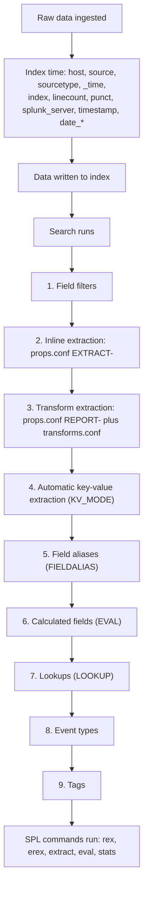
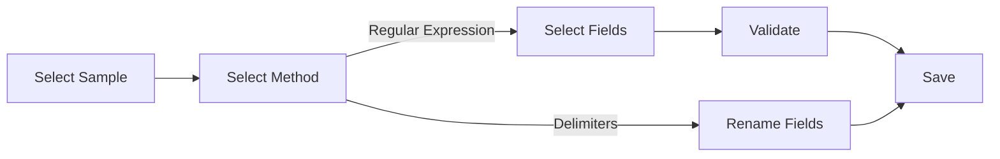

# 4.0 Creating and Managing Fields (10%)

This section is about turning raw text into named fields at search time, and the exam tests it almost entirely through the Field Extractor wizard in Splunk Web, because that is the one field-creation path a Power User can drive without editing configuration files or restarting anything.

## Blueprint mapping

> The following topics are general guidelines for the content likely to be included on the exam; however, other related topics may also appear on any specific delivery of the exam. In order to better reflect the contents of the exam and for clarity purposes, the guidelines below may change at any time without notice.

- Section 4.0 Creating and Managing Fields
- Weight: 10%
- 4.1 Perform regex field extractions using the Field Extractor (FX)
- 4.2 Perform delimiter field extractions using the FX

| Source | Coverage | Honest assessment |
| --- | --- | --- |
| Udemy "Splunk: Zero to Power User" (Hailie Shaw), Module 7 | Fields, the fields sidebar, default fields | Adequate on the sidebar. Never states the 20 percent threshold as a number, and blurs index time against search time. |
| Udemy Module 12A | Field Extractor, regular expression method | Happy path only. Skips required text, counterexamples, manual regex editing, and Save-step permissions. |
| Udemy Module 12B | Field Extractor, delimiter method | Shows the flow without saying that the delimiter path skips Validate, or where the extraction lands in configuration. |
| Apress "Splunk Certified Study Guide" (Deep Mehta, 2021), Chapter 3 | Field extraction, regular expressions, inline regex, delimiters | Body text is broadly correct that delimiters suit structured data, then the answer key marks "delimiters are mostly used in structured data" as False, contradicting the chapter body and the docs. Treat the key as wrong. The chapter also contradicts itself on field-value case sensitivity, and never mentions `erex`. |

## What it is

Splunk extracts a small, fixed set of default fields when data is indexed, and extracts everything else when you run a search. Index-time extraction is expensive and permanent: an indexed field increases the size of the searchable index, and changing it requires reindexing the data. Search-time extraction is cheap and reversible: the extraction is a knowledge object evaluated against `_raw` while the search runs, so creating one immediately applies to data that was indexed months ago and deleting one changes nothing about what is stored. The Field Extractor only ever creates search-time extractions, which is exactly why the Power User exam confines itself to search time.

At index time Splunk adds these fields to every event: the internal fields `_raw`, `_time`, `_indextime`, `_cd`, and `_bkt`; the default fields `host`, `index`, `linecount`, `punct`, `source`, `sourcetype`, `splunk_server`, and `timestamp`; and the default datetime fields `date_hour`, `date_mday`, `date_minute`, `date_month`, `date_second`, `date_wday`, `date_year`, and `date_zone`. The docs state plainly of the default-field group that "These fields are indexed and added to the Fields menu by default." The `date_*` fields only exist for events that carried timestamp information generated by their source system. Note what is absent: `eventtype` and `tag` are not on the default field list. They are search-time knowledge objects that attach to events after extraction, and the exam will offer them as distractors in a "which of these are default fields" question.

At search time, when field discovery is on, Splunk identifies and extracts the first 100 fields it finds that match obvious `key=value` pairs, extracts any field named in the search string, and then runs custom extractions from configuration files or from commands such as `rex`. Field discovery happens for non-transforming searches in Smart mode and for any search in Verbose mode. Fast mode turns field discovery off, but the docs are careful about what that costs: fast mode "only returns information on indexed and default fields, and any search-time extracted fields that you explicitly include in your search". A field you name in the search still resolves in Fast mode, so Fast mode alone never explains an empty result set. Custom search-time extractions run in a fixed order relative to everything else the search does.



The Field Extractor writes into stage 2 or stage 3 of that sequence depending on which method you pick. Inline extractions are processed before transform extractions, so when both produce the same field name the inline version is retained and the transform version is discarded, because `MV_ADD` defaults to false.

### Selected, Interesting, and All Fields

The fields sidebar is two lists plus a dialog, and the exam separates them carefully. **Selected Fields** holds the fields displayed under every event in the events list, and the docs state that "when you first run a search the Selected Fields list contains the default fields host, source, and sourcetype." Those three, and only those three, are selected for you. **Interesting Fields** lists fields that appear in at least 20 percent of the returned events. **All Fields** is not a third list: it is the dialog you open to see every field the search produced and to promote any of them into Selected Fields, and it is also one of the entry points into the Field Extractor.

`index` is what this design catches people on. It is a default field, present on every event, so it clears the 20 percent bar comfortably, but it is not one of the three that start out selected, so on a fresh search it appears under Interesting Fields. The 20 percent figure governs that list and nothing else.

### The Field Extractor workflow

The FX is a wizard with six named screens, and which screens you see depends on the method you choose.



| Screen | Method | What it does |
| --- | --- | --- |
| Select Sample | both | Pick a source type from a dropdown or type a source, then click one event from the list to be the sample. The FX is limited to twenty lines on a sample event. Existing extractions are drawn as coloured outlines, and a red triangle next to Existing fields warns that extractions overlap. |
| Select Method | both | Choose Regular Expression for unstructured data such as a system log, or Delimiters when values are cleanly separated by a common character and sit in the same position in every event. |
| Select Fields | regex only | Highlight a value, name the field, add the extraction. The FX generates the regex for you. Add required text, add more sample events, or open the generated regex for manual editing. |
| Rename Fields | delimiters only | Pick the delimiter, then rename the auto-named fields. Four delimiters are offered as buttons: Space, Comma, Tab, and Pipe. Anything else, a colon or a double pipe for instance, works only by selecting **Other** and typing the character or characters yourself. |
| Validate | regex only | Review matching and non-matching events, and mark bad extractions as counterexamples so the FX rewrites the regex. |
| Save | both | Name the extraction, set permissions, Finish. |

### What the delimiter method assumes about your data

The docs describe the delimiters method as designed for structured event data, "data from files with headers, where all of the fields in the events are separated by a common delimiter, such as a comma or space". Headers, not the absence of them. The header row sits in the file rather than inside each event, which is why the extractor has no names to work with and hands you `field1`, `field2`, `field3` to rename.

The second condition is the one people forget: the values must also be consistent across events, each in the same position every time. Cleanly comma-separated events whose fields move around are a bad candidate, and the docs send you to the regular expression method with required text instead. Hierarchical formats are not candidates at all, since XML and JSON are nested rather than delimited and Splunk parses them through automatic key-value extraction or `spath`. A `.csv` file, or events indexed from a database table, is the textbook case.

### Required text on the Select Fields step

Required text is the regex path's filter: highlight a literal string in the sample event, select **Require**, then **Add Required Text**. The docs say it "behaves like a search filter. It is a string of text that must be present in the event for Splunk software to match it with the extraction." Be precise about the consequence: it narrows which events the extraction applies to, not which events a search returns. An event lacking the string is still returned by any search that would otherwise return it, it simply does not gain the extracted fields.

Two limits are testable. You get one required-text string per field extraction, and required text cannot overlap a field value in either direction: text already highlighted as a value cannot be marked required, and required text cannot then be highlighted as a value. Requiring text does not lock the pattern, since **Show Regular Expression** and its **Edit the Regular Expression** option stay available.

### The entry points the exam cares about

| Entry point | Exact path | Opens on |
| --- | --- | --- |
| Fields sidebar | Run a search, scroll to the bottom of the fields sidebar, select **Extract New Fields** | Select Sample |
| All Fields dialog | Run a search, select **All Fields**, select **Extract new fields** | Select Sample |
| Event Actions | Run a search, expand an event, select **Event Actions**, then **Extract Fields** | Select Method, in a new browser tab (source type and sample are already fixed by the event you clicked) |
| Settings | **Settings > Fields > Field extractions**, then **Open field extractor** | Select Sample |
| Home page | Home page, **extract fields** link under the Add Data icon (needs a role with `edit_monitor`, such as Admin) | Select Sample |
| Add Data | Add Data, define a fixed source type, then **Extract Fields** (needs `edit_monitor`) | Select Sample |

The search-driven entry points run only against the set of events returned by that search. The Settings entry point sees every source type in the deployment.

One button on that Settings page is not an entry point at all. **New Field Extraction**, beside Open field extractor, opens a plain configuration form: destination app, name, the sourcetype, source, or host to apply to, the type (Inline or Uses transform), and the regex or transform name, all typed by hand with no sample event and no validation. The wizard is only ever behind **Open field extractor**.

## Syntax and options

The FX has no syntax. The four SPL commands that do the same job in a search do, and the exam mixes them into FX questions freely.

### rex

```spl
rex [field=<field>] ( <regex-expression> [max_match=<int>] [offset_field=<string>] ) | (mode=sed <sed-expression>)
```

| Option | Values | Default | What it does |
| --- | --- | --- | --- |
| `field` | any field name | `_raw` | Field the regex or sed expression is applied to. |
| `<regex-expression>` | a PCRE string in quotes, with named capture groups `(?<name>...)` or `(?P<name>...)` | none (required unless `mode=sed`) | Pattern to match. Each named group creates a field of that name. |
| `max_match` | integer, `0` means unlimited | `1` | How many times the regex may match per event. Any value above 1 makes the resulting field multivalue. |
| `offset_field` | a field name | none | Creates a field holding the zero-indexed start and end character positions of each matched value. |
| `mode` | `sed` | none | Switches to sed mode. Mutually exclusive with the regex-extraction form. |
| `<sed-expression>` | `"s/<regex>/<replacement>/<flags>"` or `"y/<string1>/<string2>/"` | none (required when `mode=sed`) | `s` replaces, `y` substitutes character by character. Flags include `g` for global and a number for the Nth occurrence. Back references are `\1`, `\2`. |

### erex

```spl
erex [<field>] examples=<string> [counterexamples=<string>] [fromfield=<field>] [maxtrainers=<integer>]
```

| Option | Values | Default | What it does |
| --- | --- | --- | --- |
| `<field>` | a field name | none | Name of the new field that receives the extracted values. |
| `examples` | comma-separated values, quoted if they contain spaces | none (required) | Sample values you want extracted. They must exist in the events piped into `erex` or the command fails. |
| `counterexamples` | comma-separated values | none | Values that must not be extracted. |
| `fromfield` | a field name | `_raw` | Field to extract from. |
| `maxtrainers` | integer 1 to 1000 | `100` | Maximum number of values to learn from. |

### extract (alias kv)

```spl
extract [<extract-options>...] [<extractor-name>...]
```

| Option | Values | Default | What it does |
| --- | --- | --- | --- |
| `pairdelim` | string of delimiter characters | none stated in the docs | Characters that separate one key-value pair from the next. |
| `kvdelim` | string of delimiter characters | none stated in the docs | Characters that separate a key from its value. A delimiter appearing inside a value blocks that extraction. |
| `limit` | integer | `50` | How many automatic key-value pairs to extract. |
| `maxchars` | integer | `10240` | How many characters into the event to look. |
| `mv_add` | boolean | `false` | Create multivalue fields. Overrides `MV_ADD` in transforms.conf. |
| `clean_keys` | boolean | the value of `CLEAN_KEYS` in transforms.conf | Strip leading underscores and digits from extracted field names. |
| `segment` | boolean | `false` | Note the locations of the key-value pairs in the results. |
| `reload` | boolean | `false` | Force a reload of props.conf and transforms.conf. |
| `auto` | `f` | none | `auto=f` turns off automatic key-value extraction for that search. |
| `<extractor-name>` | a transforms.conf stanza name | none | Apply a named field transform instead of automatic extraction. |

`extract` works only on `_raw`. There is no `field=` argument. To extract from another field you must rename that field to `_raw` first and rename it back afterwards.

### Named capture groups

Splunk regular expressions "are PCRE (Perl Compatible Regular Expressions) and use the PCRE C library", and the docs use two spellings for a named capture group. The Capture groups section and every `EXTRACT-` example write `(?<field_name>capture pattern)`; the metacharacter table on the same page writes "Use the syntax `(?P<var> ...)` to set up a named field extraction". Both are valid, and the first is the one the docs use everywhere else, so learn that one and recognise the other. PCRE matches case sensitively unless the pattern says otherwise, so `rex "(?<user>admin)"` does not match `Admin`.

### What the FX writes

| FX method | props.conf | transforms.conf |
| --- | --- | --- |
| Regular Expression | `EXTRACT-<name> = <generated regex>` under the sourcetype or source stanza | nothing |
| Delimiters | `REPORT-<name> = <transform stanza name>` | a stanza containing `DELIMS` and, when only values are being extracted, `FIELDS` |

The Field extractions page in Settings states that "EXTRACT-<class> field extractions are extractions that are only defined in props.conf. They are created automatically by field extractions made through IFX and certain search commands." The delimiter half is settled by joining two pages that each say part of it. The Save step proves a delimiter extraction has a transforms.conf stanza: "For delimiter-based field extractions, you will need to move the transforms.conf stanzas manually in order to change the field extraction permissions." The Field extractions page supplies the name: "Uses transform extractions always have REPORT-<class> name configurations. As such they reference field transforms in transforms.conf." A props.conf setting that points at a field transform has no other spelling, so the deduction is safe.

```ini
# props.conf, what the FX regular expression method produces
[secure]
EXTRACT-src_port = port (?<src_port>\d+)

# props.conf plus transforms.conf, what the FX delimiter method produces
[my_pipe_data]
REPORT-my_pipe_data_fields = my_pipe_data_fields
```

```ini
# transforms.conf
[my_pipe_data_fields]
DELIMS = "|"
FIELDS = order_id, region, product, qty, unit_price
```

## Result contract

**The Field Extractor.** Its output is a knowledge object, not a result set. After you select Finish, the named fields appear in the fields sidebar for every event of that source type or source, retroactively, with no reindexing and no restart. The extraction shows up on **Settings > Fields > Field extractions** where you can edit its permissions or delete it. Nothing is written to `_raw`, nothing is written to the index, and no existing field is dropped.

**Permissions at the Save step.** The default is Owner, which means the extraction only extracts fields in searches run by the person who created it. App makes it available only to users of the app the extraction belongs to. All apps makes it available to all users of all apps. Promoting an extraction beyond Owner is always a deliberate, separate action. Permissions therefore decide which searches see the field, and a field that resolves for you and returns nothing for a colleague is almost always an Owner-scoped extraction. Extraction names cannot include spaces; the Field extractions page tells you to use underscores between words. The regex method proposes a name automatically from the comma-separated list of field names; the delimiter method requires you to type one.

Sharing something built on an extraction does not share the extraction. A report saved on a private extraction can be shared to the whole app and still return an empty column for everyone but its author, because report and extraction carry independent permissions. The companion cause in that scenario is index access: roles control which indexes a user may search, so a colleague without the index gets no events at all, custom fields or not.

**rex.** A distributable streaming command. Row count is unchanged: every input event is emitted, matched or not. Each named capture group becomes a new field on events where the pattern matched; events where it did not match pass through untouched and simply lack the field. No existing field is dropped unless a capture group reuses an existing field name, in which case the new value overwrites it. With `max_match` above 1 the produced field is multivalue. In sed mode the target field's value is rewritten in the result set only, never in the index.

| _time | _raw (abbreviated) | src_port |
| --- | --- | --- |
| 2024-03-26 00:16:12 | ... from 194.8.74.23 port 3351 ssh2 | 3351 |
| 2024-03-26 00:16:14 | ... from 218.75.163.62 port 3768 ssh2 | 3768 |
| 2024-03-26 00:16:19 | ... session opened for user djohnson | *(no value)* |

**erex.** Adds one new field holding values similar to your examples, and emits the generated regular expression as an informational message rather than a result row. You read it from the **Job** menu, then paste it into a `rex` command or an FX extraction. Nothing persists. The `rex` and `extract` reference pages each state "distributable streaming command" under Usage; the 10.4 `erex` page states no command type at all, so no exam question can turn on one.

**extract.** A distributable streaming command. It adds fields parsed out of `_raw` and leaves the row count alone. Because `clean_keys` defaults to whatever `CLEAN_KEYS` says in transforms.conf, and `CLEAN_KEYS` defaults to true, extracted keys have leading underscores and digits stripped unless you say otherwise.

## Worked examples

Assume the Splunk tutorial data is loaded into `main` with source types `access_combined_wcookie`, `vendor_sales`, and `secure`.

**1. Basic named capture group. The single pattern every FX regex extraction reduces to.**

```spl
index=main sourcetype=secure "Failed password"
| rex "port (?<src_port>\d+)"
| stats count by src_port
| sort - count
```

`field` is omitted so the regex runs against `_raw`, producing one row per distinct source port with a count. It is the same regex the FX would generate if you highlighted `3351` in a sample event and named the field `src_port`, minus the surrounding context the FX usually adds.

**2. Multivalue extraction with max_match.**

```spl
index=main sourcetype=access_combined_wcookie action=purchase
| rex field=uri_query max_match=0 "(?<qs_param>[^&]+)"
| stats count by qs_param
```

`field=uri_query` retargets the regex away from `_raw`. `max_match=0` means unlimited matches, so `qs_param` becomes a multivalue field holding every `name=value` chunk of the query string, and `stats count by` on a multivalue field counts each value separately. Change `max_match=0` to the default `1` and you get only the first chunk per event, collapsing the stats table.

**3. offset_field, which the exam likes because almost nobody uses it.**

```spl
index=main sourcetype=secure "Failed password"
| rex "from (?<src_ip>\d{1,3}\.\d{1,3}\.\d{1,3}\.\d{1,3})" offset_field=src_ip_offset
| table _time src_ip src_ip_offset
```

Produces two new fields. `src_ip` holds the address; `src_ip_offset` holds the zero-indexed character range of the match, rendered like `src_ip=71-83`. A clean giveaway that a question is about `rex` and not the FX, since the FX cannot produce an offset field.

**4. sed mode for masking, which creates no new field at all.**

```spl
index=main sourcetype=vendor_sales
| rex field=AcctID mode=sed "s/\d(?=\d{4})/x/g"
| table VendorID AcctID
```

Rewrites `AcctID` in place, masking every digit except the last four. There is no capture group and no new field name because `mode=sed` transforms an existing field rather than extracting a new one. The index is untouched; re-run the search without the `rex` and the original values are back.

**5. erex, the example-based extractor.**

```spl
index=main sourcetype=secure "failed password"
| erex src_port examples="port 3351, port 3768"
| top src_port
```

`erex` learns from the two example values, creates `src_port`, and writes the regular expression it derived into the job messages, readable from the **Job** menu. Add `counterexamples="port 22"` if it starts matching the destination port too. Treat the output as a draft for `rex` or the FX, not a finished extraction.

**6. extract with explicit delimiters, the SPL twin of the FX delimiter method.**

```spl
index=main sourcetype=access_combined_wcookie action=purchase
| rename _raw AS keep_raw, uri_query AS _raw
| extract pairdelim="?&" kvdelim="="
| rename _raw AS uri_query, keep_raw AS _raw
| table uri_query itemId productId
```

The double rename exists because `extract` works only on `_raw`. `pairdelim="?&"` says either `?` or `&` separates one pair from the next; `kvdelim="="` says `=` separates key from value. Both arguments take a set of characters, not a single string to match.

**7. The same delimiter job done as a saved knowledge object.**

```ini
# transforms.conf
[access_query_params]
DELIMS = "?&", "="

# props.conf
[access_combined_wcookie]
REPORT-access_query_params = access_query_params
```

Two sets of quoted delimiters because the data contains full key-value pairs. If the data contained only values, you would supply one set of delimiters plus a `FIELDS` list naming the values in the order they appear. This is exactly the shape the FX delimiter method writes on your behalf.

## Decision rules

| Situation | Use | Why |
| --- | --- | --- |
| Values are separated by a consistent character and sit in the same position in every event (CSV, TSV, pipe, database export) | FX Delimiters method | The wizard is faster and the resulting transform is far more maintainable than a positional regex. |
| Events are unstructured, such as syslog or an application log, and the value has recognisable text around it | FX Regular Expression method | The FX can generate a regex that anchors on surrounding literal text. |
| Fields are positionally inconsistent between events even though delimiters exist | FX Regular Expression method with required text | The delimiter method assumes each value is in the same place from event to event. |
| Events are XML or JSON | Automatic key-value extraction or `spath`, not the FX delimiter method | Nested formats are structured but not delimited, so no single character separates the values in a fixed order. |
| You need the field once, in one search, and nobody else needs it | `rex` | Not a knowledge object, so no permissions, no configuration, no cleanup. |
| You need the field permanently, for everyone, for all past and future events of that source type | FX, saved with App or All apps permissions | Only a saved extraction persists. |
| You know example values but cannot write the regex | `erex`, then transplant the generated regex | It is a regex generator with a teaching purpose, not a persistence mechanism. |
| You need to redact or reshape an existing field's value in search results | `rex mode=sed` | Sed mode transforms, it does not extract. |
| Data is already `key=value` and just needs different delimiters than the automatic extractor assumes | `extract pairdelim=... kvdelim=...` | Fastest way to reparse delimited key-value text. |
| You must extract from a field other than `_raw` | `rex field=<name>` or `erex fromfield=<name>` | `extract` cannot do it without renaming, and the FX always works from the raw event. |
| The field must be searchable before the first pipe, at index time | Not a Power User task | Index-time extraction requires configuration-file changes and reindexing. |

## Traps

**T-04-01** The Field Extractor changes indexed data. Wrong belief: after saving an extraction you must reindex, or the field will only appear on data ingested from now on. Correct fact: the FX creates a search-time extraction only. It applies retroactively to every already-indexed event of that source type or source, and it requires no reindex and no restart.

**T-04-02** `rex` creates a reusable field. Wrong belief: a field created by `rex` shows up in the fields sidebar for future searches, or can be managed under Settings. Correct fact: `rex` is a search command, not a knowledge object. Its fields exist for the duration of that one search pipeline and appear nowhere in Settings.

**T-04-03** The Validate step applies to both methods. Wrong belief: every FX extraction ends with Select Fields, Validate, Save. Correct fact: Validate exists only on the regular expression path. The delimiter path is Select Sample, Select Method, Rename Fields, Save. Counterexamples are a Validate-step feature and therefore do not exist for delimiter extractions.

**T-04-04** The default permission at the Save step is App. Wrong belief: a saved extraction is immediately visible to everyone in the app. Correct fact: the default is Owner, and the docs state it "only extracts fields in searches run by the person who created the extraction." The three choices are Owner, App, All apps.

**T-04-05** Field values are case sensitive. Wrong belief, and the belief the Apress book states inconsistently in two different places. The rule is per context, and this is the table to memorise.

| Context | Case sensitive? | Source sentence |
| --- | --- | --- |
| A bare keyword search term, `failed password` | No | Keyword terms match regardless of case; `CASE()` exists precisely to override that |
| The field name in `field=value` in the `search` command | Yes | "Field names are case sensitive, but field values are not" |
| The field value in `field=value` in the `search` command | No | Same sentence. `status=Failed` matches `failed` |
| `CASE(<term>)` in the `search` command | Yes, deliberately | "You can use the CASE() directive to search for terms and field values that are case-sensitive" |
| A `where` expression | Yes | "The `<eval-expression>` is case-sensitive" |
| An `eval` expression | Yes | "The eval expression is case-sensitive" |
| A tag name in `tag=<name>` | No | A tag name is matched as a value of the `tag` field, and field values are not case sensitive |
| The field name in `tag::<field>=<name>` | Yes | That position holds a field name, and field names are case sensitive |
| Lookup matching | Yes, by default | `case_sensitive_match` in transforms.conf defaults to true |
| A regular expression in `rex`, `regex`, or an `EXTRACT-` | Yes, by default | Splunk regexes are PCRE, which matches case sensitively unless the pattern says otherwise |

So `sourcetype=access_combined_wcookie` and `SOURCETYPE=...` are not the same search, but `status=Failed` matches `failed`. The exception the exam builds questions on is the eval family: `| where action="Purchase"` returns nothing against `purchase` even though `action=Purchase` in the base search would have matched it.

**T-04-06** `eventtype` and `tag` are default fields extracted at index time. Wrong belief: they appear in the sidebar so they must be default. Correct fact: the documented default field list is `host`, `index`, `linecount`, `punct`, `source`, `sourcetype`, `splunk_server`, `timestamp`, plus the internal fields `_raw`, `_time`, `_indextime`, `_cd`, `_bkt`, plus the `date_*` fields. Event types and tags are applied at search time, at stages 8 and 9 of the search-time sequence, long after extraction.

**T-04-07** Interesting Fields means the fields Splunk considers important, or the 20 percent threshold controls what gets extracted. Correct fact: it is a display rule for the sidebar only. A field appearing in 5 percent of events is fully extracted and fully searchable, it just sits outside the Interesting Fields list and is reached through All Fields.

**T-04-08** `rex` requires a `field=` argument. Wrong belief: you must name the target. Correct fact: `field` defaults to `_raw`. `erex` uses `fromfield`, which also defaults to `_raw`. `extract` has neither and can only ever read `_raw`.

**T-04-09** `max_match=0` means no matches, or `max_match` defaults to unlimited. Correct fact: the default is `1`, and `0` means unlimited. Any value greater than 1 produces a multivalue field. If your pattern has a capture group that can match multiple times within itself, only the last capture group is used for the multiple matches.

**T-04-10** `erex` saves an extraction. Wrong belief: `erex` is the command-line version of the FX and persists what it builds. Correct fact: `erex` extracts for that search only and prints its generated regular expression to the job messages, readable from the Job menu. It is a regex-writing aid. It is also completely absent from the Apress book, so do not expect that source to prepare you for it.

**T-04-11** You can always back out of a manual regex edit in the FX. Correct fact: you can select the Back button to abandon manual editing and return to the field extractor workflow "only if you have not yet tried to preview a regular expression change." Once you preview an edited regex, the interactive highlighting workflow for that extraction is gone and you are committed to editing the regex by hand.

**T-04-12** `extract` takes a `field=` argument like `rex`. Correct fact: it does not. `extract` works only on `_raw`, and the documented workaround is `| rename _raw AS temp uri_query AS _raw | extract ... | rename _raw AS uri_query temp AS _raw`.

**T-04-13** In the delimiter method you must rename every discovered field. Correct fact: you must select and rename at least one field to move on to the Save step, and you do not have to rename every field the extractor found. Unrenamed fields keep their auto-assigned names `field1`, `field2`, `field3` and so on.

**T-04-14** The FX always writes the same configuration. Correct fact: the regular expression method writes an inline `EXTRACT-<class>` into props.conf with the regex embedded. The delimiter method writes a `transforms.conf` stanza holding `DELIMS` and `FIELDS` plus a `REPORT-<class>` reference in props.conf. This is why changing permissions on a delimiter extraction requires moving the transforms.conf stanza manually.

**T-04-15** Delimiters are mostly used for unstructured data. This is the Apress answer-key error verbatim. Correct fact: choose Delimiters when values are cleanly separated by a common character such as a space, comma, or pipe, and are consistent across events, "commonly the case with structured, table-based data such as .csv files or events indexed from a database." Choose Regular Expression for unstructured data such as a system log.

**T-04-16** The Event Actions entry point starts the wizard at Select Sample. Correct fact: opening the FX from **Event Actions > Extract Fields** on a specific event starts you at Select Method, because the source type and the sample event are already determined by the event you clicked. Every other entry point starts at Select Sample.

**T-04-17** A saved delimiter extraction can later be edited as a regular expression. Correct fact: the two methods produce different configuration objects. A saved delimiter extraction is a transform built on `DELIMS` and `FIELDS`, with no `REGEX` setting, so there is no regular expression to open, and the Validate step does not apply to it. Within the wizard, before saving, you can back up and change the method. The 10.4 Select Method and Select Fields pages document a Back button but never say whether it lets you switch methods, so treat that last sentence as product behaviour rather than a documented fact. [verify]

**T-04-18** Sample size does not matter. Correct fact: the field extractor is limited to twenty lines on a sample event, so a very long multiline event cannot be fully sampled. Separately, automatic search-time key-value extraction finds only the first 100 obvious `key=value` pairs per event, and `extract` defaults to `limit=50` pairs and `maxchars=10240` characters of the event.

**T-04-19** The delimiter method is for data that has no header row. Wrong belief, and a common one in third-party material. Correct fact: the docs describe the delimiters method as designed for structured event data, "data from files with headers, where all of the fields in the events are separated by a common delimiter, such as a comma or space". The header row lives in the file, not inside each event, which is why the Rename Fields step gives you `field1`, `field2`, `field3` and makes you name them.

**T-04-20** Required text filters your search results. Wrong belief: events without the required string stop appearing in searches. Correct fact: required text "behaves like a search filter" for the extraction only. Events that lack the string are still returned by the search, they just do not get the extracted fields. Two limits go with it: one required-text string per field extraction, and required text may not overlap with text already highlighted as a field value.

**T-04-21** Selected Fields is Splunk's judgement about which fields matter. Wrong belief, and its usual companion is that every default field starts out selected. Correct fact: on a fresh search Selected Fields contains exactly `host`, `source`, and `sourcetype`. `index` is a default field on every event, so it clears the 20 percent bar and appears under Interesting Fields, not Selected Fields. All Fields is the dialog you use to promote anything else into the selected list.

**T-04-22** Any delimiter character can be chosen from the delimiter list. Correct fact: the Rename Fields step offers four presets, Space, Comma, Tab, and Pipe. Every other delimiter, a colon or a semicolon for instance, has to be typed into the **Other** box. Such delimiters work perfectly well; they are simply not on the button list.

**T-04-23** New Field Extraction on the Field extractions page opens the Field Extractor. Correct fact: it opens a manual configuration form where you type the stanza, the type, and the regex or transform name yourself. The wizard is behind the **Open field extractor** button on the same page.

## Lab

Fifteen minutes on a single-node Splunk Enterprise 10.x instance with the tutorial data in `main`.

**Part A, regex extraction from the search-result entry point (about 8 minutes).**

1. Run this search over All time.

```spl
index=main sourcetype=secure "Failed password for invalid user"
```

2. Expand any result event, select **Event Actions**, then **Extract Fields**. Confirm the wizard opens on **Select Method**, not Select Sample. That is the observable difference between the two entry points.
3. Choose **Regular Expression**, select **Next**.
4. In the sample event, highlight the username value, for example `appserver`, in the phrase `invalid user appserver from`. Name the field `bad_user` and select **Add Extraction**.
5. Highlight the port digits, for example `3351`, name the field `src_port`, and select **Add Extraction**.
6. Highlight the literal phrase `invalid user`, select **Require**, then **Add Required Text**. The extraction now matches only events containing that phrase, which is not the same as filtering anyone's search results.
7. Select **Show Regular Expression** and read the pattern. Confirm one named capture group per field. The docs write `(?<bad_user>...)` everywhere and `(?P<bad_user>...)` once; both are valid. Do not select Edit the Regular Expression unless you intend to finish by hand.
8. Select **Next** to reach **Validate**. Switch between the `bad_user` and `src_port` tabs and check the value distributions. If an event shows a wrong value, select the grey **X** beside it to submit a counterexample and watch the regex change.
9. Select **Next** to reach **Save**. Set **Permissions** to **App**. Leave the auto-generated name or type one without spaces. Select **Finish**.

**Part B, delimiter extraction (about 5 minutes).**

1. Create a small pipe-delimited file.

```bash
printf '2024-03-26 10:04:20|EU-WEST|Dream Crusher|3|29.99\n2024-03-26 10:06:11|US-EAST|Manganiello Bros.|1|19.99\n2024-03-26 10:09:02|APAC|Curling 2014|7|24.99\n' > /tmp/pipe_sales.log
```

2. In Splunk Web go to **Settings > Add Data > Upload**, select the file, set **Source type** to a new type named `pipe_sales` and **Index** to `main`, then **Review** and **Submit**.
3. Go to **Settings > Fields > Field extractions**, select **Open field extractor**.
4. On **Select Sample**, choose source type `pipe_sales` and click one event.
5. On **Select Method**, choose **Delimiters**. Note that selecting Next takes you to **Rename Fields**, not Select Fields, and that there is no Validate step ahead of you.
6. Choose **Pipe** as the delimiter, and note that Space, Comma, Tab, and Pipe are the only presets: a colon or a semicolon would have to be typed into **Other**. Confirm the values are auto-named `field1` through `field5`.
7. Rename `field2` to `region`, `field3` to `product`, and `field4` to `qty`. Leave `field1` and `field5` alone to prove that renaming all of them is not required.
8. Select **Next**, name the extraction `pipe_sales_fields`, set **Permissions** to **App**, and select **Finish**.

**Verification searches.**

```spl
index=main sourcetype=secure "Failed password for invalid user"
| stats count by bad_user, src_port
| sort - count
```

```spl
index=main sourcetype=pipe_sales
| stats sum(qty) AS units by region, product
```

Both must return populated fields with no manual `rex` in the pipeline. If `bad_user` is empty, the extraction saved with Owner permissions under a different user, or the extraction is scoped to a source type that does not match. Confirm at **Settings > Fields > Field extractions** by filtering on the extraction name and checking the Sharing column reads `App` and the Owner column matches you.

## Self-check

**1.** You open the Field Extractor by expanding an event in the search results and selecting Event Actions, then Extract Fields. Which wizard step appears first?

- A. Select Sample
- B. Select Method
- C. Select Fields
- D. Rename Fields

**2.** You save a Field Extractor extraction and accept every default. A colleague runs the same search and does not see the new field. What is the most likely cause?

- A. The extraction requires a reindex before it takes effect
- B. The extraction was saved with Owner permissions
- C. The colleague's role lacks the `edit_monitor` capability
- D. The field appears in fewer than 20 percent of events

**3.** Which of these is NOT a default field added when data is indexed?

- A. `punct`
- B. `linecount`
- C. `eventtype`
- D. `splunk_server`

**4.** `... | rex field=message "(?<code>[A-Z]{3}\d{2})"` runs against 500 events, and 120 of them contain a matching pattern. How many events does the command emit?

- A. 120
- B. 380
- C. 500
- D. 500, but the 380 non-matching events are marked as null results

**5.** You chose the Delimiters method in the Field Extractor. Which step will you NOT see before Save?

- A. Select Sample
- B. Select Method
- C. Rename Fields
- D. Validate

**6.** Which statement about case sensitivity is correct?

- A. Field names and field values are both case sensitive
- B. Field names are case sensitive, field values are not, but `where` and `eval` expressions are case sensitive
- C. Neither field names nor field values are case sensitive
- D. Field values are case sensitive, field names are not

**7.** You need to extract every `name=value` pair from the `uri_query` field. Which command cannot do this without first renaming a field?

- A. `rex`
- B. `erex`
- C. `extract`
- D. `eval`

**8.** A Field Extractor extraction built with the Delimiters method lands in which configuration?

- A. `EXTRACT-<class>` in props.conf only
- B. `REPORT-<class>` in props.conf plus a stanza in transforms.conf
- C. `DELIMS` in props.conf only
- D. `FIELDALIAS-<class>` in props.conf plus a stanza in transforms.conf

**9.** A source type carries both of these settings, and the transform `app_field_transform` also produces a field called `status_code`.

```ini
# props.conf
[app_log]
EXTRACT-status = status=(?<status_code>\d+)
REPORT-app_status = app_field_transform
```

Which value does `status_code` hold at search time?

- A. The value produced by `EXTRACT-status`
- B. The value produced by `app_field_transform`, because transform extractions run last
- C. Both values, as a multivalue field
- D. Neither, because two extractions cannot define the same field name

**10.** You run this search and look at the fields sidebar.

```spl
index=main sourcetype=access_combined_wcookie
```

`host`, `source`, and `sourcetype` are listed under Selected Fields. Where does `index` appear, and why?

- A. Under Selected Fields, because every default field is selected automatically
- B. Under Interesting Fields, because Selected Fields starts with only `host`, `source`, and `sourcetype`
- C. Under All Fields only, because `index` is present in fewer than 20 percent of events
- D. Nowhere, because `index` is an internal field and internal fields are not listed in the sidebar

<details><summary>Answers</summary>

**1. B.** Opening the FX from Event Actions on a specific event fixes both the source type and the sample event, so the wizard starts at Select Method. A is wrong because Select Sample is skipped precisely because the sample is already chosen; it is the first step for the sidebar, All Fields, Settings, Home page, and Add Data entry points. C is wrong because Select Fields comes after Select Method and only on the regex path. D is wrong for the same reason on the delimiter path.

**2. B.** The Save step defaults to Owner, which means the extraction only extracts fields in searches run by its creator. A is wrong because the FX creates search-time extractions, which never require reindexing. C is wrong because `edit_monitor` gates two FX entry points (Home page and Add Data), not the visibility of a saved extraction. D is wrong because the 20 percent threshold controls whether a field is listed under Interesting Fields in the sidebar; it never controls whether the field exists or is searchable.

**3. C.** `eventtype` is applied at search time, at stage 8 of the search-time sequence, well after extraction. A, B, and D are all on the documented default field list that is indexed and added to the Fields menu by default, alongside `host`, `index`, `source`, `sourcetype`, and `timestamp`.

**4. C.** `rex` is a distributable streaming command that does not filter. Every input event is emitted; the 380 non-matching events simply do not gain the `code` field. A is the answer for the `regex` command, which does filter, and that is the distractor the question is built on. B is the inverse of A. D is wrong because non-matching events do not gain a null-valued field, they gain nothing at all.

**5. D.** Validate is a regular-expression-only step, because counterexamples exist to refine a generated regex and a delimiter extraction has no regex. A and B are common to both methods. C is the delimiter-only step that replaces Select Fields and Validate.

**6. B.** Field names are case sensitive and field values are not, in search terms. The exception is that `eval` and `where` share an expression syntax that the docs state plainly is case-sensitive, so string comparisons inside them do respect case. A is the belief that fails on `status=Failed` matching `failed`. C fails on `sourcetype` versus `SOURCETYPE`. D inverts the rule entirely.

**7. C.** `extract` works only on `_raw` and has no field-targeting argument, so you must rename `uri_query` to `_raw` and back. A is wrong because `rex` takes `field=uri_query`. B is wrong because `erex` takes `fromfield=uri_query`. D is a partial distractor: `eval` is not an extraction command at all, but the question asks which cannot do it without renaming, and `eval` with `split` or `mvindex` operates on any field directly without renaming.

**8. B.** The delimiter method builds a field transform, which is by definition a transforms.conf stanza (holding `DELIMS`, and `FIELDS` when only values are present) plus a `REPORT-<class>` reference in props.conf. This is why the Save step warns that changing permissions on a delimiter extraction requires moving the transforms.conf stanza by hand. A is what the regular expression method produces. C is wrong because `DELIMS` is a transforms.conf setting and never appears in props.conf. D is wrong because `FIELDALIAS` renames an existing field and extracts nothing.

**9. A.** Inline extractions are stage 2 of the search-time sequence and transform extractions are stage 3, so the inline `EXTRACT-` value is written first and the transform value is discarded when it collides with an existing field name. B inverts the ordering and also misreads "runs last" as "wins"; later stages do not overwrite an established field. C is what would happen only if `MV_ADD` were turned on for the transform, and it defaults to false. D is wrong because nothing errors here, the collision is resolved silently, which is exactly what makes it hard to debug.

**10. B.** Selected Fields starts a search with the three default fields `host`, `source`, and `sourcetype`, so `index` is not there even though it is also a default field. It appears on every event, so it passes the 20 percent threshold and lands under Interesting Fields. A is wrong because being a default field does not make a field selected, only those three start selected. C is wrong on the arithmetic: `index` is present on 100 percent of events, and All Fields is a dialog showing everything rather than a leftovers list. D confuses default fields with internal fields; `index` is on the default field list, not the internal list that begins with `_raw` and `_time`.

</details>

## Docs

1. [About fields](https://help.splunk.com/en/splunk-enterprise/manage-knowledge-objects/knowledge-management-manual/10.4/fields-and-field-extractions/about-fields) - what a field is, every mechanism for creating one, and the rule that custom extractions belong at search time. 5 minutes.
2. [Use default fields](https://help.splunk.com/en/splunk-enterprise/manage-knowledge-objects/knowledge-management-manual/10.4/fields-and-field-extractions/use-default-fields) - the three groups (internal, default, default datetime) and what is not on the list. 8 minutes.
3. [When Splunk software extracts fields](https://help.splunk.com/en/splunk-enterprise/manage-knowledge-objects/knowledge-management-manual/10.4/fields-and-field-extractions/when-splunk-software-extracts-fields) - index time versus search time, and the first-100-fields rule. 6 minutes.
4. [Build field extractions with the field extractor](https://help.splunk.com/en/splunk-enterprise/manage-knowledge-objects/knowledge-management-manual/10.4/use-the-field-extractor-in-splunk-web/build-field-extractions-with-the-field-extractor) - the entry-point table and which entry point lands on which step. 8 minutes.
5. [Field Extractor: Select Sample step](https://help.splunk.com/en/splunk-enterprise/manage-knowledge-objects/knowledge-management-manual/10.4/use-the-field-extractor-in-splunk-web/field-extractor-select-sample-step) - the twenty-line sample limit and the overlapping-extraction warning. 4 minutes.
6. [Field Extractor: Select Method step](https://help.splunk.com/en/splunk-enterprise/manage-knowledge-objects/knowledge-management-manual/10.4/use-the-field-extractor-in-splunk-web/field-extractor-select-method-step) - the exact criteria for choosing Regular Expression versus Delimiters, and which step each choice leads to. 4 minutes.
7. [Field Extractor: Select Fields step](https://help.splunk.com/en/splunk-enterprise/manage-knowledge-objects/knowledge-management-manual/10.4/use-the-field-extractor-in-splunk-web/field-extractor-select-fields-step) - field naming rules, required text and its two limits, adding sample events, and when you can still back out of a manual regex edit. 10 minutes.
8. [Field Extractor: Rename Fields step](https://help.splunk.com/en/splunk-enterprise/manage-knowledge-objects/knowledge-management-manual/10.4/use-the-field-extractor-in-splunk-web/field-extractor-rename-fields-step) - the four preset delimiters (Space, Comma, Tab, Pipe) plus Other, `field1` auto-naming, and the rename-at-least-one rule. 5 minutes.
9. [Field Extractor: Validate step](https://help.splunk.com/en/splunk-enterprise/manage-knowledge-objects/knowledge-management-manual/10.4/use-the-field-extractor-in-splunk-web/field-extractor-validate-step) - counterexamples, the grey X and the blue X. 4 minutes.
10. [Field Extractor: Save step](https://help.splunk.com/en/splunk-enterprise/manage-knowledge-objects/knowledge-management-manual/10.4/use-the-field-extractor-in-splunk-web/field-extractor-save-step) - the Owner default and the transforms.conf note. Highest yield per word in the section. 5 minutes.
11. [rex](https://help.splunk.com/en/splunk-enterprise/search/spl-search-reference/10.4/search-commands/rex) - syntax, `field` default `_raw`, `max_match` default 1, `offset_field`, and sed mode. 10 minutes.
12. [erex](https://help.splunk.com/en/splunk-enterprise/search/spl-search-reference/10.4/search-commands/erex) - `examples`, `counterexamples`, `fromfield` default `_raw`, `maxtrainers` default 100 with range 1 to 1000. 6 minutes.
13. [extract](https://help.splunk.com/en/splunk-enterprise/search/spl-search-reference/10.4/search-commands/extract) - `pairdelim`, `kvdelim`, `limit=50`, `maxchars=10240`, and the `_raw`-only restriction. 7 minutes.
14. [Use the Field extractions page](https://help.splunk.com/en/splunk-enterprise/manage-knowledge-objects/knowledge-management-manual/10.4/use-the-settings-pages-for-field-extractions-in-splunk-web/use-the-field-extractions-page) - Inline versus Uses transform, the statement that IFX creates `EXTRACT-<class>` entries, and the manual New Field Extraction form that is not the wizard. 6 minutes.
15. [Configure advanced extractions with field transforms](https://help.splunk.com/en/splunk-enterprise/manage-knowledge-objects/knowledge-management-manual/10.4/use-the-configuration-files-to-configure-field-extractions/configure-advanced-extractions-with-field-transforms) - `DELIMS`, `FIELDS`, `REGEX`, `FORMAT`, `MV_ADD`, `CLEAN_KEYS`, and `REPORT-<class>`. Read for recognition. 10 minutes.
16. [The sequence of search-time operations](https://help.splunk.com/en/splunk-enterprise/manage-knowledge-objects/knowledge-management-manual/10.4/get-started-with-knowledge-objects/the-sequence-of-search-time-operations) - the nine ordered stages, and why EXTRACT wins over REPORT for the same field name. Shared with sections 5 and 6. 6 minutes.
17. [Use fields to search](https://help.splunk.com/en/splunk-enterprise/search/search-tutorial/10.4/part-4-searching-the-tutorial-data/use-fields-to-search) - the fields sidebar, the Selected Fields default of `host`, `source`, and `sourcetype`, the 20 percent Interesting Fields threshold, and the exact case-sensitivity sentence. 6 minutes.
18. [About Splunk regular expressions](https://help.splunk.com/en/splunk-enterprise/manage-knowledge-objects/knowledge-management-manual/10.4/get-started-with-knowledge-objects/about-splunk-regular-expressions) - the PCRE statement and the two named-capture spellings, `(?P<var> ...)` in the metacharacter table and `(?<field_name>capture pattern)` in the Capture groups section. 8 minutes.
19. [where](https://help.splunk.com/en/splunk-enterprise/search/spl-search-reference/10.4/search-commands/where) and [eval](https://help.splunk.com/en/splunk-enterprise/search/spl-search-reference/10.4/search-commands/eval) - one sentence each, and both are the sentence behind T-04-05: the expression is case-sensitive. 2 minutes.
20. [Search modes](https://help.splunk.com/en/splunk-enterprise/search/search-manual/10.4/use-the-search-app/search-modes) - what Fast mode still returns with field discovery off, and the Smart mode rule about event versus transforming searches. Shared with section 1. 4 minutes.
