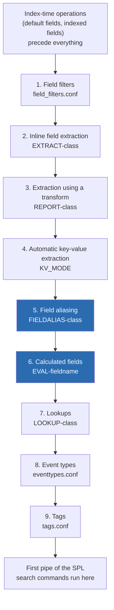

# 5.0 Creating Field Aliases and Calculated Fields (10%)

Two knowledge objects that add fields to events before the first pipe, and one ordering rule (extractions, aliases, calculated fields, lookups, event types, tags) that the exam mines for roughly half of this section's questions and reuses in sections 6.0, 9.0, and 10.0.

## Blueprint mapping

> The following topics are general guidelines for the content likely to be included on the exam; however, other related topics may also appear on any specific delivery of the exam. In order to better reflect the contents of the exam and for clarity purposes, the guidelines below may change at any time without notice.

- Section: 5.0 Creating Field Aliases and Calculated Fields
- Weight: 10%
- 5.1 Describe, create, and use field aliases
- 5.2 Describe, create, and use calculated fields

Exam context: 65 questions, 60 minutes total (which includes 3 minutes to review the exam agreement), entry-level. At 10%, expect roughly 6 or 7 scored items from this section.

Take no answer key from secondary material without checking it against help.splunk.com.

## What it is

A field alias is a second name for a field that already exists on the event. The Splexicon definition is precise about the mechanic: an alias does not replace a field in an event or remove it from an event, it is added to the event alongside the field. After aliasing `clientip` to `src_ip`, an event carries both `clientip` and `src_ip`, both with the same value, and either name can be used in a search, in a lookup match field, or in an eval expression downstream.

A calculated field is an eval expression saved as a knowledge object and bound to a host, source, or source type. It is the knowledge object that represents the output of an eval expression, and nothing else fills that role: there is no "eval field" object and no "calculated lookup" object in Splunk. The documentation defines calculated fields as fields added to events at search time that perform calculations with the values of fields already present in those events, and frames them as a shortcut for repetitive, long, or complex transformations using the `eval` command. Once defined, the field is present on every matching event in every search, so it can be filtered on in the base search the same way an extracted field can.

Do not harden that opening definition into a rule. It speaks of calculating with the values of two or more fields, but the same manual's example `EVAL-x = x * 2` uses one, and the props.conf topic states that the eval statement is as flexible as it is for the `eval` search command. One field is legal, a field alias in place of an extracted field is legal, and an expression naming no field at all, such as a constant or `now()`, is legal. The constraint is directional rather than arithmetic: whatever the expression names has to already exist by step 6.

Neither object stores anything. Both are pure search-time schema. The indexed `_raw` is untouched, and turning either object off makes the field disappear from future searches with no reindexing involved.

Where they sit is the whole game. Splunk applies a fixed nine-step sequence of search-time operations, and each step may reference fields produced by earlier steps but never by later ones.



Three consequences follow directly and all three are testable. You can alias any field extracted at index time or search time, because extraction is steps 2 through 4 and aliasing is step 5. You can use an alias inside a calculated field expression and inside a lookup match field, because both are downstream. You cannot alias a calculated field, a lookup output field, an event type, or a tag, because all of those are downstream of step 5. The other direction is the more commonly tested half: every object after step 5 can consume an alias, meaning calculated fields, lookups, event types, and tags, all four. Field extractions cannot, because they run at steps 2 through 4 and the alias does not exist yet. Within step 5, Splunk "processes field aliases belonging to a specific host, source, or source type in lexicographical order", which is the only route by which one alias can consume another: the class of the alias being read has to sort before the class of the alias reading it.

## Syntax and options

### Field alias, Splunk Web

Navigation: Settings, then Fields, then Field aliases, then the New Field Alias button. The documented step text is `Select Settings > Fields > Field aliases`.

| Option | Values | Default | What it does |
| --- | --- | --- | --- |
| Destination app | Any app the user can write to | none, the docs mark the app selection as required | Sets which app's `local/props.conf` receives the stanza, and therefore the object's app scope |
| Name | Characters `a-z`, `A-Z`, `0-9`, `_` only | none | The `<class>` in `FIELDALIAS-<class>`. Purely a label, but it decides lexicographical ordering against other alias configs on the same host, source, or source type |
| Apply to | `sourcetype`, `source`, `host` | see the note below this table | Chooses which props.conf stanza type the alias is written into |
| named | Free text, wildcards permitted | none | The literal host, source, or source type value the stanza matches |
| Field aliases (left column) | An existing field name | none | The original field. The docs are explicit that the existing field goes on the left side |
| Field aliases (right column) | The new name | none | The alias. The alias goes on the right side |
| Overwrite field values | Checkbox | Not selected. The docs state this literally: "Overwrite field values is not selected by default" | Selected writes `AS`, cleared writes `ASNEW`. See the behaviour table under Result contract |

Two caveats on this table. The on-screen labels Destination app, Apply to, and named, plus the New Field Alias button caption, are not enumerated in the 10.4 topic, which gives the same steps in prose: "Select an app to use the alias", "Enter a name for the alias. Currently supported characters for alias names are a-z, A-Z, 0-9, or _", "Select the host, source, or sourcetype to apply to a default field", and "Enter the name for the existing field and the new alias. The existing field should be on the left side, and the new alias should be on the right side". Take the captions from the product and the semantics from those sentences. The Apply to dropdown's pre-selected value is a product default rather than a documented one, on both forms, so it carries the single marker on the calculated field table below.

### Field alias, props.conf

```ini
[<sourcetype>]
FIELDALIAS-<class> = (<orig_field_name> AS|ASNEW <new_field_name>)+
```

| Element | Values | Default | What it does |
| --- | --- | --- | --- |
| `FIELDALIAS-<class>` | Any class string | No default | Whole setting is absent unless you write it. Class governs lexicographical ordering |
| `<orig_field_name>` | An extracted field | none | The source field. The spec states plainly that it is not removed by this configuration |
| `AS` | Literal keyword | none | If the destination already exists, its value is replaced with the original's. If the original has no value or does not exist, the destination is removed |
| `ASNEW` | Literal keyword, added in 7.2.4 | none | If the destination already exists, it is left alone. If the original has no value or does not exist, the destination is kept |
| `<new_field_name>` | The alias | none | Added alongside the original |

Multiple pairs are legal in one setting, separated by whitespace or continued with a trailing backslash:

```ini
[access_combined]
FIELDALIAS-vendor = vendor_identifier AS vendor_id \
                    vendor_identifier AS vendor_name
FIELDALIAS-foo = user AS myuser id AS myid
```

The reverse is not legal. Mapping two different original fields onto one alias name is documented as an invalid configuration in which only one of the aliases takes effect:

```ini
FIELDALIAS-foo = userID AS user loginID AS user
```

The documented fix is a calculated field with `coalesce`, which also makes the precedence of the inputs explicit: `EVAL-ip = coalesce(clientip,ipaddress)`.

### Calculated field, Splunk Web

Navigation: Settings, then Fields, then the Calculated Fields row, then Add new. The docs give both forms of the path, `Settings > Fields` followed by "On the row for Calculated Fields, click Add new", and `Settings > Fields > Calculated fields`.

| Option | Values | Default | What it does |
| --- | --- | --- | --- |
| Destination app | Any writable app | none, you must select one | App scope of the resulting `EVAL-` stanza |
| Apply to | `sourcetype`, `source`, `host` | The docs state no default and treat the choice as required on both forms; `sourcetype` is pre-selected in the product [verify] | Stanza type. A wildcard is accepted here to apply the field to all hosts, sources, or source types |
| named | Free text, wildcards permitted | none | The stanza value |
| Name | A field name, case sensitive | none | The `<fieldname>` in `EVAL-<fieldname>`. This is the field name, so it is not written inside the expression |
| Eval expression | Any valid eval expression | none | The right-hand side only. No leading `eval` keyword, no `fieldname =` assignment |

The two omissions in the last row are the single most common data-entry error and a reliable distractor. In a search you write `| eval kb = round(bytes/1024, 2)`. In the form, Name is `kb` and Eval expression is `round(bytes/1024, 2)`. Nothing else.

### Calculated field, props.conf

```ini
[access_combined]
EVAL-kb = round(bytes/1024, 2)
```

| Element | Values | Default | What it does |
| --- | --- | --- | --- |
| `EVAL-` prefix | Literal, hyphen required | No default | The docs state the key must start with `EVAL-` including the hyphen, and that `EVAL` itself is not case-sensitive, so `eVaL-kb` is accepted |
| `<fieldname>` | Field name | none | Case sensitive, consistent with all other field names in Splunk |
| `<eval statement>` | Any eval expression | none | Documented as being as flexible as it is for the `eval` search command, and able to evaluate to any value type including multivalue, boolean, or null |

### Scope, and how many objects you need

The docs use the same sentence for both objects: each configuration is specific to events belonging to a particular host, source, or source type. One definition, one selector. A field appearing in two source types that needs the same alias in both therefore needs two alias definitions, one per source type, and the same arithmetic applies to calculated fields. The count does not depend on the original field carrying the same name in both places, and it does not depend on the two source types sharing an index, because an index is not a scope for either object.

Wildcards rescue this less often than people assume. The props.conf spec documents its pattern matching syntax for the `[source::<source>]` and `[host::<host>]` stanza forms, while a bare `[<sourcetype>]` stanza names one literal source type.

## Result contract

Both objects are applied per event, before the first pipe, and neither changes the number of events returned. There is no streaming versus transforming distinction here, because neither is a search command: both run during search-time schema construction, upstream of every SPL command in the pipeline.

Field alias output shape, with `FIELDALIAS-cim = clientip AS src_ip` on `access_combined`:

| _time | clientip | src_ip | status |
| --- | --- | --- | --- |
| 2026-07-19 10:04:11 | 87.194.216.51 | 87.194.216.51 | 200 |
| 2026-07-19 10:04:12 | 182.236.164.11 | 182.236.164.11 | 404 |

Both columns are present, both hold the same value, and both appear in the fields sidebar. `clientip=87.194.216.51` and `src_ip=87.194.216.51` return identical result sets. Neither name has to appear in the search string for both to be on the event.

The two sidebar lists follow different rules. Interesting Fields lists fields that appear in at least 20% of the events, so a sparse field and its alias can both be missing from it. All Fields opens the Select Fields dialog, which lists every field found in the events with no frequency threshold. The 20% figure belongs to Interesting Fields only.

An alias name is a field name, so it is case sensitive: `SRC_IP=87.194.216.51` finds nothing. Field names are case sensitive, field values are not.

The Overwrite field values behaviour, using the documentation's own example of a field alias where original field `src` has been given `dst` as an alias:

| Overwrite field values | Events contain both `src` and `dst` | Events contain only `dst` |
| --- | --- | --- |
| Not selected (default, writes `ASNEW`) | The value of the field alias `dst` is unchanged | The field alias `dst` remains as-is |
| Selected (writes `AS`) | The search head replaces the value of `dst` with the value of `src` | The search head removes `dst` from the event |

Calculated field output shape, with `EVAL-kb = round(bytes/1024, 2)`:

| _time | bytes | kb |
| --- | --- | --- |
| 2026-07-19 10:04:11 | 3423 | 3.34 |
| 2026-07-19 10:04:12 | 1015 | 0.99 |

If the calculated field name collides with an extracted field name, the calculated field wins. The docs are unambiguous: the calculated field overrides the extracted field even if the eval statement evaluates to null. The two documented escapes are `EVAL-field = coalesce(field, <eval expression>)` to keep the extracted value when the expression returns a value, and `EVAL-field = coalesce(<eval expression>, field)` to keep the extracted value only when the expression returns null.

Because both objects run before the pipeline, both names are usable as base-search filters. `index=web sourcetype=access_combined src_ip=87.194.216.51 kb>50` is a valid base search. The docs demonstrate exactly this for calculated fields with `source=eqs7day-M1.csv Description=Deep`.

The ordered-pair consequences table. "Silent" means no error message, the field is simply absent or the expression yields null.

| Configuration you are writing | Field it references | Result | Failure mode |
| --- | --- | --- | --- |
| Field alias (5) | Index-time or search-time extracted field (2 to 4) | Works | none |
| Field alias (5) | Another field alias (5) | Order dependent. Aliases on one host, source, or source type are processed in lexicographical order by `<class>`, so an alias can only consume one whose class sorts earlier | Silent |
| Field alias (5) | Calculated field (6) | Fails. The props.conf spec says outright: you cannot alias a calculated field | Silent |
| Field alias (5) | Lookup output field (7) | Fails | Silent |
| Field alias (5) | Event type (8) or tag (9) | Fails | Silent |
| Calculated field (6) | Extracted field (2 to 4) | Works | none |
| Calculated field (6) | Field alias (5) | Works. The spec states you can use a field alias in the eval statement for a calculated field | none |
| Calculated field (6) | Another calculated field in the same stanza | Fails to chain. Both expressions see the pre-calculation value | Silent, wrong number |
| Calculated field (6) | Lookup output field (7) | Fails. The docs promise an error message here | Error message |
| Calculated field (6) | Event type (8) or tag (9) | Fails | Silent |
| Lookup (7) | Extracted, aliased, or calculated field | Works | none |
| Lookup (7) | Event type (8) or tag (9) | Fails | Silent |
| Event type (8) | Extracted, aliased, calculated, or lookup field | Works | none |
| Event type (8) | Tag (9) | Fails. Search strings that define event types cannot reference tags | Silent |
| Tag (9) | Any field-value pair, including ones added by an event type, lookup, or calculated field | Works | none |

The calculated field row that reads "fails to chain" deserves its own contract, because it is the one place the failure is a wrong answer rather than a missing field. All `EVAL-<fieldname>` configurations within a single props.conf stanza are processed in parallel instead of sequentially. The documentation's example:

```ini
[foo]
EVAL-x = x * 2
EVAL-y = x * 2
```

For an event where `x=4`, the result is `x=8` and `y=8`, because both expressions read the original `x`. The second documented example is the one to memorise, because the wrong answer looks reasonable:

```ini
[access_common]
EVAL-response_time = response_time/1000
EVAL-bitrate = bytes*1000/response_time
```

`response_time` is extracted in milliseconds. The first line converts it to seconds. The second line still divides by the millisecond value, because both `EVAL-` statements are calculated independently of the other.

## Worked examples

These assume the practice dataset from [lab setup](../lab-setup.md) is loaded, with source types `access_combined`, `linux_secure` and `cisco:wsa:squid`.

### 1. Alias a field, then prove the original survives

```ini
[access_combined]
FIELDALIAS-cim_src = clientip AS src_ip
```

```spl
index=web sourcetype=access_combined
| table _time, clientip, src_ip, status
| head 5
```

Five rows, four columns, `clientip` and `src_ip` identical on every row. This is the single fact 5.1 tests hardest: aliasing added a name, it did not consume one. Compare against `| rename clientip AS src_ip`, which returns a `src_ip` column and no `clientip` column at all.

### 2. One field, two aliases

```ini
[access_combined]
FIELDALIAS-vendor = clientip AS vendor_id \
                    clientip AS vendor_identifier
```

```spl
index=web sourcetype=access_combined action=purchase
| stats dc(clientip) AS orig, dc(vendor_id) AS a1, dc(vendor_identifier) AS a2
```

One row, three columns, all three counts equal. A field can have multiple aliases. The inverse is blocked: a single alias can only apply to one field, so `JSESSIONID AS vendor_id` alongside `clientip AS vendor_id` is an invalid configuration in which only one of the two takes effect.

### 3. A calculated field that consumes an alias

```ini
[access_combined]
FIELDALIAS-cim_src = clientip AS src_ip
EVAL-src_first_octet = mvindex(split(src_ip,"."),0)
EVAL-kb = round(bytes/1024, 2)
```

```spl
index=web sourcetype=access_combined kb>50
| stats count BY src_first_octet
| sort - count
```

Two things are proven at once. The eval expression reads `src_ip`, an alias, which is legal because aliasing (5) precedes calculated fields (6). And `kb>50` sits in the base search before any pipe, because the calculated field is materialised during schema construction rather than by a command.

### 4. The parallel-evaluation trap, made visible

```ini
[access_combined]
EVAL-bytes = bytes * 2
EVAL-bytes_doubled = bytes * 2
```

```spl
index=web sourcetype=access_combined
| table bytes, bytes_doubled
| head 5
```

Both columns hold the same number. The intuitive reading, that `bytes_doubled` is four times the raw value because `bytes` was already doubled, is wrong. Both statements read the original extracted `bytes`. Delete these two before continuing.

### 5. The coalesce pattern, both directions

Mapping two source fields onto one normalised name cannot be done with an alias. It is done with a calculated field:

```ini
[access_combined]
EVAL-ip = coalesce(clientip, ipaddress)
```

```spl
index=web sourcetype=access_combined
| stats count(clientip) AS from_clientip, count(ip) AS normalised
```

And to stop a calculated field from clobbering an extraction of the same name:

```ini
[secure]
EVAL-user = coalesce(user, "unknown")
```

Here the extracted `user` wins whenever it has a value, and the literal fills in only where it is null. Reversing the arguments to `coalesce("unknown", user)` would make the calculated field win on every event.

### 6. What a lookup can and cannot see

```ini
[access_combined]
FIELDALIAS-vendorlookup = clientip AS vendor_key
LOOKUP-vendors = vendors_lookup vendor_key OUTPUT VendorCountry
EVAL-country_upper = upper(VendorCountry)
```

The `LOOKUP-` line works, because a lookup may match on an alias. The `EVAL-country_upper` line does not, because `VendorCountry` arrives from a lookup at step 7 and the calculated field runs at step 6. This is the one ordering violation the docs say produces a visible error message rather than silence.

## Decision rules

| You need to | Use | Because |
| --- | --- | --- |
| Give an existing field a second name for every search, permanently, keeping the original | Field alias | Aliases add a name alongside the field and persist as a knowledge object |
| Map a differently named source field onto the name a CIM data model expects | Field alias | The CIM documentation names field aliases as the mechanism to capture differently-named fields in your original data and map them to the field name that the CIM expects |
| Give the same field the same alias in two different source types | Two field aliases, one per source type | Each field alias configuration is specific to one host, source, or source type, and a bare source type stanza names a single literal source type |
| Map two or more different source fields onto one normalised name | Calculated field with `coalesce` | A single alias can only apply to one field. Two originals onto one alias name is an invalid configuration where only one takes effect |
| Derive a value from one or more existing fields, for every search, permanently | Calculated field | The eval expression is saved and applied at search time to every matching event |
| Change a field name for the duration of one search only, after the pipeline has started | `rename` command | `rename` acts on the result set downstream of all nine search-time operations, and it replaces the name rather than adding one |
| Compute a value for the duration of one search only | `eval` command | No knowledge object, no permissions, no app scope, no effect on other users |
| Reference a lookup output field in a derived value | `eval` in the SPL, after the lookup | Lookups are step 7 and calculated fields are step 6, so the knowledge object cannot see the lookup |
| Chain a derived value off another derived value | Two `eval` expressions in the SPL, or one calculated field with the full expression inlined | `EVAL-` statements in a stanza run in parallel and cannot be chained |
| Preserve a destination field that some events already carry | Field alias with Overwrite field values cleared, which writes `ASNEW` | `ASNEW` leaves an existing destination alone and keeps it when the original is missing |
| Force the destination field to always mirror the original, including deleting it when the original is absent | Field alias with Overwrite field values selected, which writes `AS` | `AS` replaces the destination value and removes the destination when the original has no value |

Scope rule for both objects: the target is always a host, a source, or a source type. There is no fourth choice, and "event", "index", and "app" are not scopes.

## Traps

**T-05-01** The alias renames the field. Wrong belief: after aliasing `clientip` to `src_ip`, searching `clientip=*` returns nothing. Correct fact: an alias does not replace a field in an event or remove it from an event, it is added to the event alongside the field. Both names work. The command that actually replaces a name is `rename`, and it only affects the current result set.

**T-05-02** Aliases and `rename` are interchangeable. Wrong belief: `| rename clientip AS src_ip` is the same thing as a field alias. Correct fact: `rename` is a search command that operates on the result set downstream of all nine search-time operations, drops the old name, and lasts one search. An alias is a knowledge object that runs at step 5, keeps the old name, applies to every search against the scoped host, source, or source type, and is subject to app scope and permissions.

**T-05-03** One alias name can collect several source fields. Wrong belief: `FIELDALIAS-x = userID AS user loginID AS user` merges both into `user`. Correct fact: a field can have multiple aliases, but a single alias can only apply to one field. That configuration is documented as invalid, and only one of the two aliases takes effect. The documented answer is `EVAL-user = coalesce(userID, loginID)`.

**T-05-04** The Overwrite field values checkbox is on by default. Wrong belief: it defaults to selected, or it controls whether the original field survives. Correct fact: the docs state that Overwrite field values is not selected by default, and it never touches the original field. It controls the destination field only: selected replaces an existing destination and deletes it when the original is missing, cleared leaves an existing destination alone and keeps it when the original is missing.

**T-05-05** A calculated field can reference a lookup output field. Wrong belief: since lookups add fields to events, an eval expression can use them. Correct fact: calculated fields are step 6 and lookups are step 7. Calculated fields can reference all types of field extractions, and they cannot reference lookups, event types, or tags. The docs promise an error message for this specific violation.

**T-05-06** You can alias a calculated field to give it a CIM name. Wrong belief: define `EVAL-duration_ms`, then alias it to `duration`. Correct fact: aliasing is step 5 and calculated fields are step 6. The props.conf spec states directly that you cannot alias a calculated field. Give the calculated field the CIM name in the first place, or use a second calculated field.

**T-05-07** Calculated fields in one stanza run top to bottom and chain. Wrong belief: `EVAL-response_time = response_time/1000` followed by `EVAL-bitrate = bytes*1000/response_time` uses the converted seconds value. Correct fact: all `EVAL-<fieldname>` configurations within a single props.conf stanza are processed in parallel instead of sequentially, so `bitrate` still divides by the original millisecond value. This trap produces a plausible wrong number, not a missing field.

**T-05-08** The Eval expression form field takes a full eval statement. Wrong belief: the box should contain `eval kb = round(bytes/1024, 2)`, or at least `kb = round(bytes/1024, 2)`. Correct fact: the field name is a separate form field (Name in the UI, `<fieldname>` in `EVAL-<fieldname>`), and the Eval expression box holds the right-hand side only. There is no leading `eval` keyword and no assignment.

**T-05-09** A calculated field defers to an existing extracted field of the same name. Wrong belief: if `status` is already extracted, `EVAL-status` only fills in the gaps. Correct fact: the calculated field overrides the extracted field, even if the eval statement evaluates to null. Preserving the extraction requires `EVAL-field = coalesce(field, <eval expression>)`, or `EVAL-field = coalesce(<eval expression>, field)` if you only want the extraction to win when the expression returns null.

**T-05-10** Aliases and calculated fields can only be used after a pipe. Wrong belief: you must write `sourcetype=x | search src_ip=1.2.3.4` because the alias is not real until the pipeline runs. Correct fact: both objects are applied during search-time schema construction, before the first pipe, so both are valid base-search terms. The docs demonstrate `source=eqs7day-M1.csv Description=Deep` against a calculated field.

**T-05-11** The scope choices are host, source, and event, or host, source, and index. Wrong belief, and an answer key error found in circulating material for question E encodes exactly this error with "Host, Source, Events". Correct fact: both the alias form and the calculated field form scope to a host, a source, or a source type. Nothing else. This is the same triple that every props.conf stanza type maps to.

**T-05-12** A calculated field can be scoped to an aliased source type. Wrong belief: alias a source type value, then point the `EVAL-` stanza at the alias. Correct fact: creation of a calculated field on an aliased source is not supported, and you cannot create a calculated field that is scoped to an aliased host, source, or source type. The documented workaround is to filter inside the expression instead, for example `if(response_code=200,len(app),null)`.

**T-05-13** The conf-file settings are `ALIAS-` and `CALC-`. Wrong belief, built from plausible-sounding names. Correct fact: `FIELDALIAS-<class>` and `EVAL-<fieldname>`, both in props.conf, both with no default. The `EVAL` portion is not case-sensitive but the hyphen is required and the `<fieldname>` portion is case sensitive. Field aliases live in props.conf, not in fields.conf, transforms.conf, or aliases.conf.

**T-05-14** A newly created alias or calculated field is immediately visible to the whole team. Wrong belief. Correct fact: the knowledge object is private to you when you first create it, meaning that other users cannot see it or use it. Sharing to an app or globally is a separate step under Settings, Fields, then the object's Permissions link. By default only admin and power roles can share and promote knowledge objects, and a power user can only change permissions for objects they own.

**T-05-15** Naming an alias after an internal field is a neat way to override the timestamp. Wrong belief: alias `eventStartTime` to `_time` to re-timestamp events at search time. Correct fact: the docs warn not to create a field alias for a field with the same name as an internal field such as `_time`, because it produces unpredictable search results.

**T-05-16** One alias definition covers the field wherever it appears. Wrong belief: a field present in two source types needs one alias, or the number needed depends on the index or on the original field names matching. Correct fact: each field alias configuration is specific to events belonging to a particular host, source, or source type, so two source types need two alias definitions. Index is not a scope, and the pattern matching syntax is documented for the `host::` and `source::` stanza forms, not for a bare source type stanza.

**T-05-17** A calculated field has to be based on an extracted field, or has to combine two or more fields. Wrong belief, usually picked up from the opening line of the docs. Correct fact: the eval statement is as flexible as it is for the `eval` search command, so it may read one field, several fields, a field alias, or no field at all. The real rule is directional: calculated fields can reference all types of field extractions and field aliases, and cannot reference lookups, event types, or tags.

**T-05-18** Alias names are not case sensitive in a search. Wrong belief: since `src_ip=DEEP` and `src_ip=deep` match the same events, `SRC_IP=deep` must work too. Correct fact: an alias name is a field name, and field names are case sensitive while field values are not.

## Lab

Fifteen minutes on a single-node Splunk Enterprise 10.x instance with the practice dataset loaded. Work in the Search & Reporting app throughout.

### Part 1: create the alias (4 minutes)

1. Settings, then Fields, then Field aliases, then New Field Alias.
2. Destination app: `search`.
3. Name: `cim_src`.
4. Apply to: `sourcetype`, named: `access_combined`.
5. Field aliases: left box `clientip`, right box `src_ip`.
6. Leave Overwrite field values cleared.
7. Save.

Verification:

```spl
index=web sourcetype=access_combined
| table _time, clientip, src_ip
| head 5
```

Both columns are populated and identical. Now confirm the alias is a real search term rather than a display artefact:

```spl
index=web sourcetype=access_combined src_ip=*
| stats count AS via_alias
| appendcols [ search index=web sourcetype=access_combined clientip=* | stats count AS via_original ]
```

Both counts match.

### Part 2: create the calculated field (4 minutes)

1. Settings, then Fields, then the Calculated Fields row, then Add new.
2. Destination app: `search`.
3. Apply to: `sourcetype`, named: `access_combined`.
4. Name: `kb`.
5. Eval expression: `round(bytes/1024, 2)`. No `eval`, no `kb =`.
6. Save.

Verification, including a base-search filter to prove it exists before the first pipe:

```spl
index=web sourcetype=access_combined kb>50
| stats count, avg(kb) AS avg_kb, max(bytes) AS max_bytes
```

### Part 3: prove the ordering rule in both directions (5 minutes)

Add a second calculated field that consumes the alias. Same path, Name `src_first_octet`, Eval expression `mvindex(split(src_ip,"."),0)`. Save.

Now attempt the illegal direction. Settings, then Fields, then Field aliases, then New Field Alias. Name `bad_alias`, Apply to `sourcetype` named `access_combined`, left box `kb`, right box `kilobytes`. Save.

Single verification search that shows the legal reference working and the illegal one producing nothing:

```spl
index=web sourcetype=access_combined
| stats count AS events,
        count(src_ip) AS alias_ok,
        count(src_first_octet) AS calc_reads_alias_ok,
        count(kb) AS calc_ok,
        count(kilobytes) AS alias_of_calc_FAILS
```

`alias_ok`, `calc_reads_alias_ok`, and `calc_ok` all equal `events`. `alias_of_calc_FAILS` is zero, with no error anywhere in the UI. That silence is the point of trap T-05-06.

### Part 4: cleanup (2 minutes)

Delete `bad_alias` from Settings, then Fields, then Field aliases. Keep `cim_src`, `kb`, and `src_first_octet` if you want them for the section 10.0 CIM lab, or delete all four to leave the instance clean.

## Self-check

**Q1.** A field alias is created on source type `access_combined` mapping `clientip` to `src_ip`. Which statement is true after the alias is saved and shared?

A. Searching `clientip=10.1.1.1` returns no events, because the field has been renamed.
B. Both `clientip` and `src_ip` are present on the event and either can be searched.
C. `src_ip` is only available after a `| rename` in the search.
D. The alias is written to the indexed data, so previously indexed events are unaffected.

**Q2.** Which configuration is invalid?

A. `FIELDALIAS-a = clientip AS vendor_id clientip AS vendor_name`
B. `FIELDALIAS-b = userID AS user loginID AS user`
C. `EVAL-user = coalesce(userID, loginID)`
D. `FIELDALIAS-c = ip AS ipaddress`

**Q3.** A props.conf stanza contains both lines below. The extracted `response_time` is in milliseconds and `bytes` is extracted normally. What does `bitrate` divide by?

```ini
EVAL-response_time = response_time/1000
EVAL-bitrate = bytes*1000/response_time
```

A. The value of `response_time` in seconds, because the first line runs first.
B. The original value of `response_time` in milliseconds.
C. Null, because a calculated field cannot reference another calculated field at all.
D. The value of `bytes`, because the expression is evaluated left to right.

**Q4.** In the New Calculated Field form, a Power User wants the field `kb` to hold kilobytes. What goes in the Eval expression box?

A. `eval kb = round(bytes/1024, 2)`
B. `kb = round(bytes/1024, 2)`
C. `round(bytes/1024, 2)`
D. `| eval kb = round(bytes/1024, 2)`

**Q5.** Which of these can a calculated field's eval expression reference?

A. A field added to the event by an automatic lookup.
B. A tag applied to a field-value pair.
C. A field alias defined on the same source type.
D. An event type that matches the event.

**Q6.** Which pair correctly names the props.conf settings for field aliases and calculated fields?

A. `ALIAS-<class>` and `CALC-<fieldname>`
B. `FIELDALIAS-<class>` and `EVAL-<fieldname>`
C. `FIELDALIAS-<class>` in fields.conf and `EVAL-<fieldname>` in props.conf
D. `RENAME-<class>` and `EVAL-<fieldname>`

**Q7.** An alias maps `src` to `dst`. Some events already have their own `dst` field. Overwrite field values is left at its default. What happens to those events?

A. `dst` is replaced with the value of `src`.
B. `dst` is removed from the event.
C. The value of `dst` is unchanged.
D. The alias is rejected at save time because of the collision.

**Q8.** A calculated field named `status` is created on a source type where `status` is already extracted, and the eval expression returns null for a given event. What is the value of `status` on that event?

A. The originally extracted value, because a null expression is ignored.
B. Null, because the calculated field overrides the extracted field even when the expression evaluates to null.
C. Both values, as a multivalue field.
D. The search fails with a field collision error.

**Q9.** The field `cs_username` is extracted from both `iis_web` and `proxy_json` events. Only this stanza exists:

```ini
[iis_web]
FIELDALIAS-user = cs_username AS user
```

What does `(sourcetype=iis_web OR sourcetype=proxy_json) user=*` return?

A. Events from both source types, because the alias applies wherever the original field is found.
B. Events from `iis_web` only, because an alias configuration is specific to one host, source, or source type.
C. Events from both source types, but only if they are written to the same index.
D. No events, because `user` cannot be used in the base search.

**Q10.** A calculated field is defined on `access_combined`, where `src_ip` is a field alias of `clientip`:

```ini
EVAL-src_label = "ip: " . src_ip
```

What happens?

A. It fails, because a calculated field expression must reference at least one extracted field.
B. It fails, because a calculated field cannot reference a field alias.
C. It works, producing `src_label` on every event that has `src_ip`.
D. It works only if the alias class sorts before `src_label` lexicographically.

<details><summary>Answers</summary>

**Q1: B.** An alias does not replace a field in an event or remove it from an event, it is added to the event alongside the field. A is the `rename` behaviour, which drops the old name from the result set, and describes trap T-05-01. C is wrong because aliases are applied at step 5 of the search-time sequence, before the first pipe, so no command is needed to surface the field. D confuses search-time and index-time: aliases are pure search-time schema, they touch no indexed data, and they apply to already-indexed events immediately.

**Q2: B.** A single alias can only apply to one field, so mapping two originals onto the same `user` name is documented as an invalid configuration in which only one of the aliases takes effect. A is valid and is the documented example of the legal inverse, one field with two aliases. C is the documented fix for B, a calculated field using `coalesce`, which also makes the input ordering explicit. D is the documented example from the props.conf alias topic.

**Q3: B.** All `EVAL-<fieldname>` configurations within a single props.conf stanza are processed in parallel instead of sequentially, so both expressions read the originally extracted millisecond value. A is the intuitive but wrong reading and the whole point of trap T-05-07. C overstates the rule: the expressions do not chain, but they still evaluate successfully against extracted fields, so nothing is null. D is nonsense arithmetic dressed up as an ordering rule.

**Q4: C.** The field name is a separate form field, and the Eval expression box holds the right-hand side only. A includes the `eval` keyword, which belongs in a search pipeline. B includes the assignment, which duplicates the Name form field. D adds a leading pipe, which belongs to SPL syntax and never appears in a knowledge object definition.

**Q5: C.** Field aliasing is step 5 and calculated fields are step 6, so an alias is available to the eval expression, and the props.conf spec says so explicitly. A is wrong because lookups are step 7 and the docs promise an error message for this exact violation. B and D are wrong because event types are step 8 and tags are step 9, both downstream, and the calculated fields topic lists lookups, event types, and tags together as things calculated fields cannot reference.

**Q6: B.** Both settings live in props.conf. A invents plausible names that do not exist. C is right about `EVAL-` but puts the alias in fields.conf, which handles field extraction properties rather than aliases. D borrows the name of the `rename` search command, which is not a props.conf setting at all.

**Q7: C.** Overwrite field values is not selected by default, which writes `ASNEW`, and `ASNEW` leaves an existing destination field alone. A is the behaviour when the box is selected, which writes `AS`. B is also `AS` behaviour, but only in the case where the original field has no value or does not exist, which is not the scenario described. D is invented: the collision is a documented and supported situation, which is precisely why the checkbox exists.

**Q8: B.** The calculated field overrides the extracted field, even if the eval statement evaluates to null. A describes the behaviour you get only by writing `EVAL-status = coalesce(status, <expression>)`. C is wrong because the calculated field replaces the value rather than appending to it, even though eval expressions can legitimately produce multivalue results in other situations. D invents an error: the override is silent, which is why the `coalesce` guidance exists in the docs.

**Q9: B.** Each field alias configuration is specific to one host, source, or source type, and this stanza names only `iis_web`, so `proxy_json` events never gain `user` and the `user=*` term filters them out. Covering both takes a second alias in a `[proxy_json]` stanza. A is trap T-05-16: the alias follows the stanza, not the field name. C invents an index dependency, and an index is not a scope for any props.conf object. D contradicts step 5 running before the first pipe, which makes `user` a legal base-search term for the events that carry it.

**Q10: C.** Aliasing is step 5 and calculated fields are step 6, so `src_ip` exists by the time the expression runs, and the eval statement is as flexible as it is for the `eval` search command, string concatenation included. A is trap T-05-17: there is no requirement to reference an extracted field, or any field. B inverts the sequence, and the props.conf spec explicitly permits a field alias inside a calculated field expression. D borrows a real rule out of context: lexicographical order governs alias classes competing inside step 5, not the relationship between an alias and a calculated field, which the step order settles on its own.

</details>

## Docs

Read in this order.

1. [The sequence of search-time operations](https://help.splunk.com/en/splunk-enterprise/manage-knowledge-objects/knowledge-management-manual/10.4/get-started-with-knowledge-objects/the-sequence-of-search-time-operations) - the nine-step table with each step's props.conf setting, plus the per-step Restrictions sections. Memorise the table. 20 minutes.
2. [About tags and aliases](https://help.splunk.com/en/splunk-enterprise/manage-knowledge-objects/knowledge-management-manual/10.4/tags/about-tags-and-aliases) - the one-paragraph definition of an alias and the `http_referrer` normalisation example. 5 minutes.
3. [Create field aliases in Splunk Web](https://help.splunk.com/en/splunk-enterprise/manage-knowledge-objects/knowledge-management-manual/10.4/field-aliases/create-field-aliases-in-splunk-web) - the eight numbered steps, the Overwrite field values table, and the closing section on mapping one alias name to multiple original fields. 12 minutes.
4. [Configure field aliases with props.conf](https://help.splunk.com/en/splunk-enterprise/manage-knowledge-objects/knowledge-management-manual/10.4/field-aliases/configure-field-aliases-with-props.conf) - the `FIELDALIAS-<class>` syntax and the `accesslog` example that feeds a lookup. 6 minutes.
5. [About calculated fields](https://help.splunk.com/en/splunk-enterprise/manage-knowledge-objects/knowledge-management-manual/10.4/calculated-fields/about-calculated-fields) - Restrictions, Preventing overrides of existing fields, and Calculated fields independence. The two independence examples are directly examinable. 15 minutes.
6. [Create calculated fields with Splunk Web](https://help.splunk.com/en/splunk-enterprise/manage-knowledge-objects/knowledge-management-manual/10.4/calculated-fields/create-calculated-fields-with-splunk-web) - the six steps and the private-by-default note. 4 minutes.
7. [Configure calculated fields with props.conf](https://help.splunk.com/en/splunk-enterprise/manage-knowledge-objects/knowledge-management-manual/10.4/calculated-fields/configure-calculated-fields-with-props.conf) - the `EVAL-` prefix rules, field name case sensitivity, and the earthquake `case()` example. 6 minutes.
8. [props.conf spec, 10.4](https://help.splunk.com/en/splunk-enterprise/administer/admin-manual/10.4/configuration-file-reference/10.4.0-configuration-file-reference/props.conf) - read only the `FIELDALIAS-<class>`, `EVAL-<fieldname>`, and `LOOKUP-<class>` entries. This is the only place `AS` versus `ASNEW` is specified precisely. 10 minutes.
9. [Field alias behavior change](https://help.splunk.com/en/splunk-enterprise/release-notes-and-updates/release-notes/10.4/known-issues-for-this-release/field-alias-behavior-change) - the 7.2.4 change and the lexicographical collision rule between competing `AS` configurations. 6 minutes.
10. [Manage knowledge object permissions](https://help.splunk.com/en/splunk-enterprise/manage-knowledge-objects/knowledge-management-manual/10.4/get-started-with-knowledge-objects/manage-knowledge-object-permissions) - private by default, and which roles can promote. 6 minutes.
11. [Understand and use the Common Information Model Add-on](https://help.splunk.com/en/splunk-enterprise/manage-knowledge-objects/knowledge-management-manual/10.4/get-started-with-knowledge-objects/understand-and-use-the-common-information-model-add-on) - read now for the normalisation framing, then again for section 10.0. 5 minutes.
12. [eval command reference, 10.4](https://help.splunk.com/en/splunk-enterprise/search/spl-search-reference/10.4/search-commands/eval) - the function catalogue behind every calculated field expression. Skim now, return to it for section 2.0. 15 minutes.
