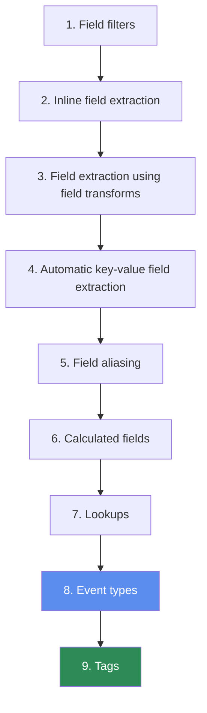
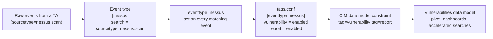

# 6.0 Creating Tags and Event Types (10%)

This section is the classification half of Splunk knowledge management: tags label field-value pairs so you can search by meaning instead of by literal value, and event types label whole events so you can search by category instead of by search string. They are the two knowledge objects at the very end of the search-time sequence, and almost every wrong answer here comes from one of four confusions: what a tag is attached to, exactly how a tag search is written, what an event type search may contain, and which end of the priority scale wins.

## Blueprint mapping

> The following topics are general guidelines for the content likely to be included on the exam; however, other related topics may also appear on any specific delivery of the exam. In order to better reflect the contents of the exam and for clarity purposes, the guidelines below may change at any time without notice.

- Section 6.0 Creating Tags and Event Types, 10% of the exam
- 6.1 Create and use tags
- 6.2 Describe event types and their uses
- 6.3 Create an event type

Read both secondary sources for orientation only. Every default, every option name and every click path below comes from help.splunk.com for Splunk Enterprise 10.4.

## What it is

A **tag** is a label attached to a **field-value pair**. Not to an event. Not to a field. The unit of tagging is the combination of one field name and one specific value of that field, written `<field>=<value>`. The docs state it directly: tags "enable you to assign names to specific field and value combinations, including event type, host, source, or source type." One field-value pair can carry many tags, and one tag can be attached to many field-value pairs. That two-way many-to-many relationship is the whole point: an IP address of a router located in San Francisco inside Building 1 could carry the tags `router`, `SF` and `Building1`, and every router IP in the estate can share the single tag `router`.

The stated purpose is readability: tags track abstract field values, IP addresses and ID numbers, by giving them descriptive names, and group several distinct values under one searchable name. "Tags make your data more understandable" is therefore always a true statement about tags, and it is what separates them from event types, which categorise events using a saved search string. The pair you tag can come from anywhere, since tags apply to fields "extracted at index time, search time, or added through some other method". The tag itself is always search-time, because "tags come last in the sequence of search-time operations". A tag is never created at index time.

An **event type** is a saved search string that classifies events. Any event returned by that search string gets the field `eventtype` set to the event type's name at search time. It is a categorization system, not a shortcut for typing. Splunk's own guidance is that "using event types as a short cut for search is not recommended" and that search macros are the better tool for shortening a search, because macros can contain other search commands, can be parameterized, and do not incur costs when events are retrieved.

Both objects are applied at search time, and their position in the sequence is examinable. The full documented sequence of search-time operations is:



The consequences fall straight out of that ordering. Calculated fields (6) cannot reference lookups, event types or tags. Lookups (7) cannot reference event types or tags. An event type search string **can** reference a lookup output field, because 7 runs before 8, but it cannot reference a tag. Tags (9) can be applied to any field-value pair produced by any earlier operation, which is exactly why you can tag an event type: `eventtype` is just another field by the time step 9 runs.

That last point is the mechanism the Common Information Model is built on.



CIM never tags raw events directly. A technology add-on defines event types over its sourcetypes, tags those event types in `tags.conf`, and the CIM data model constrains on those tags. Change the event type definition and every downstream model follows.

## Syntax and options

### Tag search syntax

```spl
tag=<tagname>
tag::<field>=<tagname>
```

Those two forms are the only documented ones. `tag=<tagname>` matches events where **any** tagged field-value pair carries that tag. `tag::<field>=<tagname>` restricts the match to tags attached to values of that one field. The separator is a **double colon** with no space around it, it sits between `tag` and the field name, and the term is `tag`, singular. Both forms end in a tag name, so `tag::<field>` on its own is not a search.

The asterisk wildcard is documented on the tag name: `tag::eventtype=IP-*`, `tag::host=*local*`, and `NOT tag::eventtype=*`. The docs also state generally that you can use the asterisk when you search keywords and field values, "including for eventtypes and tags", so the unscoped form takes it too. `tag=Priv*` is as legal as the scoped examples, and a wildcard is the safe way to match a tag name whose exact capitalisation you are unsure of (see T-06-12).

| Option | Values | Default | What it does |
| --- | --- | --- | --- |
| `tag=<tagname>` | any tag name, wildcards allowed | none (required) | Matches events with that tag on any field-value pair |
| `tag::<field>=<tagname>` | any field name and tag name, wildcards documented on the tag name | none (required) | Matches events where that specific field's value carries that tag |

Documented wildcard examples: `tag::eventtype=IP-*` matches event types tagged `IP-src`, `IP-dest` and so on; `tag::host=*local*` finds hosts whose tags contain `local`; `NOT tag::eventtype=*` finds event types with no tags at all. Tag terms combine with Boolean operators like any other search term: `tag=router tag=SF NOT (tag=Building1)`.

### tags.conf

```ini
[<fieldname>=<value>]
<tag1> = <enabled|disabled>
<tag2> = <enabled|disabled>
```

| Setting | Values | Default | What it does |
| --- | --- | --- | --- |
| stanza `[<fieldname>=<value>]` | one field-value pair per stanza | none (required) | The field name and value the tags in the stanza apply to, for example `host=localhost` |
| `<tag>` | `enabled` or `disabled` | None stated in the spec, so write it explicitly. Every stanza in `tags.conf.example` uses `enabled` | Enables or disables that one tag for this field-value pair |

Spec rules that are easy to test on: only one tag is allowed per stanza line; do not put the tag value in quotes (`foo=enabled`, never `"foo"=enabled`); each stanza refers to exactly one field-value pair; URL-encode the value when it contains `\n`, `=` or `[ ]`. There is no `tags.conf` in `$SPLUNK_HOME/etc/system/default/`, so every tag on the system is something a person or an app created.

### eventtypes.conf

```ini
[$EVENTTYPE]
disabled = <1|0>
search = <string>
description = <string>
priority = <integer>
color = <string>
```

| Setting | Values | Default | What it does |
| --- | --- | --- | --- |
| stanza `[$EVENTTYPE]` | any unique name | none (required) | The event type name, which becomes the value of the `eventtype` field |
| `search` | a search string with no pipe after the simple search, no subsearch, no `savedsearch` reference | none (required) | The classifier. Every event this search returns gets `eventtype=<name>` |
| `disabled` | `1` or `0` | None stated in the spec. The spec says "Set to 1 to disable", so a stanza with no `disabled` line is active | Turns the event type off without deleting it |
| `description` | free text | none | Human readable explanation shown in Settings |
| `priority` | integer 1 through 10, declared in the spec as `priority = <integer, 1 through 10>` | none (the attribute is omitted when you do not set one) | "1 is the highest priority and 10 is the lowest priority." Controls display order and colour precedence |
| `color` | `none`, `et_blue`, `et_green`, `et_magenta`, `et_orange`, `et_purple`, `et_red`, `et_sky`, `et_teal`, `et_yellow` | `none` | Colour band drawn beside matching events in the events list |
| `tags` | free text | none | **Deprecated.** The spec points you to `tags.conf.spec` instead |

That table is the whole surface of an event type: `disabled`, `search`, `description`, `priority`, `color`, plus the deprecated `tags`, and nothing else. There is no time-range attribute, no result-formatting attribute, no rank and no weight. An event type cannot pin itself to the last 24 hours; the time range is whatever the running search uses. That is the sharpest discriminator against a saved search, which stores a search plus its time range and its formatting, while an event type contributes a searchable field value you can drop into any future search over any time range.

File precedence locations: `$SPLUNK_HOME/etc/system/default/eventtypes.conf` holds the few shipped event types, `$SPLUNK_HOME/etc/system/local/` and `$SPLUNK_HOME/etc/apps/<app>/local/` hold administrator and app definitions, and anything you create in Splunk Web lands in `$SPLUNK_HOME/etc/users/<username>/<app>/local/eventtypes.conf` until you share it.

### Routes to create an event type

Three routes exist in Splunk Web, and the fourth is the file itself. Know all four by their exact menu wording, because the exam builds options out of near-miss menu names.

1. **Run a search, then Save As, Event Type.** The search bar contents become the definition, so the dialog has no Search String box. You supply Name, and optionally Tag(s), Color and Priority.
2. **Settings, Event Types, New.** The full form, including Destination App and a Search String you type yourself. Use it when you are not currently looking at results.
3. **Expand an event in the results, click Event Actions, select Build Event Type.** This opens the Event Type Builder, where you pick which of the event's own fields and terms form the classifier and set a Style (the colour) and a Priority. It turns one interesting event into a category without writing the search string by hand.
4. **Edit `eventtypes.conf` directly** in `$SPLUNK_HOME/etc/system/local/` or an app's `local/` directory, then reload.

One command is worth knowing so you do not mistake it for a creation route. `findtypes` analyses the events returned by the search in front of it and prints candidate event type definitions, 10 by default, changeable with `max`, from at most 5000 events. It finds and prints. It saves nothing. There is no `searchtypes` command.

```spl
index=security sourcetype=linux_secure "failed password" | findtypes
```

### Splunk Web form fields

| Form field | Present in Save As, Event Type | Present in Settings, Event Types, New | Required | Default |
| --- | --- | --- | --- | --- |
| Destination App | no (uses current app context) | yes | no | current app context |
| Name | yes | yes | yes, and must be unique | none |
| Search String | no (taken from the search bar) | yes | yes | none |
| Tag(s) | yes | yes | no | none |
| Color | yes | yes | no | none |
| Priority | yes | yes | no | `eventtypes.conf` documents `priority = <integer, 1 through 10>` and states that 1 is the highest priority and 10 the lowest. No default is documented. |

## Result contract

Neither a tag nor an event type is a search command, so neither transforms the result set. Both are **search-time field enrichments** applied before your first pipe. Nothing is dropped, no rows are collapsed, and the shape of your result table is unchanged by their existence.

What they add:

- **Event types add one field: `eventtype`.** It is set on every event matching the event type's search string. When an event matches two or more event types, `eventtype` becomes a **multivalue field** holding every matching name. Splunk orders those values by priority score first and then lexicographically.
- **Tags add nothing to the event body.** The one ordering statement in the docs is that Splunk "applies tags to field/value pairs in events in ASCII sort order", which is order of application, not precedence: no tag overrides another. A tag is a search-time alias for a field-value pair. Tagging `host=web01` with `webserver` does not change the value of `host`; the docs are explicit that "tagging the host field with an alternate hostname doesn't change the actual value of the host field, but it lets you search for the tag you specified instead." The `tag` and `tag::<field>` forms are documented as searchable terms. Grouping on them as ordinary fields, as in `| stats count by tag`, works in the product, but no 10.4 page states it, so do not answer a question on that basis. [verify]

A concrete shape. Suppose `all_system_errors` (priority 7, colour `et_orange`) and `critical_disk_error` (priority 3, colour `et_purple`) both exist, and `critical_disk_error` is tagged `urgent`.

| _time | host | eventtype | tag::eventtype | colour band shown |
| --- | --- | --- | --- | --- |
| 12:00:01 | web01 | all_system_errors | (none) | orange |
| 12:00:04 | db02 | critical_disk_error<br/>all_system_errors | urgent | purple |

Row two shows the three testable behaviours at once: `eventtype` is multivalue, the better priority value (3) sorts `critical_disk_error` first, and only one colour is displayed for an event, the colour belonging to the event type with the best priority.

Tags do not create a colour band and have no priority. Colour and priority are event type properties only.

## Worked examples

All examples assume the practice dataset from [lab setup](../lab-setup.md) is loaded: `index=web` (`access_combined`), `index=security` (`linux_secure`), and `index=cisco` (`cisco:wsa:squid`).

**1. Tag a set of HTTP status values, then search by meaning.**

```ini
[status=404]
client_error = enabled
[status=403]
client_error = enabled
[status=500]
server_error = enabled
[status=503]
server_error = enabled
```

```spl
index=web sourcetype=access_combined tag=client_error
```

Returns every 403 and every 404 without naming either code. Four separate `tags.conf` stanzas, because each stanza describes exactly one field-value pair, and two distinct tags across those four pairs.

**2. Restrict a tag search to one field.**

```spl
index=web sourcetype=access_combined tag::status=client_error
```

Identical results to example 1 here, but different semantics. If someone later tags `http_status=404` or `error_code=404` with `client_error` in another app, example 1 would widen and this one would not. Use the double-colon form whenever a tag name is reused across fields.

**3. Create an event type over the tagged values and count by it.**

```ini
[web_client_error]
search = index=web sourcetype=access_combined status>=400 status<500
priority = 3
color = et_red
```

```spl
index=web sourcetype=access_combined eventtype=web_client_error | stats count by status, clientip | sort - count
```

The `eventtype=web_client_error` term is a plain field-value match against the field the event type set at step 8 of the search-time sequence. The `| stats` pipe is in your ad hoc search, not in the event type definition, which is what keeps the definition legal.

**4. Find purchases that a lookup confirms, using a lookup output field inside an event type.**

```ini
[confirmed_vip_purchase]
search = index=web sourcetype=access_combined action=purchase vip_status=gold
priority = 1
color = et_purple
```

`vip_status` here is an output field from an automatic lookup on `clientip`. This is legal precisely because lookups run at step 7 and event types at step 8. Reverse the dependency (a calculated field in `props.conf` that references `eventtype=confirmed_vip_purchase`) and it silently fails, because calculated fields run at step 6.

**5. Nest an event type inside another event type and then tag the outer one.**

```ini
[web_purchase]
search = index=web sourcetype=access_combined action=purchase
priority = 1

[web_failed_purchase]
search = eventtype=web_purchase status>=400
priority = 2
```

```ini
[eventtype=web_failed_purchase]
failed_transaction = enabled
alert = enabled
```

```spl
tag::eventtype=failed_transaction | stats count by clientip
```

An event type search string may reference another event type, but only when the inner one is processed first. The one ordering rule inside step 8 is that Splunk "processes event types first by priority score and then by lexicographical order", which is why the inner event type carries priority 1: on names alone `web_f...` sorts before `web_p...` and the outer one would be evaluated before the field it depends on exists. No 10.4 page states outright that nesting is supported, and the exam does not test it. [verify] The tag search reaches the events through two indirections, tag to event type to event, which is the CIM add-on pattern: one narrow event type per sourcetype plus a tag layer that data models constrain on.

**6. Audit your own knowledge objects.**

```spl
index=* NOT tag::eventtype=* | stats count by eventtype
```

```spl
index=security sourcetype=linux_secure | stats count by eventtype, tag
```

The first finds event types nobody has tagged, which in a CIM deployment means data that will never appear in a data model. The second cross-tabulates classification against labelling for the security sourcetype.

## Decision rules

| Question | Rule |
| --- | --- |
| I want to search several values of one field by a single name. | Tag each field-value pair with the same tag name. |
| I want to attach several names to one value. | Tag the same field-value pair repeatedly. Many tags per pair is normal. |
| I want a name for a whole category of events, not a single value. | Event type. Tags cannot classify an event, only a field-value pair. |
| The classifier needs a pipe, `stats`, `eval`, or a subsearch. | Not an event type. Use a report, or a search macro if you want a reusable fragment. |
| I want a reusable search fragment I can drop into other searches. | Search macro, per Splunk's own recommendation. Event types are for classification. |
| I want a saved search I run on demand or on a schedule. | Report (or alert). An event type is never "run"; it is applied automatically to every matching event. |
| The saved object must always cover the same time range, or carry its own formatting. | Report. An event type stanza has no time-range and no formatting attribute. |
| I want the classifier reusable inside future searches over any time range. | Event type. It becomes `eventtype=<name>`, a plain search term. |
| I want a classifier built from one interesting event, without typing a search string. | Expand the event, Event Actions, Build Event Type. |
| Two event types match the same event and I care which colour shows. | Give the more specific event type the better (lower) priority. 1 wins over 10. |
| I need to restrict a tag search to one field. | `tag::<field>=<tagname>`, double colon. |
| I need my event type to use a lookup output field. | Legal. Lookups run before event types. |
| I need a calculated field that depends on an event type. | Impossible. Calculated fields run before lookups, event types and tags. |
| I need a data model to pick up my sourcetype. | Create an event type over the sourcetype, tag the event type with the CIM tags, and let the model constrain on the tags. |
| I want the tag to disappear for one app only. | Do not use Settings, Tags, List by tag name to disable it. That disables it across all apps that contain the tag. |

## Traps

**T-06-01** Tags attach to events. **Wrong.** A tag attaches to a field-value pair, `<field>=<value>`. You cannot tag "this event"; you tag `host=web01`, `index=security sourcetype=linux_secure`, `status=404` or `eventtype=failed_login`. The event picks up the tag only because it contains that pair. This is the single most tested fact in the section, and the most common distractor pair is "a tag is applied to a field" versus "a tag is applied to a field-value pair". Choose the pair.

**T-06-02** `tag:<field>=<name>` with one colon, or `tag.<field>`, or `tag[field]`. **Wrong.** The field-scoped form is `tag::<field>=<tagname>` with exactly two colons and no spaces. `tag=<tagname>` with no field scope searches every tagged field-value pair. Both forms accept the `*` wildcard.

**T-06-03** An event type can contain a pipe as long as the pipe comes last. **Wrong.** The documentation forbids a search that "includes a pipe operator after a simple search" and a search that "includes a subsearch". Position does not rescue it. If a question shows `index=web sourcetype=access_combined status=404 | stats count` as a candidate event type definition, that option is invalid regardless of what else it does.

**T-06-04** An event type can reference a report with `savedsearch`. **Wrong.** The same restriction list forbids referencing a report with the `savedsearch` command inside an event type definition.

**T-06-05** Priority 10 is the highest priority. **Wrong.** Priority is an integer 1 through 10 and "1 is the best Priority and 10 is the worst". Lower number wins. The docs' own example gives `critical_disk_error` priority 3 and `all_system_errors` priority 7, and 3 is described as the better value.

**T-06-06** Priority only affects sort order. **Incomplete, and the exam exploits it.** Priority does two things: event types with a priority are listed above event types without one and are ordered by their priority value, and only one event type colour can be displayed per event, so the colour of the event type with the best priority is the one that renders. Event types with no priority set are ordered alphabetically below those that have one.

**T-06-07** `eventtype` is a single-valued field. **Wrong.** A single event can match multiple event types, and when it matches two or more, `eventtype` acts as a multivalue field. Splunk orders the values by priority score first and then lexicographically.

**T-06-08** An event type is the same thing as a saved search or a report. **Wrong on the dimensions the exam cares about.** A report is a saved search you run, on demand or on a schedule; it returns a result set and it stores its own time range and formatting. An event type is a classification applied automatically at search time to every matching event of every search; you never run it, you search for the field value it produces. A report may contain pipes, transforming commands and subsearches. An event type may not.

**T-06-09** Tags run before event types, or lookups run after event types. **Wrong.** The documented order is field filters, inline field extraction, field extraction using field transforms, automatic key-value field extraction, field aliasing, calculated fields, lookups, event types, tags. Tags are last. Event types are second to last, immediately after lookups. Therefore: a tag can be applied to an event type; an event type search can reference a lookup output field; a calculated field cannot reference an event type; a lookup cannot reference an event type or a tag; an event type cannot reference a tag.

**T-06-10** Settings, Tags has one list. **Wrong.** It has three views: **List by field-value pair**, **List by tag name**, and **All unique tag objects**. They are not interchangeable. Disabling a tag from the List by tag name page disables it across all apps that contain it, which is a scope trap the exam can build a scenario around. All unique tag objects is the view that exposes each tag-name to field-value-pair to app combination for per-object permission edits.

**T-06-11** You define tags for an event type using the `tags` attribute in `eventtypes.conf`. **Wrong.** That attribute exists but the spec marks it deprecated and points to `tags.conf.spec`. Tags on an event type live in `tags.conf` under a stanza header of the form `[eventtype=<name>]`, exactly like any other field-value pair. This is the CIM pattern.

**T-06-12** Field names versus field values in a tag search. The documented rule is "field names are case sensitive, but field values are not", so `tag::Host=webserver` and `tag::host=webserver` are different searches because `Host` and `host` are different field names. That part is settled.

Whether the **tag name itself** is case sensitive is not settled. The 10.4 tags pages and the tag-search page state nothing about it either way. Two readings exist, and the exam may test either:

- A tag name is matched as a value of the `tag` pseudo-field, and field values are not case sensitive, so `tag=WebServer` and `tag=webserver` would match the same pairs. This is an inference from the general rule, not a documented sentence.
- Tag names are case sensitive in their own right. This is asserted widely in unofficial material and stated nowhere in the docs. If it holds, a question of the form "which search finds the tag `Privileged`" has exactly one right answer instead of several.

Two consequences. A wildcard that preserves the original capitalisation, `tag=Priv*`, matches under either reading, so prefer it when it is offered. And you can **resolve this on your own instance in under a minute**: tag a pair with `Privileged`, run `tag=privileged`, `tag=Privileged` and `tag=priv*`, record which return events in `source-notes/`, and the trap closes. Field-value case sensitivity is a different question and is settled: see `topics/04-field-extractions.md`. [verify]

**T-06-13** Material in circulation keys "tags use event types, you can set priority and color" as false, while its own worked example creates an event type with a priority and a colour and then tags it. The correct reading: priority and colour are set **on the event type**, and that event type can then be tagged. Priority and colour are never properties of a tag.

**T-06-14** Tagging `host=web01` renames the host. **Wrong.** Tagging never changes the underlying field value. It adds a searchable alternate label. This is why tagging is the standard remedy when a host value changed for an input and historical events still carry the old value: tag both values with one tag and search the tag.

**T-06-15** The search term is `tags=<tagname>`, or a bare `tag::<fieldname>` finds everything tagged on that field. **Wrong on both counts.** The term is singular, `tag`, and the scoped form always ends with `=<tagname>`, because the tag name is what you match. Wrong options here are mutations of the two real forms: pluralised, single-coloned, colons after the field name instead of before it, or a field name where the tag name belongs. If no option is exactly `tag=<tagname>` or `tag::<field>=<tagname>`, none of them is right.

**T-06-16** Event types are defined in `props.conf`, or created with a `searchtypes` command. **Wrong.** Definitions are stanzas in `eventtypes.conf`, the stanza header being the event type name; `props.conf` holds extractions, aliases, calculated fields and lookup bindings, and has no `event_type` stanza. The discovery command is `findtypes`, and it only suggests. The three Splunk Web routes are Save As, Event Type; Settings, Event Types, New; and Event Actions, Build Event Type.

**T-06-17** An event type stores a time range, output formatting, a rank or a weight. **Wrong.** The stanza has five live attributes: `disabled`, `search`, `description`, `priority` and `color`. A stored time range and stored formatting belong to a report. Rank and weight are not event type concepts at all, so when they appear as options against "what decides which colour an event shows", the answer is **priority**.

## Lab

Fifteen minutes, single-node Splunk Enterprise 10.4, practice dataset loaded, logged in as `admin`.

**Step 1, tag a field-value pair from search results (about 3 minutes).**

Run:

```spl
index=web sourcetype=access_combined status=404 | head 20
```

Expand any result row, find the `status` field with value `404`, click the arrow in its **Actions** column and select **Edit Tags**. The Field Value box should already read `status=404`. In the Tags box type `client_error, page_missing` (comma or space separated both work). Click **Save**. Repeat for `status=403` with the tag `client_error`.

**Step 2, confirm the three views (about 2 minutes).**

Go to **Settings**, **Tags**. Confirm the three views: **List by field-value pair**, **List by tag name** and **All unique tag objects**. In List by tag name, `client_error` shows two field-value pairs. In List by field-value pair, `status=404` shows two tags.

**Step 3, create an event type from Settings (about 4 minutes).**

Go to **Settings**, **Event Types**, click **New**. Set Destination App to `search`. Name: `bc_web_client_error`. Search String: `index=web sourcetype=access_combined status>=400 status<500`. Tag(s): `web_error`. Color: pick **Red**. Priority: **2**. Click **Save**.

**Step 4, create a second, broader event type to prove colour precedence (about 3 minutes).**

From the search bar run:

```spl
index=web sourcetype=access_combined status>=400
```

Click **Save As**, then **Event Type**. Name: `bc_web_any_error`. Color: **Orange**. Priority: **8**. Save. Then try the third route without saving: expand any event, click **Event Actions**, select **Build Event Type**, and note that the builder offers Style and Priority.

**Step 5, verify (about 3 minutes).**

```spl
index=web sourcetype=access_combined eventtype=* | stats count by eventtype
```

You should see rows for `bc_web_any_error` alone and for the multivalue combination containing both event types. Now check colour precedence and ordering:

```spl
index=web sourcetype=access_combined status=404 | head 5
```

In the events list the colour band should be **red**, not orange, because priority 2 beats priority 8, and in the expanded `eventtype` field `bc_web_client_error` should be listed before `bc_web_any_error`.

Finally verify the tag layer reaches through the event type:

```spl
tag::eventtype=web_error | stats count by status
```

This should return only 4xx rows. If it returns nothing, the event type tag was not saved: reopen it in **Settings**, **Event Types**, confirm the Tags field contains `web_error`, and Save.

Optional inspection of what you wrote to disk:

```spl
| rest /servicesNS/-/-/configs/conf-eventtypes | search title=bc_web_* | table title, search, priority, color, eai:acl.app, eai:acl.sharing
```

## Self-check

**1.** A tag in Splunk is applied to which of the following?

A. An individual event
B. A field name
C. A field-value pair
D. A sourcetype only

**2.** Which search returns events where the `host` field's value carries a tag whose name begins with `prod`?

A. `tag=host:prod*`
B. `tag::host=prod*`
C. `tag.host=prod*`
D. `host::tag=prod*`

**3.** Which of these is a valid event type definition?

A. `index=web sourcetype=access_combined action=purchase | stats sum(bytes) by categoryId`
B. `index=web sourcetype=access_combined action=purchase [search index=web sourcetype=access_combined action=purchase | fields productId]`
C. `index=web sourcetype=access_combined action=purchase productId=DB-SG-G01 vip_status=gold` where `vip_status` comes from an automatic lookup
D. `| savedsearch daily_sales_report`

**4.** An event matches `all_errors` (priority 9, colour orange) and `disk_failure` (priority 2, colour purple). What does the events list show?

A. A purple band, and `disk_failure` listed before `all_errors` in the `eventtype` field
B. An orange band, and `all_errors` listed before `disk_failure`
C. Both bands, one above the other
D. No band, because a conflict suppresses colouring

**5.** A knowledge manager wants a calculated field `error_class` that is set only when `eventtype=web_client_error`. What happens?

A. It works, because calculated fields are evaluated last
B. It fails, because calculated fields are evaluated before event types
C. It works only if the event type has a priority of 1
D. It works only if the event type is shared globally

**6.** Which statement about `eventtype` is correct?

A. An event can match at most one event type
B. `eventtype` is an index-time field
C. `eventtype` becomes a multivalue field when an event matches two or more event types
D. `eventtype` is only populated when the search explicitly names the event type

**7.** Where do tags applied to an event type live?

A. In the `tags` attribute of the event type's stanza in `eventtypes.conf`
B. In `tags.conf` under a stanza header `[eventtype=<name>]`
C. In `props.conf` under the sourcetype stanza
D. In `savedsearches.conf`

**8.** A user disables the tag `deprecated_host` from Settings, Tags, List by tag name. What is the scope of that change?

A. Only the current app
B. Only the field-value pair that was selected
C. All apps that contain the tag
D. Only the current user's private objects

**9.** An analyst runs this search:

```spl
index=security sourcetype=linux_secure "failed password" | findtypes
```

What is the result?

A. Splunk creates event types for the patterns it discovers and lists them in Settings, Event Types
B. Splunk returns suggested event type definitions built from the matching events, and saves nothing
C. Splunk returns the existing event types that already match those events
D. The search fails, because the command that discovers event types is `searchtypes`

**10.** A knowledge manager writes this stanza, intending the event type to classify only the last 24 hours of data:

```ini
[recent_failed_logins]
search = index=security sourcetype=linux_secure "failed password"
priority = 4
color = et_red
earliest = -24h
```

What is the effect on classification?

A. Only events from the last 24 hours receive `eventtype=recent_failed_logins`, in every search that runs
B. The search string alone decides what matches, and the time range is whatever the running search uses
C. The definition is invalid for the same reason a pipe is invalid, so no event is classified
D. The event type is now schedulable and runs itself every 24 hours

<details><summary>Answers</summary>

**1. C.** A tag is assigned to a specific field and value combination. **A is wrong**: an event only inherits a tag because it contains the tagged pair; you never tag an event directly, and no UI path lets you. **B is wrong**: tagging a field name alone would label every value of that field, which is what a field alias or a calculated field does, not a tag. **D is wrong**: `sourcetype=<value>` is one of many taggable pairs (host, source, sourcetype and eventtype are all named in the docs), not the only one.

**2. B.** The field-scoped tag syntax is `tag::<field>=<tagname>` with a double colon, and the `*` wildcard is documented on the tag name side (`tag::eventtype=IP-*`). **A is wrong**: there is no `tag=<field>:<name>` form; the field goes after `tag::`, not inside the value. **C is wrong**: dot notation is not tag syntax anywhere in SPL. **D is wrong**: the operand order is inverted; `tag` is always the left-hand side.

**3. C.** Event types may reference lookup output fields because lookups run at step 7 of the search-time sequence and event types at step 8. **A is wrong**: it includes a pipe operator after the simple search, which the docs forbid. **B is wrong**: it includes a subsearch, also explicitly forbidden. **D is wrong**: the docs forbid referencing a report with the `savedsearch` command inside an event type, and it also begins with a pipe.

**4. A.** 1 is the best priority and 10 is the worst, so priority 2 beats priority 9. Only one event type colour is displayed per event and it belongs to the event type with the best priority, so the band is purple; the same priority ordering sorts the multivalue `eventtype` field. **B is wrong**: it inverts the scale, the single most common distractor here. **C is wrong**: the docs state only one event type colour can be displayed for each event. **D is wrong**: priority exists precisely to resolve this, so nothing is suppressed.

**5. B.** The documented sequence puts calculated fields at step 6 and event types at step 8, and the docs state directly that calculated fields cannot reference lookups, event types or tags. **A is wrong**: tags are last, not calculated fields. **C is wrong**: priority controls display order and colour precedence, never evaluation order relative to other knowledge object types. **D is wrong**: sharing changes visibility and permissions, not the search-time sequence.

**6. C.** A single event can match multiple event types, and `eventtype` acts as a multivalue field when it matches two or more. **A is wrong**: multiple matches are normal and are the reason priority exists. **B is wrong**: event types are applied at search time, step 8, not at index time. **D is wrong**: every event type whose search matches is applied to every event any search returns, whether or not you mention it.

**7. B.** Tags on an event type are ordinary tags on the field-value pair `eventtype=<name>`, so they live in `tags.conf` under `[eventtype=<name>]`. This is the CIM mechanism. **A is wrong**: the `tags` attribute does exist in `eventtypes.conf` but the spec marks it deprecated and redirects to `tags.conf.spec`. **C is wrong**: `props.conf` holds extractions, aliases, calculated fields and lookups, not tags. **D is wrong**: `savedsearches.conf` holds reports and alerts.

**8. C.** The docs state that disabling a tag through the List by tag name page disables the tag across all apps that contain the tag. **A is wrong**: app scoping applies to where an object is defined and shared, not to this particular disable action. **B is wrong**: per-pair disabling is what the List by field-value pair view and the All unique tag objects view give you. **D is wrong**: the action is not scoped to the user's private objects.

**9. B.** `findtypes` analyses the events returned by the search in front of it and prints candidate event type definitions, 10 by default and from at most 5000 events. It is a discovery aid, not a creation route. **A is wrong**: nothing is saved, and the three Splunk Web creation routes are Save As, Event Type; Settings, Event Types, New; and Event Actions, Build Event Type. **C is wrong**: existing event types already appear on the events in the `eventtype` field, so listing them is a job for `| stats count by eventtype`. **D is wrong**: the command is `findtypes`; `searchtypes` does not exist.

**10. B.** An `eventtypes.conf` stanza has five live attributes, `disabled`, `search`, `description`, `priority` and `color`, and no time-range attribute to honour. The event type is applied to whatever events the running search returns, so the time range comes from that search. If a fixed time range is a requirement, the object needed is a report. **A is wrong**: that is what a saved search stores. **C is wrong**: the documented restrictions concern the `search` value itself (no pipe after the simple search, no subsearch, no `savedsearch` reference), and this search string breaks none of them, so classification still happens. **D is wrong**: an event type is never run; it is applied automatically to every matching event of every search, which is why priority and colour exist.

</details>

## Docs

Read in this order.

1. [About tags and aliases](https://help.splunk.com/en/splunk-enterprise/manage-knowledge-objects/knowledge-management-manual/10.4/tags/about-tags-and-aliases) - a tag attaches to a field-value pair, and how tags differ from field aliases. 8 minutes.
2. [Tag field-value pairs in Search](https://help.splunk.com/en/splunk-enterprise/manage-knowledge-objects/knowledge-management-manual/10.4/tags/tag-field-value-pairs-in-search) - the Actions, Edit Tags click path, both syntax forms, every wildcard example. 10 minutes.
3. [Define and manage tags in Settings](https://help.splunk.com/en/splunk-enterprise/manage-knowledge-objects/knowledge-management-manual/10.4/tags/define-and-manage-tags-in-settings) - the three views and the cross-app disable warning. 10 minutes.
4. [Tag the host field](https://help.splunk.com/en/splunk-enterprise/manage-knowledge-objects/knowledge-management-manual/10.4/tags/tag-the-host-field) - tagging does not change the field value. 4 minutes.
5. [About event types](https://help.splunk.com/en/splunk-enterprise/manage-knowledge-objects/knowledge-management-manual/10.4/event-types/about-event-types) - definition, the pipe and subsearch restrictions, the multivalue `eventtype` field, the "use a macro instead" guidance. 12 minutes.
6. [Define event types in Splunk Web](https://help.splunk.com/en/splunk-enterprise/manage-knowledge-objects/knowledge-management-manual/10.4/event-types/define-event-types-in-splunk-web) - the Settings and Save As routes and every form field. Memorise the field order. 8 minutes.
7. [About event type priorities](https://help.splunk.com/en/splunk-enterprise/manage-knowledge-objects/knowledge-management-manual/10.4/event-types/about-event-type-priorities) - entirely examinable: 1 is best, 10 is worst, one colour per event. 4 minutes.
8. [Automatically find and build event types](https://help.splunk.com/en/splunk-enterprise/manage-knowledge-objects/knowledge-management-manual/10.4/event-types/automatically-find-and-build-event-types) - the Build Event Type route and the `findtypes` command. 6 minutes.
9. [Configure event types in eventtypes.conf](https://help.splunk.com/en/splunk-enterprise/manage-knowledge-objects/knowledge-management-manual/10.4/event-types/configure-event-types-in-eventtypes.conf) - stanza syntax, the colour list, file locations. 6 minutes.
10. [Tag event types](https://help.splunk.com/en/splunk-enterprise/manage-knowledge-objects/knowledge-management-manual/10.4/tags/tag-event-types) - the tag layer on top of the event type layer. 5 minutes.
11. [The sequence of search-time operations](https://help.splunk.com/en/splunk-enterprise/manage-knowledge-objects/knowledge-management-manual/10.4/get-started-with-knowledge-objects/the-sequence-of-search-time-operations) - the nine steps and the can-reference rules. Worth memorising outright. 10 minutes.
12. [Manage knowledge object permissions](https://help.splunk.com/en/splunk-enterprise/manage-knowledge-objects/knowledge-management-manual/10.4/get-started-with-knowledge-objects/manage-knowledge-object-permissions) - Private, App, All apps, and which roles may promote. 8 minutes.
13. [Use the CIM to normalize data at search time](https://help.splunk.com/en/splunk-enterprise/common-information-model/8.6/using-the-common-information-model/use-the-cim-to-normalize-data-at-search-time) - why event types get tagged, with the `[eventtype=nessus]` example. Context only, not directly examined. 6 minutes.
