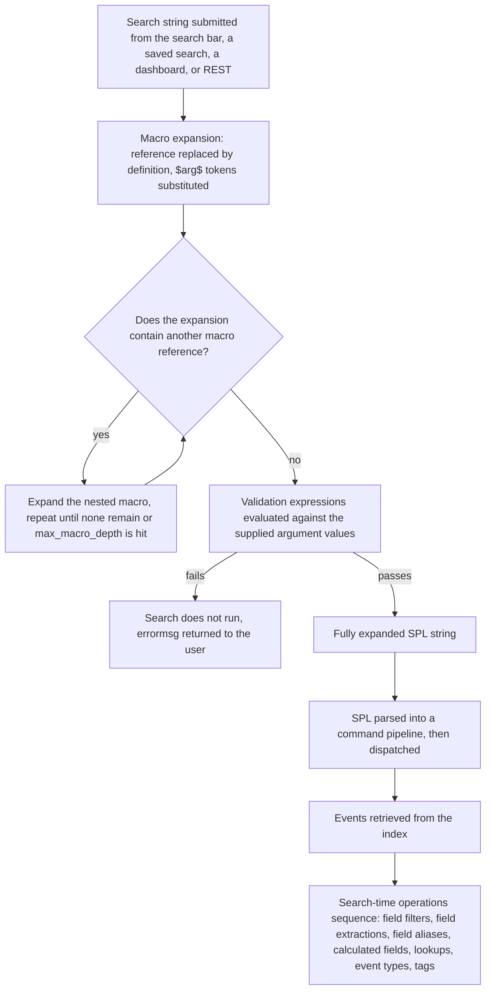

# 7.0 Creating and Using Macros (10%)

Search macros are reusable chunks of SPL substituted into a search as text before the search is parsed, and the exam weights them at 10% because the syntax is small, exact, and easy to write unambiguous questions about: backticks, the argument count in the name, and the dollar-sign tokens.

## Blueprint mapping

- Section 7.0 Creating and Using Macros, 10% of the exam
- 7.1 Describe macros
- 7.2 Create and use a basic macro
- 7.3 Define arguments and variables for a macro
- 7.4 Add and use arguments with a macro

> The following topics are general guidelines for the content likely to be included on the exam; however, other related topics may also appear on any specific delivery of the exam. In order to better reflect the contents of the exam and for clarity purposes, the guidelines below may change at any time without notice.

| Source | Coverage | Honest assessment |
| --- | --- | --- |
| Udemy, Splunk: Zero to Power User (Hailie Shaw), Modules 19A and 19B | Creating a macro in Splunk Web, using it in a search, adding arguments | Correct on mechanics and backtick syntax. Thin on validation, eval-based definitions, nested macros, and macros.conf. |
| Apress, Splunk Certified Study Guide (Deep Mehta, 2021), Chapter 3, "Create a Macro Using Splunk Web" and "Create a Macro Using the .conf File" | One zero-argument macro, created twice | Materially incomplete. Arguments, the argument count in the stanza name, validation, errormsg, and iseval are all absent, so 7.3 and 7.4 are never covered. It also states that editing macros.conf requires a full restart, which the Admin Manual contradicts. Record that in source-notes. |

## What it is

The Knowledge Management Manual states it plainly: "Search macros are reusable chunks of Search Processing Language (SPL) that you can insert into other searches. Search macros can be any part of a search, such as an eval statement or search term, and do not need to be a complete command."

Three properties follow, and the exam leans on all three. A macro need not be a whole search or even a whole command, so it can expand to a single search term, a command fragment, or part of one argument to a command. The reverse holds too: a macro can be an entire search, base terms and every piped command included. Any claim that a macro must contain the full search, or must contain only a portion of one, is wrong on the word must. Nothing fixes the time range either. A definition has no time range of its own unless you write earliest or latest into it, so the search inherits whatever the time picker or the saved search supplies. That is all the phrase "flexible time range" amounts to, and it is not documentation wording. Expansion is textual: the macro reference is replaced by the definition string with argument tokens substituted, and only then is the result handed to the SPL parser. And because expansion precedes parsing, a macro is never applied to events the way a field alias, a calculated field, or a lookup is applied.

That last point is the structural distinction the exam wants. The page "The sequence of search-time operations" lists nine operations, from field filters and the extraction steps through field aliasing, calculated fields, lookups, event types, and tags, and search macros are not among them. A macro is a knowledge object, managed in Settings alongside the others and stored in macros.conf, but it never takes a turn in that sequence, because by the time the sequence begins the macro has already become ordinary search text.



Each macros.conf stanza is one macro, and because the stanza name carries the argument count a name can be overloaded: the spec states that "[foobar], [foobar(1)], [foobar(2)], and so forth" are not the same macro. Permissions follow the normal knowledge object model: a new macro belongs to the app context you created it in, a macro shared at app level resolves only inside that app, and only the admin and power roles can share or promote by default. A macro that is not visible from the app you are searching in produces an unknown-macro error, not an empty result.

## Syntax and options

Invocation uses backtick characters, one before the macro name and one after. On most English-language keyboards the backtick shares a key with the tilde.

```spl
sourcetype=access_* | `mymacro`
```

Because the reference becomes ordinary search text before parsing, it carries no placement rule of its own: it can open a search, sit mid-pipeline, or be followed by a pipe and any number of further commands, as the manual's example above shows. What it does need is visibility. The user must have read permission on the macro and must be searching from an app context where it resolves; ownership is not part of it. The one placement rule that does exist runs the other way and concerns generating commands, below.

Arguments go in parentheses inside the backticks, positionally or by name.

```spl
`argmacro(120,300)`
`argmacro(lo=120,hi=300)`
`argmacro(hi=300,lo=120)`
```

Those three are equivalent for a two-argument macro whose arguments are named lo and hi. Escape quotation marks inside a quoted argument value with backslashes: `` `mymacro("He said \"hello!\"")` ``. If the definition begins with a generating command (the docs name from, search, metadata, inputlookup, pivot, tstats, and rest), leave the leading pipe out of the definition and write it in front of the macro reference instead, as `` | `mygeneratingmacro` ``.

The Splunk Web form is at Settings, then Advanced search, then Search macros, then the button to create a new macro (the documentation step reads "Click New"; in Splunk Enterprise 10.x the button is labelled New Search Macro [verify]). Step one of the documented procedure is verbatim "Select Settings > Advanced Search > Search macros." Memorise that location, because macros are the odd one out: field extractions, field transformations, field aliases, calculated fields, and workflow actions all sit under Settings, then Fields. Reaching for Fields, or for Searches, reports, and alerts, is the standard wrong turn. The fields, in documentation order:

| Option | Values | Default | What it does |
| --- | --- | --- | --- |
| Destination app | Any app the user can write to | The app you are currently in | Restricts the macro to that app and decides which app directory the macros.conf stanza is written to. |
| Name | Unique string. If the macro takes arguments, append the argument count in parentheses, e.g. mymacro(2) | none, required | Becomes the macros.conf stanza name and the token you type between backticks. The number is a count, not an index or a version. |
| Definition | Any SPL fragment, with argument tokens written as $argname$ | none, required | The string the macro expands to. Argument substitution is global across the string, including inside quotation marks. |
| Use eval-based definition? | Checkbox, on or off | off (macros.conf iseval = false) | When on, the Definition is an eval expression that must return a string, and that returned string is the expansion. |
| Arguments | Comma-delimited list of names in order. Alphanumerics, underscores, and hyphens only. No repeats. Written without dollar signs. | none (empty) | Declares the names the $argname$ tokens refer to. Ignored if the stanza name says the macro takes no arguments. |
| Validation expression | An eval expression returning a Boolean or a string | none (empty) | Checked against supplied argument values before the search is dispatched. |
| Validation error message | Free text | none (empty) | Returned when a Boolean validation expression does not evaluate to true. |

Only two of those fields are required, and the documented step list says so by prefixing every other step with "(Optional)": Destination app, Use eval-based definition?, Arguments, Validation expression, and Validation error message. "Enter a unique Name" and "In Definition, enter the search string" carry no such prefix. A macro is a name plus a definition; the rest is refinement. Note too that neither the form nor macros.conf has an argument-count setting. The count is written once, inside the name, and args holds names rather than a number.

Names and values belong to different moments, and the exam tests the split. Names are declared when the macro is created, in the Arguments field (macros.conf args), and referenced in the Definition as `$name$` tokens. Values are supplied at execution, inside the backticks: `` `mymacro(value1,value2)` ``, comma-separated, with no dollar signs anywhere in the invocation. Those values resolve the search string as the macro expands, and they are what the validation expression is checked against. Nothing about a value is known at creation time, and nothing about a name is decided at execution.

The same seven things are the macros.conf settings, plus an optional description.

```ini
[bc_status_band(2)]
args = lo, hi
definition = index=main sourcetype=access_combined_wcookie status>=$lo$ status<$hi$
validation = isnum($lo$) AND isnum($hi$)
errormsg = Both lo and hi must be numeric HTTP status codes.
iseval = false
description = Buttercup Games web access events in a half-open HTTP status range.
```

| macros.conf setting | Values | Default | What it does |
| --- | --- | --- | --- |
| Stanza name | `<name>` or `<name>(<numargs>)` | none, required | Identifies the macro. Macros can be overloaded on argument count. |
| args | Comma-separated names, alphanumerics, underscores and hyphens only, no repeats | none | Argument names. Ignored when the stanza name indicates no arguments. |
| definition | String | none | What the macro expands to after substitution. The spec: "The Splunk platform replaces the $<arg>$ pattern globally in the string, even inside quotation marks." |
| validation | An eval expression evaluating to a Boolean or a string | none | Boolean form: true passes, false or NULL fails and errormsg is returned. Non-Boolean form: NULL passes, and any returned string is itself the error message. |
| errormsg | String | none | Used only by the Boolean form of validation. |
| iseval | true or false | false | true means definition is an eval expression returning the expansion string. |
| description | String | none | Optional documentation of what the macro does. |

Two escaping rules matter, and they pull in opposite directions. Inside a definition, `$argname$` is the substitution token, and a literal dollar sign is written by doubling it as `$$` [verify]. Inside a search, a macro reference sitting inside a quoted value is not expanded at all: the spec gives ``"foo`bar`baz"``, the manual ``"audit`users`local"``. So argument tokens are substituted even inside quotation marks, while macro references inside quotation marks are inert.

Nesting is supported and, per the spec, "nesting can be indefinite and cycles will be detected and result in an error". The practical ceiling is limits.conf, [search] stanza, max_macro_depth: the maximum recursion depth for macro expansion, minimum 1, default 100.

## Result contract

A macro has no result contract of its own: it is not a command, so it creates no fields, drops none, and changes no row or column shape. The contract of a search containing a macro is entirely that of the expanded SPL, and whether the search is streaming or transforming is decided by the commands the macro expanded into. A macro expanding to `stats count by product_name` makes the search transforming at that point; one expanding to `eval margin=price-sale_price` leaves it streaming.

The one output a macro produces directly is the expansion preview. With the cursor in the search bar, press Control-Shift-E on Linux and Windows, or Command-Shift-E on macOS. The preview shows the expanded search string including all nested search macros and saved searches, and offers Open in Search. Using the macros defined below:

| Search as typed | Search after expansion |
| --- | --- |
| `` `bc_web` `` | `index=main sourcetype=access_combined_wcookie` |
| `` `bc_purchases` `` | `index=main sourcetype=access_combined_wcookie action=purchase` |
| `` `bc_status_band(400,500)` `` | `index=main sourcetype=access_combined_wcookie status>=400 status<500` |
| `` `bc_span(3600)` `` (eval-based) | `span=1h` |

Failure modes are part of the contract too. An unknown macro name, or one not visible from the current app, errors and the search does not run. Calling with the wrong number of arguments looks for a stanza with that count and errors if there is none; it does not silently fall back. A failed validation expression stops the search before dispatch, so you get an error rather than zero results.

## Worked examples

Splunk tutorial data (Buttercup Games) in index=main, sourcetypes access_combined_wcookie, vendor_sales, secure.

### 1. Zero-argument macro standardising the index and sourcetype prefix

Macro `bc_web`, no arguments, definition `index=main sourcetype=access_combined_wcookie`.

```spl
`bc_web` status=200 | stats count by action
```

Expands to `index=main sourcetype=access_combined_wcookie status=200 | stats count by action` and returns a two-column table, action and count, one row per distinct action. Highest-value real-world use: the index and sourcetype pair is written once, so every search stays correct when the index is renamed.

### 2. Nested macro

Macro `bc_purchases`, no arguments, definition `` `bc_web` action=purchase ``.

```spl
`bc_purchases` | stats sum(price) as revenue by product_name | sort - revenue
```

Expansion runs in two passes: `bc_purchases` becomes `` `bc_web` action=purchase ``, then `bc_web` becomes the index and sourcetype terms. Result: a two-column table, product_name and revenue, sorted descending.

### 3. Wrapping an expensive transaction, plus a parameterised span

Adapted from the documentation examples page. Macro `makesessions`, no arguments, definition `transaction clientip maxpause=30m`. Macro `pageviews_per_session(1)`, Arguments field `span`, definition:

```spl
`bc_web` | `makesessions` | timechart $span$ sum(eventcount) as pageviews count as sessions
```

Invoked as `` `pageviews_per_session(span=1h)` ``. The argument value is the whole string `span=1h`, so `$span$` supplies an entire option to timechart rather than just a value: the concrete demonstration of "a macro can be any part of a search". The result is a timechart, a _time column plus pageviews and sessions, one row per hour.

### 4. Two arguments with Boolean validation

Name `bc_status_band(2)`, Arguments `lo, hi`, definition `index=main sourcetype=access_combined_wcookie status>=$lo$ status<$hi$`, validation expression `isnum($lo$) AND isnum($hi$)`, validation error message `Both lo and hi must be numeric HTTP status codes.`

```spl
`bc_status_band(400,500)` | stats count by status, uri_path | sort - count
```

Returns client-error events only, as a three-column table. Called as `` `bc_status_band(four_hundred,500)` `` the search never dispatches and the user sees the error message. The docs show two writing styles for validation: the Knowledge Management Manual uses the token form `isnum($rate$)`, while macros.conf.example uses bare argument names, as in `validation = foo > bar`. Both are official; prefer the token form, which is what the exam-facing manual teaches.

### 5. Non-Boolean validation with validate()

Name `bc_top(1)`, Arguments `count`, definition `index=main sourcetype=access_combined_wcookie action=purchase | top limit=$count$ product_name`, validation expression:

```spl
validate(isnum($count$), "count must be a number", $count$ > 0 AND $count$ <= 100, "count must be between 1 and 100")
```

validate() "takes a list of conditions and values and returns the value that corresponds to the condition that evaluates to FALSE" and defaults to NULL when all conditions are true. Because this expression is not Boolean, NULL means success and any returned string is itself the message, so the Validation error message field is unused. `` `bc_top(10)` `` returns the standard top output (product_name, count, percent), ten rows. `` `bc_top(500)` `` never runs and reports "count must be between 1 and 100".

### 6. Eval-based definition

Name `bc_span(1)`, Arguments `seconds`, Use eval-based definition? checked, definition `if($seconds$ >= 86400, "span=1d", "span=1h")`.

```spl
`bc_web` | timechart `bc_span(3600)` count by status
```

Substitution happens first, so the expression evaluated is `if(3600 >= 86400, "span=1d", "span=1h")`, which returns the string `span=1h`, and that string is spliced into the search. The final search is `index=main sourcetype=access_combined_wcookie | timechart span=1h count by status`. Two syntax points catch people: the expression must return a string, so literal SPL text inside it needs double quotation marks, and the whole thing must still be valid eval syntax after substitution.

## Decision rules

| Situation | Rule |
| --- | --- |
| The chunk is always the same text | Zero-argument macro. Do not add an argument you will always call with one value. |
| The chunk varies by a caller-supplied value | Add arguments. Name the macro with the count, list names in Arguments, reference them as $name$ in Definition. |
| The chunk varies by a whole option or clause | Still an argument. Pass `span=1h` as the value, as in `` `pageviews_per_session(span=1h)` ``. |
| The expansion text must be chosen conditionally | Eval-based definition returning the expansion string. |
| The caller could supply a nonsense value | Validation expression. Boolean form plus Validation error message for one condition; validate() non-Boolean form for several conditions with distinct messages. |
| The definition starts with a generating command | Drop the leading pipe from the definition, write it before the backtick in the search. |
| The macro is needed from more than one app | Share globally (All apps). App-level sharing resolves only inside that app. |
| The reference would sit inside a quoted string | It will not expand. Restructure so the backticks are outside the quotation marks. |
| You need to know what the search really is | Control-Shift-E, or Command-Shift-E on macOS. |
| You edited macros.conf on disk | Refresh the endpoints, for example `http://<server>:8000/en-US/debug/refresh`. macros.conf is on the Admin Manual's no-restart list. |

## Traps

**T-07-01** Backticks, not quotation marks. Wrong belief: a macro is invoked as `'mymacro'`, because the glyphs look alike in some fonts. Correct: the delimiter is the backtick, the character sharing a key with the tilde. Single or double quotation marks do not invoke a macro; the text is just a search term. Any option using `'` or `"` around the macro name is wrong.

**T-07-02** The number in the name is the argument count. Wrong belief: `mymacro(2)` means "the second form" or "use argument 2". Correct, verbatim: "if your search macro mymacro includes two arguments, name it mymacro(2)". You store `mymacro(2)` and invoke `` `mymacro(foo,bar)` ``. The stored name carries a count, the invocation carries values.

**T-07-03** Arguments field takes bare names; Definition uses dollar tokens. Wrong belief: you write `$val$, $rate$` in the Arguments field to match the definition. Correct: Arguments is "a comma-delimited string of argument names", written bare as `val, rate`, while the Definition references them as `$val$` and `$rate$`.

**T-07-04** Quotation marks affect references and tokens differently. Wrong belief: one rule covers both. Correct, from the same spec file: "The Splunk platform does not expand macros when they are inside quoted values", and, separately, "The Splunk platform replaces the $<arg>$ pattern globally in the string, even inside quotation marks."

**T-07-05** Validation semantics are asymmetric. Wrong belief: returning a string means success, or errormsg is always what the user sees. Correct: a Boolean validation expression succeeds on true and fails on false or NULL, with errormsg supplying the message; a non-Boolean validation expression succeeds on NULL and fails when a string is returned, and the returned string is itself the message, so errormsg is unused.

**T-07-06** A validation failure is an error, not an empty result set. Wrong belief: a bad argument yields zero events. Correct: validation runs before dispatch, so the search does not run and the user sees the validation error message.

**T-07-07** Editing macros.conf does not require a restart. Wrong belief, stated outright by the Apress guide: a full restart is needed. Correct: the Admin Manual page on when to restart lists macros.conf among search-time files whose settings take effect without one, and refreshing the endpoints is sufficient. The line inside macros.conf.spec reading "You must restart the Splunk instance to enable configuration changes" is generic boilerplate copied into every spec file.

**T-07-08** Macros are not part of the search-time operations sequence. Wrong belief: macro expansion sits among field aliases, calculated fields, and lookups and obeys the same precedence reasoning. Correct: the documented nine-step sequence contains no macro step, because expansion is textual and precedes parsing.

**T-07-09** Leading pipes and generating commands. Wrong belief: a definition starting with tstats or inputlookup keeps its leading pipe. Correct: remove the leading pipe from the definition and put it in the search in front of the reference, as `` | `mygeneratingmacro` ``.

**T-07-10** Hyphens are legal in argument names and hostile in macro names. Wrong belief: the naming rule is the same for both. Correct: argument names "can only contain alphanumeric characters, underscores ( _ ), and hyphens ( - )" with no repeats, while the manual warns "Don't include macros with hyphens in your searches; the Search app doesn't support hyphens in macro names."

**T-07-11** Overloading on argument count creates distinct objects. Wrong belief: `[foobar]` and `[foobar(1)]` are one macro with an optional argument. Correct, from the spec: "[foobar], [foobar(1)], [foobar(2)], and so forth" are not the same macro. Calling `` `foobar(x)` `` when only `[foobar]` exists is an error, not a call with an ignored argument.

**T-07-12** Named arguments are allowed and order-independent. Wrong belief: arguments are always positional. Correct, from macros.conf.example, a two-argument macro "could be invoked equivalently as `foobar(1,2)` `foobar(foo=1,bar=2)` or `foobar(bar=2,foo=1)`". The documentation's own example uses the named form, `` `iis_search(fragment=TM)` ``.

**T-07-13** An eval-based definition returns the expansion, not a result. Wrong belief: iseval makes the macro run an eval command, or computes a value that appears in your results. Correct: iseval = true means "the 'definition' setting is expected to be an eval expression that returns a string representing the expansion of this macro", default false. `` `fooeval(10,20)` `` is replaced by the text `10 + 20`, which the surrounding search then has to make sense of.

**T-07-14** App scope decides whether the macro resolves at all. Wrong belief: a macro created in Search and Reporting is available everywhere. Correct: a new knowledge object is associated with the app context it was created in, and app-level sharing makes it available only to users of that app. Sharing must be All apps to use it elsewhere, and only admin and power roles can share and promote by default.

**T-07-15** Names at creation, values at execution. Wrong belief: arguments are defined when the macro runs, or the values are baked into the search string when the macro is saved. Correct: the Arguments field fixes the names at creation time, and the invocation supplies the values, which resolve the search string at execution by substituting into the `$name$` tokens. Validation is checked against those supplied values, so it happens at execution too.

**T-07-16** Name and Definition are the only required fields. Wrong belief: a macro with arguments must also carry a validation expression and an error message. Correct: the documented procedure marks every step except Name and Definition as "(Optional)", Destination app included.

**T-07-17** Macros live under Advanced search, not Fields. Wrong belief: macros are configured in Settings, then Fields, with the other search-time objects, or under Searches, reports, and alerts because a macro is search text. Correct, verbatim: "Select Settings > Advanced Search > Search macros."

**T-07-18** A pipe may follow a macro reference. Wrong belief: a macro has to end the search, or piping after a reference requires the macro to be shared globally. Correct: a reference behaves like the text it becomes, and the manual's own example pipes into one (`` sourcetype=access_* | `mymacro` ``) with nothing stopping further commands after it. Sharing decides whether the macro resolves, not what may follow it.

## Lab

Fifteen minutes, single-node Splunk Enterprise 10.x, tutorial data in index=main.

1. Go to Settings, then Advanced search, then Search macros, then create a new macro. Destination app: Search and Reporting. Name: `bc_web`. Definition: `index=main sourcetype=access_combined_wcookie`. Leave Use eval-based definition? unchecked and Arguments, Validation expression, and Validation error message empty. Save.
2. Create another macro. Name: `bc_purchases`. Definition: `` `bc_web` action=purchase ``. Save.
3. Create a third. Name: `bc_status_band(2)`. Definition: `index=main sourcetype=access_combined_wcookie status>=$lo$ status<$hi$`. Arguments: `lo, hi`. Validation expression: `isnum($lo$) AND isnum($hi$)`. Validation error message: `Both lo and hi must be numeric HTTP status codes.` Save.
4. On the Search macros listing page, in the `bc_web` row, click Permissions. Set "Object should appear in" to All apps, give Everyone Read, and Save.
5. Run the nested macro over a time range that covers the tutorial data:

```spl
`bc_purchases` | stats sum(price) as revenue by product_name | sort - revenue
```

6. With the cursor in the search bar, press Control-Shift-E (Command-Shift-E on macOS). Confirm the preview reads `index=main sourcetype=access_combined_wcookie action=purchase | stats sum(price) as revenue by product_name | sort - revenue`, proving both levels of nesting resolved.
7. Trigger validation failure deliberately with `` `bc_status_band(four_hundred,500)` `` and confirm you get the error message, not an empty table.
8. Run the valid form and confirm real results:

```spl
`bc_status_band(400,500)` | stats count by status
```

9. Verification search proving the three objects exist as knowledge objects:

```spl
| rest /servicesNS/-/-/admin/macros | search title=bc_* | table title, definition, args, validation, errormsg, iseval, eai:acl.app, eai:acl.sharing
```

10. Optional: open `$SPLUNK_HOME/etc/apps/search/local/macros.conf` (or the equivalent under `etc/users/<you>/search/local/` if the macro is still private) and confirm the stanza is `[bc_status_band(2)]` with `args`, `definition`, `validation`, and `errormsg` keys. Change the errormsg on disk, load `http://localhost:8000/en-US/debug/refresh`, rerun step 7, and confirm the new message appears without a restart.

## Self-check

1. A search macro named `netscan` takes three arguments. What is its correct name in Settings, and how is it invoked?

   A. Name `netscan`, invoked as `` `netscan(3)` ``
   B. Name `netscan(3)`, invoked as `` `netscan(a,b,c)` ``
   C. Name `netscan(a,b,c)`, invoked as `` `netscan(3)` ``
   D. Name `netscan(3)`, invoked as `'netscan(a,b,c)'`

2. In the Splunk Web macro form, which field takes a comma-delimited list of names written without dollar signs?

   A. Definition
   B. Validation expression
   C. Arguments
   D. Name

3. A macro's Validation expression is `isnum($retries$)` and its Validation error message is set. A user calls the macro with `retries=many`. What happens?

   A. The search runs and returns zero events
   B. The search runs and `retries` is treated as a string
   C. The search does not run and the Validation error message is returned
   D. The search runs and the message appears as a warning in the job inspector

4. Which statement about macro expansion and quotation marks is correct?

   A. Both macro references and argument tokens are expanded inside quoted values
   B. Neither macro references nor argument tokens are expanded inside quoted values
   C. Macro references inside quoted values are not expanded, but argument tokens are substituted even inside quotation marks
   D. Argument tokens inside quoted values are not substituted, but macro references are expanded

5. A macro definition is `tstats count where index=main by sourcetype`. How should it be referenced?

   A. `` `mymacro` ``
   B. `` | `mymacro` ``
   C. `` `| mymacro` ``
   D. `` search `mymacro` ``

6. Use eval-based definition? is checked. What does the Definition field now contain?

   A. An eval command that will be appended to the search
   B. An eval expression that must return a string, and that string becomes the macro expansion
   C. A Boolean expression that gates whether the macro expands
   D. A field name calculated at search time

7. Which is true of search macros in Splunk's processing model?

   A. Macros are applied after field aliases and before calculated fields
   B. Macros are applied after lookups and before tags
   C. Macros are expanded into search text before the search is parsed, and do not appear in the search-time operations sequence
   D. Macros are applied at index time along with default field extraction

8. An admin edits `$SPLUNK_HOME/etc/apps/search/local/macros.conf` directly. What is required for the change to take effect?

   A. A full restart of splunkd
   B. A rolling restart of the indexer cluster
   C. A refresh of the endpoints, for example via the debug refresh URL, because macros.conf settings apply at search time
   D. Nothing, because Splunk Web writes and reads a separate copy

9. A single stanza exists in macros.conf:

   ```ini
   [peak_hours]
   definition = date_hour>=9 date_hour<17
   ```

   A user runs `` `peak_hours(9,17)` | stats count by host ``. What happens?

   A. The definition expands as written and the two supplied values are ignored
   B. The search fails, because no macro named `peak_hours(2)` exists
   C. The values 9 and 17 are substituted positionally into the first two comparisons
   D. The search fails, because a pipe cannot follow a macro reference

10. A macro named `top_talkers` is saved in an app called netops and shared at app level. An analyst with the user role, working in Search and Reporting, runs `` `top_talkers` | stats sum(bytes) by src_ip ``. What happens?

    A. The search runs, because app-level sharing makes a macro readable from any app
    B. The search runs but returns no results, because the macro expands to an empty string
    C. The search fails with an unknown macro error; the macro has to be shared to All apps, or the search run from the netops app
    D. The search fails because the analyst does not own the macro

<details><summary>Answers</summary>

1. **B.** The stored name carries the argument count and the invocation carries the values. A reverses the two. C puts argument names in the Name field, where the count belongs. D has the right name but uses single quotation marks instead of backticks, which does not invoke a macro.

2. **C.** Arguments is documented as "a comma-delimited string of argument names", written bare. A is wrong because Definition references those names as `$name$` tokens. B holds an eval expression, not a name list. D holds the macro name plus, if applicable, the argument count in parentheses.

3. **C.** Validation runs before dispatch, so failure stops the search and returns the message. A is the most common misconception: a validation failure is an error condition, not an empty result set. B is wrong because the point of `isnum()` is to reject non-numeric input rather than coerce it. D is wrong because the message comes back as a search error, not a job inspector warning.

4. **C.** Both halves are quoted from macros.conf.spec, and they point in opposite directions. A, B, and D each assume a single consistent rule and get one half wrong.

5. **B.** `tstats` is generating, so the leading pipe is removed from the definition and written before the reference. A leaves the expanded search starting with a generating command in a non-generating position, which fails to parse. C puts the pipe inside the backticks, making it part of the macro name. D is wrong because prefixing `search` does not legalise a generating command in that position.

6. **B.** The spec says iseval = true means the definition "is expected to be an eval expression that returns a string representing the expansion of this macro". A is wrong because nothing is appended to the pipeline; only the returned string is spliced in. C describes the Validation expression. D describes a calculated field, a different knowledge object.

7. **C.** Expansion is textual and precedes parsing, which is why the search-time operations sequence has no macro entry. A and B place macros inside that sequence, whose real members are field filters, field extractions, field aliasing, calculated fields, lookups, event types, and tags. D is wrong because macros are a search-time object stored in macros.conf and have nothing to do with index-time processing.

8. **C.** The Admin Manual lists macros.conf among the search-time files that do not require a restart. A is the specific error the Apress guide makes. B is wrong additionally because macros are a search-head-tier object. D is wrong because Splunk Web reads the same macros.conf layer stack, subject to configuration file precedence.

9. **B.** The argument count is part of a macro's identity, so `[peak_hours]` and a hypothetical `[peak_hours(2)]` are different objects; a two-value invocation looks for the two-argument stanza, finds nothing, and errors. A is the silent-fallback belief: there is no fallback to the zero-argument form. C is wrong because substitution only happens into `$name$` tokens, and this definition contains none. D states a rule that does not exist: a pipe may follow a macro reference, and here the reference itself is what fails.

10. **C.** An object shared at app level resolves only inside that app, so from Search and Reporting the reference is an unknown macro and the search never runs. A is the common overreach: only All apps sharing makes a macro usable regardless of app context. B is wrong because an unresolved macro is an error, not an empty expansion. D is wrong because ownership is never a requirement; read permission plus a resolving app context is.

</details>

## Docs

1. [Use search macros in searches](https://help.splunk.com/en/splunk-enterprise/manage-knowledge-objects/knowledge-management-manual/10.4/search-macros) - backtick syntax, argument forms, quote escaping, the generating-command pipe rule, the not-expanded-inside-quotes rule, the no-hyphens warning, Control-Shift-E. Ten minutes, highest yield page in the section.
2. [Define search macros in Settings](https://help.splunk.com/en/splunk-enterprise/manage-knowledge-objects/knowledge-management-manual/10.4/search-macros/define-search-macros-in-settings) - the ten numbered UI steps plus "Design a search macro definition" and "Validate search macro arguments". Read the validation paragraphs twice. Fifteen minutes.
3. [Search macro examples](https://help.splunk.com/en/splunk-enterprise/manage-knowledge-objects/knowledge-management-manual/10.4/search-macros/search-macro-examples) - iis_search(1), the expansion preview, makesessions plus pageviews_per_session(1), newrate(2). Ten minutes; rebuild one on your own instance.
4. [macros.conf](https://help.splunk.com/en/splunk-enterprise/administer/admin-manual/10.4/configuration-file-reference/10.4.0-configuration-file-reference/macros.conf) - spec plus macros.conf.example. The stanza-name comment, the definition comment, the validation comment, and the stanzas foovalid(1), foovalid(2), fooeval(2). Ten minutes.
5. [The sequence of search-time operations](https://help.splunk.com/en/splunk-enterprise/manage-knowledge-objects/knowledge-management-manual/10.4/get-started-with-knowledge-objects/the-sequence-of-search-time-operations) - read it to confirm macros are absent. Three minutes, settles T-07-08.
6. [Manage knowledge object permissions](https://help.splunk.com/en/splunk-enterprise/manage-knowledge-objects/knowledge-management-manual/10.4/get-started-with-knowledge-objects/manage-knowledge-object-permissions) - private versus app versus all apps, who may share, the app-context rule. Five minutes.
7. [When to restart Splunk Enterprise after a configuration file change](https://help.splunk.com/en/splunk-enterprise/administer/admin-manual/10.4/administer-splunk-enterprise-with-configuration-files/when-to-restart-splunk-enterprise-after-a-configuration-file-change) - confirm macros.conf is on the no-restart list, note the debug refresh URL. Three minutes.
8. [Comparison and Conditional functions](https://help.splunk.com/en/splunk-enterprise/search/spl-search-reference/10.4/evaluation-functions/comparison-and-conditional-functions) - the validate() entry only, plus the note that case, if, and validate accept Boolean input. Three minutes.
