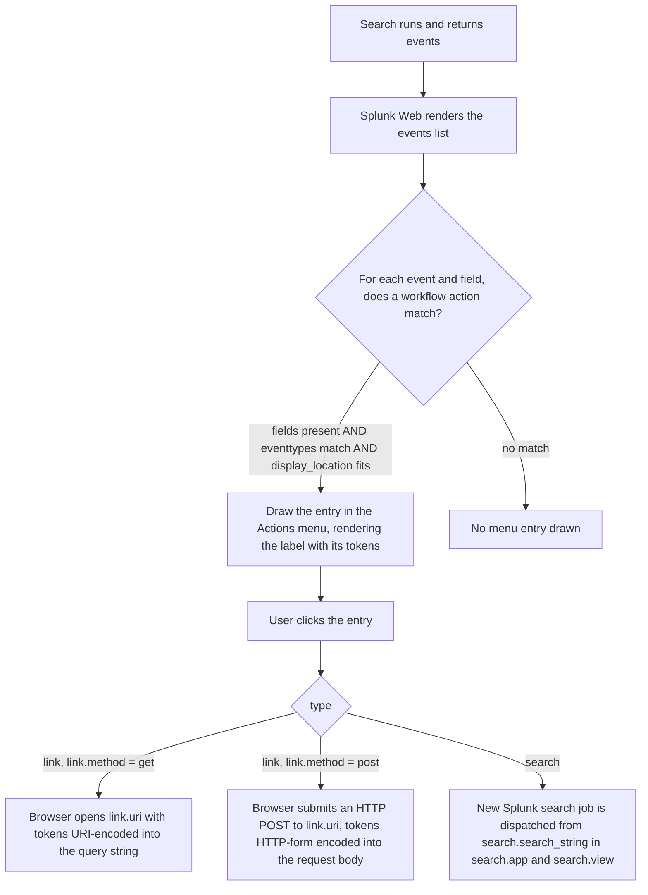
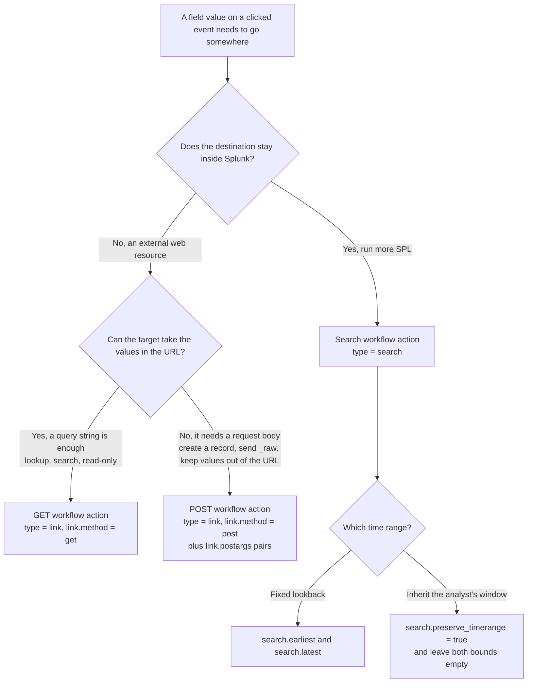

# 8.0 Creating and Using Workflow Actions (10%)

Workflow actions are the only blueprint section that is pure knowledge-object configuration with no SPL command behind it, which is how the exam weights four short sub-objectives at 10%: every question reduces to "which of the three kinds, and which form field holds which value".

## Blueprint mapping

- Section 8.0 Creating and Using Workflow Actions
- Weight: 10%
- 8.1 Describe the function of GET, POST, and Search workflow actions
- 8.2 Create a GET workflow action
- 8.3 Create a POST workflow action
- 8.4 Create a Search workflow action

> The following topics are general guidelines for the content likely to be included on the exam; however, other related topics may also appear on any specific delivery of the exam. In order to better reflect the contents of the exam and for clarity purposes, the guidelines below may change at any time without notice.

## What it is

A workflow action is a knowledge object that adds an interactive entry to the **Actions** menu attached to an event or to a field value in search results. Clicking it either opens an external web resource (a `link` action, issued as an HTTP GET or an HTTP POST) or launches a new Splunk search (a `search` action). In both cases, values from the event you clicked are substituted into the target by a `$fieldname$` token syntax before the request or search runs.

The official framing is that workflow actions "enable a wide variety of interactions between indexed or extracted fields and other web resources". The documented uses are: perform an external WHOIS lookup based on an IP address found in an event; use the field values in an HTTP error event to create a new entry in an external issue management system; launch secondary searches that use one or more field values from selected events; and perform an external search (using Google or a similar web search application) on the value of a specific field found in an event.

### The three kinds, and the two configuration levels

The Knowledge Management Manual says there are three kinds of workflow action you can set up, and names them GET, POST and Search.

| Kind | Documented purpose | How it is configured |
| --- | --- | --- |
| GET | Retrieve information from an external web resource, for example a WHOIS lookup or a web search on a field value | `type = link`, `link.method = get` |
| POST | Generate an HTTP POST request to a URI, for example creating an entry in an external issue management system from a set of relevant field values | `type = link`, `link.method = post`, plus `link.postargs` pairs |
| Search | Launch secondary searches that use specific field values from an event | `type = search`, `search.search_string` |

Those three kinds sit on two configuration levels, and most of this section's difficulty lives in the gap between them. **Action type** has two values, `link` and `search`. **Link method** has two values, `get` and `post`, and it exists only once the type is `link`. GET and POST are therefore not types that happen to use a link; they are the only two methods a link action can be issued with. `search` is a type and never a method, so it cannot answer a question about methods, and `put`, `update`, `delete` and `head` are not accepted values of anything in `workflow_actions.conf`.

The "GET retrieves, POST sends" split is a compression worth holding loosely, because a GET action passes values outward too: the setup page describes it as performing an HTTP GET request in a browser, allowing you to pass information to an external web resource. What actually separates them is placement. GET puts the values in the URL query string and you land on the resource's response. POST puts them in an HTTP-form-encoded request body so the target can create a record.

Where this sits in the processing model matters, because the exam likes to place workflow actions somewhere they do not belong. A workflow action is **not** part of the search pipeline. It does not run at index time or at search time, and it never touches the result set. Splunk Web evaluates it while rendering the events list, purely to decide which menu entries to draw and what text to draw on them, and nothing happens until a human clicks. That is the difference from every other object in this exam: a lookup, a calculated field, an alias and an event type all change what a search returns, while a workflow action changes what a menu offers.



Workflow actions live in `workflow_actions.conf`. The stanza name is the object's internal name; every other form field maps to a setting inside that stanza. Like every knowledge object they are private to their creator when first created and must be explicitly shared; by default only the admin and power roles can share and promote knowledge objects.

## Syntax and options

The Splunk Web path in 10.x is: **Settings**, **Fields**, **Workflow actions**. That page lists existing workflow actions, which you review and update by clicking their names, and offers **Add new** to create one. The task-oriented setup pages phrase the same step as clicking **New**; both wordings mean the same button.

### The Splunk Web form, in order

| Form field | Applies to | Values | Default | What it does |
| --- | --- | --- | --- | --- |
| Destination app | all types | any app the user can write to | the current app | App context the object is created in. Sets its namespace, which drives permissions and where the stanza is written. |
| Name | all types | free text, becomes the stanza header | none, required | Internal name of the workflow action. Not shown to searchers. No documentation restricts spaces or special characters; the spec's own examples include `[Create JIRA issue]`. |
| Label | all types | free text, accepts `$field$` tokens | none, required | The text drawn in the Actions menu. A label can be static or include the value of relevant fields, so tokens are permitted and never required. Tokens in the label are rendered per event, so `Whois: $clientip$` shows the actual IP. |
| Apply only to the following fields | all types | comma or space separated field list, wildcards allowed | `*` | Every field named here must be present on the event before the action is offered. Blank behaves as `*`, which matches all fields. |
| Apply only to the following event types | all types | comma or space separated event type list, wildcards allowed | none (no restriction) | The event must belong to the named event types before the action is offered. |
| Show action in | all types | Event menu, Fields menus, Both | Both | Which menu the entry appears in. Maps to `display_location`. |
| Action type | all types | link, search | none, required | Chooses the whole downstream half of the form. `link` reaches an external resource, `search` runs SPL. |
| URI | link only | URL, accepts `$field$` tokens | none, required for link | The external resource. Substituted values are URI-encoded automatically. |
| Open link in | link only | New window, Current window | New window | Browser target. Maps to `link.target` (`blank` or `self`). GET and POST actions both have this control, because both are link actions and the two setup procedures share this step. |
| Link method | link only | get, post | get | HTTP verb. Selecting `post` reveals the Post arguments table. |
| Post arguments (Key, Value) | link, method post only | key/value pair rows, values accept `$field$` tokens | none | The request body. Add another row per argument. Keys may repeat. |
| Search string | search only | SPL, accepts `$field$` tokens | none, required for search | The secondary search to dispatch. |
| Run in app | search only | app name | the current app | App the secondary search runs in. Maps to `search.app`. |
| Open in view | search only | view name | the current view | View the secondary search opens in. Maps to `search.view`. |
| Run search in | search only | New window, Current window | New window | Window target. Maps to `search.target`. |
| Time range, Earliest | search only | absolute or relative time modifier | none (all time) | Earliest bound of the secondary search. |
| Time range, Latest | search only | absolute or relative time modifier | none (all time) | Latest bound of the secondary search. |
| Use the same time range as the search that produced this event | search only | checked, unchecked | unchecked | Inherits the originating search's time range instead of using a fixed one. Maps to `search.preserve_timerange`. Ignored if Earliest or Latest is set. |

The label strings for **Run in app**, **Open in view**, **Run search in** and **Use the same time range as the search that produced this event** are the working labels in Splunk Web; the 10.4 docs describe these four controls in prose rather than quoting them [verify]. The settings they write are verified below.

### workflow_actions.conf

```ini
[<workflow_action_name>]
type = <link|search>
label = <string>
fields = <comma or space separated list>
eventtypes = <comma or space separated list>
display_location = <field_menu|event_menu|both>
disabled = <True|False>

# link type only
link.uri = <string>
link.target = <blank|self>
link.method = <get|post>
link.postargs.<int>.key = <string>
link.postargs.<int>.value = <string>

# search type only
search.search_string = <string>
search.app = <string>
search.view = <string>
search.target = <blank|self>
search.earliest = <time>
search.latest = <time>
search.preserve_timerange = <boolean>
```

| Option | Values | Default | What it does |
| --- | --- | --- | --- |
| `type` | `link`, `search` | none, required | The type of the workflow action. If not set, the Splunk platform skips this workflow action. |
| `label` | string, accepts tokens | none, required | The label to display in the workflow action menu. If not set, the Splunk platform skips this workflow action. |
| `fields` | comma or space separated list, `*` allowed | `*` | The fields required to be present on the event in order for the workflow action to be applied. |
| `eventtypes` | comma or space separated list, `*` allowed | none | The eventtypes required to be present on the event in order for the workflow action to be applied. |
| `display_location` | `field_menu`, `event_menu`, `both` | `both` | Whether to display the workflow action in the event menu, the field menus, or in both locations. |
| `disabled` | `True`, `False` | `False` | Whether the workflow action is currently disabled. |
| `link.uri` | string with `$field$` tokens | none, required for `type = link` | The URI for the resource to link to. All inserted values are URI encoded. |
| `link.target` | `blank`, `self` | `blank` | Whether clicking the link opens a new window (`blank`) or redirects the current window (`self`). |
| `link.method` | `get`, `post` | `get` | Whether clicking the link generates a GET request or a POST request to `link.uri`. |
| `link.postargs.<int>.<key/value>` | string with `$field$` tokens | none | Only available when `link.method = post`. A list of key/value pairs, so that `foo=bar` becomes `link.postargs.1.key = "foo"` and `link.postargs.1.value = "bar"`. |
| `search.search_string` | SPL with `$field$` tokens | none, required for `type = search` | The search string to construct. Does NOT attempt to determine if the inserted field values may break quoting or other search language escaping. |
| `search.app` | app name | the current app | The Splunk application in which to perform the constructed search. |
| `search.view` | view name | the current view | The view in which to perform the constructed search. |
| `search.target` | `blank`, `self` | not stated in the spec; the spec says it works in the same way as `link.target`, whose default is `blank` [verify] | Whether the constructed search opens in a new window or the current one. |
| `search.earliest` | absolute or relative time, for example `-10h` | none | The earliest time to search from. |
| `search.latest` | absolute or relative time | none | The latest time to search to. |
| `search.preserve_timerange` | boolean | `false` | When true, the time range from the original search that produced the events list is used. Ignored if either `search.earliest` or `search.latest` is set. |

### What is required, by kind

| Kind | Required | Why |
| --- | --- | --- |
| all | Name, Destination app, `type`, `label` | The procedure opens with "you need to give it a Name and identify its Destination app". `type` and `label` are general required settings; the action is skipped if either is unset. |
| GET | `link.uri` | Marked Required in the spec. |
| POST | `link.uri`, plus at least one `link.postargs.<int>.key` and matching `.value` | A POST request is defined by inputs that become POST arguments, so you have to identify the arguments to send to the URI. |
| Search | `search.search_string` | The only search setting with no fallback; `search.app`, `search.view`, `search.target`, `search.earliest` and `search.latest` all default. |

Everything else is optional, and what is absent from that table is as testable as what is in it. There is no sourcetype setting, no permission field, no data model name, no eval statement, and no time range on the link half of the form. Scope comes from **Apply only to the following fields** and **Apply only to the following event types**, and from nothing else. To offer an action only on one sourcetype, define an event type for it and name that in `eventtypes`.

### Token syntax

Substitution uses a special variable syntax where the field's name is enclosed in dollar signs. `$clientip$` in a URI, a label, a post argument value or a search string is replaced with that event's `clientip` value.

| Token | Available where | Meaning |
| --- | --- | --- |
| `$<field name>$` | label, `link.uri`, `link.postargs.*.value`, `search.search_string` | The value of that field on the clicked event. `$_raw$` gives the whole raw event. |
| `$!<field name>$` | `link.uri`, post argument values | Same substitution with the automatic escaping suppressed. Use when the value is itself a complete HTTP address that must not be percent-encoded. |
| `$@field_name$` | field menus only | The name of the current field being clicked on. Useful for actions that apply to all fields. NOT AVAILABLE FOR EVENT MENUS. |
| `$@field_value$` | field menus only | The value of the current field being clicked on. NOT AVAILABLE FOR EVENT MENUS. |
| `$@sid$` | anywhere | The sid of the current search job. |
| `$@offset$` | anywhere | The offset of the event being clicked on in the list of search events. |
| `$@namespace$` | anywhere | The name of the application from which the search was run. |
| `$@latest_time$` | anywhere | The latest time the event occurred. This is used to disambiguate similar events from one another. |

Encoding is the asymmetry the exam cares about. Values inserted into `link.uri` are URI-encoded automatically, which is why a value containing spaces or punctuation is safe in a GET action. A POST action's `link.uri` may carry tokens too, and the POST setup page states that variables passed in URIs for POST actions are URL encoded, exactly as in a GET. What a POST adds is the second payload: the `link.postargs` values, HTTP-form encoded into the request body. Values inserted into `search.search_string` are **not** escaped at all: the spec states plainly that it does not attempt to determine whether the inserted field values may break quoting or other search language escaping, so quoting a token as `"$field$"` in SPL is on you.

## Result contract

A workflow action produces no rows, no columns and no fields. It is neither streaming nor transforming, because it is not a search command and never appears in a pipeline. Its "output" is a menu entry, and then a browser action. Precisely:

1. **At render time**, for every event in the events list, Splunk Web tests the action's `fields` and `eventtypes` requirements against that event, and its `display_location` against the menu being drawn. If all pass, one entry is drawn, with `label` token-substituted using that event's values.
2. **At click time for `type = link`, `link.method = get`**, the browser navigates to `link.uri` with all `$field$` tokens URI-encoded in place, in a new tab when `link.target = blank`. The values are visible in the URL, therefore in browser history and in the target server's access log query string.
3. **At click time for `type = link`, `link.method = post`**, the browser issues an HTTP POST to `link.uri`. The `link.postargs.<int>.key` and `.value` pairs form the HTTP-form-encoded request body. They are not in the query string, so they do not appear in the URL bar.
4. **At click time for `type = search`**, Splunk dispatches a new search job whose SPL is `search.search_string` with tokens substituted, in app `search.app`, view `search.view`, over `search.earliest` to `search.latest`, or the originating search's range when `search.preserve_timerange = true` and neither bound is set. The job is independent, with its own sid and its own results, and it runs under the clicking user's roles.

The rendered menu for a single `access_combined` event with `clientip = 87.194.216.51` and three workflow actions defined:

| Menu | Entry drawn | Why it is there |
| --- | --- | --- |
| Event Actions | Show Source | `display_location = event_menu`, `fields = _cd, source, host, index` all present |
| Event Actions | Extract Fields | `display_location = event_menu`, no field restriction |
| clientip Actions | Whois: 87.194.216.51 | `display_location = field_menu`, `fields = clientip`, label tokens rendered |
| clientip Actions | Google 87.194.216.51 | `display_location = field_menu`, `fields = *`, `$@field_value$` rendered |
| status Actions | Google 200 | same action, same definition, different field clicked |

The last two rows are the point of `$@field_value$`: one definition, one stanza, an entry on every field.

## Worked examples

### 1. GET, the minimum viable workflow action

Look up the owner of a client IP from the web access logs.

```ini
[whois_clientip]
type = link
label = Whois: $clientip$
fields = clientip
display_location = field_menu
link.method = get
link.target = blank
link.uri = http://ws.arin.net/whois/?queryinput=$clientip$
```

Run `index=web sourcetype=access_combined | head 20`, expand an event, open the Actions menu on a `clientip` value. The entry reads `Whois: 87.194.216.51` and opens ARIN in a new tab. `link.method = get` and `link.target = blank` are both defaults, so this stanza behaves identically with those two lines deleted. Writing them out is good hygiene and bad exam preparation: know that they are defaults.

### 2. GET on every field at once

One definition that offers a web search on whatever field the user clicked.

```ini
[google_any_field]
type = link
label = Google $@field_name$
fields = *
display_location = field_menu
link.method = get
link.uri = http://www.google.com/search?q=$@field_value$
```

This appears on `productName`, on `useragent`, on `status`, on everything, because `fields = *`. The label names the field and the URI carries its value. Setting `display_location = event_menu` or `both` here is a defect, not a feature: `$@field_name$` and `$@field_value$` are not available for event menus, so the event-menu copy of the entry has nothing to substitute.

### 3. POST, sending an event body to an issue tracker

The application returns HTTP 500s from the checkout path. Open a ticket from the event without retyping the stack trace.

```ini
[create_issue_500]
type = link
label = Open ticket for $status$ on $uri_path$
eventtypes = errors_in_500_range
display_location = event_menu
link.method = post
link.target = blank
link.uri = http://issuetracker.example.com:8000/issue/create
link.postargs.1.key = title
link.postargs.1.value = server error $status$
link.postargs.2.key = description
link.postargs.2.value = $_raw$
link.postargs.3.key = reporter
link.postargs.3.value = splunk
```

Three things to read off this. The whole raw event is passed as `$_raw$`, which is why POST exists: a stack trace does not belong in a query string. The values travel HTTP-form encoded in the request body, so nothing lands in the URL bar or the tracker's access log query string. And `eventtypes = errors_in_500_range` stops the entry being offered on every successful request in the index.

### 4. Search, pivot on a session

From a single web hit, see everything that session did.

```ini
[session_activity]
type = search
label = All activity for JSESSIONID $JSESSIONID$ in past 24h
fields = JSESSIONID
display_location = both
search.search_string = index=web sourcetype=access_combined JSESSIONID="$JSESSIONID$" | stats count by uri_path, status | sort - count
search.app = search
search.view = search
search.target = blank
search.earliest = -24h
```

The dispatched SPL, after substitution, is:

```spl
index=web sourcetype=access_combined JSESSIONID="SD6SL8FF9ADFF3" | stats count by uri_path, status | sort - count
```

Note the explicit double quotes around `$JSESSIONID$`. Search-string tokens are not escaped by Splunk, so quoting is the author's job. `search.latest` is unset, so with `search.earliest = -24h` the range is the last 24 hours up to the moment of the click, not of the original search.

### 5. Search that inherits the originating time range

Same pivot, but anchored to whatever window the analyst was already looking at.

```ini
[session_activity_same_window]
type = search
label = All activity for JSESSIONID $JSESSIONID$ in this time range
fields = JSESSIONID
display_location = field_menu
search.search_string = index=web sourcetype=access_combined JSESSIONID="$JSESSIONID$" | timechart span=5m count by status
search.preserve_timerange = true
```

`search.earliest` and `search.latest` are deliberately absent. If either were present, `search.preserve_timerange` would be ignored and the fixed bound would win. With both absent and `preserve_timerange` left at its `false` default, this search would run over **all time**, not real time and not the analyst's window, which on a real index is the difference between a two-second search and an outage.

### 6. Search across sourcetypes, from web log to auth log

Take a user from the vendor sales data and go look for their authentication activity.

```ini
[user_auth_history]
type = search
label = Recent auth events for $User$
fields = User
eventtypes = web_purchase_events
display_location = field_menu
search.search_string = index=security sourcetype=linux_secure user="$User$" | stats count by action, src_ip | sort - count
search.app = search
search.earliest = -7d
search.latest = now
```

This is the canonical Search workflow action scenario: the value stays inside Splunk and moves to a different dataset. Because both bounds are set, adding `search.preserve_timerange = true` here would change nothing.

### 7. Using the job context tokens

The shipped `show_source` action is the reference implementation for `$@sid$`, `$@offset$` and `$@namespace$`:

```ini
[show_source]
type = link
fields = _cd, source, host, index
display_location = event_menu
label = Show Source
link.uri = /app/$@namespace$/show_source?sid=$@sid$&offset=$@offset$&latest_time=$@latest_time$
```

`link.uri` is a relative path, so a `link` action does not have to point off-box. It points back into Splunk Web, carrying the search job id, the event's offset in the results, and the event's latest time so that near-identical events can be told apart. `fields = _cd, source, host, index` means all four must be present or the entry is not drawn.

## Decision rules

| Question the scenario asks | Answer | Setting that encodes it |
| --- | --- | --- |
| The value must reach a system outside Splunk through a URL, and a query string carries it fine | GET workflow action | `type = link`, `link.method = get` |
| The value must reach a system outside Splunk and the target needs a request body, or the payload is large, or it should not appear in a URL, or it creates a record | POST workflow action | `type = link`, `link.method = post`, plus `link.postargs.*` |
| The value must be used in another Splunk search | Search workflow action | `type = search`, `search.search_string` |
| The action makes sense for the event as a whole | Event menu only | `display_location = event_menu` |
| The action operates on one specific field value | Fields menus only | `display_location = field_menu` |
| The action generalises across whatever field was clicked | Fields menus only, and use `$@field_name$` / `$@field_value$` | `display_location = field_menu` |
| The action must not appear unless certain fields exist | List them, comma separated | `fields = a, b, c` |
| The action must not appear unless the event is a known category | Name the event types | `eventtypes = ...` |
| The secondary search should follow the analyst's current window | Tick the same-time-range box, and set no bounds | `search.preserve_timerange = true`, no `search.earliest`, no `search.latest` |
| The secondary search should always cover a fixed lookback | Set the bounds, ignore the checkbox | `search.earliest = -24h` |
| The value must be passed unencoded, for example a whole URL | Prefix the token | `$!fieldname$` |



## Traps

**T-08-01** The exam offers "GET, POST, and Search" as the values of the **Action type** field, or offers Search as a **Link method**. Wrong belief: Action type has three options matching the three kinds. Correct fact: Action type has exactly two values, `link` and `search`. GET and POST are both `link` actions, separated by the **Link method** setting (`link.method = get` or `post`). There is no `type = get`, no `type = post`, and no `link.method = search`.

**T-08-02** A question states that a workflow action was created with **Open link in** left untouched, then asks where the link opens. Wrong belief: the default is the current window, because that is how ordinary hyperlinks behave. Correct fact: `link.target` defaults to `blank`, a new window. Both GET and POST actions expose this control, and `search.target` works the same way.

**T-08-03** A stanza is shown with `type = link` and a `link.uri` but no `link.method`, and the question asks what happens on click. Wrong belief: nothing happens, or the action is invalid. Correct fact: `link.method` defaults to `get`, so a GET request is issued.

**T-08-04** "Apply only to the following fields" is left blank and the question asks which events show the action. Wrong belief: blank means the action never appears. Correct fact: `fields` defaults to `*`, matching all fields, so an unrestricted action appears everywhere. Restriction is opt-in.

**T-08-05** The field list is read as a set of alternatives. Wrong belief: `fields = src_ip, dest_ip` means the action shows when either field is present. Correct fact: it is a conjunction. Every field listed must be present on the event before the action is applied. The documented example is explicit: entering `*, ip_client, ip_server` makes the workflow action apply to all fields in the event **if `ip_client` and `ip_server` are both present**.

**T-08-06** A scenario passes a full stack trace to an external system and asks which kind to use, or asks where POST arguments appear. Wrong belief: POST arguments are appended to the URI, so a POST is a GET with extra steps. Correct fact: `link.postargs.<int>.key` and `.value` pairs are sent HTTP-form encoded in the request body, so they appear in no URL, browser history or access log query string. `link.postargs` is available only when `link.method = post`; post arguments on a GET action do nothing.

**T-08-07** A question about a field value containing spaces, ampersands or slashes. Wrong belief: tokens are escaped consistently everywhere, or nowhere. Correct fact: encoding differs by destination. Values inserted into `link.uri` are URI encoded automatically, in POST URIs as well as GET ones, so punctuation is safe. POST argument values are HTTP-form encoded automatically. Values inserted into `search.search_string` are **not** escaped, since the spec does not attempt to determine whether they may break quoting or other search language escaping, so quote your own tokens in SPL. The `$!fieldname$` form suppresses escaping in a URI, for cases such as passing a complete HTTP address as a parameter.

**T-08-08** A search workflow action has `search.earliest = -7d` and `search.preserve_timerange = true`, and the question asks the effective time range. Wrong belief: the originating search's range wins because the checkbox is on. Correct fact: `search.preserve_timerange` is ignored if either `search.earliest` or `search.latest` is set. The range is the last seven days. To inherit the originating range, set `preserve_timerange = true` and leave both bounds empty.

**T-08-09** A "Google this value" action is configured with `display_location = both` or `event_menu`. Wrong belief: `$@field_value$` resolves to the first field of the event, or to `_raw`. Correct fact: `$@field_name$` and `$@field_value$` are not available for event menus, so a generic per-field action must be scoped `display_location = field_menu`.

**T-08-10** Name and Label are treated as interchangeable. Wrong belief: the Name is what searchers see in the menu. Correct fact: **Name** is the internal name and becomes the stanza header in `workflow_actions.conf`; **Label** is the text drawn in the menu and the field that accepts `$field$` tokens, which is what lets an entry read `Whois: 87.194.216.51`.

**T-08-11** A workflow action is offered as the answer to "how do you add a field to your results" or "how do you trigger an action automatically when a condition is met". Wrong belief: workflow actions are a kind of alert action, or a search-time knowledge object that enriches events. Correct fact: a workflow action creates no field, modifies no event, and fires only on a human click in Splunk Web. It has no schedule setting of any kind. Automatic responses to conditions are alert actions on a saved search; search-time enrichment is lookups, calculated fields, field aliases and extractions.

**T-08-12** "Show action in" is left at its default and the question asks where the entry appears. Wrong belief: the default is the field menu, since most examples are field-level. Correct fact: `display_location` defaults to `both`, so an unconfigured action appears in the event menu **and** the field menus.

**T-08-13** A search workflow action is created and immediately visible to the whole team in the question stem. Wrong belief: workflow actions are global by default because they are configured under Settings. Correct fact: a new knowledge object is available only to its creator until it is explicitly shared, and by default only the admin and power roles can share and promote knowledge objects. The **Destination app** chosen at creation sets the namespace sharing then operates within.

**T-08-14** A search workflow action omits `search.app` and `search.view`, and the question asks where the secondary search runs. Wrong belief: it defaults to the Search & Reporting app and the default search view. Correct fact: `search.app` defaults to the **current app** and `search.view` to the **current view**, meaning wherever the analyst happened to be when they clicked. Both are optional, and `search.app` exists precisely so the secondary search can run in a different app from the one the click came from.

**T-08-15** A question asks how to name a workflow action, or offers a naming rule among the setup steps. Wrong belief: workflow action names must not contain spaces or special characters. Correct fact: no Splunk documentation states any such restriction. The `workflow_actions.conf.example` file shipped with the product defines the stanzas `[Create JIRA issue]` and `[Controller req over time]`, both containing spaces. The rule that does exist is the Name and Label split of T-08-10.

**T-08-16** A GET action is defined with a plain label such as `Look up this address`. Wrong belief: a label is invalid unless it contains a field name surrounded by dollar signs. Correct fact: a label can be static or include the value of relevant fields, so tokens are supported and never required. "Must include a token" is false; "can include a token" is true.

**T-08-17** A scenario wants an action offered only on one sourcetype, and an option offers a sourcetype setting on the form. Wrong belief: configuring a workflow action includes choosing a sourcetype. Correct fact: there is no sourcetype setting in `workflow_actions.conf` and none on the form. Scope is `fields` and `eventtypes` only. Listing `sourcetype` under `fields` does not help either, since that requires the field to exist and it exists on every event. Build an event type and name it in `eventtypes`.

**T-08-18** A POST action is offered as the secure choice because the values stay out of the URL. Wrong belief: POST workflow actions are always encrypted. Correct fact: nothing about the POST method encrypts anything; transport security depends entirely on whether `link.uri` is `https`. POST guarantees placement, not confidentiality. The arguments avoid the URL bar, browser history and the target's access log query string, and travel in plaintext over `http` just the same.

**T-08-19** A question asks for a limitation of searches generated by workflow actions. Wrong belief: the search string is capped at a fixed character count, or cannot use macros, or must run in the app the action lives in. Correct fact: none of those is documented, and the app claim is refuted by `search.app` existing. The one stated limitation is on `search.search_string`, which does not attempt to determine whether inserted field values may break quoting or other search language escaping. The dispatched job is an ordinary search job started from the clicking user's session, so it sees what that user's roles allow.

## Lab

Roughly fifteen minutes on a single-node Splunk Enterprise 10.x instance with the practice dataset loaded. You will build one GET action, one Search action, and prove both.

**Part 1, GET action on `clientip` (5 minutes).**

1. Splunk Web, top-right menu, **Settings**, then **Fields**, then **Workflow actions**.
2. Click **Add new**.
3. **Destination app**: `search`.
4. **Name**: `lab_whois_clientip`.
5. **Label**: `Whois: $clientip$`
6. **Apply only to the following fields**: `clientip`
7. Leave **Apply only to the following event types** empty.
8. **Show action in**: `Fields menus`
9. **Action type**: `link`
10. **URI**: `http://ws.arin.net/whois/?queryinput=$clientip$`
11. **Open link in**: `New window`
12. **Link method**: `get`
13. **Save**.

**Part 2, Search action on `JSESSIONID` (5 minutes).**

1. **Settings**, **Fields**, **Workflow actions**, **Add new**.
2. **Destination app**: `search`. **Name**: `lab_session_pivot`.
3. **Label**: `Session activity for $JSESSIONID$`
4. **Apply only to the following fields**: `JSESSIONID`
5. **Show action in**: `Both`
6. **Action type**: `search`
7. **Search string**:

```spl
index=web sourcetype=access_combined JSESSIONID="$JSESSIONID$" | stats count by uri_path, status | sort - count
```

8. **Run in app**: `search`. Leave **Open in view** empty.
9. **Run search in**: `New window`
10. **Time range**: leave **Earliest** and **Latest** empty, and tick **Use the same time range as the search that produced this event**.
11. **Save**.

**Part 3, verification (5 minutes).**

Run this over All time (use All time, the practice data is historical):

```spl
index=web sourcetype=access_combined | head 50 | table _time, clientip, JSESSIONID, uri_path, status
```

Expand any event. On the `clientip` value, open the **Actions** menu: `Whois: <the actual IP>` must be present, with the IP rendered rather than the literal `$clientip$`. On the `JSESSIONID` value, open **Actions** and click `Session activity for <the actual session id>`. A new tab opens running the substituted SPL, and its time range picker must show the range you ran the original search over, not All time. Now open **Event Actions** on the event itself: `Session activity ...` appears there too because you chose `Both`, while the Whois entry does not, because you chose `Fields menus`.

Confirm what was actually written to disk:

```bash
$SPLUNK_HOME/bin/splunk btool workflow_actions list lab_whois_clientip lab_session_pivot --debug
```

You should see `type = link`, `link.method = get`, `link.target = blank`, `fields = clientip` for the first, and `type = search`, `search.preserve_timerange = 1`, no `search.earliest`, no `search.latest` for the second. If `search.earliest` appears, you filled in a bound and the preserve setting is being ignored; clear it and save again.

**Stretch, 2 minutes.** Edit `lab_whois_clientip`, set **Apply only to the following fields** to `clientip, JSESSIONID`, save, and re-run the verification search. The Whois entry still appears on both fields' menus, because every listed field is present. Now change it to `clientip, nonexistent_field`: the entry disappears entirely, because the field list is a conjunction and one member is missing.

## Self-check

**1.** In `workflow_actions.conf`, which values does the `type` setting accept?

- A. `get`, `post`, `search`
- B. `link`, `search`
- C. `link`, `post`, `search`
- D. `uri`, `search`, `alert`

**2.** A workflow action is defined with `type = link` and `link.uri = http://intranet/lookup?q=$user$`, and no other `link.*` settings. What happens when a user clicks it?

- A. Nothing; `link.method` is required
- B. A GET request opens in a new window
- C. A GET request redirects the current window
- D. A POST request opens in a new window

**3.** An analyst wants a workflow action that sends the entire `_raw` event, including a multi-line Python stack trace, to an issue tracker's REST endpoint, and the security team requires that the payload never appear in a URL. Which configuration is correct?

- A. `type = link`, `link.method = get`, with `$_raw$` in `link.uri`
- B. `type = link`, `link.method = get`, with `$!_raw$` in `link.uri`
- C. `type = link`, `link.method = post`, with `link.postargs.1.key = description` and `link.postargs.1.value = $_raw$`
- D. `type = search`, with `$_raw$` in `search.search_string`

**4.** A search workflow action is defined with `search.earliest = -30d` and `search.preserve_timerange = true`. The originating search ran over Last 60 minutes. What time range does the secondary search use?

- A. Last 60 minutes, because `preserve_timerange` overrides the bounds
- B. Last 30 days, because `preserve_timerange` is ignored when a bound is set
- C. All time, because the two settings conflict and both are discarded
- D. The intersection, the last 60 minutes

**5.** Which statement about token substitution is correct?

- A. Tokens in `link.uri` and tokens in `search.search_string` are both automatically escaped
- B. Tokens in `link.uri` are automatically URI encoded, while tokens in `search.search_string` are not escaped
- C. Tokens in `search.search_string` are automatically escaped, while tokens in `link.uri` are not
- D. Neither is escaped; the `$!` prefix is required in both to make values safe

**6.** A workflow action has `label = Google $@field_value$`, `fields = *`, and `display_location = both`. What is the defect?

- A. `fields = *` is invalid syntax; wildcards are not permitted
- B. `$@field_value$` is not available for event menus, so the event-menu entry cannot resolve its label
- C. `label` does not accept tokens, only `link.uri` does
- D. `display_location` does not accept `both`

**7.** A workflow action is created with **Apply only to the following fields** and **Apply only to the following event types** both left empty, and **Show action in** left untouched. Where does it appear?

- A. Nowhere, until at least one restriction is added
- B. Only in the Event Actions menu
- C. Only in the field Actions menus
- D. In both the Event Actions menu and every field Actions menu, on every event

**8.** Which is the correct description of a Search workflow action?

- A. It adds a field to the current result set based on the clicked value
- B. It runs automatically whenever the originating search returns results
- C. It dispatches a new, independent search job built from the clicked event's field values
- D. It re-runs the originating search with an added filter, in the same job

**9.** A workflow action is saved with exactly this stanza, and an analyst clicks it on an event where `status = 500`:

```ini
[Create JIRA issue]
type = link
label = Create JIRA issue
link.method = post
link.uri = https://jira.example.com/rest/api/2/issue
```

What happens?

- A. The action never appears, because a stanza name containing spaces is invalid
- B. A GET request is issued, because `link.postargs` is missing and the method falls back to its default
- C. All fields on the event are HTTP-form encoded into the body, because a POST action sends the event by default
- D. A POST request reaches the URI carrying no arguments, because no `link.postargs` pairs were defined

**10.** An analyst wants an action offered only on events from `sourcetype=cisco_esa` that carry both `src_user` and `dest_ip`. Which configuration does that with the settings the product provides?

- A. `sourcetypes = cisco_esa` and `fields = src_user, dest_ip`
- B. `fields = sourcetype, src_user, dest_ip`
- C. `eventtypes = cisco_esa_events`, where that event type is defined as `sourcetype=cisco_esa`, and `fields = src_user, dest_ip`
- D. `label = cisco_esa activity for $src_user$`, since a label token that cannot resolve suppresses the entry

<details><summary>Answers</summary>

**1. B.** Across the documentation and every shipped example stanza, only `link` and `search` are used, and if `type` is not set the platform skips the action. **A** is the most common misreading of sub-objective 8.1: GET and POST are not values of `type`, they are values of `link.method`, which exists only under `type = link`. **C** mixes the two levels, putting `post` alongside `link` as if they were peers. **D** invents settings; `link.uri` is a setting name, not a type value, and alert actions are a different object entirely.

**2. B.** Two defaults combine: `link.method` defaults to `get` and `link.target` to `blank`, a new window. **A** is wrong because only `type`, `label` and `link.uri` are needed for a link action to function. **C** describes `link.target = self`, which must be set explicitly. **D** would require `link.method = post`, and a POST with no `link.postargs` would carry no arguments anyway.

**3. C.** POST is the kind designed for handing a body to an external system: `link.postargs` pairs are HTTP-form encoded into the request body, so the stack trace is neither length-limited by a URL nor visible in the URL bar, history or access log query string. **A** puts the whole raw event in a query string, the requirement that was ruled out. **B** is worse: `$!` suppresses escaping, injecting an unescaped multi-line value into the URI. **D** confuses destinations; a search workflow action runs SPL inside Splunk and cannot reach an external REST endpoint.

**4. B.** The spec is explicit that `search.preserve_timerange` is ignored if either bound is set, so the fixed `-30d` wins. **A** inverts the precedence. **C** invents a discard rule; there is a defined winner. **D** invents an intersection rule; Splunk does not combine the two ranges.

**5. B.** `link.uri` states that all inserted values are URI encoded, while `search.search_string` does not attempt to determine whether inserted values may break quoting or other search language escaping. **A** and **C** each get one half backwards. **D** inverts `$!`, which suppresses escaping rather than enabling it, and is meaningful only where escaping happens at all.

**6. B.** `$@field_name$` and `$@field_value$` are documented as not available for event menus. With `display_location = both`, the field-menu entries work and the event-menu entry has nothing to substitute; the fix is `display_location = field_menu`. **A** is wrong because `*` is the documented default of `fields` and wildcards are supported. **C** is wrong because the label is where per-event tokens are most used, which is how `Whois: $clientip$` renders a real IP. **D** is wrong because `display_location` accepts `field_menu`, `event_menu` or `both`.

**7. D.** Three defaults stack: `fields` defaults to `*`, `eventtypes` imposes no restriction, and `display_location` defaults to `both`. The result is an entry on every event and on every field of every event. **A** inverts the model; the "Apply only to" settings narrow an action that is otherwise universal. **B** describes `display_location = event_menu` and **C** describes `field_menu`, neither of which is the default.

**8. C.** A search workflow action launches a secondary search that uses specific field values from an event; the new search is a separate job with its own sid, app and view context, and time range. **A** describes a calculated field or a lookup, search-time enrichment that changes the result set. **B** describes an alert action on a saved search; a workflow action requires a human click. **D** is the plausible distractor: nothing re-runs the original job, and the dispatched SPL is whatever `search.search_string` says, which need not resemble the original search at all.

**9. D.** `type`, `label` and `link.uri` are all set, so the action is valid, is drawn on every event (`fields` defaults to `*`, `display_location` to `both`) and issues the method it was given. A POST with no `link.postargs` pairs sends an empty body, which the tracker will reject, and that is why post arguments count as required for a POST. **A** invents the naming rule that circulates in courseware; the spec's own example stanzas contain spaces, `[Create JIRA issue]` among them. **B** is backwards: `get` applies only when `link.method` is absent, and here it is explicit. **C** assumes a POST ships the event automatically; nothing travels that you did not name in a `link.postargs.<int>.value`, which is why `$_raw$` has to be passed deliberately.

**10. C.** Scope comes from two settings and no others: `eventtypes` restricts by event category and `fields` requires the named fields to be present, as a conjunction, so both `src_user` and `dest_ip` must exist. An event type is the supported way to say "this sourcetype". **A** invents a setting; there is no `sourcetypes` in `workflow_actions.conf` and no sourcetype control on the form. **B** is the instructive miss: `sourcetype` is a field on every indexed event, so requiring its presence excludes nothing, and `fields` tests presence, never value. **D** misreads the label, which is display text rendered per event; an unresolved token renders as literal text, since appearance is decided by `fields`, `eventtypes` and `display_location` before the label is drawn.

</details>

## Docs

1. [About workflow actions in Splunk Web](https://help.splunk.com/en/splunk-enterprise/manage-knowledge-objects/knowledge-management-manual/10.4/workflow-actions/about-workflow-actions-in-splunk-web) - the definition, the four canonical use cases, the one-paragraph description of each of the three kinds, the Settings navigation, and the "Apply only to the following fields / event types" scoping rules including the `*, ip_client, ip_server` conjunction example. Read this first, twice. 10 minutes.
2. [Control workflow action appearance in field and event menus](https://help.splunk.com/en/splunk-enterprise/manage-knowledge-objects/knowledge-management-manual/10.4/workflow-actions/control-workflow-action-appearance-in-field-and-event-menus) - event-level versus field-level placement, and screenshots of where the entries land. Read it for the mental picture of Event Actions versus a field's Actions menu. 5 minutes.
3. [Set up a GET workflow action](https://help.splunk.com/en/splunk-enterprise/manage-knowledge-objects/knowledge-management-manual/10.4/workflow-actions/set-up-a-get-workflow-action) - the form procedure, the automatic URL encoding statement, and the `$!` prefix. 5 minutes.
4. [Set up a POST workflow action](https://help.splunk.com/en/splunk-enterprise/manage-knowledge-objects/knowledge-management-manual/10.4/workflow-actions/set-up-a-post-workflow-action) - the same procedure plus the Post arguments key/value table and the HTTP form encoding statement. How little differs from the GET page is itself the exam question. 5 minutes.
5. [Set up a search workflow action](https://help.splunk.com/en/splunk-enterprise/manage-knowledge-objects/knowledge-management-manual/10.4/workflow-actions/set-up-a-search-workflow-action) - the search string, the app and view targets, the Earliest and Latest fields, and the note that blank bounds mean all time. 5 minutes.
6. [workflow_actions.conf](https://help.splunk.com/en/splunk-enterprise/administer/admin-manual/10.4/configuration-file-reference/10.4.0-configuration-file-reference/workflow_actions.conf) - the only page that states the defaults, and the only page documenting `$@field_name$`, `$@field_value$`, `$@sid$`, `$@offset$`, `$@namespace$` and `$@latest_time$`. Read the settings list, then map each example stanza back to its UI form. 15 minutes, and the highest yield per minute in this section.
7. [Manage knowledge object permissions](https://help.splunk.com/en/splunk-enterprise/manage-knowledge-objects/knowledge-management-manual/10.4/get-started-with-knowledge-objects/manage-knowledge-object-permissions) - private on creation, Owner / App / All apps sharing, and which roles can promote. Shared with sections 2 through 7. 10 minutes.
