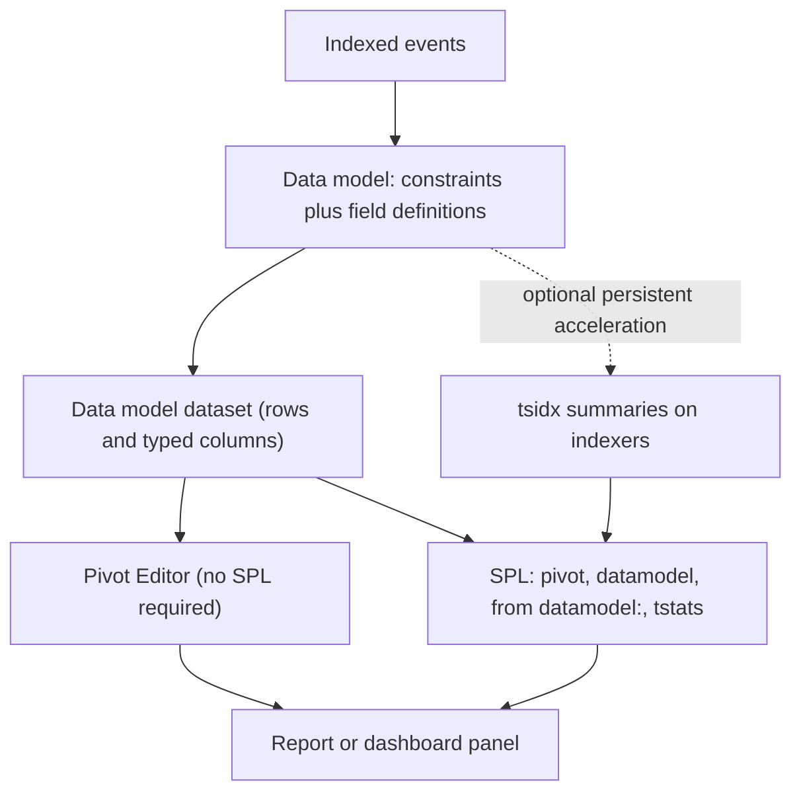
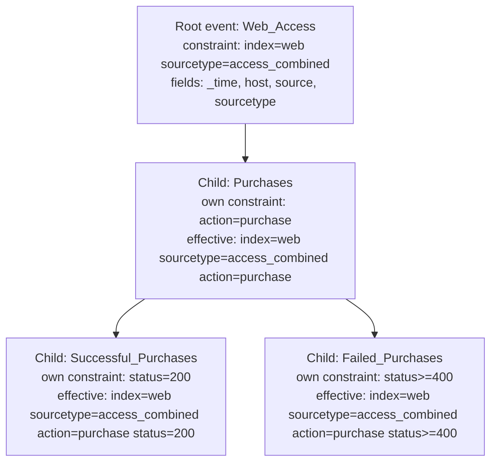

# 9.0 Creating Data Models (10%)

Data models are the search-time schema layer that turns raw events into a named, typed, hierarchical dataset a non-SPL user can report on through Pivot, and the exam weights this section at 10% because it is the only section where a Power User is expected to build a knowledge object that other people consume rather than just run a search.

## Blueprint mapping

> The following topics are general guidelines for the content likely to be included on the exam; however, other related topics may also appear on any specific delivery of the exam. In order to better reflect the contents of the exam and for clarity purposes, the guidelines below may change at any time without notice.

- Section 9.0 Creating Data Models, weight 10%
- 9.1 Describe the relationship between data models and pivot
- 9.2 Identify data model attributes
- 9.3 Create a data model

## What it is

A data model is, in the documentation's own words, "a hierarchically structured search-time mapping of semantic knowledge about one or more datasets". Hold on to the word hierarchically: a data model is an ordered parent-child tree, so an option calling it a randomly structured collection of datasets fails on that word alone. It is a knowledge object, it is fully permissionable, and its permissions cover all of its datasets at once. It contains no data. It contains constraints (searches) and field definitions (extractions, evals, lookups, regexes) applied at search time to produce a dataset. The docs put the same breakdown at dataset level: "Data model datasets are defined by characteristics that mostly break down into constraints and fields." The two parts of a root event dataset are therefore its constraints and its fields. Attribute is a synonym for field here, which is why objective 9.2 says attributes while the editor says fields, so an option offering "fields and attributes" as the two parts has named one thing twice.

The relationship the exam asks about in 9.1 runs one way only: the data model provides the dataset, and Pivot consumes it. Pivot is the drag-and-drop reporting interface that lets a user who cannot write SPL build a table or chart from a data model dataset. Pivot cannot exist without a data model behind it. The Pivot documentation states that Pivot "uses data models to define the broad category of event data that you're working with, and then uses hierarchically arranged collections of data model datasets to further subdivide the original dataset". If an exam option says Pivot supplies data to the data model, it is wrong.

Who does what matters as much as which way the arrow points. Knowledge managers design and maintain the data models and their datasets; the people who use Pivot are ordinary users who want a report and do not write SPL. The Pivot manual opens with "The Pivot tool lets you report on a specific data set without the Splunk Search Processing Language (SPL)", and describes a drag-and-drop interface producing tables, charts and other visualizations that are saved as reports or dashboard panels. So Pivot is a tool rather than a knowledge object, it creates no datasets and no lookups, and building models is a knowledge manager job restricted by role rather than something each user does for themselves.



A data model is built from datasets. There are three root dataset types and one child type, and the exam can ask the count either way, so hold both framings. The docs state it as four: "Datasets break down into four types. These types are: Event datasets, search datasets, transaction datasets, and child datasets." The Pivot manual says the same thing independently, "There are four dataset types", ending its list with child datasets. Courseware usually states it as three, counting only the root types, which is the right answer to a question worded "a data model consists of which THREE types of datasets". The collective term comes from the same page: "The top-level event, search, and transaction datasets in data models are collectively referred to as root datasets." Read the stem carefully: if an option offers "any child of event, transaction and search datasets" alongside the three root types in a choose-all-that-apply question, the docs support selecting it. Whichever count the stem wants, Pivot is never one of the answers. Pivot consumes datasets and is not a dataset type.

| Dataset type | Constraint form | Can add auto-extracted fields | Persistently accelerable |
| --- | --- | --- | --- |
| Root event | A simple search, no pipes and no search commands. "Constraints look like the first part of a search, before pipe characters and additional search commands are added." | Yes | Yes |
| Root search | An arbitrary SPL search, pipes and transforming commands allowed | Yes | Only if it uses streaming commands only. "You cannot accelerate root search datasets that use transforming searches." |
| Root transaction | A `transaction` over one or more Group Datasets already defined in this data model, plus Group by, Max Pause or Max Span | Yes | No. "Root transaction datasets and their children do not benefit from data model acceleration." |
| Child | One or more additional constraints, in the same simple-search form. Search macros are not allowed. | No, it inherits them from its root | Yes, if its root hierarchy is accelerable |

Constraint inheritance is cumulative and narrowing. A child dataset inherits all constraints and all fields from every ancestor and then adds its own. The documentation's own example composes a root event constraint `index=web sourcetype=access_combined`, a parent constraint `action=purchase`, and a child constraint `status=200` into the effective search `index=web sourcetype=access_combined action=purchase status=200`. Each level down the tree returns fewer events and exposes more fields.



Where the definition lives: the model is a JSON file under `$SPLUNK_HOME/etc/apps/<app>/local/data/models/`, one file per model, which is why the CIM add-on ships its models in `Splunk_SA_CIM/default/data/models`. `datamodels.conf` is a separate file holding the acceleration settings in a `[<data model name>]` stanza. Download the JSON from the Data Model Editor and upload it on another instance with Upload Data Model on the Data Models management page, which validates that the file is valid JSON.

## Syntax and options

### Dataset definition settings

| Option | Values | Default | What it does |
| --- | --- | --- | --- |
| Dataset Name | Any character except asterisks; spaces allowed | none | Human-readable label shown in Pivot and the Datasets listing. Editable after save. |
| Dataset ID | Alphanumeric, underscores and hyphens only; no spaces | Auto-populated from Dataset Name | The identifier used in SPL (`datamodel=Model.Dataset_ID`). Cannot be edited after the dataset is saved. |
| Constraints (root event, child) | A simple search with no leading pipe and no commands | none | Filters the events that belong to the dataset. Child constraints cannot include search macros. |
| Search (root search) | Any SPL, including transforming commands | none | Defines the dataset from an arbitrary search. Transforming searches block acceleration. |
| Group Dataset (root transaction) | One or more event datasets (root event or child event), or one transaction dataset (root or child), or one search dataset (root or child), all from the current data model | none | The parent dataset or datasets whose events get grouped into transactions. At least one is required. |
| Group by (root transaction) | One or more field names | none | Field or fields whose shared value binds events into one transaction. |
| Max Pause (root transaction) | A time span | none | Maximum gap allowed between events in one transaction. |
| Max Span (root transaction) | A time span | none | Maximum total duration of one transaction. |

A root transaction dataset requires a Dataset Name, a Dataset ID, and at least one Group Dataset, plus at least one of Group by, Max Pause or Max Span.

### Field (attribute) types

| Field type | Where it can be added | Configuration form | Notes |
| --- | --- | --- | --- |
| Auto-Extracted | Root datasets only. Child datasets inherit them. | Check the fields you want in the Add Auto-Extracted Field dialog, or click Add by name to declare a field that has not been extracted yet | Covers automatically extracted fields, indexed structured-data fields, and custom extractions, lookups and calculated fields defined in Settings or `props.conf`. |
| Eval Expression | Any dataset | Eval Expression (just the expression, not the word `eval`), Field Name, Display Name, Type, Flags | Can chain: a field it depends on must sit above it in the field list. |
| Lookup | Any dataset | Lookup Table (an existing lookup definition), Input pairs (Field in Lookup matched to Field in Dataset), Output fields, Field Name, Display Name, Type, Flags | At least one output field is required. The lookup definition and the data model must have matching permissions. |
| Regular Expression | Any dataset | Extract From (any dataset field, or `_raw`), Regular Expression with at least one named capture group, Field Name, Display Name, Type, Flags | Named groups become fields. Sed mode and sed expressions are not supported. Type defaults to String. |
| Geo IP | Any dataset that has a field with Type `ipv4` positioned above this field | Pick the IPv4 field to match, pick the output fields (City, Region, Country, latitude, longitude), optionally rename them | Geo IP fields are added as required fields and their Type values are predetermined; you cannot change either. |

Once added, an auto-extracted field is an ordinary data model field, so the whole metadata set below applies to it. You can give it a Display Name for Pivot without changing the field name used in the index or in SPL, correct its Type when the guess is wrong ("If an auto-extracted field's Type value is assigned incorrectly, you can provide the correct one", from Boolean, IPv4, Number and String), and set it Hidden, Required, or both. The dialog offers the fields already present in the events the dataset constraints return, and Add by name covers a field that has not surfaced yet. The one thing you cannot do is add an auto-extracted field to a child dataset.

### Field attributes (metadata)

| Option | Values | Default | What it does |
| --- | --- | --- | --- |
| Field Name | No whitespace, single quotes, double quotes, curly braces or asterisks | The extracted field name | The name used in SPL and in the model JSON. |
| Display Name | Any text without asterisks | Same as Field Name | The label a Pivot user sees. |
| Type | Boolean, IPv4, Number, String in the Add Field dialog. Timestamp exists as a data model field type for time fields such as `_time` and drives the Pivot timestamp behaviours, but it is not offered in the Add Field type selector. | String | Controls which Pivot filters, split options and aggregation functions are offered for the field. |
| Flags: visibility | Shown, Hidden | Shown | "A hidden field is not displayed to Pivot users when they select the dataset in a Pivot context. They will be unable to use it for the purpose of Pivot report definition." |
| Flags: requirement | Optional, Required | Optional | "A required field must appear in every event represented by the dataset. This filters out any event that does not have the field. In effect this is another type of constraint on top of any formal constraints you've associated with the dataset." |

The Add Auto-Extracted Field dialog exposes the two flags as a single status picker with four values: Optional, Required, Hidden, and Hidden and Required.

Fields fall into three categories in the editor: Inherited (the default fields on a root dataset, plus every field inherited from a parent), Extracted (auto-extracted fields added to this dataset), and Calculated (Eval Expression, Regular Expression, Lookup and Geo IP fields). Fields are processed in descending order from the top of the list to the bottom, which is why a calculated field must sit below anything it depends on.

The default inherited fields on a root event dataset, per the documentation, are `_time`, `host`, `source`, and `sourcetype`. `_raw` is not listed among those default fields, although `_raw` is selectable as the Extract From source when you add a regular expression field.

### SPL commands that read a data model

`datamodel` syntax:

```spl
| datamodel [<data model name>] [<dataset name>] [<data model search mode>] [strict_fields=<bool>] [allow_old_summaries=<bool>] [summariesonly=<bool>]
```

| Option | Values | Default | What it does |
| --- | --- | --- | --- |
| `<data model name>` | A data model name | none (optional) | Restricts output to one model. |
| `<dataset name>` | A dataset ID inside that model | none (optional) | Restricts output to one dataset. |
| `<data model search mode>` | `search`, `flat`, `acceleration_search`, `search_string`, `flat_string`, `acceleration_search_string` | none (optional); omitting it returns JSON | `search` runs the dataset search. `flat` runs it and strips the hierarchical field-name prefixes. `acceleration_search` uses the acceleration strategy. The three `_string` modes return the generated SPL instead of running it. |
| `strict_fields` | `true`, `false` | `true` | `true` returns only the default fields and the fields in the dataset constraints. `false` returns every field defined on the dataset. |
| `allow_old_summaries` | `true`, `false` | `false` | Accelerated models only. Permits summary data built under an older data model definition. |
| `summariesonly` | `true`, `false` | `false` | Accelerated models only. `true` returns only summarized data. |

All three positional arguments are optional, but their order is fixed: model name first, dataset name second, search mode third. The docs state that the dataset name "must be specified after the data model name", so in `| datamodel Application_State All_Application_State search` the model is `Application_State` and the dataset is `All_Application_State`, never the reverse. The mode is spelled `acceleration_search`, and there are six modes rather than three because each result mode has a `_string` twin. `datamodel` is a generating command, so it takes a leading pipe and sits first: `search datamodel=Web` reads no data model at all, it searches for a literal field named `datamodel`.

`from` syntax for data models:

```spl
| from datamodel:<data_model_name>.<dataset_name>
```

`from` accepts `datamodel`, `lookup` and `savedsearch` dataset types. A space may replace the colon. Names containing spaces must be quoted.

`tstats` syntax:

```spl
| tstats [prestats=<bool>] [local=<bool>] [append=<bool>] [summariesonly=<bool>] [include_reduced_buckets=<bool>] [allow_old_summaries=<bool>] [chunk_size=<unsigned int>] [fillnull_value=<string>] <stats-func>... [FROM datamodel=<data_model_name>.<root_dataset_name> [where nodename=<root_dataset_name>.<...>.<target_dataset_name>]] [WHERE <search-query> | <field> IN (<value-list>)] [BY (<field-list> | (PREFIX(<field>))) [span=<timespan>]]
```

| Option | Values | Default | What it does |
| --- | --- | --- | --- |
| `prestats` | bool | `false` | Emits the internal prestats format for piping into `chart`, `stats` or `timechart`. Changes `tstats` from a report-generating command into an event-generating command. |
| `local` | bool | `false` | Runs the search on the search head only. |
| `append` | bool | `false` | Appends prestats results rather than generating a fresh set. |
| `summariesonly` | bool | `false` | `true` returns results only from the acceleration summary. `false` lets the search fall back to raw data outside the summary range. |
| `include_reduced_buckets` | bool | `false` | Includes data from tsidx-reduced buckets. |
| `allow_old_summaries` | bool | `false` | Uses summary data built before the current data model definition. |
| `chunk_size` | unsigned int, minimum 10000 | `10000000` | Events retrieved per tsidx file. |
| `fillnull_value` | string | none | Value substituted for null field values in the BY clause. |
| `FROM datamodel=` | `<model>.<root_dataset>` optionally with `where nodename=<path>` | none | Selects the data model to read. Note the equals sign, not a colon. |
| `WHERE` | Search expression or `<field> IN (...)` | none | Filters on indexed fields and on fields held in the acceleration summary. Search-time extracted fields are not supported. |
| `BY ... span` | `auto` or `<int><timescale>` | `auto` | Grouping. `span` is mandatory when grouping by `_time`. |

`pivot` syntax:

```spl
| pivot <datamodel-name> <object-name> <pivot-element>
```

`pivot` is a report-generating command and must be first in the search. The first pivot element must be a cell value; split rows, split columns, filters, limits and formatting follow.

### Acceleration settings

Persistent acceleration builds `.tsidx` summary files on the indexers, beside the buckets of the indexes the model searches, recording the indexed field and value combinations for the accelerated datasets so `tstats` can count them without opening raw events. The source index is untouched and the model's fields do not become index-time extracted fields.

Acceleration is switched on per model but delivered per hierarchy. The model qualifies if it holds at least one root event hierarchy or one streaming-only root search hierarchy, and "Data models can contain a mixture of accelerated and unaccelerated datasets." A model with two root event datasets gets both summarized. The only per-root behaviour documented is that Size on Disk under-reports on a multi-root model because it accounts for only one root object.

| Option (UI name) | `datamodels.conf` setting | Values | Default | What it does |
| --- | --- | --- | --- | --- |
| Accelerate | `acceleration` | true, false | `false` | Turns persistent acceleration on. Off by default on every data model, including every CIM data model. |
| Summary Range | `acceleration.earliest_time` | 1 Day, 7 Days, 1 Month, 3 Months, 1 Year, All Time, Custom (relative time notation or Unix epoch) | empty string, which represents All Time | How far back the summary is maintained. |
| Backfill Range | `acceleration.backfill_time` | Relative time | empty string | Builds a shorter partial summary first, then grows it toward the Summary Range. |
| Summarization Period | `acceleration.cron_schedule` | Cron string | `*/5 * * * *` (every five minutes) | How often the summarization search runs. |
| Max Summarization Search Time | `acceleration.max_time` | Seconds | `3600` (1 hour) | Maximum runtime for one summarization search. |
| Maximum Concurrent Summarization Searches | `acceleration.max_concurrent` | Integer | `3` | Concurrent summarization jobs for this model. |
| Manual Rebuilds | `acceleration.manual_rebuilds` | true, false | `false` | When false, Splunk rebuilds the summary automatically after the model definition changes. |
| Poll Buckets Until Maxtime | `acceleration.poll_buckets_until_maxtime` | true, false | `false` | Keeps polling buckets until max_time is reached. |
| Allow Old Summaries | `acceleration.allow_old_summaries` | true, false | `false` | Lets searches use summary data built under an older definition. |
| Schedule Priority | `acceleration.schedule_priority` | default, higher, highest | `default` | Scheduler priority of the summarization search. |
| Allow Skew | `acceleration.allow_skew` | Time or percentage | `0` | Randomizes the summarization start time. |
| (not in UI) | `strict_fields` | true, false | `true` | Default value of `strict_fields` for the `datamodel` command against this model. |
| (not in UI) | `tags_whitelist` | Comma-separated tag names | empty (not set) | Loads only the listed tags, improving performance on tag-heavy models. |

## Result contract

A data model dataset is a table. Rows are the events surviving the accumulated constraints of the dataset and all of its ancestors, minus any event missing a Required field. Columns are the fields: the four default inherited fields, plus every inherited field from ancestors, plus this dataset's own extracted and calculated fields. Hidden fields still exist in the dataset and are still available to SPL; they are only suppressed in the Pivot field pickers.

`| datamodel` with no arguments returns a single-column result whose cells hold JSON for every data model available in the current app context. Add a model name to narrow it to one model. Add a dataset name and the `search` mode and it stops returning JSON and starts returning events.

`| datamodel <model> <dataset> search` returns events with fully qualified field names in the form `<Root_Dataset>.<Child_Dataset>.<field>`. The `flat` mode returns the same rows with the hierarchical prefixes stripped, so the columns are plain field names. This prefixing is the most common surprise when moving from Pivot to SPL.

| Command | Streaming or transforming | Output shape |
| --- | --- | --- |
| `\| datamodel M D search` | Generating, non-transforming | Events, fields prefixed `D.field` |
| `\| datamodel M D flat` | Generating, non-transforming | Events, unprefixed field names |
| `\| from datamodel:M.D` | Generating, non-transforming | Events from the dataset |
| `\| tstats count FROM datamodel=M.D BY field` | Report-generating (transforming), unless `prestats=true` | Statistics table, one row per BY combination |
| `\| pivot M D count(D) SPLITROW f` | Report-generating (transforming) | Statistics table |

A pivot result is always a statistics table before it becomes a visualization. Rows come from split rows, columns from split columns, cells from column values, and filters cut the row count first. With no split rows and one column value you get a single-cell table. A four-element pivot with one filter (`action = purchase`), one split row (`categoryId`), one split column (`status`) and one column value (`Count of Purchases`) renders as:

| categoryId | 200 | 400 | 503 |
| --- | --- | --- | --- |
| STRATEGY | 1043 | 12 | 4 |
| SIMULATION | 887 | 9 | 2 |
| SHOOTER | 654 | 7 | 1 |

`tstats` returns a statistics table exactly like `stats`, with the aggregation names as column headers. Against a data model, column headers keep the dataset prefix unless you rename them.

## Worked examples

1. List every data model available in the current app context, as JSON.

```spl
| datamodel
```

One row per data model, each cell holding the full JSON definition: every dataset, constraint and field. This is how you read a model definition without opening the editor.

2. Return the events of a child dataset, with prefixed field names, then flatten them.

```spl
| datamodel Web_Activity Successful_Purchases search
```

Returns events matching `index=web sourcetype=access_combined action=purchase status=200`, with columns named `Web_Access.Purchases.Successful_Purchases.productId` and similar. Swap `search` for `flat` to get plain `productId`:

```spl
| datamodel Web_Activity Successful_Purchases flat
```

3. Show every field the model defines, not just the constrained ones.

```spl
| datamodel Web_Activity Successful_Purchases search strict_fields=false
```

At the default `strict_fields=true` you get only the default fields and the fields named in the dataset constraints. Setting it `false` returns all fields defined on the dataset, which is what you want when a Pivot user reports a field they can see in Pivot missing from an SPL result.

4. Reproduce a Pivot table in SPL with `pivot`.

```spl
| pivot Web_Activity Successful_Purchases count(Successful_Purchases) AS "Purchases" SPLITROW categoryId AS "Category" SPLITCOL status SORT 10 categoryId
```

Produces the same statistics table the Pivot Editor builds from one column value, one split row and one split column, which is how you turn a Pivot into a scheduled report you can edit as SPL.

5. Count purchases per category off the acceleration summary only.

```spl
| tstats summariesonly=t count FROM datamodel=Web_Activity.Web_Access WHERE nodename=Web_Access.Purchases.Successful_Purchases BY Successful_Purchases.categoryId
```

Runs against the tsidx summary and never touches raw events. If the search time range is wider than the Summary Range, results are silently incomplete: that is the bytes of `summariesonly=t`. At the default `summariesonly=f` the search falls back to raw data outside the summary range, returning complete results more slowly.

6. Chart purchase volume over time from the summary, one point per hour.

```spl
| tstats count FROM datamodel=Web_Activity.Web_Access WHERE nodename=Web_Access.Purchases BY _time span=1h
```

`span` is mandatory when the BY clause includes `_time`. Without it the search errors rather than defaulting to a sensible bucket.

7. Read a dataset with the `from` command instead, then keep using ordinary SPL.

```spl
| from datamodel:Web_Activity.Successful_Purchases
| stats sum(bytes) AS total_bytes BY categoryId
| sort - revenue
```

`from` uses a colon between `datamodel` and the model name and a dot before the dataset, where `tstats` uses an equals sign.

## Decision rules

| Situation | Choice | Why |
| --- | --- | --- |
| The dataset is "all events of this type" and you want acceleration later | Root event dataset | Only root event hierarchies and streaming-only root search hierarchies can be persistently accelerated. |
| You need a transforming search (`stats`, `chart`, `timechart`) as the basis of the dataset | Root search dataset, and accept that it cannot be accelerated | Transforming searches produce tables, not events, so there is nothing to summarize per bucket. |
| You need to group related events across time | Root transaction dataset with at least one Group Dataset and at least one of Group by, Max Pause, Max Span | This is the only dataset type that runs `transaction`. It also gives up acceleration for itself and all of its children. |
| You want a narrower slice of an existing dataset | Child dataset with one or more extra constraints | Inheritance is cumulative and narrowing; you never repeat the parent constraint. |
| The field is already extracted by Splunk and you are on a root dataset | Auto-Extracted field | Only root datasets can add auto-extracted fields. |
| The field is derived arithmetically or conditionally from other fields | Eval Expression field, placed below the fields it reads | Fields are processed top to bottom. |
| The field comes from a CSV or KV store | Lookup field, with matching permissions on the lookup definition | The lookup definition and data model must share the same permission level. |
| The field is buried inside a string | Regular Expression field with named capture groups | Sed mode is not supported here. |
| You need city, region, country, latitude or longitude from an IP | Geo IP field, below an existing field typed `ipv4` | Its output fields are forced to Required and their types cannot be changed. |
| Every event in the dataset genuinely has the field and you want to enforce that | Set the flag to Required | Required silently filters out events lacking the field, which is a second constraint. |
| The field is an implementation detail Pivot users should not see | Set the flag to Hidden | Hidden affects Pivot visibility only, not SPL access. |
| A user has no SPL and needs a report | Point them at Pivot on the dataset | Pivot is the SPL-free front end to a data model. |
| A user has a non-transforming search and wants a chart without leaving Search | Statistics or Visualization tab, then Pivot | This works only for non-transforming searches, and creates a private data model when saved. |
| The model is large and searched often | Enable persistent acceleration, share it at app or global level | Private data models cannot be accelerated. |
| You just want one fast Pivot on an unaccelerated model | Do nothing; ad hoc acceleration happens automatically in the Pivot Editor | Those summaries live in the dispatch directory and are deleted when you leave the Pivot Editor or switch datasets. |

## Traps

**T-09-01** The direction of the data model and Pivot relationship. The wrong belief, stated outright in circulating answer keys, is that Pivot provides a dataset for the data model. The correct fact is the reverse: the data model provides the dataset, and Pivot is the SPL-free interface that consumes it to build a report. Pivot cannot run without a data model.

**T-09-02** Child dataset inheritance. The wrong belief, marked false in circulating answer keys, is that a child dataset does not inherit from its parent. The correct fact is that a child dataset inherits all constraints and all fields from every ancestor, then adds its own. Inheritance is cumulative and each level down returns strictly fewer events.

**T-09-03** CIM acceleration defaults. The wrong belief, stated in circulating answer keys, is that the CIM data models ship with acceleration enabled. The correct fact is that "All data models included in the CIM add-on have data model acceleration turned off by default." You enable it per model on the CIM Setup page by selecting the model and checking Accelerate, which writes `acceleration = 1` for that model.

**T-09-04** Which datasets can be accelerated. The wrong belief is that acceleration applies to every dataset in the model. The correct fact is that it requires at least one root event hierarchy, or one root search hierarchy using only streaming commands. Root search datasets built on transforming searches cannot be accelerated, and root transaction datasets and their children do not benefit.

**T-09-19** Editing an accelerated data model. The wrong belief is that an accelerated data model is frozen and you must build a new one to change it. The correct fact, verbatim from Manage data models: "After you accelerate a data model, you cannot edit it. To make changes to an accelerated data model, you must turn off its acceleration." Both halves matter. The model genuinely is uneditable while acceleration is on, so "accelerated data models cannot be edited" is a true statement; the remedy is to toggle acceleration off, edit, and turn it back on, never to create a replacement model. Turning acceleration off discards the existing summaries, so the model rebuilds them afterwards.

**T-09-05** Auto-extracted fields on child datasets. The wrong belief is that you add auto-extracted fields wherever you need them. The correct fact is that only root datasets can add auto-extracted fields; child datasets inherit them. Eval expression, lookup, regular expression and Geo IP fields can be added to any dataset.

**T-09-06** What Required does. The wrong belief is that Required is a documentation hint or a Pivot form validation. The correct fact is that Required filters out any event that does not have the field, acting as another constraint on top of the formal constraints. Marking a sparse field Required will shrink your dataset without warning.

**T-09-07** What Hidden does. The wrong belief is that a hidden field is removed from the dataset or from search results. The correct fact is that a hidden field is only suppressed for Pivot users defining a report; the field still exists in the dataset and is still reachable from SPL.

**T-09-08** Root event constraint syntax. The wrong belief is that a root event dataset constraint can contain a pipe and a command such as `| stats count`. The correct fact is that constraints "look like the first part of a search, before pipe characters and additional search commands are added". If you need a pipe, you need a root search dataset, and you give up acceleration if that search is transforming.

**T-09-09** Dataset ID immutability. The wrong belief is that both the Dataset Name and the Dataset ID can be renamed later. The correct fact is that the Dataset Name accepts any character except asterisks and can be changed, while the Dataset ID accepts only alphanumerics, underscores and hyphens, cannot contain spaces, and cannot be edited after the dataset is saved.

**T-09-10** `tstats` versus `from` syntax. The wrong belief is that both use the same separator. The correct fact is that `tstats` uses `FROM datamodel=<model>.<root_dataset>` with an equals sign, while `from` uses `| from datamodel:<model>.<dataset>` with a colon. Options that swap the two are the standard distractor.

**T-09-11** `summariesonly` default and effect. The wrong belief is that `tstats` reads only summaries, or that `summariesonly=true` is the default. The correct fact is that `summariesonly` defaults to `false`, and by default `tstats` runs over accelerated and unaccelerated data models alike. Setting it to `true` restricts results to summarized data, which is faster and may be incomplete outside the Summary Range.

**T-09-12** `strict_fields` default on the `datamodel` command. The wrong belief is that `| datamodel M D search` returns every field the dataset defines. The correct fact is that `strict_fields` defaults to `true`, returning only the default fields and the fields used in the dataset constraints. Set `strict_fields=false` to get all defined fields.

**T-09-13** Ad hoc acceleration persistence. The wrong belief is that using Pivot on an unaccelerated model builds a summary you keep. The correct fact is that ad hoc acceleration summaries live in the search head dispatch directory and are deleted when you leave the Pivot Editor or switch to a different dataset. Only persistent acceleration writes shared summaries to the indexers.

**T-09-14** Private data models and acceleration. The wrong belief is that any user can accelerate their own data model. The correct fact is that you cannot accelerate data models that are private; the model must be shared at app level or globally, and the user needs a role with the `accelerate_datamodel` capability. By default only the admin and power roles can create data models at all.

**T-09-15** Search macros in child constraints. The wrong belief is that a macro is just text substitution so it is safe anywhere. The correct fact is that child dataset constraints cannot include search macros, and searches referencing child datasets whose constraints contain macros will fail.

**T-09-16** Geo IP field flags. The wrong belief is that Geo IP output fields behave like any other calculated field and can be set Optional. The correct fact is that Geo IP fields are added as Required fields and their Type values are predetermined; you cannot change either. They also need an existing field of Type `ipv4` positioned above them.

**T-09-17** Field processing order. The wrong belief is that field definition order is cosmetic. The correct fact is that fields are processed in descending order from the top of the list to the bottom, so an eval expression that reads another calculated field must sit below it or it will evaluate to null.

**T-09-18** Instant Pivot scope. The wrong belief is that you can open any search in Pivot. The correct fact is that the Pivot button on the Statistics or Visualization tab is available for non-transforming searches; and when you save the resulting table or chart, the data model created behind it is private and can only be seen by its creator until an admin or power user shares it.

**T-09-20** Acceleration with several root datasets. The wrong belief is that when a data model has more than one root dataset, only the first one is accelerated. The correct fact is that every qualifying hierarchy in the model is summarized, and the docs state plainly that "Data models can contain a mixture of accelerated and unaccelerated datasets". The one thing that really is single-root is the Size on Disk metric, which under-reports on a multi-root model because it accounts for only one root object.

**T-09-21** What acceleration does to fields. The wrong belief is that persistent acceleration turns all the fields in the model into indexed fields. The correct fact is that acceleration writes `.tsidx` summary files alongside the buckets on the indexers, holding the indexed field and value combinations for the accelerated datasets. Nothing is added to the source index and no index-time extraction is created.

**T-09-22** Child datasets as a dataset type. The wrong belief is that a child of an event, search or transaction dataset is not one of the data model dataset types, because a data model has only three. The correct fact is that three is the count of root types. The docs count four dataset types overall, event, search, transaction and child, so a stem asking what a data model is composed of should include children.

**T-09-23** `datamodel` argument order and mode names. The wrong belief is that the first name after `| datamodel` is the dataset. The correct fact is model first, dataset second, mode third, because the dataset name must be specified after the data model name. Two distractors travel with this one: the acceleration mode is `acceleration_search`, not `accelerate_search`, and there are six modes, not three, since each result mode has a `_string` twin.

## Lab

Fifteen minutes on a single-node Splunk Enterprise 10.x instance with the practice dataset loaded.

1. Create the model. Settings, Data Models, New Data Model. Title `Web Activity`, ID `Web_Activity`, App `Search`, then Create.

2. Add the root event dataset. In the Data Model Editor click Add Dataset, then Root Event. Dataset Name `Web Access`, Dataset ID `Web_Access`, Constraints `index=web sourcetype=access_combined`. Click Preview to confirm events return, then Save. Confirm the Inherited fields section lists `_time`, `host`, `source` and `sourcetype`.

3. Add auto-extracted fields. With `Web Access` selected, click Add Field, then Auto-Extracted. Tick `action`, `status`, `categoryId`, `productId`, `clientip`, `bytes`. Set the Type of `status` and `bytes` to Number and the Type of `clientip` to IPv4. Leave the rest as String and Optional. Save.

4. Add a calculated field. Still on `Web Access`, click Add Field, then Eval Expression. Eval Expression `if(status>=400,"error","ok")`, Field Name `outcome`, Display Name `Outcome`, Type String, Flags Optional. Preview, then Save. Confirm `outcome` appears in the Calculated section below the extracted fields.

5. Add the child datasets. Select `Web Access`, click Add Dataset, then Child. Dataset Name `Purchases`, Dataset ID `Purchases`, Constraints `action=purchase`. Save. Select `Purchases`, click Add Dataset, then Child. Dataset Name `Successful Purchases`, Dataset ID `Successful_Purchases`, Constraints `status=200`. Save. Confirm the Inherited section of `Successful Purchases` shows every field from `Web Access`.

6. Share the model. On the Data Models management page, find `Web Activity` and select Edit, then Edit Permissions. Set Display For to `App`, give Everyone Read, and Save.

7. Build a Pivot. Settings, Data Models, click Pivot on the `Web Activity` row, and select the `Successful Purchases` dataset. In the Pivot Editor set the time range to All time, set Split Rows to `categoryId`, set Column Values to `Count of Successful Purchases`, and set Split Columns to `outcome`. Click Save As, then Report, and name it `Web Activity purchases by category`.

Verification searches. Each should return rows.

```spl
| datamodel Web_Activity
```

```spl
| datamodel Web_Activity Successful_Purchases search strict_fields=false | head 5
```

```spl
| from datamodel:Web_Activity.Successful_Purchases | stats count BY categoryId
```

A stronger proof that inheritance composed correctly, comparing the model result to the hand-written equivalent search. Both counts must match.

```spl
| datamodel Web_Activity Successful_Purchases flat
| stats count AS from_model
| appendcols [ search index=web sourcetype=access_combined action=purchase status=200 | stats count AS from_raw ]
| eval match=if(from_model=from_raw,"PASS","FAIL")
```

## Self-check

1. Which statement correctly describes the relationship between data models and Pivot?

A. Pivot supplies the dataset that a data model reports on.
B. A data model supplies the dataset that Pivot reports on.
C. Pivot and data models are independent features that both read from summary indexes.
D. A data model is generated automatically from a saved Pivot report.

2. You need a dataset defined by `index=web sourcetype=access_combined action=purchase | stats sum(bytes) BY VendorCountry`. Which dataset type must you use, and what do you give up?

A. Root event; you give up field inheritance.
B. Root search; you give up persistent acceleration.
C. Root transaction; you give up child datasets.
D. Child; you give up the ability to add auto-extracted fields.

3. A child dataset `Failed_Logins` has constraint `action=failure`. Its parent `Auth` has constraint `user=*`. The root event dataset `Secure` has constraint `index=security sourcetype=linux_secure`. What search does `Failed_Logins` effectively run?

A. `action=failure`
B. `index=security sourcetype=linux_secure action=failure`
C. `index=security sourcetype=linux_secure user=* action=failure`
D. `index=security sourcetype=linux_secure OR user=* OR action=failure`

4. You mark the field `productId` as Required on a dataset built from `index=web sourcetype=access_combined`. What happens?

A. Pivot users are forced to include `productId` in every report.
B. Events that lack `productId` are filtered out of the dataset.
C. `productId` is promoted to an indexed field.
D. Nothing changes at search time; the flag is documentation only.

5. Which field type can only be added to a root dataset?

A. Eval Expression
B. Lookup
C. Auto-Extracted
D. Regular Expression

6. Which command and syntax correctly counts events in an accelerated data model using only summarized data?

A. `| tstats summariesonly=t count FROM datamodel:Sales.Transactions`
B. `| tstats summariesonly=t count FROM datamodel=Sales.Transactions`
C. `| from datamodel=Sales.Transactions summariesonly=t | stats count`
D. `| datamodel Sales Transactions tstats summariesonly=t`

7. Which of these data models cannot be given persistent acceleration?

A. A model whose root is an event dataset with two child datasets.
B. A model whose root is a search dataset using only `eval` and `where`.
C. A model whose root is a transaction dataset grouping an event dataset by `JSESSIONID`.
D. A model whose root event dataset has a Geo IP field.

8. A colleague runs `| datamodel Web_Activity Successful_Purchases search` and complains that `outcome`, an eval expression field they can see in Pivot, is missing from the results. What is the fix?

A. Rebuild the acceleration summary.
B. Add `strict_fields=false`.
C. Use `flat` instead of `search`.
D. Move `outcome` above the extracted fields in the field list.

9. A data model contains two root event datasets, each with two child datasets, plus one root transaction dataset that groups one of those event datasets. The model is shared at app level and you enable acceleration on it. What gets summarized?

A. Only the first root event dataset and its children; the rest of the model is skipped.
B. Both root event hierarchies, including their child datasets; the transaction hierarchy does not benefit.
C. Every dataset in the model, because acceleration is a model-level setting.
D. Nothing, because a model containing a root transaction dataset cannot be accelerated at all.

10. On a root event dataset you add the auto-extracted field `clientip`, give it the Display Name `Client IP`, set its Type to IPv4, and set its status to Hidden. What is the result?

A. Pivot users see the field listed as `Client IP` and can use it to split rows.
B. Pivot users no longer see the field when defining a report, SPL can still reference `clientip`, and the dataset can now take a Geo IP field placed below it.
C. Events that have no `clientip` value are dropped from the dataset.
D. The field is renamed to `Client IP` everywhere, including in the index and in SPL.

<details><summary>Answers</summary>

1. **B.** The data model is a search-time mapping that produces a dataset, and Pivot is the SPL-free interface that consumes that dataset to build tables and charts. A is the a circulating answer key error, the relationship reversed. C is wrong because Pivot has no path to data except through a data model, and summary indexes are a different acceleration mechanism. D is wrong in the general case: saving an Instant Pivot from a non-transforming search does create a private data model, but a Pivot built on an existing model creates nothing.

2. **B.** A constraint containing a pipe and a transforming command requires a root search dataset, and the documentation states you cannot accelerate root search datasets that use transforming searches. A is wrong because root event constraints cannot contain pipes at all, and root event datasets do not give up field inheritance. C is wrong because a transaction dataset groups events rather than running `stats`, and transaction datasets can have children. D is wrong because a child dataset takes a simple constraint; child datasets really cannot add auto-extracted fields, but that is not the trade-off here.

3. **C.** Constraint inheritance is cumulative: the child inherits every ancestor constraint and adds its own, ANDed together. A ignores inheritance. B skips the middle dataset's constraint, which is still inherited. D is wrong because inherited constraints are combined implicitly with AND, not OR.

4. **B.** "A required field must appear in every event represented by the dataset. This filters out any event that does not have the field." A describes a Pivot form behaviour that does not exist. C confuses a search-time data model flag with index-time field creation. D is the belief the trap is built on; Required has a real filtering effect.

5. **C.** Only root datasets can add auto-extracted fields; child datasets inherit them from the root. A, B and D are all addable to any dataset in the model, root or child.

6. **B.** `tstats` uses `FROM datamodel=<model>.<root_dataset>` with an equals sign, and `summariesonly=t` restricts results to the acceleration summary. A uses the colon form, which belongs to `from`. C mixes the two: `from` uses a colon and does not accept `summariesonly`. D is not valid syntax; `datamodel` and `tstats` are separate generating commands and neither takes the other as an argument.

7. **C.** Root transaction datasets and their children do not benefit from data model acceleration. A is the canonical accelerable shape. B qualifies because a root search dataset using only streaming commands can be accelerated, and `eval` and `where` are streaming. D is built on a real feature: a Geo IP field is a calculated field and has no bearing on acceleration.

8. **B.** `strict_fields` defaults to `true` on the `datamodel` command, returning only the default fields and the fields named in the dataset constraints. `outcome` is neither, so it is dropped until you set `strict_fields=false`. A is wrong because acceleration has no bearing on which fields are returned, and this model need not be accelerated at all. C changes field naming from prefixed to flat but adds no missing fields. D matters for evaluation order, which would produce a null `outcome`, not an absent column.

9. **B.** Acceleration is enabled once for the model but delivered per hierarchy: both root event hierarchies qualify and their children come with them, while the root transaction dataset and its children do not benefit. A is the first-root-only myth; nothing in the docs limits summarization to one root, and the only single-root behaviour is Size on Disk under-reporting. C is wrong because "Data models can contain a mixture of accelerated and unaccelerated datasets", so the transaction hierarchy stays unaccelerated inside an accelerated model. D is wrong because the model only needs one qualifying root hierarchy and here it has two; an unaccelerable root does not disqualify the model.

10. **B.** Hidden suppresses the field for Pivot users defining a report and does nothing else, so the field remains in the dataset, reachable from SPL as `clientip`, and usable as the IPv4 source a Geo IP field needs above it. A would be right if the status had been left Optional, since Display Name is the Pivot label, but Hidden removes the field from the Pivot pickers. C describes Required, which filters out events lacking the field; Hidden changes no row counts. D confuses a label with a rename: Display Name changes only what Pivot shows, and the field name in the index and in SPL is untouched.

</details>

## Docs

1. [About data models](https://help.splunk.com/en/splunk-enterprise/manage-knowledge-objects/knowledge-management-manual/10.4/build-a-data-model/about-data-models) - the definition, the four dataset types and the three root types among them, constraint and field inheritance, and the default inherited fields. Read first, 15 minutes.
2. [Design data models](https://help.splunk.com/en/splunk-enterprise/manage-knowledge-objects/knowledge-management-manual/10.4/build-a-data-model/design-data-models) - the exact Add Dataset flow for each dataset type, Dataset Name and Dataset ID rules, transaction Group Dataset requirements, and the macro restriction on child constraints. 20 minutes.
3. [Define dataset fields](https://help.splunk.com/en/splunk-enterprise/manage-knowledge-objects/knowledge-management-manual/10.4/define-data-model-dataset-fields/define-dataset-fields) - the five field types, the three field categories, the Type and Flags values, and what Required and Hidden actually do. 15 minutes.
4. [Add an auto-extracted field](https://help.splunk.com/en/splunk-enterprise/manage-knowledge-objects/knowledge-management-manual/10.4/define-data-model-dataset-fields/add-an-auto-extracted-field) - the root-dataset-only rule and the four-value status picker. 5 minutes. Skim the eval expression, lookup, regular expression and Geo IP siblings from the same chapter, 5 minutes each.
5. [Manage data models](https://help.splunk.com/en/splunk-enterprise/manage-knowledge-objects/knowledge-management-manual/10.4/build-a-data-model/manage-data-models) - the Data Models management page, who can create data models, permissions, cloning, and JSON upload and download. 10 minutes.
6. [Introduction to Pivot](https://help.splunk.com/en/splunk-enterprise/manage-knowledge-objects/pivot-manual/10.4/pivot-overview/introduction-to-pivot) - the relationship statement in Splunk's own words and the two routes into the Pivot Editor. 10 minutes.
7. [Design pivot tables with the Pivot Editor](https://help.splunk.com/en/splunk-enterprise/manage-knowledge-objects/pivot-manual/10.4/building-pivots/design-pivot-tables-with-the-pivot-editor) - the four pivot element categories and the per-type filter, split and aggregation options. 20 minutes.
8. [Open a non-transforming search in Pivot to create tables and charts](https://help.splunk.com/en/splunk-enterprise/search/search-manual/10.4/create-statistical-tables-and-chart-visualizations/open-a-non-transforming-search-in-pivot-to-create-tables-and-charts) - Instant Pivot, the fieldset choices, and the private data model it creates on save. 5 minutes.
9. [Accelerate data models](https://help.splunk.com/en/splunk-enterprise/manage-knowledge-objects/knowledge-management-manual/10.4/use-data-summaries-to-accelerate-searches/accelerate-data-models) - what the high performance analytics store is, which hierarchies qualify, every acceleration setting and its default, and ad hoc versus persistent acceleration. 25 minutes.
10. [tstats](https://help.splunk.com/en/splunk-enterprise/search/spl-search-reference/10.4/search-commands/tstats) - the FROM datamodel syntax, `summariesonly`, `allow_old_summaries`, and the indexed-fields-only restriction. 15 minutes.
11. [datamodel](https://help.splunk.com/en/splunk-enterprise/search/spl-search-reference/10.4/search-commands/datamodel) - the six search modes and the `strict_fields` default. 10 minutes.
12. [from](https://help.splunk.com/en/splunk-enterprise/spl-search-reference/10.4/search-commands/from) - the `datamodel:` colon syntax and dotted dataset path. 5 minutes.
13. [pivot](https://help.splunk.com/en/splunk-enterprise/spl-search-reference/10.4/search-commands/pivot) - the SPL equivalent of the Pivot Editor, useful for reading a saved pivot. 10 minutes.
14. [datamodels.conf](https://help.splunk.com/en/splunk-enterprise/administer/admin-manual/10.4/configuration-file-reference/10.4.0-configuration-file-reference/datamodels.conf) - every acceleration default in one place, plus `strict_fields` and `tags_whitelist`. Read last as a defaults reference, 10 minutes.
