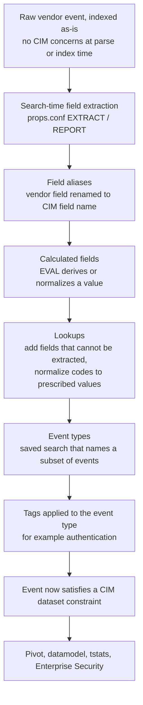

# 10.0 Using the Common Information Model (CIM) Add-On (10%)

The CIM is the only blueprint section with no dedicated Splunk course behind it, so the exam tests it as recall of a fixed body of facts: what the CIM is, exactly which knowledge objects the add-on ships, and the mechanical order of operations for making a vendor sourcetype CIM compliant.

## Blueprint mapping

- Section: 10.0 Using the Common Information Model (CIM) Add-On
- Weight: 10% of the exam
- 10.1 Describe the Splunk CIM
- 10.2 List the knowledge objects included with the Splunk CIM Add-On
- 10.3 Use the CIM Add-On to normalize data

> The following topics are general guidelines for the content likely to be included on the exam; however, other related topics may also appear on any specific delivery of the exam. In order to better reflect the contents of the exam and for clarity purposes, the guidelines below may change at any time without notice.

Two known defects to carry into the exam. Circulating answer keys state that CIM data models ship accelerated; they do not, and T-10-02 covers why. The same material is inconsistent on case sensitivity. Hold to what the docs support: CIM field names are case sensitive, the values you search often are not, and the 10.4 docs never state whether tag names are case sensitive, so do not answer as though they did.

## What it is

The Splunk Common Information Model is "a shared semantic model focused on extracting value from data". It is a naming contract: a set of field names, field values, and event tags that describe the least common denominator of a domain such as authentication, web traffic, or malware detection. If two vendors both log a failed login, CIM says both events must carry `tag=authentication`, a `user` field, a `src` field, and `action=failure`. A search written against those names then works against both vendors without modification.

The CIM is implemented as an add-on: the Splunk Common Information Model Add-on, Splunkbase app ID 1621, installed to the directory `Splunk_SA_CIM`. The docs describe it as containing "a collection of pre-configured data models that you can apply to your data at search time", and say that each model "consists of a set of field names and tags that define the least common denominator of a domain of interest". Those two nouns, fields and event category tags, are the defining content of the add-on. Normalizing to one shared schema is what lets several apps read the same indexed data on one deployment, so the add-on coexists with everything else installed there. Install it on your search heads only, because everything it does happens at search time and there is nothing for an indexer or a forwarder to do with it. The data model JSON definitions live in `$SPLUNK_HOME/etc/apps/Splunk_SA_CIM/default/data/models`. The add-on is packaged with Splunk Enterprise Security and the Splunk App for PCI Compliance, which is why CIM compliance is a hard prerequisite for any ES content: ES correlation searches are written against CIM data models, so untagged or unmapped data is simply invisible to ES.

The single most important structural fact is that the CIM is a search-time schema, described in the docs as schema-on-the-fly, that "leaves the raw machine data intact". Installing the add-on changes nothing on disk, reindexes nothing, and rewrites no events. Everything it does is a knowledge object layered over data that was already indexed.



That order is not decorative. Splunk applies field aliases after key-value field extraction but before calculated fields, lookups, event types, and tags, so you cannot alias a calculated field, a lookup output field, an event type, or a tag. The CIM normalization procedure is this pipeline walked forwards.

Keep the two roles apart. The add-on supplies the data models, already defined as JSON with their datasets, constraints, and field lists written; nobody creates them locally. The knowledge manager creates everything that maps a vendor sourcetype into those shipped models: field extractions, field aliases, calculated fields, lookups, event types, and tags. Saying the knowledge manager uses the CIM to create data models has the relationship backwards. The models are the contract, and the objects you build are how you satisfy it.

### The documented normalization procedure (objective 10.3)

The CIM manual sets normalization out as an eight-step procedure. Condensed, with the steps the exam draws on called out:

1. Decide which data model and dataset your source belongs to, from the model catalogue.
2. Consult the CIM data model reference tables for that dataset. This is the documented recommended approach, and the answer to any question of the form "what should you consult before normalizing a source".
3. Tag the events so they satisfy the dataset constraint, normally by defining an event type and tagging that.
4. Compare the fields your source produces against the required and recommended lists, then normalize each one "using a combination of field aliases, field extractions, and lookups", the docs' own wording, with its sub-steps in that order: alias, extraction, lookup. Add a calculated field where the value must be derived rather than found.
5. Validate by running the dataset search or a Pivot and confirming the required fields are populated.

Two object types stay outside this procedure: search macros and workflow actions. The add-on does ship macros, so "does the add-on include macros" is answered yes, but they report acceleration status and filter data out of models rather than populating a CIM field. Workflow actions have no CIM role at all. No step here touches index time.

### Knowledge objects the add-on ships (objective 10.2)

| Knowledge object | What the add-on ships | Exam-relevant detail |
| --- | --- | --- |
| Data models | The CIM data models themselves, as JSON in `Splunk_SA_CIM/default/data/models` | 26 model pages in the CIM 8.6 docs, two of them deprecated, plus the separately documented CIM Validation (S.o.S.) model. The docs publish no total, so learn names rather than a number |
| Tags | Tag definitions used as dataset constraints | Tags are the entry condition for every event dataset |
| Event types | Event type definitions, including those used by the validation content | TAs supply the event types for real vendor data; the CIM add-on supplies the models the tags point at |
| Field aliases | Aliases used inside the add-on's own content | You add your own aliases in your TA, not in `Splunk_SA_CIM` |
| Calculated fields | EVAL expressions used by model calculations | Model-level calculations such as normalized severity |
| Lookups | Lookups backing normalization and filtering, including the assets and identities style categorization used by the CIM filter macros | Used to map vendor codes to prescribed values |
| Search macros | Macros in `Splunk_SA_CIM/default/macros.conf`: `cim_datamodelinfo` and the CIM filter macros such as `cim_filter_known_scanners`. Index scoping is NOT a macro; it is the per-model Indexes allowlist on the CIM Setup page | The docs say there is no need to modify the filter stanzas by hand. Answer "does the add-on include search macros" with yes, but do not name a `cim_<model>_indexes` macro: no 8.6 page documents one |
| Reports and dashboards | Validation content, reachable through Pivot on the CIM Validation (S.o.S.) model, plus the Data Model Audit dashboard for acceleration health | Validation is a first-class use case of the add-on, not an afterthought. Data Model Audit is the only shipped dashboard. The add-on is not a library of report or dashboard templates: CIM-compliant dashboards come from Enterprise Security and the PCI Compliance app |
| A custom search command | `datamodelsimple`, the add-on's custom command for CIM validation | Ships with the add-on, not with core Splunk |
| A common action model | Support for custom alert actions, backed by the `cim_modactions` index | The deprecated `cim_summary` index has been removed |

What the add-on does not ship is examined as often as what it does. No custom visualizations. No workflow actions. No index-time configuration of any kind. And no tsidx summaries, because column stores exist only after acceleration is switched on for a model, and every CIM model ships with acceleration off. Extractions and tags for your vendor data are not shipped either: the add-on defines the models your objects must satisfy, and the vendor's technology add-on, or you, supplies the rest.

### The CIM 8.6 data model catalogue

Every model below is an entry in the Data models section of the CIM 8.6 docs. The docs publish a page per model and state no total, so a memorised figure such as "22 data models" comes from an older release and is worth nothing in an answer option. Recognise the names; do not recite a count. The tag column is the constraint on the root event dataset unless stated otherwise. Child datasets inherit the parent constraint and add their own, so the Proxy dataset requires `web` and `proxy`, not `proxy` alone.

| Data model | One-line scope | Root dataset tags |
| --- | --- | --- |
| Alerts | Alerts produced by alerting systems such as Nagios or NetCool | `alert` |
| Application State (deprecated) | Service or process inventory and state; deprecated in 4.12.0, replaced by Endpoint | `(listening, port)`, `(process, report)`, `(service, report)` |
| Authentication | Login activities from any data source | `authentication` |
| Certificates | Key and certificate management events from secure servers and IAM systems | `certificate` |
| Change | Create, read, update, and delete activities from any data source | `change` |
| Change Analysis (deprecated) | CRUD activity; deprecated in 4.12.0, replaced by Change | `change` |
| Data Access | Shared data access user activity, for detecting unauthorized access and exfiltration | `data`, `access` |
| Data Loss Prevention | Events gathered from DLP tools | `dlp`, `incident` |
| Databases | Events pertaining to structured and semi-structured data storage | `database` |
| Email | Email traffic, server to server or client to server | `email` |
| Endpoint | Endpoint clients: processes, services, files, ports, registry | Per dataset, see below |
| Event Signatures | Standard location to store Windows EventID data | `track_event_signatures` |
| Interprocess Messaging | Transactional requests in programmatic interfaces, messaging queues, IPC and web interfaces | `messaging` |
| Intrusion Detection | Attack detection events from network monitoring devices and apps | `ids`, `attack` |
| Inventory | Common computer infrastructure components, plus network inventory and topology | `inventory` plus a component tag |
| Java Virtual Machines (JVM) | Generic Java server platforms | `jvm` |
| Malware | Malware detection and endpoint protection management activity | `malware`, `attack` for Malware_Attacks |
| Network Resolution (DNS) | DNS traffic, server to server or client to server | `network`, `resolution`, `dns` |
| Network Sessions | DHCP and VPN traffic, plus network inventory and topology | `network`, `session` |
| Network Traffic | Flows of data across network infrastructure components | `network`, `communicate` |
| Performance | Performance tracking data | `performance` plus a component tag |
| Splunk Audit Logs | Audit information for systems producing event logs | `modaction` for Modular_Actions; other datasets are search-constrained |
| Ticket Management | Service requests and their states in ITIL-influenced service desks, bug trackers, ticket systems, GRC systems | `ticketing` |
| Updates | Patch management events from individual systems or central management tools | `update`, `status` |
| Vulnerabilities | Vulnerability detection data | `report`, `vulnerability` |
| Web | Web server and proxy server data in a security or operational context | `web` |

Dataset-level tag detail for the models the exam is most likely to use:

| Model | Dataset | Tags |
| --- | --- | --- |
| Authentication | Authentication | `authentication` |
| Authentication | Default_Authentication | `default` |
| Authentication | Insecure_Authentication | `cleartext` OR `insecure` |
| Authentication | Privileged_Authentication | `privileged` |
| Authentication | Failed_Authentication, Successful_Authentication | Search-based on the result, not tag-based |
| Endpoint | Ports | `listening`, `port` |
| Endpoint | Processes | `process`, `report` |
| Endpoint | Services | `service`, `report` |
| Endpoint | Filesystem | `endpoint`, `filesystem` |
| Endpoint | Registry | `endpoint`, `registry` |
| Web | Web / Proxy / Storage | `web` / `proxy` / `storage` |
| Change | All_Changes / Auditing_Changes / Endpoint_Changes / Network_Changes / Account_Management / Instance_Changes | `change` / `audit` / `endpoint` / `network` / `account` / `instance` |
| Malware | Malware_Attacks / Malware_Operations | `malware`,`attack` / `malware`,`operations` |
| Email | All_Email / Delivery / Content / Filtering | `email` / `delivery` / `content` / `filter` |
| Network Sessions | All_Sessions / Session_Start / Session_End / DHCP / VPN | `network`,`session` / `start` / `end` / `dhcp` / `vpn` |
| Updates | Updates / Update_Errors | `update`,`status` / `update`,`error` |
| Ticket Management | All_Ticket_Management / Change / Incident / Problem | `ticketing` / `change` / `incident` / `problem` |
| Certificates | All_Certificates / SSL | `certificate` / `ssl` OR `tls` |

### Field classification

The reference tables are organised per data model, each with a tags table giving the dataset constraints, inherited tags included, and a fields table giving names, descriptions, and expected values. There is no such thing as a CIM event type reference table. One vocabulary note: the reference-table page records that "object" is the pre-6.5.0 name for "dataset", so older material talking about data model objects means datasets. The tables mark fields as required, recommended, or optional. Required fields are the ones a dataset cannot be meaningfully used without; the 8.6 tables express this as "required for pytest-splunk-addon". Recommended fields are described in the docs as "both commonly available in data sources of the intended type, and highly useful for security monitoring and investigations", and are flagged as `recommended=true` in the model JSON. Optional fields add value where the source happens to carry them.

Expected values are guidance, not enforcement. The docs say they are "provided to help you make normalization decisions when developing add-ons" and that they "are not exhaustive or exclusive". The tables split them into values Enterprise Security expects and values the CIM itself uses as dataset constraints. Nothing in Splunk rejects an out-of-spec value; downstream apps such as Enterprise Security simply will not match it.

A dataset is CIM compliant when both halves are true: the events carry the tags that constrain the dataset, and the required fields are populated with CIM-compliant names and values. Tagging alone puts events into the model with empty columns. Field mapping alone leaves the events outside the model entirely.

## Syntax and options

There is no `cim` command. The section is examined through the commands you use to search and validate a CIM data model, plus the CIM Setup page.

### datamodel

```spl
| datamodel [<data model name>] [<dataset name>] [<data model search mode>] [strict_fields=<bool>] [allow_old_summaries=<bool>] [summariesonly=<bool>]
```

| Option | Values | Default | What it does |
| --- | --- | --- | --- |
| data model name | string | none | Names the model. With no other argument, returns the JSON for that model. Omit entirely to list all models. |
| dataset name | string | none | Names a dataset inside the model. Must be given after the model name. Returns the JSON for that dataset. |
| data model search mode | `search`, `flat`, `acceleration_search`, `search_string`, `flat_string`, `acceleration_search_string` | none (returns JSON when omitted) | `search` runs the dataset search as defined. `flat` runs it but strips the hierarchical prefix from field names. `acceleration_search` runs the search the search head uses to accelerate the model. The three `_string` variants return the search string instead of running it. |
| strict_fields | boolean | `true` | When true, returns only the default fields and the fields named in the constraints. When false, includes inherited and calculated fields. |
| allow_old_summaries | boolean | `false` | When false, the search head ignores summary directories older than the current model definition, so results always reflect the current configuration. |
| summariesonly | boolean | `false` | When false, returns results from both summarized and unsummarized data. When true, returns only data already summarized in TSIDX format for an accelerated model. |

### tstats against a data model

```spl
| tstats [summariesonly=<bool>] [allow_old_summaries=<bool>] [prestats=<bool>] <stats-func>... FROM datamodel=<model>.<root_dataset> [where nodename=<lineage>] [WHERE <search>] [BY <field-list> [span=<timespan>]]
```

| Option | Values | Default | What it does |
| --- | --- | --- | --- |
| summariesonly | boolean | `false` | True restricts results to the accelerated summary only. This is the flag that makes a search fast and also the flag that returns zero rows against an unaccelerated model. |
| allow_old_summaries | boolean | `false` | True permits summaries built under an older model definition. |
| prestats | boolean | `false` | True emits prestats output for chaining into `chart`, `stats`, or `timechart`. |
| FROM datamodel= | `<model>.<root_dataset>` | none | Required to target a data model. The root dataset name is part of the reference. |
| where nodename= | dotted dataset lineage | none | Selects a child dataset, for example `nodename=Authentication.Failed_Authentication`. |
| fillnull_value | string | none | Value substituted for null field values in the output. |

### datamodelsimple (custom command from the CIM add-on)

```spl
| datamodelsimple type=<models|objects|attributes> datamodel=<model name> object=<dataset name> nodename=<dataset lineage>
```

| Option | Values | Default | What it does |
| --- | --- | --- | --- |
| type | `models`, `objects`, `attributes` | none, must be supplied | `models` lists model names, `objects` lists datasets in a model, `attributes` lists the field names available in a dataset. |
| datamodel | model name | none | Required for `objects` and `attributes`. |
| object | dataset name | none | Names the dataset for `attributes`. |
| nodename | dotted lineage | none | Addresses a child dataset, for example `Authentication.Failed_Authentication`. |

### from

```spl
| from datamodel:<datamodel_name>.<dataset_name>
```

The `from` command accepts `datamodel`, `lookup`, and `savedsearch` as dataset types. Quotation marks are needed only when a name contains spaces.

### CIM Setup page

Navigate to Apps, then Manage Apps, then click **Set up** in the Splunk Common Information Model row. The direct URL is `https://<your-splunk-host>/en-US/app/search/cim_setup`.

| Setting | Values | Default | What it does |
| --- | --- | --- | --- |
| Indexes allowlist | comma-delimited index names | all indexes | Constrains which indexes the selected data model searches. Written into the per-model index constraint macro in `Splunk_SA_CIM` macros. Index names defined only on indexers are accepted. |
| Accelerate | on / off, per data model | off for every CIM data model | Enables data model acceleration for the selected model. |
| Backfill range | time modifier | none | How far back to build column stores. Consult `datamodels.conf.spec` before setting it. |
| Summary range | time modifier | none | How long column stores are retained. Drives disk usage and indexer load. |
| Max summarization search time | seconds | none | Ceiling on how long one acceleration search may run. |
| Max concurrent summarization searches | integer | none | How many acceleration searches may run in parallel. |

Required capability is `accelerate_datamodel` on add-on version 4.12.0 and above, or `admin_all_objects` on 4.11.0 and below. If Enterprise Security or the PCI Compliance app is installed, the Data Model Acceleration Enforcement modular input enforces acceleration and your manual changes on this page do not persist.

## Result contract

`| datamodel` with no arguments returns one row per data model with the model JSON in a single field. It is a generating command, so it must be first in the search, and the output is a single-column table of JSON text, not events. Naming a model, or a model and a dataset, narrows that to one JSON row. None of these forms touches your indexed data.

`| datamodel Authentication Authentication search` is the form that returns events. The output is the events that satisfy the dataset constraint, with data model fields presented under their fully qualified dotted names: `Authentication.action`, `Authentication.src`, `Authentication.user`. Internal fields such as `_time`, `_raw`, `host`, `source`, and `sourcetype` keep their bare names. Because the field names carry the dataset prefix, a naive `| table action` after `datamodel ... search` returns an empty column.

`| datamodel Authentication Authentication flat` returns the same rows with the prefix stripped, so the column is `action`. Use `flat` to feed the result into commands written for ordinary field names.

| Command form | Row shape | Column shape | Streaming or transforming |
| --- | --- | --- | --- |
| `\| datamodel` | one row per model | one JSON column | generating, non-streaming |
| `\| datamodel <model> <dataset>` | one row | one JSON column | generating, non-streaming |
| `\| datamodel <model> <dataset> search` | one row per matching event | dotted `Dataset.field` names plus internal fields | generating, then streams events |
| `\| datamodel <model> <dataset> flat` | one row per matching event | bare field names | generating, then streams events |
| `\| tstats ... FROM datamodel=...` | one row per BY group | the aggregate plus the BY fields, still dotted | generating and transforming, returns a statistics table |
| `\| datamodelsimple type=attributes ...` | one row per field | a single name column | generating, returns a table of names |

A concrete `tstats` result against the Web model:

| Web.status | count |
| --- | --- |
| 200 | 14238 |
| 404 | 611 |
| 503 | 87 |

Note the dotted column name survives into the statistics table. `| rename Web.status AS status` is the usual next step.

## Worked examples

The practice dataset is used throughout: `access_combined` for web traffic, `linux_secure` for Linux authentication, and `access_combined` for the non-CIM counterexample.

**1. Enumerate what the add-on gave you.**

```spl
| datamodel
```

Returns one row per installed data model with its JSON, which is the fastest confirmation that `Splunk_SA_CIM` is present. Pair it with the add-on's own command for a clean list of names:

```spl
| datamodelsimple type=models
```

**2. Read the contract before you normalize.**

```spl
| datamodelsimple type=objects datamodel=Web
| datamodelsimple type=attributes datamodel=Web nodename=Web.Web
```

The first returns the datasets in the Web model, the second the field names the Web dataset expects. This is the reference-table step done in SPL: reading the field list for the dataset you intend to map to.

**3. Prove the tutorial web data is not yet in the Web model.**

```spl
| datamodel Web Web search | search index=web sourcetype=access_combined | stats count
```

Returns `count=0` on a stock instance. The practice data has `status`, `clientip`, `action`, and `bytes` extracted, so the field half is largely satisfied, but nothing tags it `web`. This is the single most instructive search in the section: correct fields with no tag means the events are outside the model.

**4. Tag it, then re-run.**

Create an event type over the sourcetype and tag it `web`. The Lab below has the Splunk Web click path; the configuration file equivalent is:

```ini
# eventtypes.conf
[web_activity]
search = index=web sourcetype=access_combined

# tags.conf
[eventtype=web_activity]
web = enabled
```

Now the same validation search returns rows:

```spl
| datamodel Web Web search | search index=web sourcetype=access_combined | stats count by Web.status
```

**5. Map a field the vendor named differently.**

The Web dataset expects `src` for the client address. The practice data extracts `clientip`. A field alias fixes it without touching the raw event or the existing field:

```ini
# props.conf
[access_combined]
FIELDALIAS-cim_src = clientip AS src
```

The original `clientip` still exists after aliasing. Aliases add a name, they do not rename destructively.

**6. Derive a value the vendor did not log, with a calculated field.**

The Authentication dataset requires `action` with expected values `success`, `failure`, `pending`, `error`. Linux `linux_secure` events say "Accepted password" or "Failed password" in the raw text. A calculated field normalizes it:

```ini
# props.conf
[secure]
EVAL-action = case(match(_raw,"(?i)Accepted"),"success", match(_raw,"(?i)Failed"),"failure", true(),"error")
```

Then validate the failed-login child dataset:

```spl
| datamodel Authentication Failed_Authentication search | search index=security sourcetype=linux_secure | stats count by Authentication.user, Authentication.src
```

**7. Field-level validation with fieldsummary.**

```spl
| datamodel Authentication Successful_Authentication search
| search index=security sourcetype=linux_secure
| table *
| fields - date_* host index punct _raw time* splunk_server sourcetype source eventtype linecount
| fieldsummary
```

This is the docs' own validation pattern. `fieldsummary` gives you a per-field count and distinct-count, so a required CIM field sitting at `count=0` is immediately visible.

**8. Accelerated search, and the trap inside it.**

```spl
| tstats summariesonly=t count FROM datamodel=Web.Web WHERE nodename=Web.Web BY Web.status span=1h
```

On a stock instance with acceleration disabled this returns zero rows even though example 4 returned data. Drop `summariesonly=t` and the same search returns results by falling back to raw events. Confirm acceleration status before blaming your tagging:

```spl
| `cim_datamodelinfo`
```

**9. The counterexample.**

```spl
| datamodel Web Web search | search index=web sourcetype=access_combined action=purchase | stats count
```

Returns zero and always will. `access_combined` is transactional retail data with no CIM domain. Not every sourcetype belongs in a CIM model, and the docs explicitly warn against force-fitting a source into a model "based solely on field name".

**10. Find the recommended fields you have not mapped yet.**

```spl
| rest splunk_server=local count=0 /services/data/models
| rename title AS model, eai:data AS data
| spath input=data output=objects path=objects{}
| mvexpand objects
| spath input=objects output=object_name path=objectName
| spath input=objects output=fields path=fields{}
| mvexpand fields
| spath input=fields output=field_name path=fieldName
| spath input=fields output=recommended path=comment.recommended
| search recommended=true
| table model, object_name, field_name
| sort model, object_name, field_name
```

This is the docs' own prioritization search, reading the `recommended=true` flag straight out of the model JSON, which is where the classification actually lives.

## Decision rules

| Situation | Rule |
| --- | --- |
| Events have the right field names but do not appear in the model | Missing or wrong tag. Tags are the entry condition for every event dataset. Fix the event type and tag first. |
| Events appear in the model but the columns are empty | Tagging is right, field mapping is missing. Add field aliases, extractions, or lookups. |
| Vendor field has a different name, same meaning, and the value is already correct | Field alias. Cheapest option, and it runs earliest in the pipeline. |
| The value itself must be derived, converted, or normalized to a prescribed value | Calculated field with EVAL. |
| The value is not in the event at all, or is a code that must become a word | Lookup. |
| You need the field to exist before the alias applies | Field extraction, because aliases run after extraction and cannot alias a calculated, lookup, event type, or tag value. |
| Choosing between Change and Endpoint for a service start event | Endpoint covers processes, services, files, ports and registry on the client. Administrative changes to infrastructure or to EDR systems go to Change. |
| Choosing between Network Traffic and Intrusion Detection | Network Traffic is connection-level flow, decided on TCP headers, destination, and ports at connection time. Intrusion Detection is attack detection from monitoring devices, decided mid-connection on traffic patterns. |
| Choosing between Alerts and Intrusion Detection | Alerts is for generic alerting systems such as Nagios or NetCool. Intrusion Detection is for attack-detection appliances. |
| The model returns data but slowly, across every index | Set the Indexes allowlist on the CIM Setup page for that model. Default is all indexes. |
| You want `tstats summariesonly=t` to return rows | The model must be accelerated. It is not, by default. |
| You need to see whether a field extraction is missing across a whole model | Pivot on the CIM Validation (S.o.S.) model, Missing Extractions dataset. |
| You need to find events that should be tagged and are not | Pivot on the CIM Validation (S.o.S.) model, Untagged Events dataset. |
| You are asked what to consult before mapping a source | The CIM data model reference tables for the target dataset. That is the documented recommended approach. |
| You are asked which knowledge objects do the normalizing | Field aliases, field extractions, and lookups, plus calculated fields where the value must be derived. Macros filter and report; workflow actions do nothing here. |
| An answer option quotes a number of CIM data models or datasets | Treat the number as noise. The 8.6 docs publish no count. |
| You are asked where to install the add-on | Search heads only. |
| Your source genuinely has no matching model | Do not force it. Extend a model with a custom field only if the model is otherwise right, and do not clone the model. |

## Traps

**T-10-01** The exam offers "the CIM normalizes data at index time" or "the CIM changes how events are stored". Wrong belief: normalizing means rewriting. Correct fact: the CIM is a search-time schema, schema-on-the-fly, and it "leaves the raw machine data intact". Installing the add-on reindexes nothing and modifies no indexed event.

**T-10-02** A question states that CIM data models are accelerated out of the box, or that installing the add-on immediately speeds up searches. This is a circulating answer key F error. Correct fact: acceleration is disabled by default for every CIM data model, and you enable it per model on the CIM Setup page. A `tstats summariesonly=t` search against a stock CIM model returns zero rows.

**T-10-03** A question implies that populating the CIM field names is sufficient for compliance. Wrong belief: field mapping equals compliance. Correct fact: tags are the constraint that admits events into an event dataset. Correct field names without the required tag put the events nowhere. Compliance requires both the tags and the populated required fields.

**T-10-04** A distractor claims the default Indexes allowlist is empty, or that the model searches no indexes until you configure one. Correct fact: by default each data model searches all indexes. Leaving it that way is a performance problem, not a functional one. The old term "index whitelist" is the same setting.

**T-10-05** A question asks where the CIM add-on is installed and offers indexers, forwarders, or all tiers. Correct fact: search heads only, because the add-on contains only search-time knowledge objects.

**T-10-06** "Compute Inventory" appears as a data model name in an answer list. Correct fact: the model is named Inventory in current CIM. "Compute Inventory" is the legacy documentation slug for that same page and is not the current model name. The same trap works with Application State and Change Analysis, both deprecated in add-on version 4.12.0 and replaced by Endpoint and Change respectively.

**T-10-07** A question offers `| datamodel Web Web search | table action, status` as a working validation search. Correct fact: `datamodel ... search` returns fields under their fully qualified dotted names, so the columns are `Web.action` and `Web.status`. The `flat` mode is what strips the prefix. The plain `table action` returns an empty column.

**T-10-08** A distractor swaps the order of the search-time knowledge object pipeline, for example claiming you can create a field alias for a lookup output field or for a tag. Correct fact: field aliases are applied after key-value field extraction but before calculated fields, lookups, event types, and tags. You cannot alias a calculated field, an event type, a tag, or a lookup-added field.

**T-10-09** A question presents `datamodelsimple` as a core SPL command, or presents `datamodel` as something the CIM add-on installs. Correct fact: `datamodel`, `tstats`, `pivot`, and `from` are core SPL. `datamodelsimple` is the custom command shipped inside `Splunk_SA_CIM` and does not exist without the add-on.

**T-10-10** A distractor claims the CIM expected values are enforced, so an event with `action=denied` in the Authentication model will be rejected. Correct fact: expected values are "not exhaustive or exclusive" and nothing rejects an out-of-spec value. The consequence is silent: Enterprise Security content that looks for `action=failure` simply will not match.

**T-10-11** A question asks which model covers a Windows service being stopped and offers Application State. Correct fact: Application State is deprecated; Endpoint's Services dataset, tagged `service` and `report`, is the current answer. Endpoint superseded Application State in 4.12.0.

**T-10-12** A distractor states that a child dataset only needs its own tag. Correct fact: child datasets inherit the parent constraint. The Web model's Proxy dataset requires `web` and `proxy`. The Endpoint model's Filesystem dataset requires `endpoint` and `filesystem`. Adding only the child tag leaves the event out of both datasets.

**T-10-13** A question suggests cloning a CIM data model before extending it, "to keep the original for record keeping". Correct fact: the docs state that cloning the data model and keeping the original is not considered a best practice. Add the custom field to the model itself, or better, avoid extending at all if a field mapping will do.

**T-10-14** A question conflates the CIM Add-on with the CIM Add-on Builder. Correct fact: the Splunk Common Information Model Add-on (app 1621, `Splunk_SA_CIM`) supplies the models. The Splunk Add-on Builder is a separate app whose "Map to data model" step generates the mapping objects for a new sourcetype, and it needs the CIM add-on installed to map to CIM models. Only the first is on the blueprint.

**T-10-15** A distractor names `cim_summary` as the index the add-on uses. Correct fact: `cim_summary` is deprecated and has been removed. The index that matters now is `cim_modactions`, which supports common action model alerting and auditing.

**T-10-16** An option states a count, "the CIM contains 22 pre-configured data models" or "28 pre-configured datasets". Wrong belief: the catalogue has a published size you are meant to know. Correct fact: the 8.6 docs state no total for either, the catalogue has grown across releases, and any number in an option is inherited from older material. Judge the option on the model names it uses, not on its arithmetic.

**T-10-17** An option says the add-on ships tsidx summary files, custom visualizations, or a library of CIM-compliant security dashboards. Correct fact: none of those. Column stores exist only once acceleration is enabled, which it is not on a fresh install, and the one dashboard shipped is Data Model Audit for acceleration health. The polished CIM dashboards come from Enterprise Security and the PCI Compliance app.

**T-10-18** A statement credits the knowledge manager with using the CIM to create data models, or says the CIM builds your field extractions for you. Correct fact: the models ship as JSON in `Splunk_SA_CIM/default/data/models` and are not built locally, and the knowledge manager creates the objects that map data into them: extractions, aliases, calculated fields, lookups, event types, and tags.

**T-10-19** A question asks which knowledge objects the CIM uses to normalize data and offers search macros or workflow actions. Correct fact: the documented set is field aliases, field extractions, and lookups, alongside the event types and tags that admit events to a dataset, plus calculated fields for derived values. The shipped macros report acceleration status and filter data out of models, so "the add-on includes macros" is true while "macros normalize data" is false. Workflow actions are unrelated to the CIM.

## Lab

Fifteen minutes on a single-node Splunk Enterprise 10.x instance with the practice dataset loaded. If `Splunk_SA_CIM` is not installed, install app 1621 from Splunkbase first and restart.

1. Confirm the add-on is present. Run `| datamodelsimple type=models` in Search and Reporting. If the command is unknown, the add-on is missing.
2. Read the contract. Run `| datamodelsimple type=attributes datamodel=Web nodename=Web.Web` and note that `src`, `action`, `status`, and `url` are expected.
3. Establish the baseline. Run `| datamodel Web Web search | search index=web sourcetype=access_combined | stats count`. Expect `0`.
4. Create the event type. Settings, then Event types, then New Event Type. Name `web_activity`, search string `index=web sourcetype=access_combined`, app Search and Reporting.
5. Tag it. Settings, then Tags, then List by tag name, then New. Tag name `web`, field-value pair `eventtype=web_activity`.
6. Alias the client address. Settings, then Fields, then Field aliases, then New Field Alias. Name `cim_src`, applied to sourcetype `access_combined`, with `clientip` becoming `src`.
7. Set the index allowlist. Apps, then Manage Apps, then Set up on the Splunk Common Information Model row. Select the Web data model, type `main` into Indexes allowlist, save. Leave acceleration off.
8. Verification search. Run:

```spl
| datamodel Web Web search
| search index=web sourcetype=access_combined
| stats count, dc(Web.src) AS distinct_sources BY Web.status
| sort - count
```

A non-zero `count` with a non-zero `distinct_sources` proves both halves: the tag admitted the events to the dataset, and the alias populated a required field. If `count` is non-zero but `distinct_sources` is `0`, the tag worked and the alias did not.

9. Optional, two minutes. Settings, then Data models, then CIM Validation (S.o.S.), then Pivot. Pick the Untagged Events dataset and split rows by sourcetype to see what else is a CIM candidate. Leave acceleration off.

## Self-check

**Q1.** A team installs the Splunk CIM Add-on on the search head. Immediately afterwards, which statement is true about their already-indexed firewall data?

- A. The events are reindexed so their fields match CIM names.
- B. The events are unchanged on disk and will not appear in any CIM data model until tags and field mappings are added.
- C. The events appear in the Network Traffic data model automatically because the add-on ships the model.
- D. The events appear in the model only after the Network Traffic model is accelerated.

**Q2.** Which set contains only knowledge objects that ship inside the CIM Add-on?

- A. Data models, tags, event types, field aliases, calculated fields, lookups, search macros, reports and dashboards.
- B. Data models, indexes, source types, forwarder inputs.
- C. Data models, index-time transforms, tags, summary indexes.
- D. Data models, tags, and the `datamodel` command.

**Q3.** Events from a new SSO product carry `user`, `src`, and `action=success`, and the search `| datamodel Authentication Authentication search | search sourcetype=sso` returns no results. What is the most likely cause?

- A. The Authentication data model is not accelerated.
- B. The `action` value must be `succeeded`, not `success`.
- C. The events are not tagged `authentication`.
- D. `src` must be aliased to `dest`.

**Q4.** Which command form returns web events with a column literally named `status` rather than `Web.status`?

- A. `| datamodel Web Web search`
- B. `| datamodel Web Web flat`
- C. `| datamodel Web Web search_string`
- D. `| tstats count FROM datamodel=Web.Web BY status`

**Q5.** A vendor logs a numeric result code that must become the CIM `action` value. Which knowledge object is the correct choice?

- A. Field alias, because the field needs a different name.
- B. Calculated field, because the value must be derived from the existing value.
- C. Tag, because `action` is a constraint field.
- D. Event type, because the value depends on which events matched.

**Q6.** On the CIM Setup page, what is the default Indexes allowlist for each data model, and why does it matter?

- A. Empty, so the model returns nothing until you configure it.
- B. `main` only, so data in other indexes is invisible to the model.
- C. All indexes, so the model searches more data than necessary and runs slowly.
- D. The indexes named in `cim_modactions`, which is set at install time.

**Q7.** Which pairing of data model and root dataset tag is correct?

- A. Malware / `endpoint`
- B. Intrusion Detection / `ids` and `attack`
- C. Vulnerabilities / `vuln`
- D. Network Resolution (DNS) / `web`

**Q8.** A search using `| tstats summariesonly=true count FROM datamodel=Authentication.Authentication BY Authentication.user` returns no rows, but `| datamodel Authentication Authentication search | stats count BY Authentication.user` returns thousands. What explains this?

- A. `tstats` cannot use the Authentication data model.
- B. The model is not accelerated, so there is no TSIDX summary for `summariesonly=true` to read.
- C. `Authentication.user` is not a valid field in `tstats`.
- D. `summariesonly=true` requires `allow_old_summaries=true` to be set as well.

**Q9.** A vendor sourcetype identifies the account holder only as a numeric `acct_id`, and a CSV file maps every id to the person's login name. The Authentication dataset needs the CIM `user` field populated. Which configuration follows the documented normalization procedure?

- A. `FIELDALIAS-user = acct_id AS user` in props.conf.
- B. `LOOKUP-user = acct_lookup acct_id OUTPUT login_name AS user` in props.conf.
- C. A search macro added to `Splunk_SA_CIM/default/macros.conf` that resolves the id.
- D. `TRANSFORMS-user = acct_lookup` in props.conf, so `user` is written into the event at index time.

**Q10.** Which statement about what the Splunk CIM Add-on installs is correct?

- A. Pre-configured data models, plus the field names and event category tags that define each domain.
- B. Pre-configured data models and their tsidx summaries, so `| tstats summariesonly=true` works as soon as the add-on is installed.
- C. Pre-configured data models and a set of custom visualizations for security dashboards.
- D. Empty data model shells, so the knowledge manager defines each dataset's constraints in the Data Model Editor before use.

<details><summary>Answers</summary>

**Q1: B.** The CIM is a search-time schema; the docs state it leaves the raw machine data intact. Nothing enters a data model until the events satisfy the dataset constraint, which is a tag. A is wrong because installing a search-time add-on never triggers reindexing. C is wrong because the add-on ships the model definition, not membership: the model is empty of your data until you tag it. D is wrong because acceleration changes speed, not membership; an unaccelerated model still returns data through raw search.

**Q2: A.** That is precisely the knowledge object inventory the add-on carries, plus the custom `datamodelsimple` command and the common action model. B is wrong because indexes, source types, and inputs are not search-time knowledge objects and are not part of the add-on's normalization content. C is wrong because the CIM does nothing at index time, so index-time transforms are excluded, and the deprecated `cim_summary` summary index has been removed. D is wrong because `datamodel` is a core SPL command that exists without the add-on; the command the add-on adds is `datamodelsimple`.

**Q3: C.** Tags are the constraint that admits events into an event dataset. Correct field names with no tag means the events are outside the model. A is wrong because an unaccelerated model still returns results through `datamodel ... search`. B is wrong because `success` is the CIM expected value for the Authentication `action` field, and in any case expected values are not enforced. D is wrong because `src` and `dest` are distinct CIM fields with different meanings; aliasing one to the other would corrupt the mapping.

**Q4: B.** The `flat` search mode returns the same results as `search` except that it strips the hierarchical information from the field names. A returns fully qualified names such as `Web.status`. C returns the search string as text rather than running it, so it returns no events at all. D is wrong because `tstats` against a data model requires the dotted field name, so the BY clause would need `Web.status`.

**Q5: B.** A calculated field applies an EVAL expression at search time to derive a value from what is already in the event, which is exactly the code-to-word conversion described. A is wrong because a field alias only renames; it cannot change a value. C is wrong because tags mark events, not field values, and `action` is a field whose value must be populated. D is wrong because an event type names a set of events; it does not set a field value on them. A lookup would also be defensible if the mapping table were large, but among the options given, the derived-value case is the calculated field.

**Q6: C.** By default each data model searches all indexes, which is why the docs recommend constraining it. A is wrong because the model is fully functional with the default; the setting is a performance control, not a switch. B is wrong because no index is privileged by default. D is wrong because `cim_modactions` is the index for common action model alerting and auditing, unrelated to the allowlist.

**Q7: B.** The Intrusion Detection model's `IDS_Attacks` dataset is constrained by the tags `ids` and `attack`. A is wrong: `Malware_Attacks` uses `malware` and `attack`; `endpoint` belongs to the Endpoint model's Filesystem and Registry datasets and to the Change model's `Endpoint_Changes` dataset. C is wrong: the tag is `vulnerability`, together with `report`, not `vuln`. D is wrong: the DNS dataset uses `network`, `resolution`, and `dns`; `web` belongs to the Web model.

**Q8: B.** `summariesonly=true` restricts results to data already summarized in TSIDX format for an accelerated model, and CIM models are not accelerated by default, so the summary is empty. A is wrong because `tstats` works against any data model; it just needs a summary when `summariesonly=true`. C is wrong because `Authentication.user` is the correct fully qualified field reference for `tstats` against that model. D is wrong because `allow_old_summaries` controls whether stale summaries built under a previous model definition may be used; it cannot conjure a summary that was never built.

**Q9: B.** The documented step is to normalize with a combination of field aliases, field extractions, and lookups, and the lookup is the member of that set that supplies a value the event does not contain. A is wrong because an alias only adds a second name for the same value, so `user` would hold the numeric id. C is wrong on two counts: the shipped macros report acceleration status and filter data out of models rather than populating fields, and you do not edit files inside `Splunk_SA_CIM` to normalize your own source. D is wrong because CIM normalization is entirely search-time; an index-time value would also need reindexing to correct.

**Q10: A.** The docs describe the add-on as a collection of pre-configured data models applied at search time, each consisting of a set of field names and tags for a domain. B is wrong because tsidx column stores exist only after acceleration is enabled, and it is off for every CIM model by default, so a fresh install has nothing summarized. C is wrong because the add-on ships no custom visualizations; its one dashboard is Data Model Audit, and CIM-compliant security dashboards come from Enterprise Security and the PCI Compliance app. D is wrong because the models arrive fully defined as JSON under `Splunk_SA_CIM/default/data/models`; the knowledge manager builds the tags, event types, aliases, extractions, and lookups that map data into them.

</details>

## Docs

1. [Overview of the Splunk Common Information Model](https://help.splunk.com/en/data-management/common-information-model/8.6/introduction/overview-of-the-splunk-common-information-model) - the definition sentence, schema-on-the-fly, the add-on contents, the model path. Read first, 10 minutes.
2. [Understand and use the Common Information Model add-on](https://help.splunk.com/en/splunk-enterprise/manage-knowledge-objects/knowledge-management-manual/10.4/get-started-with-knowledge-objects/understand-and-use-the-common-information-model-add-on) - fields plus event category tags, normalized at search time. 5 minutes.
3. [Install the Splunk Common Information Model Add-on](https://help.splunk.com/en/data-management/common-information-model/8.6/introduction/install-the-splunk-common-information-model-add-on) - search heads only, app 1621, `cim_modactions`, removal of `cim_summary`. 5 minutes.
4. [Approaches to using the CIM](https://help.splunk.com/en/data-management/common-information-model/8.6/using-the-common-information-model/approaches-to-using-the-cim) - normalize, validate, report. 5 minutes.
5. [Use the CIM to normalize data at search time](https://help.splunk.com/en/data-management/common-information-model/8.6/using-the-common-information-model/use-the-cim-to-normalize-data-at-search-time) - the eight-step procedure, the alias / extraction / lookup ordering, the `recommended=true` REST search. The most exam-relevant page. 25 minutes.
6. [Data models index](https://help.splunk.com/en/data-management/common-information-model/8.6/data-models) - the catalogue. Skim every model's tag table; do not memorize field lists. 20 minutes.
7. [How to use the CIM data model reference tables](https://help.splunk.com/en/data-management/common-information-model/8.6/data-models/how-to-use-the-cim-data-model-reference-tables) - tags tables, fields tables, and what required, recommended, and expected values mean. 10 minutes.
8. [Use the CIM to validate your data](https://help.splunk.com/en/data-management/common-information-model/8.6/using-the-common-information-model/use-the-cim-to-validate-your-data) - `datamodelsimple` syntax, CIM Validation (S.o.S.) datasets. 10 minutes.
9. [Set up the Splunk Common Information Model Add-on](https://help.splunk.com/en/data-management/common-information-model/8.6/introduction/set-up-the-splunk-common-information-model-add-on) - the CIM Setup page, the allowlist default of all indexes, acceleration off by default. 10 minutes.
10. [Accelerate CIM data models](https://help.splunk.com/en/data-management/common-information-model/8.6/using-the-common-information-model/accelerate-cim-data-models) - acceleration parameters, `cim_datamodelinfo`, the ES enforcement caveat. 10 minutes.
11. [datamodel command reference](https://help.splunk.com/en/splunk-enterprise/search/spl-search-reference/10.4/search-commands/datamodel) - search modes and option defaults. 10 minutes.
12. [tstats command reference](https://help.splunk.com/en/splunk-enterprise/search/spl-search-reference/10.4/search-commands/tstats) - the `FROM datamodel=` clause and `summariesonly`. Data model portion only. 10 minutes.
13. [Match TA event types with CIM data models to accelerate searches](https://help.splunk.com/en/data-management/common-information-model/8.6/using-the-common-information-model/match-ta-event-types-with-cim-data-models-to-accelerate-searches) - how a TA's `eventtypes.conf` plus `tags.conf` produces model membership. 10 minutes.
14. [Use the CIM Filters to exclude data](https://help.splunk.com/en/data-management/common-information-model/8.6/using-the-common-information-model/use-the-cim-filters-to-exclude-data) - `cim_filter_known_scanners` and where the macros live. Read last, 5 minutes.
